# Architecture

本ドキュメントは開発者向けに roost の内部アーキテクチャを説明する。

**roost** は tmux 上で複数の AI エージェントセッションを一元管理する TUI ツールである。

## 目次

- [ビジョン](#ビジョン) / [設計原則](#設計原則) / [用語](#用語)
- [レイヤー構成](#レイヤー構成) / [プロセスモデル](#プロセスモデル) / [tmux レイアウト](#tmux-レイアウト)
- [プロセス間通信](#プロセス間通信-ipc) / [ツールシステム](#ツールシステム) / [UX 処理パイプライン](#ux-処理パイプライン)
- [状態監視](#状態監視) / [インターフェース](#インターフェース) / [設計判断](#設計判断)
- [データファイル](#データファイル) / [ファイル構成](#ファイル構成) / [依存](#依存)

## ビジョン

AI エージェントを複数プロジェクトで並行稼働させると、tmux の素の操作ではセッションの把握・切替が煩雑になり、各エージェントが idle/running/waiting のどの状態かも見えない。これを解決する。

- 複数の AI エージェントセッションを、プロジェクトを跨いで一元管理する操作パネル
- エージェント自体のオーケストレーションには踏み込まず、セッションのライフサイクル管理に徹する薄い TUI
- 最小操作でセッションの起動・切替ができる

## 設計原則

- **Functional Core / Imperative Shell**: 全状態遷移は純関数 `state.Reduce(state, event) → (state', effects)` で表現する。I/O は `Effect` 値として external に出し、単一の event loop (runtime) が interpret する。goroutine・mutex・actor は state 層に存在しない
- **tmux ネイティブ**: tmux のセッション/window/pane をそのまま活用。エージェントの PTY を再実装しない
- **高レベル操作はツール**: セッション作成・停止・終了など、副作用を伴う高レベル操作を Tool として抽象化 (`tools` パッケージ)。TUI・コマンドパレットから同じ Tool を実行できる
- **TUI にビジネスロジックを置かない**: TUI は表示とキー入力のみ。ロジックは `state.Reduce` + `runtime` に集約
- **Typed messages**: 全境界 (IPC command/response/event, state Event/Effect, driver DriverEvent) は closed sum type。closure を message にしない
- **Driver は値型**: Driver は per-session state を持たない stateless plugin。per-session state は `DriverState` 値として `state.Session.Driver` に埋め込まれ、`Driver.Step` の引数と戻り値として round-trip する。goroutine も I/O も持たない
- **Effects are auditable**: 全 side-effect は `state.Effect` enum の constructor として `grep` 可能。driver が直接ファイルに書いたり subprocess を spawn したりしない — 全て runtime の interpreter が実行する
- **Single event loop**: daemon の全状態は 1 つの goroutine (runtime event loop) が単独所有する。mutex 不要 (worker pool 内部を除く)。session 数に依存しない固定 goroutine 数 (~16)
- **Worker pool for slow I/O**: transcript parse、haiku summary、git branch detect、capture-pane は fixed-size worker pool (4 goroutine) で off-loop 実行。結果は `EvJobResult` として event loop に feed back
- **Single persistence store**: `sessions.json` が唯一の真実。tmux user options は `@roost_id` (window-to-session marker) のみ。二重管理しない
- **フォールバック禁止**: 「情報源 A が無ければ B」という合成は行わない。Driver の Step が状態を更新しない限り、status は変わらない
- **テスト可能な設計**: state.Reduce は pure function test で 90%+ coverage。runtime は interface 経由の fake backend で E2E test。mock 不要

## 描画責務の所在

agent-roost の TUI 描画は driver と TUI の間で以下の境界で責務を分ける。**新しい driver を追加するとき、runtime や TUI のコードを触る必要はない**。Driver は `View(DriverState) state.View` を実装するだけで完結する。

### Driver 所有 (`SessionView`)

Driver は `View(DriverState) state.View` を返す。純関数であり、I/O や検出を行わない (重い処理は `Step(DEvTick)` で DriverState に反映済み)。

- `Card.Title`: 1 行目 (例: 会話タイトル)
- `Card.Subtitle`: 2 行目 (例: 直近プロンプト)
- `Card.Tags`: identity 系のチップ。**色も driver が直接決める** (`Foreground` / `Background` を Tag に持たせる)
  - 全 driver は通常 `CommandTag(d.Name())` を先頭に置く規約 (driver 共有ヘルパ `driver/tags.go` 経由)
- `Card.Indicators`: state 系のチップ (例: `▸ Edit`, `2 subs`, `3 err`)
- `Card.Subjects`: ぶら下がり箇条書き
- `LogTabs`: 追加ログタブ (label + 絶対パス + kind)。kind は `TabKindText` か `TabKindTranscript`
- `InfoExtras`: INFO タブの driver-specific 行
- `SuppressInfo`: INFO タブの opt-out (driver 明示)
- `StatusLine`: tmux status-left に流す pre-rendered 文字列

### TUI 所有

TUI は driver-agnostic な汎用 renderer に徹する。

- `SessionInfo` の generic フィールド (ID / Project / Command / WindowID / CreatedAt / State / StateChangedAt) の描画
- `State` enum 値からの色選択 (`tui/theme.go`) — universal な状態色は driver 横断で統一
- 経過時間フォーマット (`5m ago` などの相対表記)
- カードレイアウト (各スロットの並び順 / 余白 / wrap / truncate)
- INFO タブの generic header (`renderInfoContent` で SessionInfo の generic フィールドから自動生成 → driver の `InfoExtras` を後ろに append)
- LOG タブ (常時最後尾、`~/.roost/roost.log` を tail)
- フィルタ / フォールド / カーソル復元

### 禁止事項

- **TUI から driver 名で分岐しない** (`if cmd == "claude" {...}` のようなコード禁止)。grep で検証可能:
  ```sh
  grep -rn '"claude"\|"bash"\|"codex"\|"gemini"' src/tui/  # → 0 件であること
  ```
- **driver から TUI を import しない** (`tui` パッケージ / lipgloss / bubbletea に依存しない)
- **driver は I/O を持たない** (EffEventLogAppend, EffStartJob 等の Effect で runtime に委譲する)
- **runtime から driver-specific I/O を直接呼ばない** (runtime は Effect を interpret するだけ。driver-specific な I/O は worker pool の runner が実行する)

### Tag の色は driver、State の色は TUI — なぜ別所有なのか

- **State** の概念 (idle / running / waiting / error) と色は **全 driver で共通すべき**。同じ状態は同じ色で見えないと混乱する → TUI theme に集約
- **Tag** は driver 固有 (branch tag, command tag, ...)。何を出すかも色も driver の自由 → driver 所有
- 結果として `@roost_tags` user option は撤廃。tag のキャッシュ/永続化が必要なら driver が `PersistedState` bag 内に持つ (例: claudeDriver の `branch_tag` / `branch_target` / `branch_at`)

### 描画フロー (driver → runtime → IPC → TUI)

Driver の `View(driverState)` が UI ペイロードを produce し、runtime の `buildSessionInfos` がそれを `proto.SessionInfo` に詰め、`EffBroadcastSessionsChanged` で IPC 経由でブロードキャストし、TUI は **driver 名で分岐せず** generic に描画する。下図は各 tick で起きる流れ:

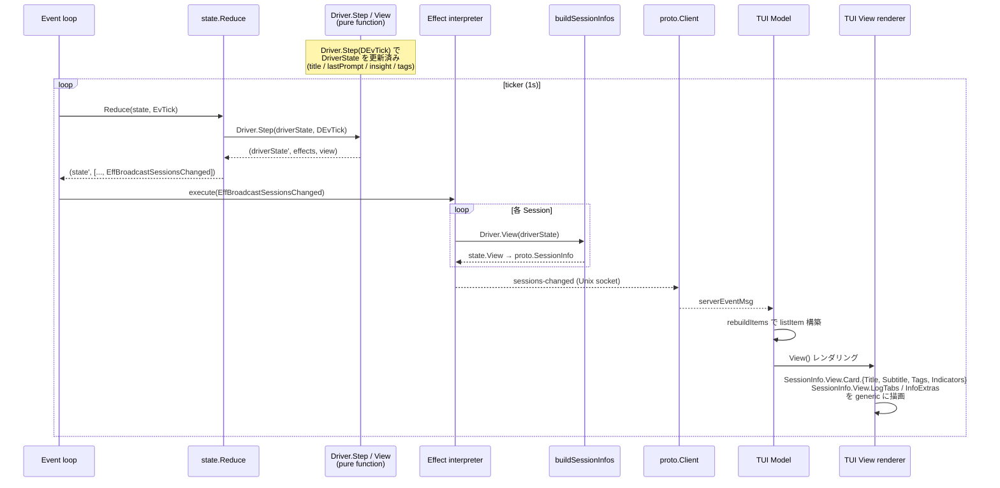

ポイント:
- **Driver.Step / View は純関数**: I/O なし、goroutine なし。重い処理 (transcript parse, git branch) は EffStartJob で worker pool に委譲済み。View は DriverState から組み立てるだけ
- **runtime は中身を見ない**: `buildSessionInfos` は `state.View` をそのまま `proto.SessionInfo.View` に詰めて運ぶ
- **TUI は generic renderer**: `SessionInfo.View.*` のフィールドを順に描画するだけ。`if cmd == "claude"` のような分岐は禁止 (`grep '"claude"\|"bash"\|"codex"' src/tui/` で検証可能)
- **StatusLine だけは別経路**: tmux `status-left` への流し込みは `EffSyncStatusLine` で runtime が active session の `Driver.View().StatusLine` を pull して tmux に反映する (broadcast 経路には乗らない)

## 用語

| 用語 | 意味 | tmux 上の実体 |
|------|------|--------------|
| **セッション** | AI エージェントの作業単位。`state.Session` (静的メタデータ + DriverState) を sessionID で管理する | tmux **window**（Window 1+、単一ペイン構成） |
| **制御セッション** | roost 全体を収容する tmux セッション | tmux **session**（`roost`） |
| **ペイン** | Window 0 内の制御ペイン | tmux **pane**（`0.0`, `0.1`, `0.2`） |
| **Warm start (温起動)** | tmux session 生存状態での Runtime 起動。sessions.json + tmux `@roost_id` から状態を復元 | 既存の tmux session/window/pane を再利用 |
| **Cold start (冷起動)** | tmux session 消滅状態 (PC 再起動 / tmux server 死亡) での Runtime 起動。`sessions.json` から tmux session/window を再作成 | tmux session/window を新規作成 |

以降「セッション」は roost セッションを指す。tmux セッションには「tmux セッション」と明記する。

Runtime の起動は必ず Warm start か Cold start のどちらかで、初回起動という分岐は持たない (sessions.json が存在しなければ空のセッション一覧で Cold start するだけ)。

## レイヤー構成

```
state/         純粋ドメイン層 — State, Event, Effect, Reduce (no I/O, no goroutine)
driver/  Driver 実装 — 値型 Driver plugin + per-session DriverState。I/O 持たない
runtime/       Imperative shell — 単一 event loop, Effect interpreter, backend 抽象
runtime/worker/ Worker pool — slow I/O job 実行 (haiku, transcript parse, git, capture-pane)
proto/         Typed IPC — Command / Response / ServerEvent の sum type + wire codec
tools/         パレットツール — TUI 向け Tool 抽象 + DefaultRegistry
tui/           表示層 — Bubbletea UI 状態管理、レンダリング、キー入力
tmux/          インフラ層 — tmux コマンド実行ラッパー
lib/           ユーティリティ — 外部ツール連携 (lib/git/, lib/claude/)
config/        設定 — TOML 読み込み、DataDir 注入
logger/        ログ — slog 初期化、ログファイル管理
```

daemon プロセスと TUI プロセスは別プロセスで、Unix socket 経由の typed IPC (`proto` パッケージ) で通信する。

コード依存方向:
- `main` → `runtime`, `driver`, `proto`, `tools`, `tmux`, `config`, `logger`
- `runtime` → `state` (Reduce 呼び出し), `proto` (wire encode/decode), `driver` (Driver interface)
- `runtime/worker` → `lib/claude/transcript`, `lib/claude/cli`, `lib/git`, `driver` (Job input/output 型)
- `state` は自己完結 — 外部パッケージを一切 import しない (pure functional core)
- `driver` → `state` (DriverStateBase embed, Effect/View 型)
- `proto` → `state` (Status enum, View 型を wire に乗せる)
- `tools` → `proto` (Client 呼び出し)
- `tui` → `proto` (Client + SessionInfo), `state` (Status/View 型), `tools` (ToolRegistry)
- `tui` → `lib/claude/transcript` (transcript 整形 Parser)
- `lib/claude/command.go` (hook bridge) → `proto` (CmdHook 送信), `config`
- `lib/` の utility 関数は他の内部パッケージに依存しない
- `lib/subcommand.go` でサブコマンドレジストリを提供。各 lib パッケージが `init()` で登録し、`main` は `lib.Dispatch` でディスパッチ

## プロセスモデル

3つの実行モードを1つのバイナリで提供。各ペイン ID (`0.0`, `0.1`, `0.2`) のレイアウトは [tmux レイアウト](#tmux-レイアウト) を参照。

```
roost                       → Daemon（親プロセス。Runtime event loop + IPC server）
roost --tui main            → メイン TUI (Pane 0.0)
roost --tui sessions        → セッション一覧サーバー (Pane 0.2)
roost --tui palette [flags] → コマンドパレット (tmux popup)
roost --tui log             → ログ TUI (Pane 0.1)
roost claude event          → Claude hook イベント受信（hook から呼ばれる短命プロセス）
roost claude setup          → Claude hook 登録（~/.claude/settings.json に書き込み）
```

### Daemon (Runtime)

tmux セッション全体のライフサイクルを管理する親プロセス。起動時に tmux セッションを作成し、TUI プロセスを子ペインとして起動する。tmux attach 中はブロックし、detach またはシャットダウンで終了する。

```
runDaemon()
├── Driver 登録 (driver.RegisterDefaults)
├── Worker pool 構築 (worker.NewPool + RegisterDefaults)
├── Runtime 構築 (runtime.New)
├── tmux セッション存在確認
│   ├── 存在 (Warm start)
│   │   ├── restoreSession (tmux pane layout 再構築)
│   │   ├── rt.LoadSnapshot() — sessions.json から State.Sessions を復元
│   │   ├── rt.ReconcileWarm() — tmux @roost_id で照合、消えた window の session を evict
│   │   └── rt.RestoreActiveWindow() — ROOST_ACTIVE_WINDOW env から State.Active 復元
│   └── 不在 (Cold start)
│       ├── setupNewSession (新 tmux session 作成)
│       ├── rt.LoadSnapshot() — sessions.json から State.Sessions を復元
│       ├── rt.ClearStaleWindowIDs() — 旧 WindowID をクリア
│       └── rt.RecreateAll() — 各 session について:
│           ├── Driver.SpawnCommand(driverState, command) で resume コマンド組み立て
│           └── tmux new-window で spawn → WindowID/PaneID を取得
├── rt.Run(ctx) — event loop goroutine 起動 (select: eventCh / ticker / workers / fsnotify)
├── rt.StartIPC() — Unix socket サーバー起動
├── FileRelay 起動 — ログ/transcript ファイルの push 監視
├── tmux attach (ブロック)
└── attach 終了時
    ├── shutdown 受信済み → KillSession()
    └── 通常 detach → 終了（tmux セッション生存）
```

**Warm start と Cold start の差は bootstrap 経路だけ**。どちらも sessions.json が SoT。Driver の PersistedState (status / title / summary / branch 等) は sessions.json に含まれるため、どちらのパスでも前回値が復元される。

### メイン TUI

Pane 0.0 で動作する常駐 Bubbletea TUI プロセス。キーバインドヘルプを常時表示し、セッション一覧でプロジェクトヘッダーが選択されたとき該当プロジェクトのセッション情報を表示する。daemon 未起動時はキーバインドヘルプのみの static モードで動作する。セッション切替時は `swap-pane` でバックグラウンド window に退避し、プロジェクトヘッダー選択時に復帰する。

```
runTUI("main")
├── ソケット接続を試行
│   ├── 成功 → subscribe + Client 付きで MainModel 起動
│   └── 失敗 → static モード（キーバインドヘルプのみ）
└── Bubbletea イベントループ（sessions-changed / project-selected を受信 → 再描画）
```

### セッション一覧サーバー

Pane 0.2 で動作する常駐 Bubbletea TUI プロセス。ソケット経由で daemon に接続し、セッション一覧の表示・操作を提供する。終了不可（Ctrl+C 無効）。crash 時はヘルスモニタが自動 respawn。state.State や Driver を一切持たず、全操作をソケット経由で daemon に委譲する。

```
runTUI("sessions")
├── Client 初期化 + ソケット接続
├── subscribe コマンド送信（broadcast 受信開始）
├── list-sessions で初期データ取得
└── Bubbletea イベントループ（キー入力 → IPC コマンド → broadcast 受信 → 再描画）
```

### ログ TUI

Pane 0.1 で動作する常駐 Bubbletea TUI プロセス。APP タブ（アプリケーションログ）と、セッションごとに動的生成されるセッションタブを提供する。200ms 間隔でログファイルをポーリングし、新規行を表示する。

```
runTUI("log")
├── ソケット接続を試行
│   ├── 成功 → subscribe + Client 付きで LogModel 起動
│   │          sessions-changed でセッションタブを動的再構築
│   └── 失敗 → アプリログのみモードで LogModel 起動（Client なし）
└── Bubbletea イベントループ（タブ切替、スクロール、follow モード）
```

**タブ構成**: アクティブセッションがある場合 `TRANSCRIPT | EVENTS | INFO | LOG` (Claude セッション時)、または `INFO | LOG` (非 Claude)、それ以外は `LOG` のみ。`sessions-changed` イベントで動的に再構築。`INFO` は LOG の直前固定で、ファイルではなく `SessionInfo` のスナップショットを直接 viewport に描画する非ファイル系タブ。Preview (サイドバーで cursor hover、メインペインに window を swap するだけ) 時は `Message.IsPreview` フラグで判定して INFO をアクティブにする。メインペインが実際に focus された (`pane-focused` イベントで `Pane == "0.0"`) ときに TRANSCRIPT へ切り替える。`sessions-changed` の Tick broadcast はアクティブタブを変更しない（ユーザーが選んだタブを保持）。タブ切替時はファイル末尾から再読み込み（状態保持不要）。マウスクリックはタブラベルの累積幅でヒット判定する。

**経過時間表示**: セッション一覧とメイン TUI の両方で、`CreatedAt` からの経過時間を `formatElapsed` で表示する（分/時/日の 3 段階）。

daemon との通信は任意。接続できない場合（daemon 未起動・起動順の競合）はアプリログのみで動作する。crash 時はヘルスモニタが Pane 0.1 の死活を検知し respawn する。

### コマンドパレット

`prefix p` または TUI の `n`/`N`/`d` で tmux popup として起動する独立プロセス。ソケット経由でコマンド送信。ツール選択 → パラメータ入力 → 実行 → 終了。TUI のサブコンポーネントではなく tmux popup にすることで、TUI のイベントループをブロックせず、パレットが crash しても TUI に影響しない。

```
runTUI("palette")
├── Client 初期化 + ソケット接続
├── フラグからツール名・初期引数を取得
├── 未確定パラメータがあればインクリメンタル選択 UI
├── 全パラメータ確定 → Tool.Run で IPC コマンド送信
└── 終了（popup 自動クローズ）
```

### 障害時の振る舞い

- **TUI のソケット切断**: TUI プロセスは終了する。ヘルスモニタが検知し respawn
- **セッション window の外部 kill / agent プロセス終了**: session window は `remain-on-exit off` のため tmux が自動でペイン破棄、ペイン 1 個のみの window も自動消滅。`reduceTick` が `EffReconcileWindows` を emit し、runtime が tmux window 一覧と `state.State` を照合、消えた window を State から削除して snapshot を更新し `sessions-changed` を broadcast する
- **Active session の agent プロセス終了 (C-c など)**: active session の agent pane は swap-pane で `roost:0.0` に持ち込まれている。Window 0 は `remain-on-exit on` のため、agent が exit すると pane は `[exited]` のまま居座り、session window 側は swap で入れ替わった main TUI pane が生きているので通常の reconcile では掃除されない。`reduceTick` は毎 tick `EffCheckPaneAlive{0.0}` を emit し、runtime が `display-message -t roost:0.0 -p '#{pane_dead} #{pane_id}'` を実行する。dead な場合はその pane id (`%N`、swap-pane を跨いで不変) で `runtime.findPaneOwner` を引いて死んだ pane の **本来の owner session** を特定する。State の activeWindowID を信頼して reap 対象を決めると、並行 Preview などで activeWindowID が pane 0.0 の実 owner とずれた瞬間に無関係な window を kill してしまう (= 別 session のカードが消え、本物の死んだ session が `stopped` 表示で残る誤爆) ため、pane id だけが reap 対象の唯一の真実。owner が特定できたら dead pane を owner window に swap-pane で戻し、window ごと破棄する。その後の `runtime.reconcileWindows` パスで State が最終的に掃除される。owner が見つからない場合 (main TUI 自身が死んだ等) は何もしない (= ヘルスモニタの責務)。PaneID は spawn 時に `display-message -t <wid>:0.0 -p '#{pane_id}'` で取得し `sessions.json` に永続化する
- **ヘルスモニタの respawn 連続失敗**: respawn-pane は tmux がペインを再作成するため通常は失敗しない（ただしバイナリ削除・権限変更等の環境異常時は起動失敗する）。tmux セッション消失時は daemon の attach も終了するため、全体が終了する
- **起動時の整合性**: tmux window user options を単一の真実とするため、orphan チェックは不要。`@roost_id` を持つ tmux window がそのまま roost セッション一覧になる
- **IPC エラー**: TUI 側で IPC コマンドがエラーを返した場合、slog にログ出力し UI 状態は変更しない。タイムアウトは設定していない（Unix socket のローカル通信のため）。サーバーがデッドロックした場合、クライアントは無期限にブロックするリスクがある。復帰手段は外部からの `tmux kill-session -t roost` または daemon プロセスの kill

## tmux レイアウト

```
┌─────────────────────┬────────────────┐
│  Pane 0.0           │  Pane 0.2      │
│  メイン TUI (常時focus) │  TUI サーバー   │
│                     │                │
├─────────────────────┤                │
│  Pane 0.1           │                │
│  ログ TUI           │                │
└─────────────────────┴────────────────┘

Window 0: 制御画面（3ペイン固定）
Window 1+: セッション（バックグラウンド、swap-pane で Pane 0.0 に表示）
```

- Window 0 のみ `remain-on-exit on`: log / sessions ペインがクラッシュしてもレイアウトを維持し、ヘルスモニタが `respawn-pane` で復活させるため
- Session window (Window 1+) は `remain-on-exit off`: agent プロセス終了でペインごと自動消滅させ、`reduceTick` → `EffReconcileWindows` で State を片付ける
- `mouse on` でマウスホイールスクロールとペイン境界認識を有効化。roost が明示的に設定し、ユーザーの tmux.conf に依存しない
- ターミナルサイズを `term.GetSize()` で取得し `new-session -x -y` に渡す
- prefix テーブルの全デフォルトキーを無効化し、Space/d/q/p のみ登録

### マウス操作

tmux `mouse on` により、マウス操作は tmux が仲介する。テキスト選択は tmux のコピーモードを経由する。

| 操作 | 動作 |
|------|------|
| ホイール | tmux がスクロール処理（alt screen ペインではプログラムにイベント転送） |
| ドラッグ | tmux コピーモードに入り、ペイン内でテキスト選択 |
| リリース | 選択テキストをコピーし、コピーモードを終了（ライブ表示に復帰） |
| Shift+ドラッグ | tmux を迂回し、ターミナルネイティブの選択（ペイン境界を跨ぐ） |

**制約**: コピーモード終了時にライブ表示（最下部）に復帰するのは tmux の仕様。スクロールバック位置を維持したままコピーモードを抜けることはできない。ペイン内選択とスクロール位置維持を両立するには Shift+ドラッグを使うか、コピーモード内で `q` を押すまで閲覧を続ける。

### セッション切替

runtime が個別の `swap-pane -d` 操作を順に実行する（途中失敗時のロールバックはない）。

```
Preview(sess):
  1. swap-pane -d  メインペイン ↔ 旧セッション (旧を戻す、activeWindowID がある場合)
  2. swap-pane -d  メインペイン ↔ 新セッション (新を表示)
  → フォーカスは変更しない

Switch(sess):
  Preview と同じ + SelectPane でメインペインにフォーカス
```

### キー入力の処理分担

| レベル | 処理者 | 例 |
|--------|--------|-----|
| prefix キー | tmux bind-key (daemon が設定) | Space, d, q, p |
| TUI キー | セッション一覧の Bubbletea | j/k, Enter, n, N, Tab |
| パレットキー | パレットの Bubbletea | Esc, Enter, 文字入力 |

prefix キーは tmux が横取り。bare key は各 pane のプロセスが直接受信。

## プロセス間通信 (IPC)

Unix domain socket (`~/.roost/roost.sock`) による JSON メッセージング。

### トポロジ

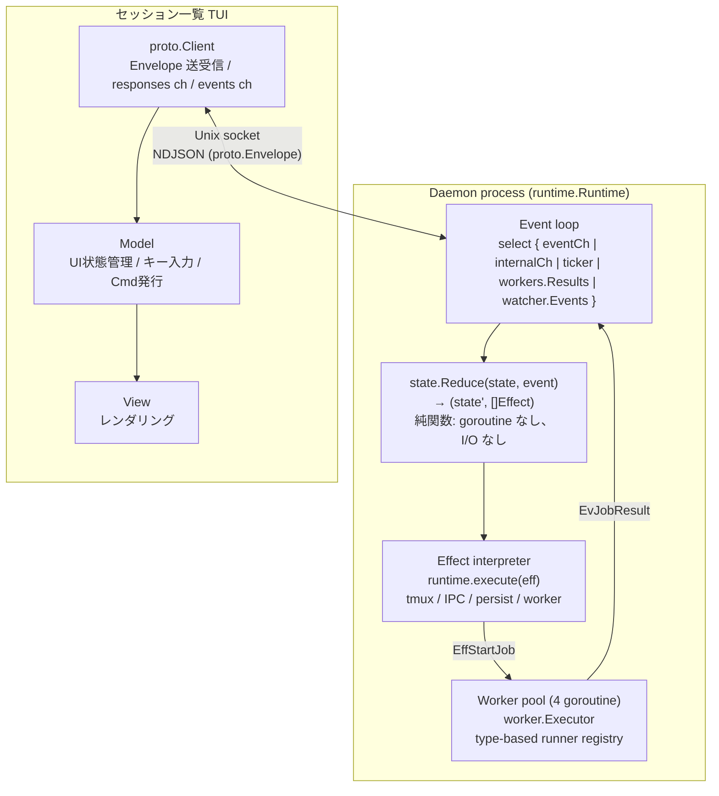

`runtime.Runtime` が唯一の状態所有者。`state.State` は純粋な値型で、`Reduce` の引数と戻り値としてのみ round-trip する。Effect interpreter が tmux 操作・IPC 送信・永続化・worker pool submit を実行し、結果を `Event` として event loop に feed back する。

**Runtime の構成**:
- `state`: `state.State` — 全ドメイン状態 (Sessions map, Active, Subscribers, Jobs)。event loop goroutine が単独所有
- `eventCh`: 外部 goroutine (IPC reader, worker pool, fsnotify watcher) が Event を投入するチャネル
- `workers`: `worker.Pool` — fixed-size (4) goroutine pool。`worker.Executor` が `reflect.Type` ベースで runner を dispatch
- `conns`: `map[ConnID]*ipcConn` — 接続管理。event loop goroutine が単独所有
- `cfg.Tmux` / `cfg.Persist` / `cfg.EventLog` / `cfg.Watcher`: backend interface (テスト時に fake 差し替え可能)

### 通信パターン

| パターン | 方向 | 特徴 | 例 |
|---------|------|------|-----|
| **Request-Response** | TUI → Server → TUI | 同期。Client が response ch でブロック待ち | `switch-session`, `preview-session` |
| **Event Broadcast** | Server → 全クライアント | 非同期。subscribe 済みクライアントに一斉配信 | `sessions-changed`, `project-selected`, `pane-focused` |
| **Tool Launch** | TUI → Server → tmux popup → Palette → Server | 間接通信。popup が独立クライアントとしてコマンド送信 | `new-session` |

`SessionInfo` は静的メタデータと動的状態を 1 メッセージで運ぶ統合型: runtime の `broadcastSessionsChanged` が `state.Sessions` の各 Session について `Driver.View(sess.Driver)` から status / title / insight 等を取得して `proto.SessionInfo` に詰め込む。状態専用イベント (`states-updated`) は廃止された — `reduceTick` が毎 tick `EffBroadcastSessionsChanged` を emit する。

Response は `sendResponse` メソッドで統一送信。Broadcast は `subscribe` コマンドを送信したクライアントのみに配信。

### メッセージ形式

全メッセージは Go の `Message` 構造体で表現し、JSON にシリアライズして送受信する。`Type` フィールドで方向を判定する。フレーミングは改行区切り JSON (NDJSON)。`json.Encoder` / `json.Decoder` がストリーム上で 1 メッセージ = 1 行として読み書きする。`Message` は全フィールドをフラットに持つ単一構造体で、`omitempty` で不要フィールドを省略する。パース側で union type の分岐が不要になる。

| フィールド | Go 型 | JSON 型 | 用途 |
|-----------|-------|---------|------|
| `type` | string | string | `"command"`, `"response"`, `"event"` |
| `command` | string | string | コマンド名 (client → server) |
| `args` | map[string]string | object | コマンド引数 |
| `event` | string | string | イベント名 (server → client) |
| `sessions` | []SessionInfo | array | セッション一覧（`SessionInfo.State` は `driver.Status` 型） |
| `error` | string | string | エラーメッセージ |
| `active_window_id` | string | string | アクティブ window ID |
| `session_log_path` | string | string | セッションログパス |
| `selected_project` | string | string | 選択中プロジェクトパス |

生成ヘルパー: `NewCommand(cmd, args)` / `NewEvent(event)`。エラーは `Message.Error` に文字列を格納し、クライアント側で `error` に変換する。

### コマンド (クライアント → サーバー)

| コマンド | パラメータ | 機能 |
|---------|-----------|------|
| `subscribe` | - | ブロードキャストの受信を開始 |
| `create-session` | project, command | セッション作成 |
| `stop-session` | session_id | セッション停止 |
| `list-sessions` | - | セッション一覧取得 |
| `preview-session` | session_id | Pane 0.0 にプレビュー |
| `preview-project` | project | アクティブセッションを退避し `project-selected` イベントを broadcast |
| `switch-session` | session_id | Pane 0.0 に切替 + フォーカス |
| `focus-pane` | pane | ペインフォーカス。`pane-focused` イベントを broadcast |
| `launch-tool` | tool | パレット popup 起動 |
| `agent-event` | type, (type 別引数) | エージェントからのイベント通知。Service に委譲 |
| `shutdown` | - | 全終了 |
| `detach` | - | デタッチ |

### Client のメッセージ振り分け

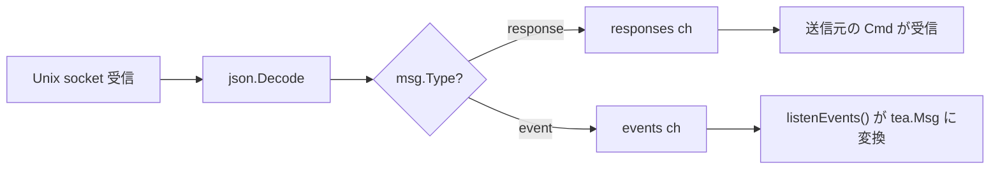

### 並行性モデル — Single event loop + Worker pool

agent-roost のサーバ側は **単一の event loop + 固定サイズ worker pool** で構成される。全ドメイン状態 (`state.State`) は event loop goroutine が単独所有し、状態遷移は純関数 `state.Reduce(state, event) → (state', []Effect)` で表現される。`sync.Mutex` はドメイン層に存在しない (worker pool 内部を除く)。

#### Event loop と状態所有

```
runtime.Runtime.Run() — 単一 goroutine
├── select {
│   ├── eventCh     — IPC reader / hook bridge からの Event
│   ├── internalCh  — conn open/close (runtime 内部イベント)
│   ├── ticker.C    — 1 秒周期の EvTick
│   ├── workers.Results() — worker pool からの EvJobResult
│   └── watcher.Events()  — fsnotify からの EvTranscriptChanged
│   }
├── dispatch(ev):
│   ├── state.Reduce(r.state, ev) → (next, effects)
│   ├── r.state = next
│   └── for _, eff := range effects { r.execute(eff) }
└── 状態: state.State (Sessions, Active, Subscribers, Jobs, ...)
    → event loop goroutine が単独所有。mutex 不要
```

#### Effect interpreter のディスパッチ

`runtime.execute(eff)` が各 Effect 型を backend I/O にマッピングする。Effect は closed sum type なので `grep` で全副作用を列挙可能:

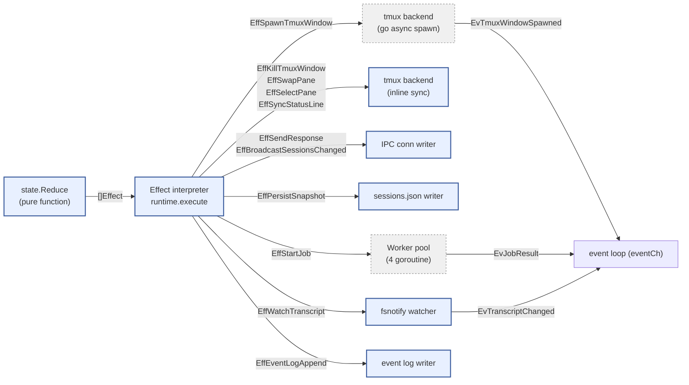

凡例:
- **実線枠** = event loop goroutine 上で同期実行
- **破線枠** = 別 goroutine で非同期実行。結果は Event として event loop に feed back

#### Worker pool (slow I/O の off-loop 実行)

重い I/O (transcript parse、haiku summary、git branch detect、capture-pane) は fixed-size worker pool (`worker.Pool`, 4 goroutine) で event loop 外で実行する。`worker.Executor` は `reflect.Type` ベースの runner registry で、入力型から runner を自動ディスパッチする:

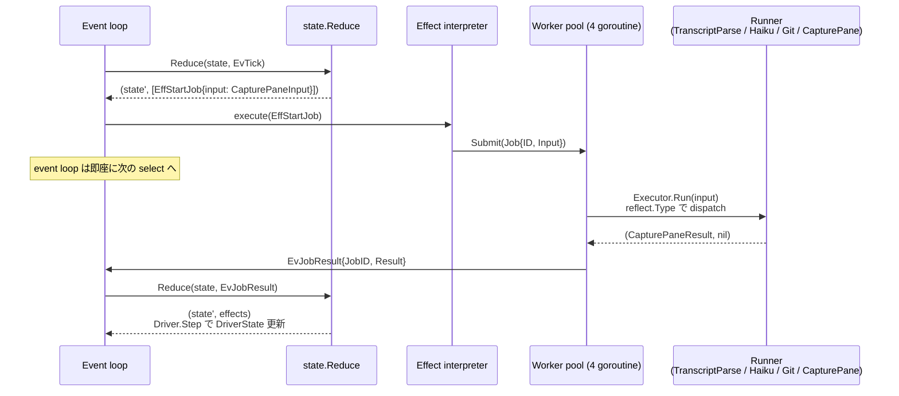

ポイント:
- **event loop は一切ブロックしない**: EffStartJob は worker pool に submit するだけ。結果は EvJobResult として非同期に戻る
- **goroutine 数は固定 (~16)**: event loop (1) + IPC accept (1) + worker pool (4) + IPC reader (M, per client) + health monitor (1)。session 数に依存しない
- **Runner 登録は型ベース**: `exec.Register(driver.CapturePaneInput{}, CapturePane(captureFn))` — 新 job 型の追加は Register 1 行 + runner 関数だけ。switch 文は不要

#### Tick 処理のシーケンス

各 tick で `state.Reduce` が全セッションの Driver.Step を呼び、必要な Effect (capture-pane job, transcript parse job, broadcast, persist) を返す:

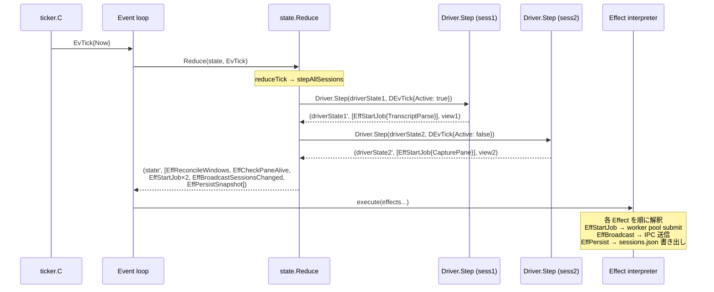

ポイント:
- **Driver.Step は純関数**: goroutine なし、I/O なし。capture-pane や transcript parse が必要な場合は EffStartJob を返すだけ
- **全セッションの Step を同期的に回す**: Driver.Step は純関数なので ~µs で完了する。重い I/O は EffStartJob で worker pool に委譲済み
- **reconcile + health check も同じ tick**: EvTick の reducer が EffReconcileWindows と EffCheckPaneAlive を emit し、effect interpreter が tmux に問い合わせる

#### Hook event ルーティング

hook event は IPC reader → event loop → Reduce → Driver.Step の一直線:

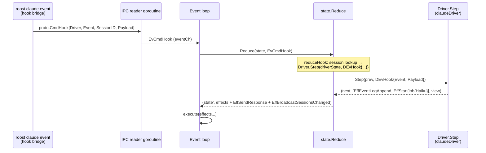

全処理が event loop goroutine 上で同期実行される。Driver.Step は純関数なので重い処理は EffStartJob で worker pool に委譲する (haiku summary など)。

#### 残存する同期プリミティブ

state 層には sync primitive が一切存在しない。runtime 層に残るのは **worker pool 内部のみ**:

| 場所 | プリミティブ | 用途 |
|------|------------|------|
| `worker.Pool` | `sync.Mutex` | `closed` フラグの保護 (Submit/Stop の競合防止) |
| `worker.Pool` | `sync.WaitGroup` | worker goroutine の join (Stop 時に全 worker の完了を待つ) |
| `worker.Executor` 内の shared Tracker | `sync.Mutex` | TranscriptParse と HaikuSummary runner 間の Tracker 共有 |
| `proto.Client` | `sync.Mutex` | TUI プロセス側の encoder 排他 (サーバ側ではない) |

ドメイン状態 (`state.State`) は event loop goroutine 単独所有で、`sync.Mutex` / `sync.RWMutex` は不要。

#### 常駐 goroutine

| goroutine | 数 | 役割 |
|-----------|----|------|
| `Runtime.Run` (event loop) | 1 | 状態所有 + Reduce + Effect 解釈 |
| `acceptLoop` | 1 | unix socket からの新規接続を受け付ける |
| `ipcConn.readLoop` | M (1 / client) | IPC reader。Command を Event に変換して eventCh に投入 |
| `ipcConn.writeLoop` | M (1 / client) | IPC writer。outbox を drain して socket 書き出し |
| `worker.Pool.run` | 4 (固定) | worker pool goroutine |
| `healthMonitor` | 1 | tmux pane 0.1/0.2 の死活監視 (eventCh 経由で event loop に通知) |

session 数に依存するのは IPC reader/writer (TUI client 数分) だけ。10 セッション運用時でも常駐 goroutine 数は ~16 で、Go ランタイム上の負荷は無視できる。

#### 設計上の利点

- **データ競合不在**: race detector で `go test -race ./...` がすべてパスする。ドメイン状態は event loop goroutine が単独所有
- **デッドロック不在**: actor 間通信が存在しない。全状態遷移は単一の goroutine 上で Reduce → execute の直列実行
- **テスト容易性**: `state.Reduce` は pure function test で検証。goroutine / channel / timing 依存なし
- **slow I/O の隔離**: transcript parse / haiku summary / git / capture-pane は worker pool で event loop 外実行。event loop は EffStartJob で submit → EvJobResult で結果受信するだけ
- **goroutine 数が固定**: session 追加で goroutine が増えない (~16)。per-session goroutine は存在しない
- **全副作用が grep 可能**: `grep 'type Eff' src/state/effect.go` で全副作用を列挙できる。Driver が直接 I/O を呼ぶことはない

## ツールシステム

ユーザーが行う高レベル操作を `Tool` として抽象化。TUI・パレットから同じインターフェースで実行可能。

```go
// tools/tools.go
type Tool struct {
    Name        string
    Description string
    Params      []Param
    Run         func(ctx *ToolContext, args map[string]string) (*ToolInvocation, error)
}

type Param struct {
    Name    string
    Options func(ctx *ToolContext) []string  // 実行時に選択肢を生成
}

type ToolContext struct {
    Client *proto.Client   // daemon との typed IPC 接続
    Config ToolConfig      // palette config (commands, projects)
    Args   map[string]string
}
```

### Tool → IPC コマンドの対応

Tool の `Run` は `ToolContext.Client` (`proto.Client`) 経由で typed IPC コマンドを送信する。1 Tool = 1 IPC コマンドの対応。`ToolInvocation` を返すことで同一 popup 内での tool chain (例: create-project → new-session) を実現する。

| Tool | IPC コマンド | パラメータ |
|------|-------------|-----------|
| `new-session` | `create-session` | project, command |
| `stop-session` | `stop-session` | session_id |
| `detach` | `detach` | - |
| `shutdown` | `shutdown` | - |

Tool は副作用を伴う高レベル操作（作成・停止・終了等）を対象とする。`switch-session`, `preview-session`, `focus-pane` 等の低レベルなナビゲーション操作は Tool を経由せず、TUI が直接 IPC コマンドを送信する。

### パレットによるパラメータ補完

パレットは tmux popup として起動する独立プロセス。TUI のイベントループをブロックせず、crash しても TUI に影響しない。

補完フロー: ツール選択 → 各 `Param` の `Options` コールバックで選択肢を動的生成 → ユーザー入力でインクリメンタルフィルタ → 全パラメータ確定後に `Tool.Run` 実行。結果は broadcast 経由で TUI に到達する。

## UX 処理パイプライン

ユーザー操作はすべて同一のパイプラインを通過する。

### インタラクティブパイプライン

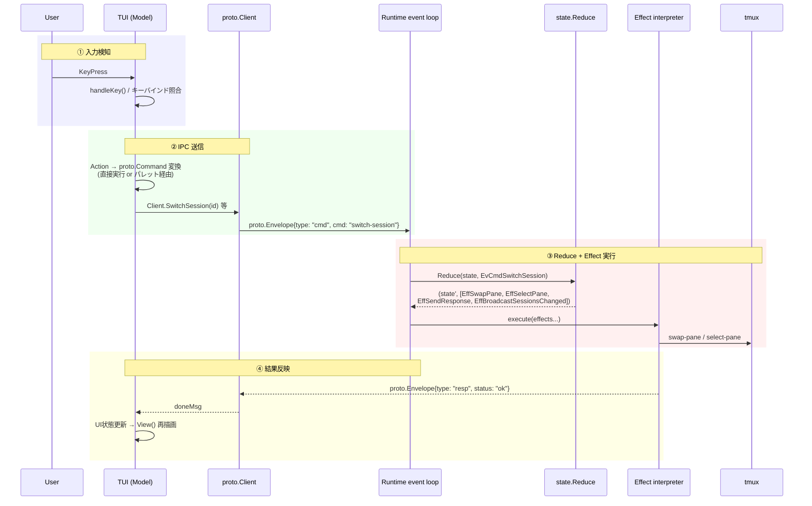

**パレット経由の場合**: ②で tmux popup を起動。Palette が独立 `proto.Client` としてパラメータ補完→③のコマンド送信を行い、結果は broadcast 経由で TUI に到達する。

**エラー時**: ③で Reduce がエラー Effect (`EffSendError`) を返した場合、response の `error` フィールドに詳細が格納される。TUI 側は slog にログ出力し、UI 状態は変更しない（楽観的更新をしない）。tmux 操作の失敗（例: swap-pane 対象の window が消失）は Effect interpreter がエラーログを出力する。

### バックグラウンドパイプライン（ステータス更新）

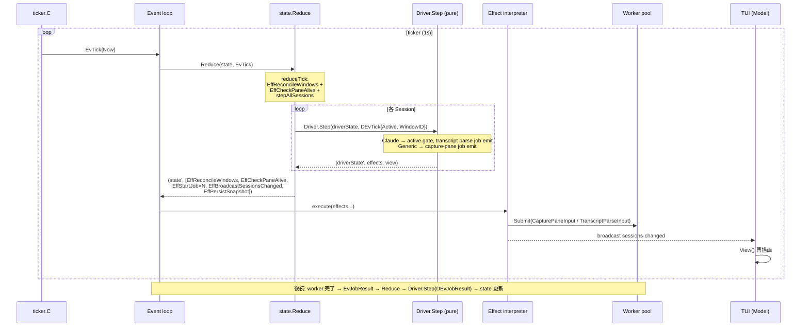

**責務分離**:
- **`reduceTick`**: 全セッションを回して `Driver.Step(driverState, DEvTick{...})` を呼ぶ。返された effects (EffStartJob 等) を集約して返す。reconcile と health check も同じ tick で emit
- **`Driver.Step` (pure)**: goroutine なし、I/O なし。capture-pane や transcript parse が必要な場合は `EffStartJob` を返すだけ。active/inactive は `DEvTick.Active` フラグで判定
- **Worker pool**: EffStartJob の input 型 (`CapturePaneInput`, `TranscriptParseInput` 等) を `Executor` が `reflect.Type` で runner に dispatch。結果は `EvJobResult` で event loop に feed back
- **EffBroadcastSessionsChanged**: runtime が `state.Sessions` から `proto.SessionInfo` を組み立てて全 subscriber に配信。状態合成 / フォールバックは存在しない

## 状態監視

ステータス更新を担うのは **値型の Driver plugin** の `Step` メソッド。`state.State.Sessions` が sessionID ごとに `DriverState` を保持し、`Reduce` が `Driver.Step(driverState, driverEvent)` を呼んで新しい `DriverState` を得る。Driver.Step は capture-pane でも hook event でも副作用を Effect として返すだけの純関数。runtime / state 層は Driver の中身を知らず、Driver interface 経由でしかアクセスしない。

### Driver interface (動的状態関連)

```go
// state/driver_iface.go
type Driver interface {
    Name() string
    DisplayName() string

    NewState(now time.Time) DriverState
    Step(prev DriverState, ev DriverEvent) (DriverState, []Effect, View)
    View(s DriverState) View

    SpawnCommand(s DriverState, baseCommand string) string
    Persist(s DriverState) map[string]string
    Restore(bag map[string]string, now time.Time) DriverState
}

// DriverState — per-session state value (closed sum type marker)
type DriverState interface { driverStateMarker() }

// DriverEvent — Driver.Step への入力 (closed sum type)
type DEvTick struct { Now time.Time; Active bool; Project string; WindowID WindowID }
type DEvHook struct { Event string; Payload map[string]any }
type DEvJobResult struct { Result any; Err error; Now time.Time }
type DEvTranscriptChanged struct { Path string }
```

ライフサイクル:

| メソッド | 呼び出し元 | 用途 |
|---------|-----------|------|
| `NewState(now)` | `reduceCreateSession` | 新しい DriverState 値を生成。初期値は Idle / now |
| `Restore(bag, now)` | `runtime.Bootstrap` | warm/cold restart で前回保存した opaque map から DriverState を再構築 |
| `Step(prev, DEvTick)` | `reduceTick` → `stepAllSessions` | 定期 polling。Claude は `DEvTick.Active` で gate し、active 時のみ transcript parse job を emit。Generic は capture-pane job を emit |
| `Step(prev, DEvHook)` | `reduceHook` | hook event を受けて DriverState を更新。Claude は status 遷移 + event log append effect |
| `Step(prev, DEvJobResult)` | `reduceJobResult` | worker pool からの結果を DriverState に反映。transcript parse result の title / lastPrompt 等 |
| `Step(prev, DEvTranscriptChanged)` | `reduceTranscriptChanged` | fsnotify からの transcript 変更通知。transcript parse job を emit |
| `View(driverState)` | runtime の `broadcastSessionsChanged` / `activeStatusLine` | TUI 向け表示ペイロード (Card / LogTabs / InfoExtras / StatusLine) を返す pure getter |
| `Persist(driverState)` | runtime の `snapshotSessions` | DriverState を opaque map に serialize。sessions.json に書き出す |
| `SpawnCommand(driverState, base)` | `runtime.Bootstrap` (cold boot のみ) | resume コマンドを組み立て (例: `claude --resume <id>`) |

### Active/Inactive と DEvTick.Active (push 型)

「session が active」とは tmux window が pane 0.0 (メイン) に swap-pane されている状態を指す。**唯一の真実は `state.State.Active`** (WindowID) で、`reduceTick` が `DEvTick` を構築する際に `sess.WindowID == state.Active` を評価して `DEvTick.Active` フラグに設定する。

設計上のポイント:

- **状態の単一化**: `active` 状態は `state.State.Active` だけが持つ。Driver 側に capture せず、毎 tick Reduce が評価して push する → 通知漏れ / 順序問題が原理的に発生しない
- **Driver は state パッケージ以外を import しない**: `DEvTick.Active` は plain bool。SessionContext のような interface 注入は不要
- **全 session に毎 tick Step を呼ぶ**: inactive Driver にも `DEvTick{Active: false}` を渡す。Driver 側で `Active` フラグを見て早期 return する。これにより active 化は次の Tick (≤ 1 秒以内) で自然に検出される

### Claude driver (event 駆動 + active gate 付き transcript 同期)

`claudeDriver` の status は **完全に event 駆動** で、`Step(prev, DEvHook{Event: "state-change"})` が state-change event を受け取った瞬間だけ DriverState の status を更新する。新しい event が来なければ status は変わらない (= 復元された前回 status がそのまま表示され続ける)。

一方 transcript メタ (title / lastPrompt / subjects / insight) は worker pool の `TranscriptParse` runner 内の `transcript.Tracker` が増分パースする。Driver.Step は `EffStartJob{TranscriptParseInput}` を emit するだけで、I/O は一切行わない:

- `Step(prev, DEvTick{Active: true})`: active 時のみ transcript parse job を emit。inactive (この session の tmux window が pane 0.0 に swap されていない) 状態では `DEvTick.Active == false` で即 return — reducer は全 session に毎 tick Step を呼び続ける (chicken-and-egg を避けるため)
- `Step(prev, DEvHook)`: active/inactive を問わず常に DriverState を更新。Hook event は鮮度の高い情報源なので、background session でも status はその都度更新される。transcript parse job も emit する
- `Step(prev, DEvJobResult{TranscriptParseResult})`: worker pool から戻った transcript parse 結果 (title / lastPrompt / statusLine / insight) を DriverState に反映
- `Step(prev, DEvTranscriptChanged)`: fsnotify からの transcript 変更通知。transcript parse job を emit
- ファイル truncation 検出: `claude --resume` で transcript が巻き戻されたとき、worker pool の Tracker が `Stat().Size() < offset` を検出して state を全リセットして再パースする

#### lastPrompt の決定

`lastPrompt` は `transcript.Tracker` が保持する **parentUuid チェーン**を `tailUUID` から逆向きに辿り、最初に出会う非 synthetic な `KindUser` エントリの text を返すことで決定する。

- **rewind+resubmit の自然な扱い**: ユーザが Esc-Esc で巻き戻して別文言を再送信すると、Claude は同じ親 uuid を持つ user 子を 2 つ書く (実 transcript で観測済み)。新 branch のエントリだけが新 tail から到達可能なので、walk すれば自然に古い branch を無視する
- **synthetic block-text の除外**: skill bootstrap (`Base directory for this skill: ...`)、interrupt marker (`[Request interrupted by user]`)、bang command の `<bash-input>` / `<bash-stdout>` 系の合成 user content は CLI からのユーザ入力ではないので、parser が `Synthetic` フラグを立てた KindUser として emit し、Tracker はこれらを userPrompts map に登録しない (チェーンは延ばす)
- **チェーンスタブ**: 表示可能 entry を 0 個しか生成しない `assistant` 行 (例: `thinking` ブロックのみで `ShowThinking=false`) でも parser は `KindUnknown` のチェーンスタブを emit する。これがなければ後続の tail から walk しても uuid が parentOf に登録されておらず、chain が切れて lastPrompt が空になる
- **`{"type":"last-prompt"}` イベントは使わない**: Claude Code がこのイベントを書くのは session resume の meta block (`last-prompt → custom-title → agent-name → permission-mode` 順) の中だけで、per-turn には emit されない。`parseLastPromptEntry` と `KindLastPrompt` 定数は dead code として残してあるが (将来の互換性 + 過去 transcript)、`applyEntryToMeta` / `applyMetaEntry` からは参照されない

hook event → driver.Status マッピング:

| hook イベント | Status |
|--------------|--------|
| UserPromptSubmit, PreToolUse, PostToolUse, SubagentStart | Running |
| Stop, StopFailure, Notification(idle_prompt) | Waiting |
| Notification(permission_prompt) | Pending |
| SessionStart | Idle |
| SessionEnd | Stopped |

`roost claude event` サブコマンドが Claude hook payload を `proto.CmdHook` に詰め替えて IPC で送り、runtime の IPC reader が `EvCmdHook` に変換して event loop に投入する。`reduceHook` が `Sessions[ev.SessionID]` で 1 段ルックアップして `Driver.Step(driverState, DEvHook{...})` を呼ぶ。state 層も runtime 層も Claude 固有の状態ロジックを一切持たない。

ルーティングは sessionID で 1 段ルックアップ。詳細は [hook event ルーティングと race-free identification](#hook-event-ルーティングと-race-free-identification) を参照。

### hook event ルーティングと race-free identification

agent (Claude 等) の hook subprocess が `roost <agent> event` として起動されたとき、自分がどの roost セッションに属するかを **race-free に** 識別する仕組み。

#### 問題

runtime の spawn 処理は `tmux new-window` で agent プロセスを起動した **後** に `SetWindowUserOptions` で `@roost_id` などの user option を設定する。各 tmux 呼び出しは独立した `exec.Command` で 5-20ms かかるため、`new-window` から `SetWindowUserOptions` 完了まで 20-50ms の窓が開く。この間に agent が SessionStart hook を発火すると、hook subprocess が pane 経由で `@roost_id` を問い合わせても **未設定** の値しか返らず、event が破棄される (origin: commit `7e541ad` の "外部 claude を排除する" ガード)。

#### 解決: env var による atomic injection

`tmux new-window -e ROOST_SESSION_ID=<sess.ID>` で **新ウィンドウのプロセス環境変数として sessionID を注入する**。env var は `new-window` と同時に kernel exec レベルで設定されるので、後続の `set-option` 呼び出しを待たない:

```
T+0ms   roost: tmux new-window -e ROOST_SESSION_ID=abc123 'exec claude'
        → claude プロセス起動 (env に ROOST_SESSION_ID=abc123 が既に入っている)
T+5ms   claude が SessionStart hook を発火
T+5ms   roost claude event 起動 (環境変数を継承)
T+5ms   currentRoostSessionID() → os.Getenv("ROOST_SESSION_ID") == "abc123" → 即 OK
T+5ms   → SendAgentEvent({SessionID: "abc123", ...}) ✓
T+5ms   server: HandleHookEvent → Sessions.FindByID("abc123") → 該当 → drv.HandleEvent
```

`lib/claude/command.go` の `currentRoostSessionID()` は env var を読むだけのトリビアル関数で、tmux への往復を一切しない。

#### 副次効果

- **間接参照の削除**: 旧設計は AgentEvent に `Pane` (tmux pane id) を載せ、runtime が `findSessionByPane` で pane → window → session の 3 段 fallback を辿っていた。新設計では AgentEvent.SessionID を `state.Sessions.FindByID` する 1 段ルックアップ。
- **roost cross-talk の防止**: 同じ tmux サーバー内で複数 roost インスタンスが動いていても、各 roost は自分の知っている sessionID しか受理しないので hook event の cross-talk が起きない。
- **セキュリティ**: 攻撃者が env var を spoof しても、`Sessions.FindByID` は実在しない ID には nil を返すので event は破棄される。socket access も user-private で従来通りのガードが効く。

#### 補足: 残存する微小な race

`tmux new-window` が返ってから `EvTmuxWindowSpawned` が State に Session を追加するまでに <1ms の窓が残る (この間に hook が届くと `FindByID` が空振り)。ただし agent の bootstrap latency (~100ms+) >> このギャップなので実用上踏むことはほぼ無い。完全に解消するには session を spawn の前に reservation で登録する restructure が必要だが、本設計では deferred している。

### Generic driver (polling 駆動)

`genericDriver` は capture-pane の hash 比較で状態判定する。`Step(prev, DEvTick)` の挙動 (capture-pane 結果は worker pool からの `DEvJobResult{CapturePaneResult}` で受信):

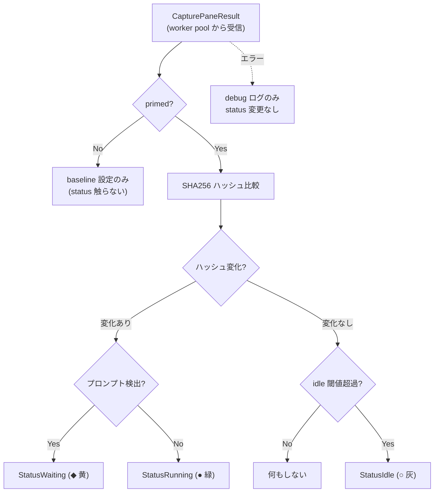

**第 1 回 Tick は status を触らない**。内部 hash baseline を設定するだけで、`Driver.Restore` で復元された前回 status は次の Tick まで保持される。第 2 回 Tick 以降のみ実際の遷移を観測したときに status を更新する。

`Driver.Restore` が呼ばれた時点で `lastActivity` も `status_changed_at` から seed し、idle countdown が再起動を跨いで継続する。

idle 閾値は `settings.toml` の `IdleThresholdSec` で変更可能 (デフォルト 30 秒)。ポーリング間隔は `PollIntervalMs` (デフォルト 1000ms)。プロンプト検出は driver ごとに自前の正規表現を持つ。汎用パターン `` (?m)(^>|[>$❯]\s*$) `` を基本とし、claude は `$` を除外した `` (?m)(^>|❯\s*$) `` を使用して bash シェルとの誤検知を防ぐ。

### 状態の永続化と復元

`Driver.Persist(driverState)` は driver が解釈する opaque な `map[string]string` を返し、`EffPersistSnapshot` が `sessions.json` に書き出す。`sessions.json` が唯一の永続化先 (Single persistence store)。tmux user options は `@roost_id` (window-to-session marker) のみ。

#### 書き込み (runtime)

各 Tick / Hook event で Driver.Step が DriverState を更新すると、reducer が `EffPersistSnapshot` を emit し、runtime の Effect interpreter が `sessions.json` に書き出す:

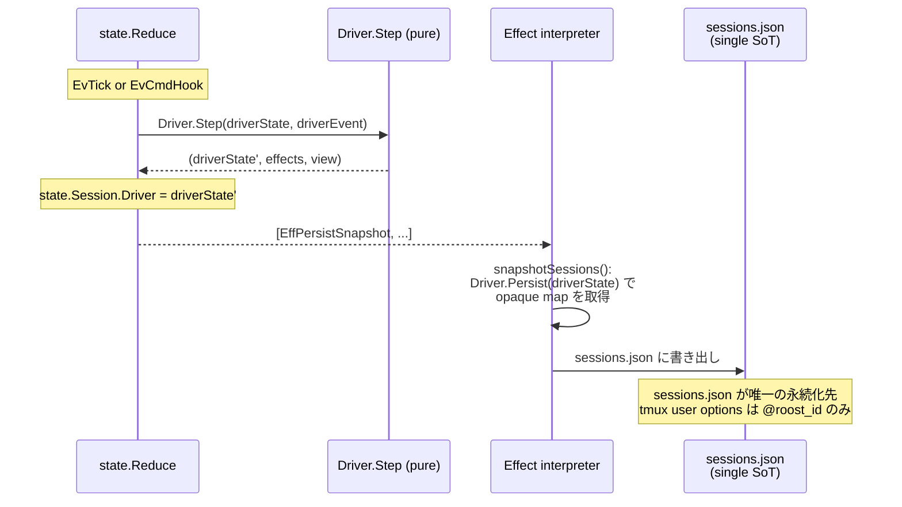

#### 復元 (warm restart / cold boot)

復元経路は 2 つ。**warm restart** (tmux server 生存) は tmux の `@roost_id` user option で window-to-session を対応付け、`sessions.json` の `driver_state` bag から `Driver.Restore` で DriverState を復元する。**cold boot** (tmux server も死亡) は sessions.json から session + tmux window を再作成する:

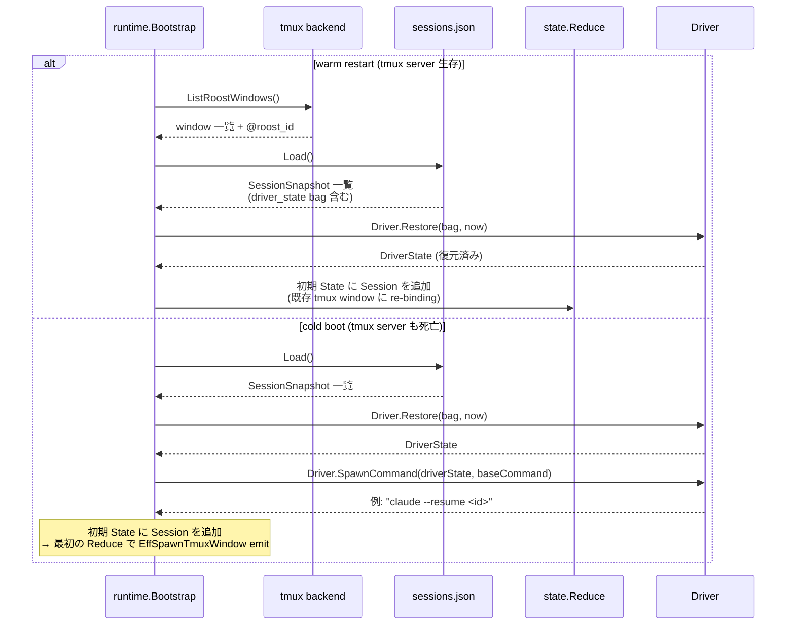

ポイント:
- **Driver.Restore は純関数**: persisted bag から DriverState 値を再構築する。goroutine も I/O もない
- **sessions.json が唯一の永続化先**: tmux user options に `@roost_persisted_state` を書き込まない。`@roost_id` だけが window-to-session の marker
- **SpawnCommand は cold boot だけ**: warm restart は既存 agent process が生きているので新 spawn しない

#### Driver ごとの PersistedState スキーマ

`claudeDriver.PersistedState()`:
```
{
  "session_id":         "abc-123",
  "working_dir":        "/path/to/workdir",
  "transcript_path":    "/path/to/transcript.jsonl",
  "status":             "running",
  "status_changed_at":  "2026-04-09T12:34:56Z"
}
```

`genericDriver.PersistedState()`:
```
{
  "status":             "running",
  "status_changed_at":  "2026-04-09T12:34:56Z"
}
```

Title / LastPrompt / Subjects / Insight は **永続化対象ではない** (transcript から再構築可能、または Tick / HandleEvent で再取得)。

| シナリオ | 挙動 |
|---------|------|
| **新規セッション作成** | `EvCmdCreateSession` → `reduceCreateSession` が State に Session を追加 (Driver.NewState で初期 DriverState 生成) + `EffSpawnTmuxWindow` emit → runtime が tmux window を spawn → `EvTmuxWindowSpawned` で WindowID/PaneID を反映 |
| **warm restart (daemon のみ再起動)** | `runtime.Bootstrap` が tmux `@roost_id` + sessions.json から Session を再構築。`Driver.Restore(bag, now)` で DriverState を復元 → 初期 State に設定 |
| **cold boot (tmux server も死亡)** | `runtime.Bootstrap` が sessions.json から SessionSnapshot を読む → `Driver.Restore(bag, now)` + `Driver.SpawnCommand(driverState, baseCommand)` で resume コマンド組み立て → 初期 State に Session 追加 → 最初の Reduce で EffSpawnTmuxWindow emit |
| **セッション停止** | `EvCmdStopSession` → `reduceStopSession` が State から Session 削除 + `EffKillTmuxWindow` + `EffPersistSnapshot` emit |
| **dead pane reap** | `EvTick` → `reduceTick` が `EffReconcileWindows` + `EffCheckPaneAlive` emit → runtime が tmux に問い合わせ → `EvTmuxWindowVanished` / `EvPaneDied` で State から Session 削除 |

永続化は `EffPersistSnapshot` が `sessions.json` に書き出すだけ。tmux user options への `@roost_persisted_state` 書き込みは廃止され、`@roost_id` のみ。

### コスト抽出

Claude セッションのモデル名・累計トークン量・派生 Insight (現在使用中のツール名・サブエージェント数・エラー数など) は transcript JSONL から `transcript.Tracker` (`lib/claude/transcript`) が抽出する。`Tracker` は worker pool の `TranscriptParse` runner 内で保持され、`Driver.Step` は `EffStartJob{TranscriptParseInput}` を emit するだけ。結果は `EvJobResult{TranscriptParseResult}` として event loop に戻り、`Driver.Step(DEvJobResult)` で DriverState に反映される。state 層も runtime 層も Claude 固有の transcript 形式を直接知らない。

## インターフェース

テスト可能性のために state 層・runtime 層・driver 層をすべてインターフェース化。state 層は純粋な値型と pure function で構成され、runtime 層は backend interface 経由でテスト時に fake 差し替えが可能。

```go
// state/state.go — 全ドメイン状態 (plain data, no methods)
type State struct {
    Sessions    map[SessionID]Session
    Active      WindowID
    Subscribers map[ConnID]Subscriber
    Jobs        map[JobID]JobMeta
    NextJobID   JobID
    NextConnID  ConnID
    Now         time.Time
    ShutdownReq bool
    Aliases     map[string]string
}

type Session struct {
    ID        SessionID
    Project   string
    Command   string
    WindowID  WindowID
    PaneID    string
    CreatedAt time.Time
    Driver    DriverState   // sum type: driver impl ごとの concrete state
}
```

```go
// state/driver_iface.go — Driver interface (値型 plugin)
type Driver interface {
    Name() string
    DisplayName() string
    NewState(now time.Time) DriverState
    Step(prev DriverState, ev DriverEvent) (DriverState, []Effect, View)
    View(s DriverState) View
    SpawnCommand(s DriverState, baseCommand string) string
    Persist(s DriverState) map[string]string
    Restore(bag map[string]string, now time.Time) DriverState
}

// DriverState — per-session state の closed sum type marker
type DriverState interface {
    driverStateMarker()
}

// DriverEvent — Driver.Step への入力 (closed sum type)
// DEvTick, DEvHook, DEvJobResult, DEvTranscriptChanged
```

Driver は**値型 plugin**: goroutine なし、I/O なし、mutex なし。per-session state は `DriverState` 値として `state.Session.Driver` に埋め込まれ、`Driver.Step` の引数と戻り値として round-trip する。副作用は `[]Effect` として返し、runtime の Effect interpreter が実行する。

```go
// state/status.go — Status enum
type Status int
const (
    StatusRunning Status = iota
    StatusWaiting
    StatusIdle
    StatusStopped
    StatusPending
)
```

```go
// state/reduce.go — 純粋状態遷移関数
func Reduce(s State, ev Event) (State, []Effect)
```

`Reduce` が全状態遷移の唯一のエントリポイント。Event / Effect は closed sum type (`isEvent()` / `isEffect()` marker)。

```go
// runtime/runtime.go — Imperative shell
type Runtime struct {
    cfg     Config
    state   state.State        // event loop goroutine が単独所有
    eventCh chan state.Event    // 外部 goroutine からの Event 投入
    workers *worker.Pool
    conns   map[state.ConnID]*ipcConn
    // ...
}

func (r *Runtime) Run(ctx context.Context) error  // event loop
func (r *Runtime) Enqueue(ev state.Event)          // goroutine-safe
```

```go
// runtime/backends.go — テスト差し替え可能な backend interface
type TmuxBackend interface {
    SpawnWindow(name, cmd, startDir string, env map[string]string) (windowID, paneID string, err error)
    KillWindow(windowID string) error
    RunChain(args ...string) error
    SelectPane(target string) error
    SetStatusLine(line string) error
    PaneAlive(target string) (bool, error)
    // ...
}

type PersistBackend interface {
    Save(sessions []SessionSnapshot) error
    Load() ([]SessionSnapshot, error)
}
```

```go
// runtime/worker/pool.go — type-based worker pool
type Executor struct {
    runners map[reflect.Type]func(any) (any, error)
}

func (e *Executor) Register(inputSample any, runner func(any) (any, error))
func (e *Executor) Run(input any) (any, error)

type Pool struct { /* fixed-size goroutine pool */ }
func (p *Pool) Submit(j Job)
func (p *Pool) Results() <-chan state.Event  // EvJobResult
```

```go
// proto/envelope.go — typed IPC wire format
type Envelope struct {
    Type   string          `json:"type"`     // "cmd" | "resp" | "evt"
    ReqID  string          `json:"req_id,omitempty"`
    Cmd    string          `json:"cmd,omitempty"`
    Name   string          `json:"name,omitempty"`
    Status string          `json:"status,omitempty"`
    Data   json.RawMessage `json:"data,omitempty"`
    Error  *ErrorBody      `json:"error,omitempty"`
}

// Command / Response / ServerEvent は closed sum type
type Command interface { isCommand(); CommandName() string }
```

driver-specific な hook payload は `proto.CmdHook{Driver, Event, SessionID, Payload}` として typed IPC を渡る。各 driver subcommand (`roost claude event` 等) が自分の hook payload を `CmdHook` に詰め替えて送信し、runtime の IPC reader が `EvCmdHook` Event に変換して event loop に投入する。`reduceHook` が `Sessions[ev.SessionID]` で 1 段ルックアップして `Driver.Step(driverState, DEvHook{...})` を呼ぶだけ。state 層も runtime 層も driver 固有のキー名を一切ハードコードしない。

`Driver.SpawnCommand` は Cold start 復元時に `runtime.Bootstrap` から呼ばれ、ドライバごとに固有の resume 方法でコマンド文字列を組み立てる。Claude ドライバは `Restore` で受け取った `session_id` を DriverState に保持しており、`lib/claude/cli.ResumeCommand` に委譲して `claude --resume <id>` を返す。Generic ドライバは base コマンドをそのまま返す。

### 依存リスト

- `main` → `runtime`, `driver`, `proto`, `tools`, `tmux`, `config`, `logger`
- `runtime` → `state` (Reduce 呼び出し), `proto` (wire encode/decode), `driver` (Driver interface)
- `runtime/worker` → `lib/claude/transcript`, `lib/claude/cli`, `lib/git`, `driver` (Job input/output 型)
- `state` は自己完結 — 外部パッケージを一切 import しない (pure functional core)
- `driver` → `state` (DriverStateBase embed, Effect/View 型)
- `proto` → `state` (Status enum, View 型を wire に乗せる)
- `tools` → `proto` (Client 呼び出し)
- `tui` → `proto` (Client + SessionInfo), `state` (Status/View 型), `tools` (ToolRegistry)
- Driver は **state パッケージ以外を import しない**。I/O は `Effect` 値として runtime に委譲
- `state.Session` が静的メタデータと DriverState (動的状態) を 1 つの struct に保持。Reduce が sessionID で routing し、Driver.Step に渡す

## 設計判断

| 判断 | 選択 | 理由 |
|------|------|------|
| パレットの実装方式 | tmux popup (独立プロセス) | crash 分離。Bubbletea サブモデルでは TUI 内で panic を共有する |
| Ctrl+C の無効化 | KeyPressMsg を consume | 常駐プロセスの誤終了防止。ヘルスモニタの respawn まで操作不能になる |
| 楽観的更新をしない | IPC エラー時に UI 状態を変更しない | 次回ポーリングで自動回復。状態不整合のリスクを回避 |
| 状態遷移の表現 | 純関数 `state.Reduce(state, event) → (state', effects)` | 全状態遷移が 1 関数に集約され、テストは pure function test で 90%+ coverage。goroutine / channel / timing 依存なし |
| 並行性モデル | Single event loop + fixed-size worker pool | per-session goroutine を排除。goroutine 数は固定 (~16)。デッドロック不在 (actor 間通信が存在しない) |
| Driver の設計 | 値型 plugin: `Step(prev DriverState, ev DriverEvent) → (next, effects, view)` | goroutine なし、I/O なし、mutex なし。副作用は Effect 値として runtime に委譲。テストは入力と出力の比較だけで完結 |
| セッションメタデータの永続化 | `sessions.json` が唯一の永続化先 (Single persistence store)。tmux user options は `@roost_id` のみ | tmux user options に `@roost_persisted_state` を二重管理しない。`@roost_id` は window-to-session marker としてのみ使い、Driver 状態は `sessions.json` の `driver_state` bag に一元化 |
| shutdown (`C-b q`) の挙動 | `EffKillSession` のみで sessions.json は残す | 次回起動時に `runtime.Bootstrap` でセッションを復元できるようにするため |
| Cold start 復元時の Claude 起動コマンド | `claude --resume <id>` を `Driver.SpawnCommand` で組立て | 過去の会話 transcript を新しい Claude プロセスにそのまま引き継ぐ。Claude 固有の `--resume` フラグ知識は `lib/claude/cli` に閉じ、`driver/claude.go` から委譲する |
| swap-pane チェーンのロールバック | しない | tmux の `;` 連結はアトミックではなく途中ロールバック不可。Reduce は State を変更するだけで tmux を直接触らないので、Effect 失敗時も State の整合性は保たれる |
| IPC タイムアウト | 設定しない | event loop のデッドロックは daemon 全体の障害を意味し、Client 側のタイムアウトでは回復できない。外部からの再起動が唯一の復帰手段であるため優先度は低い |
| IPC wire format | `proto` パッケージの typed sum type (Command / Response / ServerEvent) + NDJSON envelope | 全境界メッセージが closed sum type で型安全。`{type, req_id, cmd|name, data}` envelope で拡張可能 |
| Session と Driver の責務分離 | `state.Session` が静的メタデータ + `DriverState` を 1 struct に保持。Reduce が sessionID で routing し Driver.Step に渡す | 1 つの session に対して 1 つの真実。Reduce の中で Session と DriverState が同時に更新されるので状態不整合が原理的に発生しない |
| エージェント状態検出 | Driver.Step が DEvHook / DEvTick / DEvJobResult を受けて DriverState を更新する純関数 | Observer 抽象は廃止。フォールバック禁止: Driver.Step が走らない限り status は変わらない |
| エージェントイベント連携 | `roost claude event` → `proto.CmdHook` → `EvCmdHook` → `reduceHook` → `Driver.Step(DEvHook)` | hook bridge が `$ROOST_SESSION_ID` env var で race-free に sessionID を特定。reducer は `Sessions[ev.SessionID]` で 1 段ルックアップ。詳細は [hook event ルーティングと race-free identification](#hook-event-ルーティングと-race-free-identification) |
| driver hook payload の抽象化 | `CmdHook.Payload` を不透明 `map[string]any` バッグとして運ぶ | 各 driver subcommand が tool 固有の hook field を CmdHook に packing する。reducer は中身を見ずに `DEvHook.Payload` として Driver.Step に転送するだけ。固有 field を増やしても state / runtime / proto には一切手が入らない |
| Session ランタイム情報の永続化 | `Driver.Persist(driverState)` が opaque `map[string]string` を返し、`EffPersistSnapshot` が sessions.json に書き出す | driver 固有のキーを増やしても runtime 層は触らない。永続化先は sessions.json の 1 箇所のみ |
| 動的ステータスの永続化 | Status は DriverState に含まれ、`Driver.Persist` → sessions.json → `Driver.Restore` で round-trip | Warm/Cold restart 後、`Driver.Restore(bag, now)` で前回値を復元。Idle にリセットされない |
| polling と event 駆動の統一インターフェース | `Driver.Step` が `DEvTick` (polling) と `DEvHook` (event) の両方を受ける | Claude の status は DEvHook 駆動 (新 event が来るまで status 不変)。Generic は DEvTick で capture-pane job を emit。reducer は Driver を区別せず `Driver.Step(driverState, driverEvent)` を呼ぶだけ。新 driver 追加は Driver interface を 1 つ実装すればよい |
| Driver の active 判定 | `DEvTick.Active` フラグで push | 真実は `state.State.Active` の 1 点のみ。reducer が DEvTick 構築時に `sess.WindowID == state.Active` を評価して Driver.Step に渡す。Driver 側は pull も callback も不要 |
| transcript パースの off-loop 実行 | Worker pool の `TranscriptParse` runner が `transcript.Tracker` を保持。Driver.Step は `EffStartJob{TranscriptParseInput}` を emit するだけ | event loop をブロックしない。結果は `EvJobResult{TranscriptParseResult}` で戻り、`Driver.Step(DEvJobResult)` で DriverState に反映。Tracker は worker pool 内に閉じ、state 層は transcript 形式を知らない |
| 初回 Tick で status を触らない | `genericDriver.Step(DEvTick)` は `primed=false` のとき hash baseline を設定するだけで status を更新しない | restart 直後の最初のポーリングで `Driver.Restore` で復元した status を上書きしないため。次の Tick で実際に hash 変化を観測したときだけ status を更新する |
| Worker pool の runner dispatch | `worker.Executor` が `reflect.Type` ベースで runner を自動 dispatch | switch 文不要。新 job 型の追加は `exec.Register(InputType{}, runnerFunc)` 1 行だけ |
| StatusLine の表示 | Worker pool `TranscriptParse` runner → `TranscriptParseResult.StatusLine` → `DriverState` → `Driver.View().StatusLine` → `EffSyncStatusLine` → tmux status-left | transcript 差分読みから tmux 反映まで全て Effect 経由。state 層は tmux を直接触らない |

## 副作用の命名規約

パス計算と副作用を関数名で区別する。

| パターン | 副作用 | 例 |
|---------|--------|-----|
| `XxxPath()` | なし (純粋) | `LogDirPath`, `ConfigDirPath`, `LogPath` |
| `EnsureXxx()` | ディレクトリ作成 | `EnsureLogDir`, `EnsureConfigDir` |
| `LoadFrom(path)` | ファイル読込のみ | `config.LoadFrom` |
| `Load()` | ディレクトリ作成 + ファイル読込 | `config.Load` (convenience wrapper) |

## テスト方針

テストファイルは対象ファイルと同じディレクトリに `*_test.go` として配置。

- **state.Reduce のテスト**: mock 不要。`Reduce(state, event)` の戻り値 `(state', effects)` を直接検証する pure function test。goroutine / channel / timing 依存なし
- **Driver.Step のテスト**: mock 不要。`Step(prev, driverEvent)` の戻り値 `(next, effects, view)` を直接検証
- **runtime のテスト**: backend interface の fake を注入。`runtime.Config` に `noopTmux` / `noopPersist` 等を設定してテスト。`Config.DataDir` に `t.TempDir()` を注入してファイル I/O を分離
- **TUI テスト**: Bubbletea の `Model.Update` にメッセージを直接渡し、返り値の Model 状態を検証。実際のターミナルは不要

## データファイル

| パス | 形式 | 内容 | ライフサイクル |
|------|------|------|--------------|
| `~/.roost/config.toml` | TOML | ユーザー設定（下記参照） | ユーザーが作成。存在しなければデフォルト値で動作 |
| `~/.roost/sessions.json` | JSON | セッション静的メタデータと Driver の `driver_state` (opaque map。status を含む) — 唯一の永続化先 (Single persistence store) | `EffPersistSnapshot` で書き出し (Tick / Hook event / session lifecycle 変更時)。読まれるのは daemon 起動時の `runtime.Bootstrap` のみ。`driver_state` の中身は driver が解釈する opaque な key/value で、runtime は key 名を一切知らない |
| `~/.roost/events/{sessionID}.log` | テキスト | エージェント hook イベントログ | `EffEventLogAppend` で追記。runtime の EventLogBackend が lazy-open でファイルハンドルを管理 |
| `~/.roost/roost.log` | slog | アプリケーションログ | daemon 起動時に作成/追記 |
| `~/.roost/roost.sock` | Unix socket | プロセス間通信 | daemon 起動時に作成。終了時に削除 |

`Config.DataDir` でベースパスを変更可能（テスト時に TempDir 指定）。

`settings.toml` の全フィールド（括弧内はデフォルト値）:

- `tmux`: `session_name` (`"roost"`), `prefix` (`"C-b"`), `pane_ratio_horizontal` (`75`), `pane_ratio_vertical` (`70`)
- `monitor`: `poll_interval_ms` (`1000`), `idle_threshold_sec` (`30`)
- `session`: `auto_name` (`true`), `default_command` (`"claude"`), `commands` (`["claude","gemini","codex"]`)
- `projects`: `project_roots` (`["~/dev","~/work"]`)

## ファイル構成

```
src/
├── main.go              daemon / TUI モード分岐 (lib.Dispatch でサブコマンド委譲)
├── state/               純粋ドメイン層 (no I/O, no goroutine)
│   ├── state.go         State, Session, Subscriber, JobMeta — plain value types
│   ├── event.go         Event closed sum type (EvCmdCreateSession, EvTick, EvJobResult, ...)
│   ├── effect.go        Effect closed sum type (EffSpawnTmuxWindow, EffStartJob, EffBroadcast, ...)
│   ├── reduce.go        Reduce(State, Event) → (State, []Effect) — 純粋状態遷移関数
│   ├── reduce_session.go  session lifecycle reducers
│   ├── reduce_hook.go   hook event → Driver.Step routing
│   ├── reduce_tick.go   EvTick → stepAllSessions → Driver.Step(DEvTick)
│   ├── reduce_job.go    EvJobResult → Driver.Step(DEvJobResult)
│   ├── reduce_conn.go   IPC connection lifecycle
│   ├── reduce_lifecycle.go  shutdown / detach
│   ├── driver_iface.go  Driver interface (Step, View, Persist, Restore, SpawnCommand)
│   │                    DriverState / DriverEvent / DriverStateBase marker
│   ├── status.go        Status 列挙型 (Running/Waiting/Idle/Stopped/Pending)
│   ├── view.go          View / Card / Tag — TUI 向け表示値型
│   ├── clone.go         State の copy-on-write ヘルパー
│   └── driver/          Driver 実装 — 値型 plugin (goroutine なし, I/O なし)
│       ├── claude.go    claudeDriver — event 駆動 status + transcript job emit
│       ├── claude_event.go  DEvHook dispatch (state-change, session-start, ...)
│       ├── claude_tick.go   DEvTick: active gate + transcript parse job emit
│       ├── claude_view.go   View() — Card, LogTabs, InfoExtras, StatusLine
│       ├── claude_persist.go  Persist / Restore — opaque bag round-trip
│       ├── generic.go   genericDriver — polling 駆動 (capture-pane job emit + hash 比較)
│       ├── generic_view.go  View()
│       ├── jobs.go      Job input/output 型 (TranscriptParseInput, CapturePaneInput, ...)
│       ├── poll.go      capture-pane driver 共通ヘルパー
│       ├── tags.go      CommandTag ヘルパー
│       └── register.go  init() で state.Register
├── runtime/             Imperative shell — event loop + Effect interpreter
│   ├── runtime.go       Runtime.Run() — single event loop (select)
│   ├── interpret.go     execute(Effect) — 全副作用の interpreter
│   ├── ipc.go           IPC server (accept, readLoop, writeLoop)
│   ├── backends.go      TmuxBackend, PersistBackend, EventLogBackend, FSWatcher interface
│   ├── tmux_real.go     TmuxBackend 具象実装
│   ├── persist.go       PersistBackend 具象実装 (sessions.json)
│   ├── eventlog.go      EventLogBackend 具象実装
│   ├── fsnotify.go      FSWatcher 具象実装
│   ├── proto_bridge.go  proto.Command → state.Event 変換
│   ├── bootstrap.go     warm/cold restart の初期 State 構築
│   ├── filerelay.go     ファイルリレー
│   ├── testing.go       テスト用 helper (fake backend)
│   └── worker/          Worker pool
│       ├── pool.go      Pool + Executor (reflect.Type-based runner registry)
│       └── runners.go   built-in runners (TranscriptParse, HaikuSummary, GitBranch, CapturePane)
├── proto/               Typed IPC — Command / Response / ServerEvent sum types
│   ├── envelope.go      Envelope wire format ({type, req_id, cmd|name, data})
│   ├── command.go       Command closed sum type
│   ├── response.go      Response closed sum type
│   ├── event.go         ServerEvent closed sum type
│   ├── codec.go         NDJSON encode/decode
│   ├── client.go        proto.Client (TUI / パレット / hook bridge 用)
│   ├── client_helpers.go  typed helper (CreateSession, StopSession, ...)
│   ├── convert.go       state.View → proto.SessionInfo 変換
│   ├── reqid.go         request ID 生成
│   └── errors.go        ErrCode enum
├── tools/
│   └── tools.go         Tool + Param + ToolContext + Registry + DefaultRegistry
├── lib/
│   ├── subcommand.go    サブコマンドレジストリ (Register, Dispatch)
│   ├── git/
│   │   └── git.go       git ブランチ検出 (DetectBranch)
│   └── claude/
│       ├── command.go   Claude サブコマンドハンドラ (init で "claude" 登録)
│       ├── hook.go      Claude hook イベントのパース
│       ├── setup.go     Claude settings.json への hook 登録/解除
│       ├── transcript/  Claude JSONL トランスクリプトのパース + 差分追跡
│       └── cli/         Claude CLI 起動コマンド組立て (ResumeCommand など)
├── config/
│   └── config.go        TOML 設定読み込み
├── tmux/
│   ├── interfaces.go    PaneOperator
│   ├── client.go        tmux コマンドラッパー (具象実装)
│   └── pane.go          ペイン操作
├── tui/
│   ├── model.go         セッション一覧 Model (UI 状態のみ。state.Status を直接 import)
│   ├── view.go          セッション一覧レンダリング
│   ├── mouse.go         マウス入力ハンドラ
│   ├── keys.go          キーバインド定義 + キーボード入力ハンドラ
│   ├── main_model.go    メイン TUI Model
│   ├── main_view.go     メイン TUI レンダリング
│   ├── palette.go       コマンドパレット
│   └── log_model.go     ログ TUI (動的セッションタブ)
└── logger/
    └── logger.go        slog 初期化
```

## 依存

| パッケージ | バージョン | 用途 |
|-----------|-----------|------|
| `charm.land/bubbletea/v2` | v2.0.2 | TUI フレームワーク |
| `charm.land/lipgloss/v2` | v2.0.2 | スタイリング |
| `charm.land/bubbles/v2` | v2.1.0 | キーバインド |
| `github.com/BurntSushi/toml` | v1.6.0 | 設定ファイル |
| `golang.org/x/term` | v0.41.0 | ターミナルサイズ取得 |
| `log/slog` | 標準ライブラリ | 構造化ログ |
