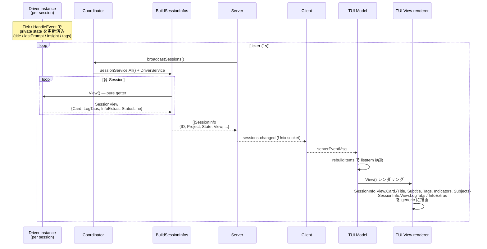
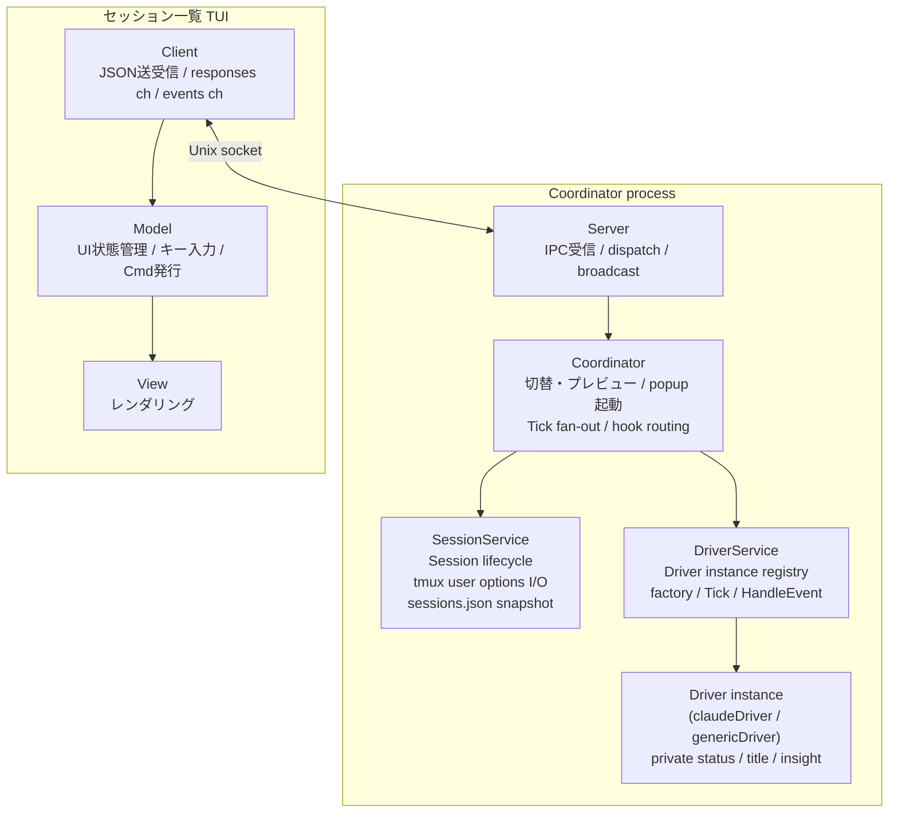
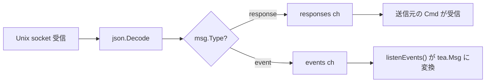
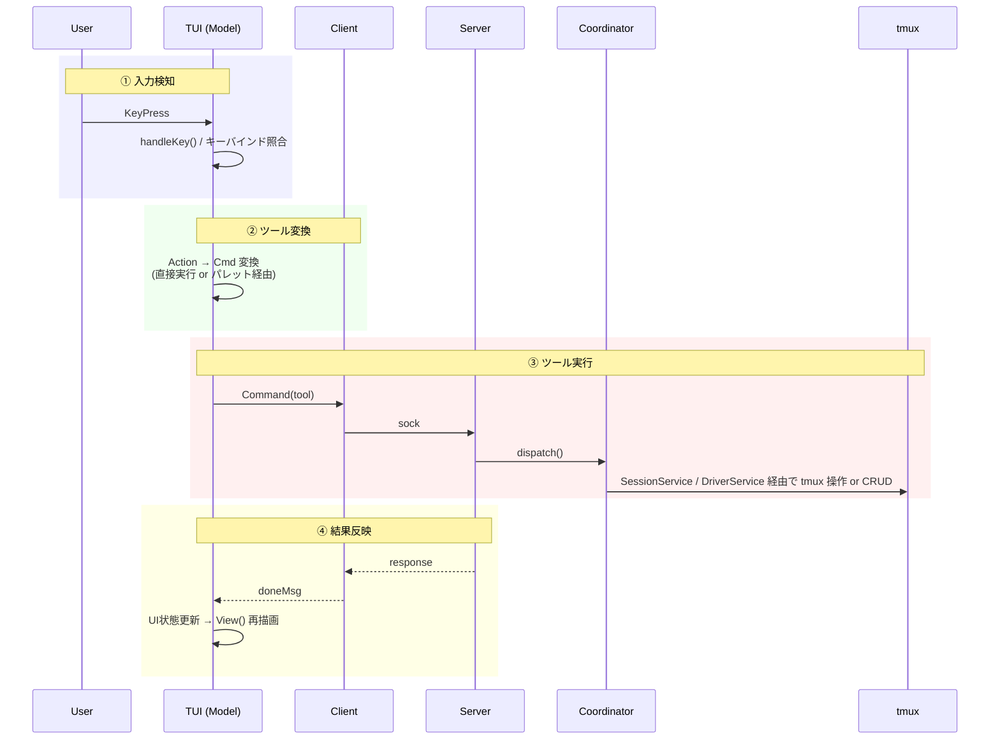
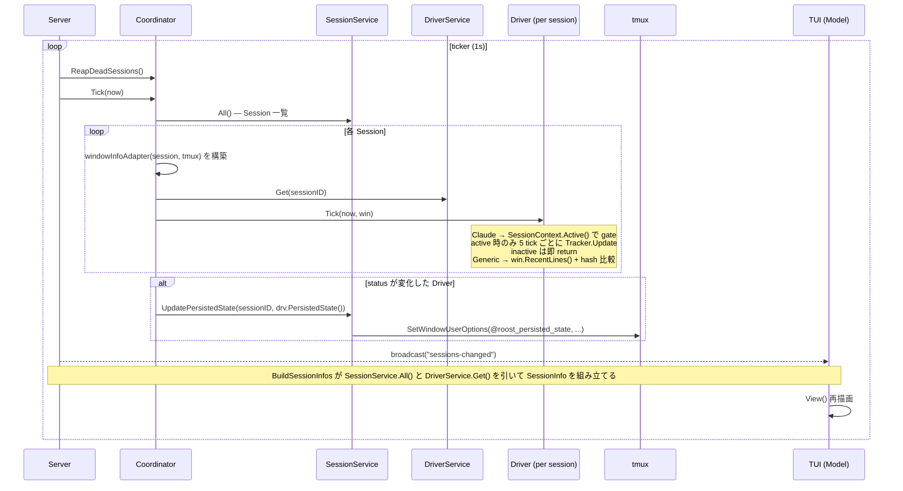
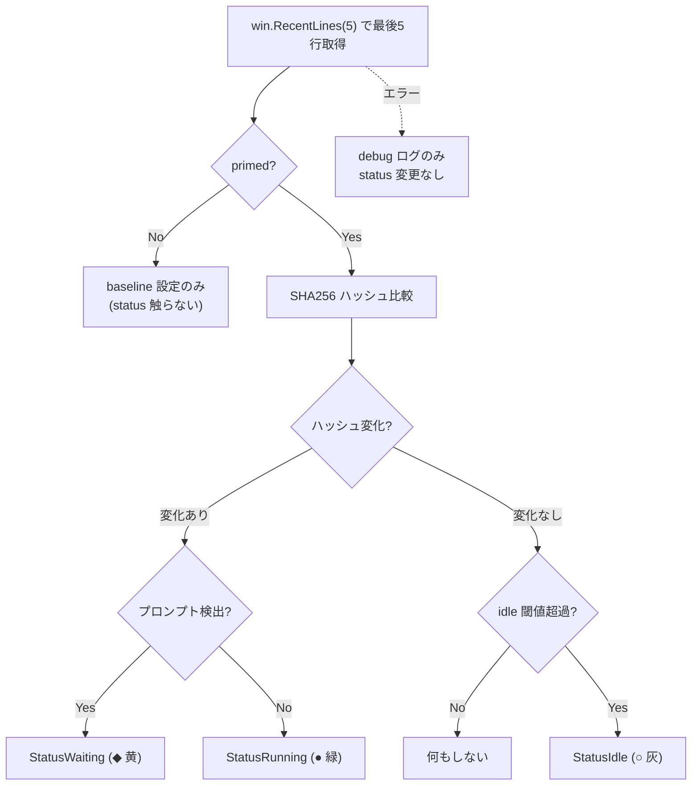
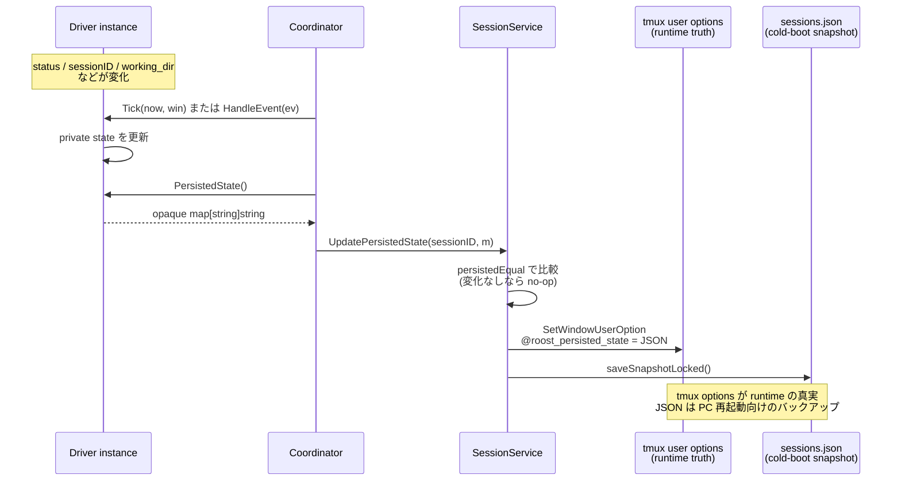
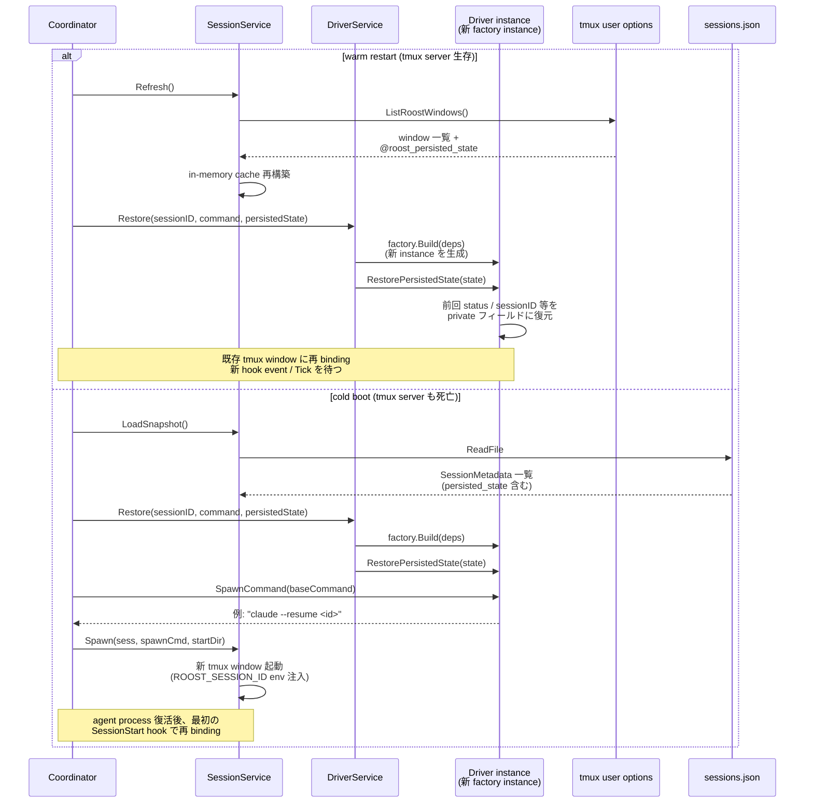

# Architecture

本ドキュメントは開発者向けに roost の内部アーキテクチャを説明する。

**roost** は tmux 上で複数の AI エージェントセッションを一元管理する TUI ツールである。

## 目次

- [ビジョン](#ビジョン) / [設計原則](#設計原則) / [用語](#用語)
- [レイヤー構成](#レイヤー構成) / [プロセスモデル](#プロセスモデル) / [tmux レイアウト](#tmux-レイアウト)
- [プロセス間通信](#プロセス間通信-ipc) / [ツールシステム](#ツールシステム) / [UX 処理パイプライン](#ux-処理パイプライン)
- [状態監視](#状態監視) / [インターフェース](#インターフェース) / [設計判断](#設計判断)
- [データファイル](#データファイル) / [ファイル構成](#ファイル構成) / [依存](#依存)

## ビジョン

AI エージェントを複数プロジェクトで並行稼働させると、tmux の素の操作ではセッションの把握・切替が煩雑になり、各エージェントが idle/running/waiting のどの状態かも見えない。これを解決する。

- 複数の AI エージェントセッションを、プロジェクトを跨いで一元管理する操作パネル
- エージェント自体のオーケストレーションには踏み込まず、セッションのライフサイクル管理に徹する薄い TUI
- 最小操作でセッションの起動・切替ができる

## 設計原則

- **tmux ネイティブ**: tmux のセッション/window/pane をそのまま活用。エージェントの PTY を再実装しない
- **高レベル操作はツール**: セッション作成・停止・終了など、副作用を伴う高レベル操作を Tool として抽象化。TUI・コマンドパレットから同じ Tool を実行できる
- **TUI にビジネスロジックを置かない**: TUI は表示とキー入力のみ。ロジックは `core.Coordinator` に集約
- **Coordinator によるライフサイクル管理**: Coordinator（後述）が TUI プロセスの死活監視と自動復帰を担う。終了判断は Coordinator の責務
- **副作用の分離**: パス計算・状態遷移ロジック・データ構築は純粋関数。I/O (ファイル作成, tmux 操作) は呼び出し側が明示的に実行する。関数名で副作用の有無を区別する (`XxxPath` = 純粋, `EnsureXxx` = 副作用あり)
- **I/O 先行・状態変更後行**: 外部操作 (tmux, ファイル) を全て完了してから内部状態を変更する。I/O 失敗時は内部状態を変更せず汚染を防ぐ。ただし tmux の `RunChain` のようにアトミックにできない外部操作チェーンでは、途中失敗時の tmux 側ロールバックは行わない（設計判断参照）
- **動的状態は Driver instance が所有する**: セッションごとの動的状態 (status / title / lastPrompt / insight / tags / 追加ログタブ / status line) は **Driver instance** が単独で所有する。Driver が `View()` を通じて TUI ペイロードを丸ごと produce する。`Session` は静的メタデータのみを持ち、Tags も branch 検出も Driver の関心事になる。`Coordinator` は Driver の getter 経由で状態を読むだけで、独自の cache を持たない。状態の合成や複数 source からの merge ロジックは存在しない
- **Driver-owned state production**: ステータスを生む責務は driver が持つ。各 driver は **stateful instance** として hook 受信 (`HandleEvent`) や capture-pane polling (`Tick`) を内部メソッドに閉じ込め、自分の private state を更新する。Claude driver の Tick は `SessionContext.Active()` でガードされ、active session のみ transcript を Tracker 経由で増分パースする。`Observer` 抽象は廃止 — Driver instance が直接 producer の役割を兼ねる。`SessionService` / `Coordinator` は Driver の中身を知らず、interface 経由でしかアクセスしない
- **Strict service separation**: Session と Driver はそれぞれ独立した service (`session.SessionService`, `driver.DriverService`) で管理される。Session は Driver の存在を知らず、Driver は Session の存在を知らない。`core.Coordinator` が sessionID で 2 service を correlate する唯一の場所。Bridge は型ではなく Coordinator の orchestration logic として表現される
- **WindowInfo via Coordinator adapter**: Driver は `Tick(now, win WindowInfo)` で window 情報を pull する。`WindowInfo` interface は Coordinator が adapter として構築する (Session interface には I/O メソッドを露出しない)。Driver は WindowInfo の実装が Session であることを知らない
- **フォールバック禁止**: 「情報源 A が無ければ B」という合成は行わない。Driver instance が `HandleEvent` / `Tick` で自分の status を更新しない限り、status は変わらない — それだけ。新規 / 復元セッションでは Driver factory が初期化した値、または `RestorePersistedState` で復元した値が次の遷移まで持続する
- **テスト可能な設計**: tmux 操作はインターフェース経由。ファイルパスは注入可能。状態遷移ロジックは mock 不要で単体テスト可能

## 描画責務の所在

agent-roost の TUI 描画は driver と TUI の間で以下の境界で責務を分ける。**新しい driver を追加するとき、Coordinator や TUI のコードを触る必要はない**。Driver は `View() SessionView` を実装するだけで完結する。

### Driver 所有 (`SessionView`)

Driver は `View() SessionView` を返す。pure getter であり、I/O や検出を行わない (重い処理は `Tick()` で更新済みの内部 cache から組み立てる)。

- `Card.Title`: 1 行目 (例: 会話タイトル)
- `Card.Subtitle`: 2 行目 (例: 直近プロンプト)
- `Card.Tags`: identity 系のチップ。**色も driver が直接決める** (`Foreground` / `Background` を Tag に持たせる)
  - 全 driver は通常 `CommandTag(d.Name())` を先頭に置く規約 (driver 共有ヘルパ `session/driver/tags.go` 経由)
- `Card.Indicators`: state 系のチップ (例: `▸ Edit`, `2 subs`, `3 err`)
- `Card.Subjects`: ぶら下がり箇条書き
- `LogTabs`: 追加ログタブ (label + 絶対パス + kind)。kind は `TabKindText` か `TabKindTranscript`
- `InfoExtras`: INFO タブの driver-specific 行
- `SuppressInfo`: INFO タブの opt-out (driver 明示)
- `StatusLine`: tmux status-left に流す pre-rendered 文字列

### TUI 所有

TUI は driver-agnostic な汎用 renderer に徹する。

- `SessionInfo` の generic フィールド (ID / Project / Command / WindowID / CreatedAt / State / StateChangedAt) の描画
- `State` enum 値からの色選択 (`tui/theme.go`) — universal な状態色は driver 横断で統一
- 経過時間フォーマット (`5m ago` などの相対表記)
- カードレイアウト (各スロットの並び順 / 余白 / wrap / truncate)
- INFO タブの generic header (`renderInfoContent` で SessionInfo の generic フィールドから自動生成 → driver の `InfoExtras` を後ろに append)
- LOG タブ (常時最後尾、`~/.config/roost/roost.log` を tail)
- フィルタ / フォールド / カーソル復元

### 禁止事項

- **TUI から driver 名で分岐しない** (`if cmd == "claude" {...}` のようなコード禁止)。grep で検証可能:
  ```sh
  grep -rn '"claude"\|"bash"\|"codex"\|"gemini"' src/tui/  # → 0 件であること
  ```
- **driver から TUI を import しない** (`tui` パッケージ / lipgloss / bubbletea に依存しない)
- **driver から `session` パッケージを import しない** (必要な型は driver パッケージで再宣言)
- **Coordinator から driver-specific I/O を呼び出さない** (`AppendEventLog` のような Claude 専用 API を Coordinator に置かない。driver が自前のファイルハンドルで書く)
- **Coordinator に observable / callback パターンを追加しない** (`OnPreview` のような fire-and-forget 通知は Coordinator の責務外。Server が事前/事後フックを直接書く)

### Tag の色は driver、State の色は TUI — なぜ別所有なのか

- **State** の概念 (idle / running / waiting / error) と色は **全 driver で共通すべき**。同じ状態は同じ色で見えないと混乱する → TUI theme に集約
- **Tag** は driver 固有 (branch tag, command tag, ...)。何を出すかも色も driver の自由 → driver 所有
- 結果として `@roost_tags` user option は撤廃。tag のキャッシュ/永続化が必要なら driver が `PersistedState` bag 内に持つ (例: claudeDriver の `branch_tag` / `branch_target` / `branch_at`)

### 描画フロー (driver → IPC → TUI)

Driver が `View() SessionView` で UI ペイロードを produce し、`BuildSessionInfos` がそれを `SessionInfo` に詰め、Server が `sessions-changed` でブロードキャストし、TUI は **driver 名で分岐せず** generic に描画する。下図は各 tick で起きる流れ:



ポイント:
- **Driver は pull で読まれる**: `View()` は pure getter。重い処理は `Tick` / `HandleEvent` の中で済ませて private cache に置いておく
- **core / Server は中身を見ない**: `BuildSessionInfos` は `SessionView` をそのまま `SessionInfo.View` に詰めて運ぶ
- **TUI は generic renderer**: `SessionInfo.View.*` のフィールドを順に描画するだけ。`if cmd == "claude"` のような分岐は禁止 (`grep '"claude"\|"bash"\|"codex"' src/tui/` で検証可能)
- **StatusLine だけは別経路**: tmux `status-left` への流し込みは `Coordinator.SyncActiveStatusLine` がアクティブセッションの `View().StatusLine` を pull して `syncStatus` コールバックに渡す (broadcast 経路には乗らない)

## 用語

| 用語 | 意味 | tmux 上の実体 |
|------|------|--------------|
| **セッション** | AI エージェントの作業単位。`session.Session` interface (静的メタデータ) + `driver.Driver` instance (動的状態) のペアを sessionID で correlate する | tmux **window**（Window 1+、単一ペイン構成） |
| **制御セッション** | roost 全体を収容する tmux セッション | tmux **session**（`roost`） |
| **ペイン** | Window 0 内の制御ペイン | tmux **pane**（`0.0`, `0.1`, `0.2`） |
| **Warm start (温起動)** | tmux session 生存状態での Coordinator 起動。tmux user options から状態を復元 | 既存の tmux session/window/pane を再利用 |
| **Cold start (冷起動)** | tmux session 消滅状態 (PC 再起動 / tmux server 死亡) での Coordinator 起動。`sessions.json` から tmux session/window を再作成 | tmux session/window を新規作成 |

以降「セッション」は roost セッションを指す。tmux セッションには「tmux セッション」と明記する。

Coordinator の起動は必ず Warm start か Cold start のどちらかで、初回起動という分岐は持たない (sessions.json が存在しなければ空のセッション一覧で Cold start するだけ)。

## レイヤー構成

```
tui/       表示層 — UI 状態管理、レンダリング、キー入力ディスパッチ
core/      Coordinator 層 — `Coordinator` が SessionService / DriverService を wire。セッション切替/プレビュー、popup 起動、sessionID で 2 service correlation、Tick fan-out、hook event routing、ツール定義
session/   Session 層 — `Session` interface + `SessionService` (session の lifecycle 管理 + tmux I/O)。runtime は tmux user options が真実、Cold start 用の sessions.json スナップショットを並行管理。Driver instance への参照は持たず、Driver の `PersistedState()` を opaque map として永続化する
session/driver/  Driver 層 — Stateful Driver instance の集合 (`DriverService` が管理)。各 Driver は private state (status / title / lastPrompt / insight / identity) を所有し、`Tick(now, win)` (polling) と `HandleEvent(ev)` (hook) で更新、interface 経由で読まれる。`Status` enum もここに置く。`Driver` 自身は `session` パッケージに依存しない
tmux/      インフラ層 — tmux コマンド実行、インターフェース定義
lib/       ユーティリティ — 外部ツール連携。サブパッケージで名前空間分離 (lib/git/, lib/claude/)
config/    設定 — TOML 読み込み、DataDir 注入
logger/    ログ — slog 初期化、ログファイル管理
```

Coordinator プロセスとTUI プロセスは別プロセスで、Unix socket 経由の IPC で通信する。

コード依存方向:
- Coordinator (main) → `core.Coordinator` → `session.SessionService`, `driver.DriverService`, `tmux`
- `core.Coordinator` は両サービスを保持し、sessionID で correlation する。`Coordinator` だけが両サービスを知る
- TUI プロセス → `core.Client`（IPC 境界）
- `tui` → `driver`（`driver.Status` enum を直接 import）
- `tui` → `driver.Registry`（コマンド表示名・ログタブ）
- `tui` → `lib/claude/transcript`（トランスクリプト整形・Parser）
- `session.SessionService` → `tmux` (read/write user options + capture-pane), `git` (DetectBranch)
- `driver.DriverService` → `driver` (各 Driver instance を保持。registry で factory)
- `driver.Driver instance` → `fs.FS` (transcript reader injection), `regexp` (prompt pattern)
- `driver` パッケージは `session` を import しない (interface 経由でも)。`Driver` は `WindowInfo` interface 経由で window 情報を pull するが、そのコンクリート実装が Session であることを知らない (Coordinator が adapter を構築して渡す)
- 共通: `main` → `config`, `logger`
- `driver/` は core / session / tmux など上位レイヤに依存しない。副作用ゼロの leaf ユーティリティ (`lib/claude/cli`, `lib/claude/transcript`) は import してよい
- `lib/` のユーティリティ関数は他の内部パッケージに依存しない。サブコマンドハンドラ（`command.go`）は `core`, `config`, `session/driver` を使用可能 (driver subcommand が tool 固有の hook payload を `driver.AgentEvent` に詰め替える責務を持つため)
- `lib/subcommand.go` でサブコマンドレジストリを提供。各 lib パッケージが `init()` で登録し、`main` は `lib.Dispatch` でディスパッチ

## プロセスモデル

3つの実行モードを1つのバイナリで提供。各ペイン ID (`0.0`, `0.1`, `0.2`) のレイアウトは [tmux レイアウト](#tmux-レイアウト) を参照。

```
roost                       → Coordinator（親プロセス。tmux セッションのライフサイクルを管理）
roost --tui main            → メイン TUI (Pane 0.0)
roost --tui sessions        → セッション一覧サーバー (Pane 0.2)
roost --tui palette [flags] → コマンドパレット (tmux popup)
roost --tui log             → ログ TUI (Pane 0.1)
roost claude event          → Claude hook イベント受信（hook から呼ばれる短命プロセス）
roost claude setup          → Claude hook 登録（~/.claude/settings.json に書き込み）
```

### Coordinator

tmux セッション全体のライフサイクルを管理する親プロセス。起動時に tmux セッションを作成し、TUI プロセスを子ペインとして起動する。tmux attach 中はブロックし、detach またはシャットダウンで終了する。

```
runCoordinator()
├── SessionService, DriverService, Coordinator 初期化
│   ・SessionService: tmux client + capturer + dataDir + git.DetectBranch を持つ
│   ・DriverService: driver.Registry (factory) を持つ
│   ・Coordinator: 両 service と tmux client を保持
├── tmux セッション存在確認
│   ├── 存在 (Warm start: Coordinator のみ起動)
│   │   ├── restoreSession (tmux pane layout 再構築)
│   │   └── Coordinator.Refresh()
│   │       ├── SessionService.Refresh() — tmux user options から Session 静的メタデータを復元 (PersistedState bag を含む)
│   │       └── 各 Session について DriverService.Restore(sessionID, command, persistedState)
│   │           — Driver factory が新 instance を生成し、PersistedState (status / changed_at / identity) を復元
│   └── 不在 (Cold start: PC 再起動 / tmux server 死亡)
│       ├── setupNewSession (新 tmux session 作成)
│       └── Coordinator.Recreate()
│           ├── SessionService.RehydrateMetadata() — sessions.json から SessionMetadata 読む
│           └── 各 metadata について:
│               ├── DriverService.Restore(meta.ID, meta.Command, meta.PersistedState)
│               ├── drv.SpawnCommand() で resume 用 command を組み立て (claude --resume <id>)
│               └── SessionService.Spawn(meta, spawnCmd, startDir) — 新 tmux window を spawn
├── restoreActiveWindowID (tmux 環境変数 ROOST_ACTIVE_WINDOW から復元)
├── Coordinator.SetSyncActive (active window ID を tmux 環境変数に同期するコールバック設定)
├── Unix socket サーバー起動 (~/.config/roost/roost.sock)
├── ポーリング goroutine 起動 (ticker で Coordinator.Tick(now) を呼ぶ
│   → 全 session について drv.Tick(now, windowInfoAdapter(sess, capturer)))
├── ヘルスモニタ goroutine 起動 (2秒間隔で Pane 0.1, 0.2 死活監視)
├── tmux attach (ブロック)
└── attach 終了時
    ├── shutdown 受信済み → flag 設定 → response 送信 → 50ms sleep → DetachClient()
    │   → attach 終了 → KillSession()（sessions.json は次回起動時に Recreate するため残す）
    └── 通常 detach → 終了（tmux セッション生存）
```

**Warm start と Cold start の差は SessionService の rehydration 経路だけ**。どちらでも DriverService.Restore は同じ呼ばれ方をして Driver factory + PersistedState 復元を行う。Status は PersistedState に含まれるので Warm start でも Cold start でも前回値が復元される (新規セッションだけ Idle で始まる)。

### メイン TUI

Pane 0.0 で動作する常駐 Bubbletea TUI プロセス。キーバインドヘルプを常時表示し、セッション一覧でプロジェクトヘッダーが選択されたとき該当プロジェクトのセッション情報を表示する。Coordinator 未起動時はキーバインドヘルプのみの static モードで動作する。セッション切替時は `swap-pane` でバックグラウンド window に退避し、プロジェクトヘッダー選択時に復帰する。

```
runTUI("main")
├── ソケット接続を試行
│   ├── 成功 → subscribe + Client 付きで MainModel 起動
│   └── 失敗 → static モード（キーバインドヘルプのみ）
└── Bubbletea イベントループ（sessions-changed / project-selected を受信 → 再描画）
```

### セッション一覧サーバー

Pane 0.2 で動作する常駐 Bubbletea TUI プロセス。ソケット経由で Coordinator に接続し、セッション一覧の表示・操作を提供する。終了不可（Ctrl+C 無効）。crash 時はヘルスモニタが自動 respawn。SessionService / DriverService / Driver instance を一切持たず、全操作をソケット経由で Coordinator に委譲する。

```
runTUI("sessions")
├── Client 初期化 + ソケット接続
├── subscribe コマンド送信（broadcast 受信開始）
├── list-sessions で初期データ取得
└── Bubbletea イベントループ（キー入力 → IPC コマンド → broadcast 受信 → 再描画）
```

### ログ TUI

Pane 0.1 で動作する常駐 Bubbletea TUI プロセス。APP タブ（アプリケーションログ）と、セッションごとに動的生成されるセッションタブを提供する。200ms 間隔でログファイルをポーリングし、新規行を表示する。

```
runTUI("log")
├── ソケット接続を試行
│   ├── 成功 → subscribe + Client 付きで LogModel 起動
│   │          sessions-changed でセッションタブを動的再構築
│   └── 失敗 → アプリログのみモードで LogModel 起動（Client なし）
└── Bubbletea イベントループ（タブ切替、スクロール、follow モード）
```

**タブ構成**: アクティブセッションがある場合 `TRANSCRIPT | EVENTS | INFO | LOG` (Claude セッション時)、または `INFO | LOG` (非 Claude)、それ以外は `LOG` のみ。`sessions-changed` イベントで動的に再構築。`INFO` は LOG の直前固定で、ファイルではなく `SessionInfo` のスナップショットを直接 viewport に描画する非ファイル系タブ。Switch 時は TRANSCRIPT がデフォルト、Preview (cursor hover) 時は `Message.IsPreview` フラグで判定して INFO がデフォルトになる。タブ切替時はファイル末尾から再読み込み（状態保持不要）。マウスクリックはタブラベルの累積幅でヒット判定する。

**経過時間表示**: セッション一覧とメイン TUI の両方で、`CreatedAt` からの経過時間を `formatElapsed` で表示する（分/時/日の 3 段階）。

Coordinator との通信は任意。接続できない場合（Coordinator 未起動・起動順の競合）はアプリログのみで動作する。crash 時はヘルスモニタが Pane 0.1 の死活を検知し respawn する。

### コマンドパレット

`prefix p` または TUI の `n`/`N`/`d` で tmux popup として起動する独立プロセス。ソケット経由でコマンド送信。ツール選択 → パラメータ入力 → 実行 → 終了。TUI のサブコンポーネントではなく tmux popup にすることで、TUI のイベントループをブロックせず、パレットが crash しても TUI に影響しない。

```
runTUI("palette")
├── Client 初期化 + ソケット接続
├── フラグからツール名・初期引数を取得
├── 未確定パラメータがあればインクリメンタル選択 UI
├── 全パラメータ確定 → Tool.Run で IPC コマンド送信
└── 終了（popup 自動クローズ）
```

### 障害時の振る舞い

- **TUI のソケット切断**: TUI プロセスは終了する。ヘルスモニタが検知し respawn
- **セッション window の外部 kill / agent プロセス終了**: session window は `remain-on-exit off` のため tmux が自動でペイン破棄、ペイン 1 個のみの window も自動消滅。`Server.StartMonitor` 各ティック先頭の `Coordinator.ReapDeadSessions` が `SessionService.ReconcileWindows` を呼び、消えた window を in-memory cache から外して snapshot を更新、`ClearActive` / `DriverService.Close(sessionID)` を実行し `sessions-changed` を broadcast する
- **Active session の agent プロセス終了 (C-c など)**: active session の agent pane は swap-pane で `roost:0.0` に持ち込まれている。Window 0 は `remain-on-exit on` のため、agent が exit すると pane は `[exited]` のまま居座り、session window 側は swap で入れ替わった main TUI pane が生きているので通常の reconcile では掃除されない。`Coordinator.ReapDeadSessions` は各 tick で `display-message -t roost:0.0 -p '#{pane_dead} #{pane_id}'` を実行し、dead な場合はその pane id (`%N`、swap-pane を跨いで不変) で `SessionService.FindByAgentPaneID` を引いて死んだ pane の **本来の owner session** を特定する。`Coordinator.activeWindowID` を信頼して reap 対象を決めると、並行 Preview などで activeWindowID が pane 0.0 の実 owner とずれた瞬間に無関係な window を kill してしまう (= 別 session のカードが消え、本物の死んだ session が `stopped` 表示で残る誤爆) ため、pane id だけが reap 対象の唯一の真実。owner が特定できたら `Coordinator.swapPaneBackTo` で dead pane を owner window に戻し、`SessionService.KillWindow` で window ごと破棄、続けて `DriverService.Close(sessionID)` で Driver instance も即座に破棄する。その後の `ReconcileWindows` パスで in-memory cache が最終的に掃除される。owner が見つからない場合 (main TUI 自身が死んだ等) は何もしない (= ヘルスモニタの責務)。Pane id は `SessionService.Create`/`Spawn` 時に `display-message -t <wid>:0.0 -p '#{pane_id}'` で取得し `@roost_agent_pane` user option に永続化する
- **ヘルスモニタの respawn 連続失敗**: respawn-pane は tmux がペインを再作成するため通常は失敗しない（ただしバイナリ削除・権限変更等の環境異常時は起動失敗する）。tmux セッション消失時は Coordinator の attach も終了するため、全体が終了する
- **起動時の整合性**: tmux window user options を単一の真実とするため、orphan チェックは不要。`@roost_id` を持つ tmux window がそのまま roost セッション一覧になる
- **IPC エラー**: TUI 側で IPC コマンドがエラーを返した場合、slog にログ出力し UI 状態は変更しない。タイムアウトは設定していない（Unix socket のローカル通信のため）。サーバーがデッドロックした場合、クライアントは無期限にブロックするリスクがある。復帰手段は外部からの `tmux kill-session -t roost` または Coordinator プロセスの kill

## tmux レイアウト

```
┌─────────────────────┬────────────────┐
│  Pane 0.0           │  Pane 0.2      │
│  メイン TUI (常時focus) │  TUI サーバー   │
│                     │                │
├─────────────────────┤                │
│  Pane 0.1           │                │
│  ログ TUI           │                │
└─────────────────────┴────────────────┘

Window 0: 制御画面（3ペイン固定）
Window 1+: セッション（バックグラウンド、swap-pane で Pane 0.0 に表示）
```

- Window 0 のみ `remain-on-exit on`: log / sessions ペインがクラッシュしてもレイアウトを維持し、ヘルスモニタが `respawn-pane` で復活させるため
- Session window (Window 1+) は `remain-on-exit off`: agent プロセス終了でペインごと自動消滅させ、`Coordinator.ReapDeadSessions` が in-memory state を片付ける
- `mouse on` でマウスホイールスクロールとペイン境界認識を有効化。roost が明示的に設定し、ユーザーの tmux.conf に依存しない
- ターミナルサイズを `term.GetSize()` で取得し `new-session -x -y` に渡す
- prefix テーブルの全デフォルトキーを無効化し、Space/d/q/p のみ登録

### マウス操作

tmux `mouse on` により、マウス操作は tmux が仲介する。テキスト選択は tmux のコピーモードを経由する。

| 操作 | 動作 |
|------|------|
| ホイール | tmux がスクロール処理（alt screen ペインではプログラムにイベント転送） |
| ドラッグ | tmux コピーモードに入り、ペイン内でテキスト選択 |
| リリース | 選択テキストをコピーし、コピーモードを終了（ライブ表示に復帰） |
| Shift+ドラッグ | tmux を迂回し、ターミナルネイティブの選択（ペイン境界を跨ぐ） |

**制約**: コピーモード終了時にライブ表示（最下部）に復帰するのは tmux の仕様。スクロールバック位置を維持したままコピーモードを抜けることはできない。ペイン内選択とスクロール位置維持を両立するには Shift+ドラッグを使うか、コピーモード内で `q` を押すまで閲覧を続ける。

### セッション切替

`core.Coordinator` が `swap-pane -d` チェーンを `RunChain` で単一 tmux 呼び出しとして実行（コマンドは `;` で連結。途中失敗時のロールバックはない）。

```
Preview(sess):
  1. swap-pane -d  メインペイン ↔ 旧セッション (旧を戻す、activeWindowID がある場合)
  2. swap-pane -d  メインペイン ↔ 新セッション (新を表示)
  → フォーカスは変更しない

Switch(sess):
  Preview と同じ + SelectPane でメインペインにフォーカス
```

### キー入力の処理分担

| レベル | 処理者 | 例 |
|--------|--------|-----|
| prefix キー | tmux bind-key (Coordinator が設定) | Space, d, q, p |
| TUI キー | セッション一覧の Bubbletea | j/k, Enter, n, N, Tab |
| パレットキー | パレットの Bubbletea | Esc, Enter, 文字入力 |

prefix キーは tmux が横取り。bare key は各 pane のプロセスが直接受信。

## プロセス間通信 (IPC)

Unix domain socket (`~/.config/roost/roost.sock`) による JSON メッセージング。

### トポロジ



`Coordinator` は `SessionService` と `DriverService` の両方を保持し、sessionID で 2 service を correlate する。両 service は互いの存在を知らない。Bridge は型ではなく Coordinator の orchestration logic として表現される。

**Coordinator のコールバック / フィールド**:
- `SetSyncActive(fn)`: active window ID 変更時に tmux 環境変数に同期するコールバック
- `SetSyncStatus(fn)`: tmux status-left に driver の `View().StatusLine` を流すコールバック
- `ClearActive(windowID)`: window 停止時に active 状態をクリア
- `Create(project, command)` / `Stop(id)`: SessionService と DriverService をペアで操作するライフサイクルラッパー。Server ハンドラは必ずこれらを使い、各 service を直接呼んではいけない (片側だけ作成 / 削除されるのを防ぐ)
- `SessionService` / `DriverService` フィールドは exported（Server が読み出し系で直接アクセス）

**Server の構成**: `Server` は `Coordinator` と `*tmux.Client`（DetachClient 用）を保持する。`driver.Registry` は `DriverService` が保持し、メタデータの取り出しは `Coordinator` 経由で `DriverService.Get(sessionID)` から interface メソッドを呼ぶ。

### 通信パターン

| パターン | 方向 | 特徴 | 例 |
|---------|------|------|-----|
| **Request-Response** | TUI → Server → TUI | 同期。Client が response ch でブロック待ち | `switch-session`, `preview-session` |
| **Event Broadcast** | Server → 全クライアント | 非同期。subscribe 済みクライアントに一斉配信 | `sessions-changed`, `project-selected` |
| **Tool Launch** | TUI → Server → tmux popup → Palette → Server | 間接通信。popup が独立クライアントとしてコマンド送信 | `new-session` |

`SessionInfo` は静的メタデータと動的状態を 1 メッセージで運ぶ統合型: `BuildSessionInfos` が `SessionService.All()` の各 Session について `DriverService.Get(sessionID)` から status / title / insight 等を pull して 1 つの構造体に詰め込む。状態専用イベント (`states-updated`) は廃止された — Driver instance が status を更新するたびに次の `Server.StartMonitor` tick が `sessions-changed` を broadcast する。

Response は `sendResponse` メソッドで統一送信。Broadcast は `subscribe` コマンドを送信したクライアントのみに配信。

### メッセージ形式

全メッセージは Go の `Message` 構造体で表現し、JSON にシリアライズして送受信する。`Type` フィールドで方向を判定する。フレーミングは改行区切り JSON (NDJSON)。`json.Encoder` / `json.Decoder` がストリーム上で 1 メッセージ = 1 行として読み書きする。`Message` は全フィールドをフラットに持つ単一構造体で、`omitempty` で不要フィールドを省略する。パース側で union type の分岐が不要になる。

| フィールド | Go 型 | JSON 型 | 用途 |
|-----------|-------|---------|------|
| `type` | string | string | `"command"`, `"response"`, `"event"` |
| `command` | string | string | コマンド名 (client → server) |
| `args` | map[string]string | object | コマンド引数 |
| `event` | string | string | イベント名 (server → client) |
| `sessions` | []SessionInfo | array | セッション一覧（`SessionInfo.State` は `driver.Status` 型） |
| `error` | string | string | エラーメッセージ |
| `active_window_id` | string | string | アクティブ window ID |
| `session_log_path` | string | string | セッションログパス |
| `selected_project` | string | string | 選択中プロジェクトパス |

生成ヘルパー: `NewCommand(cmd, args)` / `NewEvent(event)`。エラーは `Message.Error` に文字列を格納し、クライアント側で `error` に変換する。

### コマンド (クライアント → サーバー)

| コマンド | パラメータ | 機能 |
|---------|-----------|------|
| `subscribe` | - | ブロードキャストの受信を開始 |
| `create-session` | project, command | セッション作成 |
| `stop-session` | session_id | セッション停止 |
| `list-sessions` | - | セッション一覧取得 |
| `preview-session` | session_id | Pane 0.0 にプレビュー |
| `preview-project` | project | アクティブセッションを退避し `project-selected` イベントを broadcast |
| `switch-session` | session_id | Pane 0.0 に切替 + フォーカス |
| `focus-pane` | pane | ペインフォーカス |
| `launch-tool` | tool | パレット popup 起動 |
| `agent-event` | type, (type 別引数) | エージェントからのイベント通知。Service に委譲 |
| `shutdown` | - | 全終了 |
| `detach` | - | デタッチ |

### Client のメッセージ振り分け



### 並行性モデル

- **Server**: `sync.Mutex` で clients と shutdownRequested を保護。各接続は独立 goroutine。dispatch は同一 goroutine 内で逐次実行
- **Client**: `sync.Mutex` で encoder を保護。`listen` goroutine が `responses` ch / `events` ch に振り分け
- **SessionService**: `sync.RWMutex` で sessions スライスを保護
- **DriverService**: `sync.RWMutex` で sessionID → Driver instance の map を保護
- **常駐 goroutine**: acceptLoop, StartMonitor (ticker), healthMonitor の 3 本

## ツールシステム

ユーザーが行う高レベル操作を `Tool` として抽象化。TUI・パレットから同じインターフェースで実行可能。

```go
// core/tool.go
type Tool struct {
    Name        string
    Description string
    Params      []Param
    Run         func(ctx *ToolContext, args map[string]string) error
}

type Param struct {
    Name    string
    Options func(ctx *ToolContext) []string  // 実行時に選択肢を生成
}
```

### Tool → IPC コマンドの対応

Tool の `Run` は `ToolContext.Client` 経由で IPC コマンドを送信する。1 Tool = 1 IPC コマンドの対応。

| Tool | IPC コマンド | パラメータ |
|------|-------------|-----------|
| `new-session` | `create-session` | project, command |
| `stop-session` | `stop-session` | session_id |
| `detach` | `detach` | - |
| `shutdown` | `shutdown` | - |

Tool は副作用を伴う高レベル操作（作成・停止・終了等）を対象とする。`switch-session`, `preview-session`, `focus-pane` 等の低レベルなナビゲーション操作は Tool を経由せず、TUI が直接 IPC コマンドを送信する。

### パレットによるパラメータ補完

パレットは tmux popup として起動する独立プロセス。TUI のイベントループをブロックせず、crash しても TUI に影響しない。

補完フロー: ツール選択 → 各 `Param` の `Options` コールバックで選択肢を動的生成 → ユーザー入力でインクリメンタルフィルタ → 全パラメータ確定後に `Tool.Run` 実行。結果は broadcast 経由で TUI に到達する。

## UX 処理パイプライン

ユーザー操作はすべて同一のパイプラインを通過する。

### インタラクティブパイプライン



**パレット経由の場合**: ②で tmux popup を起動。Palette が独立クライアントとしてパラメータ補完→③のコマンド送信を行い、結果は broadcast 経由で TUI に到達する。

**エラー時**: ③で IPC コマンドがエラーを返した場合、response の `error` フィールドに詳細が格納される。TUI 側は slog にログ出力し、UI 状態は変更しない（楽観的更新をしない）。tmux 操作の失敗（例: swap-pane 対象の window が消失）は Coordinator 層でエラーとして返却され、同様に response 経由で TUI に伝搬する。

### バックグラウンドパイプライン（ステータス更新）



**責務分離**:
- **`Server.StartMonitor`**: ticker を回して `Coordinator.Tick(now)` を呼ぶだけ。状態判定ロジックは持たない
- **`Coordinator.Tick`**: SessionService から Session 一覧を取得し、各 Session について windowInfoAdapter を構築して `Driver.Tick(now, win)` に渡す。Driver の status が変化した場合、SessionService を介して再永続化する
- **`Driver` instance (per session)**: driver の中で完結する状態 producer。capture-pane や hash 比較は実装の内側に隠れ、外からは「Tick / HandleEvent の結果として private status が変わるか変わらないか」だけが見える。Observer 抽象は存在しない
- **`Server.broadcastSessions`**: `BuildSessionInfos` が SessionService と DriverService を引いて SessionInfo を組み立てるだけ。状態合成 / フォールバックは存在しない

## 状態監視

ステータス更新を担うのは **stateful な Driver instance** 自身。`DriverService` が sessionID ごとに Driver instance を保持し、Driver は capture-pane でも hook event でも自分のメカニズムで private state を更新する。`Coordinator` / `SessionService` は Driver の中身を知らず、interface 経由でしかアクセスしない。Observer 抽象は廃止され、Driver instance が producer の役割を兼ねる。

### Driver interface (動的状態関連)

```go
// session/driver/driver.go
type Driver interface {
    // 静的識別
    Name() string
    DisplayName() string

    // 動的状態 producer
    MarkSpawned()                          // 新プロセス起動直後だけ呼ぶ
    Tick(now time.Time, win WindowInfo)    // 定期 polling tick (Claude は active 時のみ Tracker と branch 検出を更新、inactive は no-op)
    HandleEvent(ev AgentEvent) bool        // hook event を受け取る
    Close()                                // セッション破棄時のクリーンアップ

    // 状態 reader
    Status() (StatusInfo, bool)            // 現在の status と changed_at (TUI の generic state 描画に使う)
    View() SessionView                     // TUI に渡す UI コンテンツ (Card / LogTabs / InfoExtras / StatusLine)。pure getter

    // 永続化
    PersistedState() map[string]string                    // tmux user options へ書き出す opaque bag
    RestorePersistedState(state map[string]string) error  // warm/cold restart 時に呼ぶ
    SpawnCommand(baseCommand string) string               // cold start 復元用の resume コマンド
}

// session/driver/window_info.go
type WindowInfo interface {
    WindowID() string
    AgentPaneID() string
    Project() string
    RecentLines(n int) (string, error)  // capture-pane を内側で呼ぶ
}
```

ライフサイクル:

| メソッド | 呼び出し元 | 用途 |
|---------|-----------|------|
| `Factory(...)` | `DriverService.Create` / `Restore` | 新しい Driver instance を生成。factory 初期値は Idle / time.Now()。**この時点で外部 I/O は行わない** |
| `RestorePersistedState` | `DriverService.Restore` | warm/cold restart で前回保存した opaque map を渡す。空 map なら factory 初期値のまま |
| `MarkSpawned` | `Coordinator.Create` / `Recreate` | 新プロセス起動直後に呼ばれる。Driver は内部 status を Idle にセット (新プロセスは入力待ち状態) |
| `Tick` | `Coordinator.Tick` (Server から定期呼び出し) | Claude driver は `SessionContext.Active()` でガードし、active 時のみ 5 tick ごとに Tracker 経由で transcript 増分パースを実行 (inactive は即 return)。Generic driver は `win.RecentLines()` で状態判定 |
| `HandleEvent` | `Coordinator.HandleHookEvent` (Server.handleAgentEvent から) | hook event を直接内部 status に反映 |
| `Close` | `Coordinator.Stop` / `ReapDeadSessions` | リソース開放 |

### Active/Inactive と SessionContext (pull 型問い合わせ)

「session が active」とは tmux window が pane 0.0 (メイン) に swap-pane されている状態を指す。**唯一の真実は `Coordinator.activeWindowID`** で、Driver はこの値を **問い合わせ型 (pull)** で参照する。

```go
// session/driver/driver.go
type SessionContext interface {
    Active() bool
    ID() string  // immutable session id; driver caches once at construction
}
```

Coordinator が per-session adapter (`sessionContextAdapter{coord, sessionID}`) を実装し、Driver 生成時に `Deps.Session` で注入する。adapter は sessionID をキーに `SessionService.FindByID` で WindowID を解決して `c.activeWindowID == sess.WindowID` を返す — sessionID は cold boot 時の pane/window id 再発行に対しても安定なので、warm/cold restart 経路で adapter を作り直す必要はない。

設計上のポイント:

- **状態の単一化**: `active` 状態は `Coordinator.activeWindowID` だけが持つ。Driver 側に capture せず毎回問い合わせる → 通知漏れ / 順序問題が原理的に発生しない
- **Driver は core を import しない**: `SessionContext` interface は `driver` パッケージで定義し、Coordinator がそれを実装する。依存方向は `core → driver` のまま
- **Coordinator は Tick fan-out を変えない**: inactive Driver にも毎秒 `drv.Tick` を呼び続ける。Driver 側で `SessionContext.Active()` を見て早期 return する。これにより active 化の瞬間 (≤ 1 秒以内) で Driver が次の Tick を受け取って処理を再開できる — Coordinator → Driver の通知パスを別途用意する必要がない

### Claude driver (event 駆動 + active gate 付き transcript 同期)

`claudeDriver` の status は **完全に event 駆動** で、`HandleEvent` が `state-change` event を受け取った瞬間だけ内部 status を更新する。新しい event が来なければ status は変わらない (= 復元された前回 status がそのまま表示され続ける)。

一方 transcript メタ (title / lastPrompt / subjects / insight) は `transcript.Tracker` に集約され、**単一の窓口**で増分パースされる。同じ JSONL を別経路で 2 回読まないため長時間セッションでも安価:

- `Tick(now, win)`: `SessionContext.Active()` で gate。active 時のみ 5 tick (~5 秒) ごとに `Tracker.Update` で transcript 差分を畳み込み、driver 内のキャッシュ (title / lastPrompt / insight / statusLine) を更新する。inactive (この session の tmux window が pane 0.0 に swap されていない) 状態では interface dispatch + 1 回の `Active()` 問い合わせで即 return — Coordinator は fan-out を変えない (chicken-and-egg を避けるため)
- `HandleEvent`: active/inactive を問わず常に `Tracker.Update` を回す。Hook event は鮮度の高い情報源なので、background session でも title / lastPrompt はその都度更新される
- `Close`: `Tracker.Forget(sessionID)` を呼んで per-session 状態を解放 (メモリリーク防止)
- ファイル truncation 検出: `claude --resume` で transcript が巻き戻されたとき、`Tracker.scanNewLines` が `Stat().Size() < offset` を検出して state を全リセットして再パースする

#### lastPrompt の決定

`lastPrompt` は `transcript.Tracker` が保持する **parentUuid チェーン**を `tailUUID` から逆向きに辿り、最初に出会う非 synthetic な `KindUser` エントリの text を返すことで決定する。

- **rewind+resubmit の自然な扱い**: ユーザが Esc-Esc で巻き戻して別文言を再送信すると、Claude は同じ親 uuid を持つ user 子を 2 つ書く (実 transcript で観測済み)。新 branch のエントリだけが新 tail から到達可能なので、walk すれば自然に古い branch を無視する
- **synthetic block-text の除外**: skill bootstrap (`Base directory for this skill: ...`)、interrupt marker (`[Request interrupted by user]`)、bang command の `<bash-input>` / `<bash-stdout>` 系の合成 user content は CLI からのユーザ入力ではないので、parser が `Synthetic` フラグを立てた KindUser として emit し、Tracker はこれらを userPrompts map に登録しない (チェーンは延ばす)
- **チェーンスタブ**: 表示可能 entry を 0 個しか生成しない `assistant` 行 (例: `thinking` ブロックのみで `ShowThinking=false`) でも parser は `KindUnknown` のチェーンスタブを emit する。これがなければ後続の tail から walk しても uuid が parentOf に登録されておらず、chain が切れて lastPrompt が空になる
- **`{"type":"last-prompt"}` イベントは使わない**: Claude Code がこのイベントを書くのは session resume の meta block (`last-prompt → custom-title → agent-name → permission-mode` 順) の中だけで、per-turn には emit されない。`parseLastPromptEntry` と `KindLastPrompt` 定数は dead code として残してあるが (将来の互換性 + 過去 transcript)、`applyEntryToMeta` / `applyMetaEntry` からは参照されない

hook event → driver.Status マッピング:

| hook イベント | Status |
|--------------|--------|
| UserPromptSubmit, PreToolUse, PostToolUse, SubagentStart | Running |
| Stop, StopFailure, Notification(idle_prompt) | Waiting |
| Notification(permission_prompt) | Pending |
| SessionStart | Idle |
| SessionEnd | Stopped |

`roost claude event` サブコマンドが Claude hook payload を `driver.AgentEvent` に詰め替えて IPC で送り、`Server.handleAgentEvent` が `Coordinator.HandleHookEvent(ev)` 経由で `DriverService.Get(ev.SessionID).HandleEvent(ev)` にルーティングする。Server / Coordinator / SessionService は Claude 固有の状態ロジックを一切持たない。

ルーティングは sessionID で 1 段ルックアップ。詳細は [hook event ルーティングと race-free identification](#hook-event-ルーティングと-race-free-identification) を参照。

### hook event ルーティングと race-free identification

agent (Claude 等) の hook subprocess が `roost <agent> event` として起動されたとき、自分がどの roost セッションに属するかを **race-free に** 識別する仕組み。

#### 問題

`SessionService.spawnWindowLocked` は `tmux new-window` で agent プロセスを起動した **後** に `SetWindowUserOptions` で `@roost_id` などの user option を設定する。各 tmux 呼び出しは独立した `exec.Command` で 5-20ms かかるため、`new-window` から `SetWindowUserOptions` 完了まで 20-50ms の窓が開く。この間に agent が SessionStart hook を発火すると、hook subprocess が pane 経由で `@roost_id` を問い合わせても **未設定** の値しか返らず、event が破棄される (origin: commit `7e541ad` の "外部 claude を排除する" ガード)。

#### 解決: env var による atomic injection

`tmux new-window -e ROOST_SESSION_ID=<sess.ID>` で **新ウィンドウのプロセス環境変数として sessionID を注入する**。env var は `new-window` と同時に kernel exec レベルで設定されるので、後続の `set-option` 呼び出しを待たない:

```
T+0ms   roost: tmux new-window -e ROOST_SESSION_ID=abc123 'exec claude'
        → claude プロセス起動 (env に ROOST_SESSION_ID=abc123 が既に入っている)
T+5ms   claude が SessionStart hook を発火
T+5ms   roost claude event 起動 (環境変数を継承)
T+5ms   currentRoostSessionID() → os.Getenv("ROOST_SESSION_ID") == "abc123" → 即 OK
T+5ms   → SendAgentEvent({SessionID: "abc123", ...}) ✓
T+5ms   server: HandleHookEvent → Sessions.FindByID("abc123") → 該当 → drv.HandleEvent
```

`lib/claude/command.go` の `currentRoostSessionID()` は env var を読むだけのトリビアル関数で、tmux への往復を一切しない。

#### 副次効果

- **間接参照の削除**: 旧設計は AgentEvent に `Pane` (tmux pane id) を載せ、Coordinator が `findSessionByPane` で pane → window → session の 3 段 fallback を辿っていた。新設計では AgentEvent.SessionID を `Sessions.FindByID` する 1 段ルックアップ。
- **roost cross-talk の防止**: 同じ tmux サーバー内で複数 roost インスタンスが動いていても、各 roost は自分の知っている sessionID しか受理しないので hook event の cross-talk が起きない。
- **セキュリティ**: 攻撃者が env var を spoof しても、`Sessions.FindByID` は実在しない ID には nil を返すので event は破棄される。socket access も user-private で従来通りのガードが効く。

#### 補足: 残存する微小な race

`tmux new-window` が返ってから `SessionService.Create` が `s.sessions` map に append するまでに <1ms の窓が残る (この間に hook が届くと `FindByID` が空振り)。ただし agent の bootstrap latency (~100ms+) >> このギャップなので実用上踏むことはほぼ無い。完全に解消するには session を `NewWindow` の前に reservation で登録する restructure が必要だが、本設計では deferred している。

### Generic driver (polling 駆動)

`genericDriver` は capture-pane の hash 比較で状態判定する。`Tick(now, win)` の挙動:



**第 1 回 Tick は status を触らない**。内部 hash baseline を設定するだけで、`RestorePersistedState` で復元された前回 status は次の Tick まで保持される。第 2 回 Tick 以降のみ実際の遷移を観測したときに status を更新する。

`RestorePersistedState` が呼ばれた時点で `lastActivity` も `status_changed_at` から seed し、idle countdown が再起動を跨いで継続する。

idle 閾値は `config.toml` の `IdleThresholdSec` で変更可能 (デフォルト 30 秒)。ポーリング間隔は `PollIntervalMs` (デフォルト 1000ms)。プロンプト検出は driver ごとに自前の正規表現を持つ。汎用パターン `` (?m)(^>|[>$❯]\s*$) `` を基本とし、claude は `$` を除外した `` (?m)(^>|❯\s*$) `` を使用して bash シェルとの誤検知を防ぐ。

### 状態の永続化と復元

`Driver.PersistedState()` は driver が解釈する opaque な `map[string]string` を返し、`SessionService.UpdatePersistedState(sessionID, m)` が tmux user option `@roost_persisted_state` (1 列 packed JSON) と `sessions.json` の `persisted_state` フィールドへ書き出す。SessionService は中身を一切解釈しない。

#### 書き込み (runtime)

各 Tick / HandleEvent で Driver の private state が変化したら、Coordinator が `flushPersistedState` で SessionService に書き戻す。同じ kv を 2 系統 (tmux user options + sessions.json) に同期する:



#### 復元 (warm restart / cold boot)

復元経路は 2 つ。**warm restart** (tmux server 生存) は tmux user options から、**cold boot** (tmux server も死亡) は sessions.json から読み戻す。どちらも最終的に `Driver.RestorePersistedState(map)` で同じ Driver factory に流し込む:



ポイント:
- **factory が必ず新 instance を作る**: warm/cold とも Driver を partial reset しない。前回の private state は `RestorePersistedState` で渡された opaque map から再構築する
- **SessionService は中身を見ない**: `persisted_state` の key 名は driver の関心事。SessionService は JSON を tmux option ⇄ sessions.json で round-trip するだけ
- **SpawnCommand は cold boot だけ**: warm restart は既存 agent process が生きているので新 spawn しない

#### Driver ごとの PersistedState スキーマ

`claudeDriver.PersistedState()`:
```
{
  "session_id":         "abc-123",
  "working_dir":        "/path/to/workdir",
  "transcript_path":    "/path/to/transcript.jsonl",
  "status":             "running",
  "status_changed_at":  "2026-04-09T12:34:56Z"
}
```

`genericDriver.PersistedState()`:
```
{
  "status":             "running",
  "status_changed_at":  "2026-04-09T12:34:56Z"
}
```

Title / LastPrompt / Subjects / Insight は **永続化対象ではない** (transcript から再構築可能、または Tick / HandleEvent で再取得)。

| シナリオ | 挙動 |
|---------|------|
| **新規セッション作成** | `Coordinator.Create` → `SessionService.Create` (tmux window 作成) + `DriverService.Create` (factory が新 Driver instance を Idle で生成) + `drv.MarkSpawned()` |
| **warm restart (Coordinator のみ再起動)** | `Coordinator.Refresh` → `SessionService.Refresh` (tmux user options から Session 復元) → 各 Session について `DriverService.Restore(sessionID, command, persistedState)` (Driver factory が新 instance を作り `RestorePersistedState` で前回値を復元) → 新 hook event / Tick 遷移を待つ |
| **cold boot (tmux server も死亡)** | `Coordinator.Recreate` → `SessionService.RehydrateMetadata` で sessions.json から SessionMetadata を読む → 各 metadata について `DriverService.Restore(meta.ID, meta.Command, meta.PersistedState)` → `drv.SpawnCommand(baseCommand)` で resume コマンドを組み立て → `SessionService.Spawn(meta, spawnCmd, startDir)` で新 tmux window を起動 |
| **セッション停止** | `Coordinator.Stop` → `SessionService.Stop` (window kill) + `DriverService.Close(sessionID)` (Driver.Close + map から削除) |
| **dead pane reap** | `Coordinator.ReapDeadSessions` → `SessionService.ReconcileWindows` で消えた window を検出 → 各 window について `DriverService.Close(sessionID)` + `ClearActive` |

書き込みは I/O 先行・状態変更後行 を厳格に守る: tmux への `@roost_persisted_state` 書き込みが成功した時のみ Driver の dirty flag をクリアし、失敗時は次回 Tick で再試行できるよう dirty のまま残す。

### コスト抽出

Claude セッションのモデル名・累計トークン量・派生 Insight (現在使用中のツール名・サブエージェント数・エラー数など) は transcript JSONL から `transcript.Tracker` (`lib/claude/transcript`) が抽出し、`claudeDriver` 内部の Insight フィールドに保持される。`Tracker` は `claudeDriver` の private dependency としてコンストラクタ注入され、`core` / `Coordinator` 層は Claude 固有の transcript 形式を一切知らない。state-change イベント受信時、または定期的な `RefreshMeta` (5 tick ごと) で transcript の新規行を差分読みする。

## インターフェース

テスト可能性のために tmux 操作・Session・Driver をすべてインターフェース化。

```go
// session/driver/status.go — Status enum は driver パッケージに置く
package driver

type Status int
const (
    StatusRunning Status = iota
    StatusWaiting
    StatusIdle
    StatusStopped
    StatusPending
)

type StatusInfo struct {
    Status    Status
    ChangedAt time.Time
}
```

```go
// tmux/interfaces.go
type PaneOperator interface {
    SwapPane(src, dst string) error
    SelectPane(target string) error
    RespawnPane(target, command string) error
    RunChain(commands ...[]string) error
    DisplayMessage(target, format string) (string, error)
    CapturePaneLines(target string, n int) (string, error)
}

type OptionWriter interface {
    SetWindowUserOptions(windowID string, kv map[string]string) error
}
type OptionReader interface {
    GetWindowUserOption(windowID, key string) (string, error)
}
// 旧 tmux/monitor.go は廃止された。capture-pane 駆動の状態判定は
// genericDriver の Tick の中に閉じ込められている。
```

```go
// session/session.go — Session interface (識別子と Tags のみ)
type Session interface {
    ID() string
    WindowID() string
    AgentPaneID() string
    Project() string
    Command() string
    CreatedAt() time.Time
    Tags() []Tag
}
```

`Session` interface は I/O メソッド (PaneContent / RecentLines) を **持たない**。Driver が window 情報を必要とするときは、`Coordinator` が WindowInfo adapter を構築して `Driver.Tick(now, win)` に渡す (オプション B)。これにより Driver が Session に逆依存することも、Session が tmux に直接 I/O を持つこともない。

```go
// session/service.go
type SessionService struct {
    // sync.RWMutex で保護された sessions スライス + tmux client
}

func (s *SessionService) Create(project, command string) (Session, error)
func (s *SessionService) Stop(sessionID string) error
func (s *SessionService) All() []Session
func (s *SessionService) Get(sessionID string) (Session, bool)
func (s *SessionService) FindByAgentPaneID(paneID string) (Session, bool)

// Warm start: tmux user options から Session 復元
func (s *SessionService) Refresh() error
// Cold start: sessions.json から SessionMetadata を読む
func (s *SessionService) RehydrateMetadata() ([]SessionMetadata, error)
// Cold start: 新 tmux window を spawn
func (s *SessionService) Spawn(meta SessionMetadata, spawnCmd, startDir string) (Session, error)

// Driver の opaque な永続化バッグを書き出す。中身は一切解釈しない
func (s *SessionService) UpdatePersistedState(sessionID string, m map[string]string) error
// dead pane 検出
func (s *SessionService) ReconcileWindows() ([]string, error)

type SessionMetadata struct {
    ID, Project, Command, AgentPaneID string
    CreatedAt      time.Time
    PersistedState map[string]string  // opaque
    Tags           []Tag
}
```

```go
// session/driver/window_info.go
// WindowInfo adapter は Coordinator が構築する。Session interface には載せない。
type WindowInfo interface {
    WindowID() string
    AgentPaneID() string
    Project() string
    RecentLines(n int) (string, error)
}
```

```go
// session/driver/service.go
type DriverService struct {
    // sync.RWMutex で保護された sessionID → Driver instance map
    // + driver.Registry (Factory pattern)
}

// Create: 新規セッション用。factory 初期値 (Idle) で Driver instance を生成
func (s *DriverService) Create(sessionID, command string) (Driver, error)
// Restore: warm/cold restart 用。factory 生成後 RestorePersistedState を呼ぶ
func (s *DriverService) Restore(sessionID, command string, persisted map[string]string) (Driver, error)
// Get / ForEach はすべて read lock
func (s *DriverService) Get(sessionID string) (Driver, bool)
func (s *DriverService) ForEach(fn func(sessionID string, drv Driver))
// Close: Driver.Close + map から削除
func (s *DriverService) Close(sessionID string) error
```

```go
// session/driver/factory.go
type Factory func(deps Deps) Driver

type Deps struct {
    Capturer      PaneCapturer        // capture-pane ベース driver 用 (genericDriver)
    IdleThreshold time.Duration       // 同上
    FS            fs.FS               // transcript 読み取り (claudeDriver)
    Home          string              // ~/.claude/projects/... 解決用
}

type Registry struct {
    factories map[string]Factory  // command name → Factory
}

func (r *Registry) Register(name string, f Factory)
func (r *Registry) Resolve(command string) Factory
```

```go
// session/driver/event.go
type AgentEvent struct {
    Type        AgentEventType    // session-start | state-change
    SessionID   string            // roost session id (hook bridge が $ROOST_SESSION_ID から設定)
    State       string            // running / waiting / pending / stopped / idle
    Log         string            // event log 行
    DriverState map[string]string // driver が解釈する不透明な key/value バッグ
}
```

driver-specific な値 (Claude なら `session_id` / `cwd` / `transcript_path`) はすべて `DriverState` に packed されて IPC を渡る。各 driver subcommand (`roost claude event` 等) が自分の hook payload を `AgentEvent` に **詰め替えて** 送信し、`Coordinator.HandleHookEvent` は `Sessions.FindByID(ev.SessionID)` で 1 段ルックアップして `DriverService.Get(sessionID).HandleEvent(ev)` を呼ぶだけ。Driver instance は AgentEvent.DriverState から自分が必要なキーを取り出し、private state を更新する。core / Coordinator は driver 固有のキー名 (`session_id` 等) を一切ハードコードしない。ToArgs / FromArgs は wire format 上で `drv_<key>` プレフィックスを使い、generic field と衝突しないようにしている。

`Driver.SpawnCommand` は Cold start 復元時に `Coordinator.Recreate` から呼ばれ、ドライバごとに固有の resume 方法でコマンド文字列を組み立てる。Claude ドライバは `RestorePersistedState` で受け取った `session_id` を内部に保持しており、`lib/claude/cli.ResumeCommand` に委譲して `claude --resume <id>` を返す。Generic ドライバは base コマンドをそのまま返す。

```go
// core/coordinator.go
type Coordinator struct {
    Sessions *session.SessionService
    Drivers  *driver.DriverService
    Tmux     *tmux.Client
    // ...
}

// 高レベル lifecycle ラッパー (SessionService と DriverService をペアで操作)
func (c *Coordinator) Create(project, command string) (string, error)
func (c *Coordinator) Stop(sessionID string) error
func (c *Coordinator) Refresh() error                  // warm start
func (c *Coordinator) Recreate() error                 // cold start
func (c *Coordinator) ReapDeadSessions()

// Tick: SessionService の Session 一覧を回し、各 Session について
// windowInfoAdapter を組み立てて Driver.Tick に渡す
func (c *Coordinator) Tick(now time.Time)

// hook event routing: ev.SessionID → Sessions.FindByID → driver
func (c *Coordinator) HandleHookEvent(ev driver.AgentEvent) (sessionID string, consumed bool)

// windowInfoAdapter は Coordinator 内 private 型で、Session + tmux.Client を
// 束ねて WindowInfo interface を実装する。driver 側からは pull で I/O できる
// が、I/O のエントリポイントは Coordinator が握り続ける。
```

### 依存リスト

- `Coordinator (main goroutine) → core.Coordinator → session.SessionService, driver.DriverService, tmux.Client`
- `core.Coordinator` は `SessionService` と `DriverService` の両方を保持し、sessionID で correlation する。Driver と Session は互いを知らない
- `session.SessionService → tmux.Client (read/write user options + capture-pane), git.DetectBranch (`detectBranch` フィールドで DI。テスト時に差し替え可能), Config.DataDir で sessions.json パスを注入`
- `driver.DriverService → driver.Registry (Factory pattern)`。Driver instance を sessionID キーで保持
- `driver.Driver instance → fs.FS (transcript reader injection — claudeDriver), regexp (prompt pattern), tmux.PaneCapturer (genericDriver の Tick が WindowInfo.RecentLines 経由で間接的に使う)`
- Driver は **session を import しない** (interface 経由でも)。Coordinator が WindowInfo adapter を構築して Driver に渡す
- `tui → driver` (`driver.Status` enum を直接 import)
- `Session` interface は識別子と Tags のみを提供する。動的状態 (Status / Title / LastPrompt / Insight) は **すべて Driver instance の private field**。
  `SessionInfo.Indicators` は driver の `Insight()` 等から組み立てた driver-neutral な status chip 文字列リスト

## 設計判断

| 判断 | 選択 | 理由 |
|------|------|------|
| パレットの実装方式 | tmux popup (独立プロセス) | crash 分離。Bubbletea サブモデルでは TUI 内で panic を共有する |
| Ctrl+C の無効化 | KeyPressMsg を consume | 常駐プロセスの誤終了防止。ヘルスモニタの respawn まで操作不能になる |
| 楽観的更新をしない | IPC エラー時に UI 状態を変更しない | 次回ポーリングで自動回復。状態不整合のリスクを回避 |
| セッションメタデータの永続化 | tmux window user options (`@roost_*`) を runtime 真実、`sessions.json` を Cold start スナップショット | runtime 中は tmux が単一の真実 (二重管理を避ける)。tmux server が落ちる PC 再起動時のみスナップショットから `Recreate` で復元。snapshot は読み取り専用バックアップとして役割が明確 |
| shutdown (`C-b q`) の挙動 | `KillSession()` のみで sessions.json は残す | 次回起動時に `Coordinator.Recreate()` でセッションを復元できるようにするため。`SessionService.Clear()` は呼ばない |
| Cold start 復元時の Claude 起動コマンド | `claude --resume <id>` を `Driver.SpawnCommand` で組立て | 過去の会話 transcript を新しい Claude プロセスにそのまま引き継ぐ。Claude 固有の `--resume` フラグ知識は `lib/claude/cli` に閉じ、`session/driver/claude_driver.go` から委譲する |
| swap-pane チェーンのロールバック | しない | tmux の `;` 連結はアトミックではなく途中ロールバック不可。内部状態を変更しないことで整合性を維持 |
| IPC タイムアウト | 設定しない | Server のデッドロックは Coordinator 全体の障害を意味し、Client 側のタイムアウトでは回復できない。外部からの再起動が唯一の復帰手段であるため優先度は低い |
| SessionMeta の定義場所 | `driver.SessionMeta` のみ (`session.SessionMeta` は廃止) | driver パッケージの独立性を保つ。Driver instance が内部に保持し、`Title()` / `LastPrompt()` / `Insight()` getter で公開する |
| Session と Driver の責務分離 | Session interface は静的メタデータと識別子のみ。動的状態 (status / title / lastPrompt / insight) はすべて Driver instance の private field。Coordinator が sessionID で correlate する | 1 つの session に対して 1 つの真実、合成不要。状態を複数層がキャッシュする以前の構造は再起動直後の上書きバグの温床だった (合成ロジックが原料の欠落を Idle にフォールバックしていた)。Strict service separation により Session と Driver が独立 lifecycle を持ち、片方の変更がもう片方に影響しない |
| エージェント状態検出 | Stateful Driver instance 自身が producer | `DriverService` が sessionID ごとに Driver instance を保持し、Driver が hook 受信 (Claude) または capture-pane polling (Generic) で自分の private status を更新する。Observer 抽象は廃止。core 側に状態合成ロジックは存在しない (`ResolveAgentState` は廃止)。フォールバック禁止: Driver の `HandleEvent` / `Tick` が走らない限り status は変わらない |
| エージェントイベント連携 | `roost claude event` + `agent-event` IPC | `Coordinator.HandleHookEvent` が `Sessions.FindByID(ev.SessionID)` で 1 段ルックアップし、`DriverService.Get(sessionID).HandleEvent(ev)` を呼ぶ。AgentEvent.SessionID は hook bridge が `$ROOST_SESSION_ID` env var から読む (race-free な atomic injection)。Driver instance 内部で AgentEvent.DriverState から自分が必要なキー (Claude なら `session_id` / `cwd` / `transcript_path`) を取り出して private state に merge する。詳細は [hook event ルーティングと race-free identification](#hook-event-ルーティングと-race-free-identification) |
| driver hook payload の抽象化 | `AgentEvent.DriverState` を不透明 `map[string]string` バッグとして運ぶ | 各 driver subcommand が tool 固有の hook field を **driver が定義した key** で DriverState に packing する。`Coordinator.HandleHookEvent` は中身を一切見ずに対象 Driver instance に転送するだけ。固有 field を増やしても core / Coordinator / SessionService / tmux / json には一切手が入らない |
| Session ランタイム情報の保持 | Driver instance が `PersistedState() map[string]string` で identity + status を opaque に返し、`SessionService.UpdatePersistedState(sessionID, m)` が単一の tmux user option `@roost_persisted_state` (JSON-encoded) と sessions.json の `persisted_state` フィールドへ書き出す | driver 固有のキーを増やしても tmux 層は触らない。SessionService は中身を解釈しない (key 名すら知らない) ので、driver の追加 / 変更が SessionService や Coordinator に伝播しない。git branch 検出は Driver の `PersistedState()["working_dir"]` を Coordinator が読み出して反映 (driver 依存せず一律処理) |
| 動的ステータスの永続化 | Status は Driver の `PersistedState()` に含めて永続化する。Driver が internal で更新し、Coordinator が変更検知時に `SessionService.UpdatePersistedState` を呼んで再永続化する | Warm/Cold restart 後、Driver factory が新 instance を作った直後に `RestorePersistedState` で前回値を復元する。Idle にリセットされない。書き込み失敗時は Driver の dirty flag が立ち続け、次の Tick で再試行される |
| polling と event 駆動の統一インターフェース | `Driver` に `Tick(now, win)` (polling) と `HandleEvent(ev)` (event) を両方用意。driver ごとに片方だけ実装 | Claude (`claudeDriver`) の status は event 駆動 (新 event が来るまで status 不変)。transcript meta は `SessionContext.Active()` で gate した Tick で active 時のみ Tracker 経由 increment 更新。Generic (`genericDriver`) は `HandleEvent` を `return false` にする。Coordinator は両者を区別せず `Driver.Tick` / `Driver.HandleEvent` を呼ぶだけ。新 driver 追加時は Factory を 1 つ実装すればよい |
| Driver の active 判定 | `SessionContext` interface (driver パッケージで定義、Coordinator が adapter で実装、`Deps.Session` で per-session 注入) を pull で問い合わせる | 真実は `Coordinator.activeWindowID` の 1 点のみ。Driver 側に状態を複製しない → 通知漏れ・順序問題が原理的に発生しない。Driver は core/ を import せず、依存方向は `core → driver` のまま保たれる。Coordinator は inactive Driver にも Tick fan-out を続けるので、active 化は Driver 側の次の Tick (≤ 1 秒以内) で自然に検出される (chicken-and-egg を避ける) |
| transcript パースの単一窓口 | `transcript.Tracker` が title / lastPrompt / subjects / insight / token をまとめて offset ベースで増分パースし、`claudeDriver` はそのスナップショットをコピーするだけ | 旧設計では `Tracker.Update` (statusLine 用 increment) と `claudeDriver.refreshTranscriptMeta` (meta 用 ParseAll) で同じ JSONL を 2 回読んでいた。長時間セッションで Tick ごとにフルパースを払うコストは無視できない。Tracker に集約することで二重パースを解消し、ファイル truncation 検出 (claude --resume の rewind) も Tracker 1 か所で対応できる |
| 初回 Tick で status を触らない | `genericDriver.Tick` は `primed=false` のとき hash baseline を設定するだけで status を更新しない | Warm start 直後の最初のポーリングで `RestorePersistedState` で復元した status を上書きしないため。次の Tick で実際に hash 変化を観測したときだけ status を更新する |
| Session ライフサイクルラッパー | `Coordinator.Create` / `Coordinator.Stop` が `SessionService.Create`/`Stop` と `DriverService.Create`/`Close` をペアで呼ぶ | Server ハンドラが SessionService や DriverService を直接呼ぶと片側だけ作成 / 削除されて状態が乖離する。Coordinator がペアの操作を保証することで「sessionID が存在する = Driver instance も存在する」不変条件を守る。`ReapDeadSessions` も同様に `DriverService.Close` を呼ぶ |
| WindowInfo の伝達 | `Driver.Tick(now, win)` で `WindowInfo` interface を pull で受け取る。adapter は Coordinator 内部の private 型 | Driver が Session を import すると import cycle を作りやすく、Session が tmux に I/O を持つと Session interface が肥大化する。Coordinator が両者を束ねた adapter を構築することで、Driver は I/O できるが Session interface は識別子のみに留まる (オプション B) |
| StatusLine の表示 | transcript JSONL → `transcript.Tracker` (lib/claude/transcript) → `claudeDriver` 内部で保持 → `tmux set-option status-left` | statusLine hook 不要。state-change イベントをトリガーに差分読み。Insight (current tool / subagent count / error count) も同経路で抽出。`transcript.Tracker` は `claudeDriver` の private dependency (constructor で注入)。core / Coordinator は Claude 固有の transcript 形式を一切知らない。`status-format[0]` でウィンドウリストを排除 |

## 副作用の命名規約

パス計算と副作用を関数名で区別する。

| パターン | 副作用 | 例 |
|---------|--------|-----|
| `XxxPath()` | なし (純粋) | `LogDirPath`, `ConfigDirPath`, `LogPath` |
| `EnsureXxx()` | ディレクトリ作成 | `EnsureLogDir`, `EnsureConfigDir` |
| `LoadFrom(path)` | ファイル読込のみ | `config.LoadFrom` |
| `Load()` | ディレクトリ作成 + ファイル読込 | `config.Load` (convenience wrapper) |

## テスト方針

テストファイルは対象ファイルと同じディレクトリに `*_test.go` として配置。

- **純粋関数のテスト**: mock 不要。状態遷移ロジック（`computeTransition`）、プロトコルのシリアライズ、パス計算など
- **I/O を含むテスト**: インターフェースの mock を注入。`PaneOperator`/`PaneCapturer` の mock で tmux 依存を排除。`Config.DataDir` に `t.TempDir()` を注入してファイル I/O を分離
- **TUI テスト**: Bubbletea の `Model.Update` にメッセージを直接渡し、返り値の Model 状態を検証。実際のターミナルは不要

## データファイル

| パス | 形式 | 内容 | ライフサイクル |
|------|------|------|--------------|
| `~/.config/roost/config.toml` | TOML | ユーザー設定（下記参照） | ユーザーが作成。存在しなければデフォルト値で動作 |
| `~/.config/roost/sessions.json` | JSON | セッション静的メタデータと Driver の `PersistedState` (opaque map。status を含む) の Cold start スナップショット | SessionService の各ミューテーション (Create/Stop/UpdatePersistedState/Refresh) で書き出し。読まれるのは PC 再起動 (`!client.SessionExists()`) 時の `Coordinator.Recreate` のみ。runtime の真実は tmux user options。`PersistedState` の中身は driver が解釈する opaque な key/value で、SessionService は key 名を一切知らない |
| `~/.config/roost/events/{sessionID}.log` | テキスト | エージェント hook イベントログ | hook イベント受信時に driver が直接追記 (claudeDriver の `appendEventLog`)。`Deps.EventLogDir` 経由で書き込み先 dir を注入 |
| `~/.config/roost/roost.log` | slog | アプリケーションログ | Coordinator 起動時に作成/追記 |
| `~/.config/roost/roost.sock` | Unix socket | プロセス間通信 | Coordinator 起動時に作成。終了時に削除 |

`Config.DataDir` でベースパスを変更可能（テスト時に TempDir 指定）。

`config.toml` の全フィールド（括弧内はデフォルト値）:

- `tmux`: `session_name` (`"roost"`), `prefix` (`"C-b"`), `pane_ratio_horizontal` (`75`), `pane_ratio_vertical` (`70`)
- `monitor`: `poll_interval_ms` (`1000`), `idle_threshold_sec` (`30`)
- `session`: `auto_name` (`true`), `default_command` (`"claude"`), `commands` (`["claude","gemini","codex"]`)
- `projects`: `project_roots` (`["~/dev","~/work"]`)

## ファイル構成

```
src/
├── main.go              Coordinator / モード分岐 (lib.Dispatch でサブコマンド委譲)
├── lib/
│   ├── subcommand.go    サブコマンドレジストリ (Register, Dispatch)
│   ├── git/
│   │   └── git.go       git ブランチ検出 (DetectBranch)
│   └── claude/
│       ├── command.go   Claude サブコマンドハンドラ (init で "claude" 登録)
│       ├── hook.go      Claude hook イベントのパース + DeriveState
│       ├── transcript_usage.go  transcript JSONL から model/usage をパース + FormatUsageStatusLine
│       ├── setup.go     Claude settings.json への hook 登録/解除
│       ├── transcript/  Claude JSONL トランスクリプトのパース + 差分追跡 (claudeDriver から import される leaf サブパッケージ)
│       └── cli/         Claude CLI 起動コマンド組立て (ResumeCommand など。core 依存ゼロの leaf サブパッケージ)
├── core/
│   ├── server.go        Unix socket サーバー、コマンドハンドラ、broadcast、エージェントイベント受信、StartMonitor (Coordinator.Tick)
│   ├── client.go        ソケットクライアント (TUI / パレット用)
│   ├── protocol.go      メッセージ型定義 (Message, SessionInfo, BuildSessionInfos — SessionService と DriverService から組み立て)
│   ├── coordinator.go   Coordinator (SessionService と DriverService を wire。Create/Stop/Refresh/Recreate/Tick/HandleHookEvent/ReapDeadSessions、windowInfoAdapter は private 型)
│   ├── usage_tracker.go セッションごとの transcript 差分読み + usage 累計管理
│   └── tool.go          ツール定義 + Registry
├── config/
│   └── config.go        TOML 設定読み込み
├── session/
│   ├── session.go       Session 構造体 (識別子 + 静的メタ + PersistedState bag)
│   ├── service.go       SessionService (CRUD + tmux user options I/O + sessions.json snapshot + UpdatePersistedState + ReconcileWindows)
│   └── driver/
│       ├── driver.go    Driver interface (MarkSpawned, Tick, HandleEvent, Close, Status, Title, LastPrompt, Insight, PersistedState, RestorePersistedState, SpawnCommand) + SessionContext interface (active 問い合わせ)
│       ├── status.go    Status 列挙型 (Running/Waiting/Idle/Stopped/Pending) + StatusInfo 構造体 + ParseStatus
│       ├── window_info.go  WindowInfo interface (Coordinator が adapter として実装)
│       ├── service.go   DriverService (sessionID → Driver instance map + Registry)
│       ├── factory.go   Factory + Registry + Deps
│       ├── event.go     AgentEvent (driver-neutral hook payload。driver 固有値は DriverState map に packed)
│       ├── claude_driver.go    claudeDriver (stateful。status は event 駆動。transcript meta は SessionContext.Active() でガードした Tick + HandleEvent から transcript.Tracker 経由で increment 更新)
│       ├── generic_driver.go   genericDriver (stateful。polling 駆動。capture-pane + hash 比較 + idle 閾値)
│       └── poll.go      capture-pane 駆動 driver 用の共通ヘルパー (hashContent, hasPromptIndicator)
├── tmux/
│   ├── interfaces.go    PaneOperator + OptionReader / OptionWriter
│   ├── client.go        tmux コマンドラッパー (具象実装)。CapturePaneLines を含む (旧 monitor.go の capture-pane 呼び出しが genericDriver に移動)
│   └── pane.go          ペイン操作
├── tui/
│   ├── model.go         セッション一覧 Model (UI 状態のみ。driver.Status を直接 import)
│   ├── view.go          セッション一覧レンダリング (driver.Registry で表示名取得、経過時間表示)
│   ├── mouse.go         マウス入力ハンドラ (ホバー、クリック、離脱検知)
│   ├── keys.go          キーバインド定義 + キーボード入力ハンドラ
│   ├── main_model.go    メイン TUI Model
│   ├── main_view.go     メイン TUI レンダリング
│   ├── palette.go       コマンドパレット
│   └── log_model.go     ログ TUI (動的セッションタブ)
└── logger/
    └── logger.go        slog 初期化
```

## 依存

| パッケージ | バージョン | 用途 |
|-----------|-----------|------|
| `charm.land/bubbletea/v2` | v2.0.2 | TUI フレームワーク |
| `charm.land/lipgloss/v2` | v2.0.2 | スタイリング |
| `charm.land/bubbles/v2` | v2.1.0 | キーバインド |
| `github.com/BurntSushi/toml` | v1.6.0 | 設定ファイル |
| `golang.org/x/term` | v0.41.0 | ターミナルサイズ取得 |
| `log/slog` | 標準ライブラリ | 構造化ログ |
