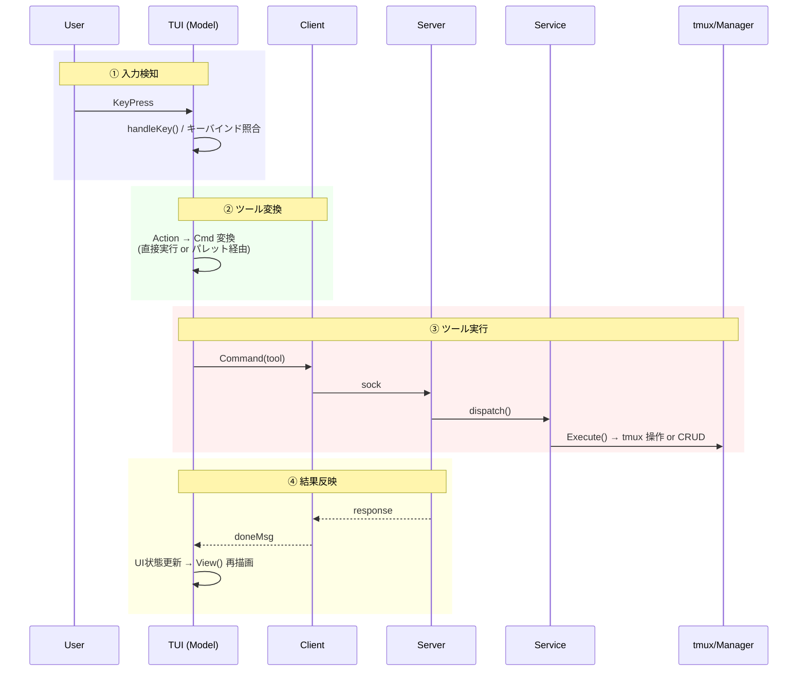
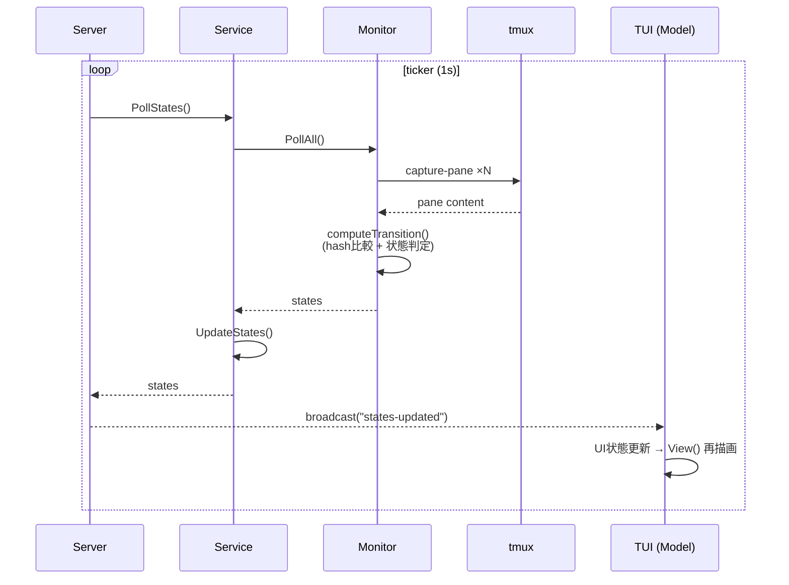
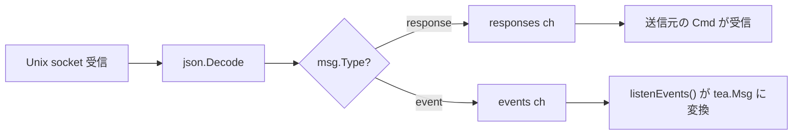
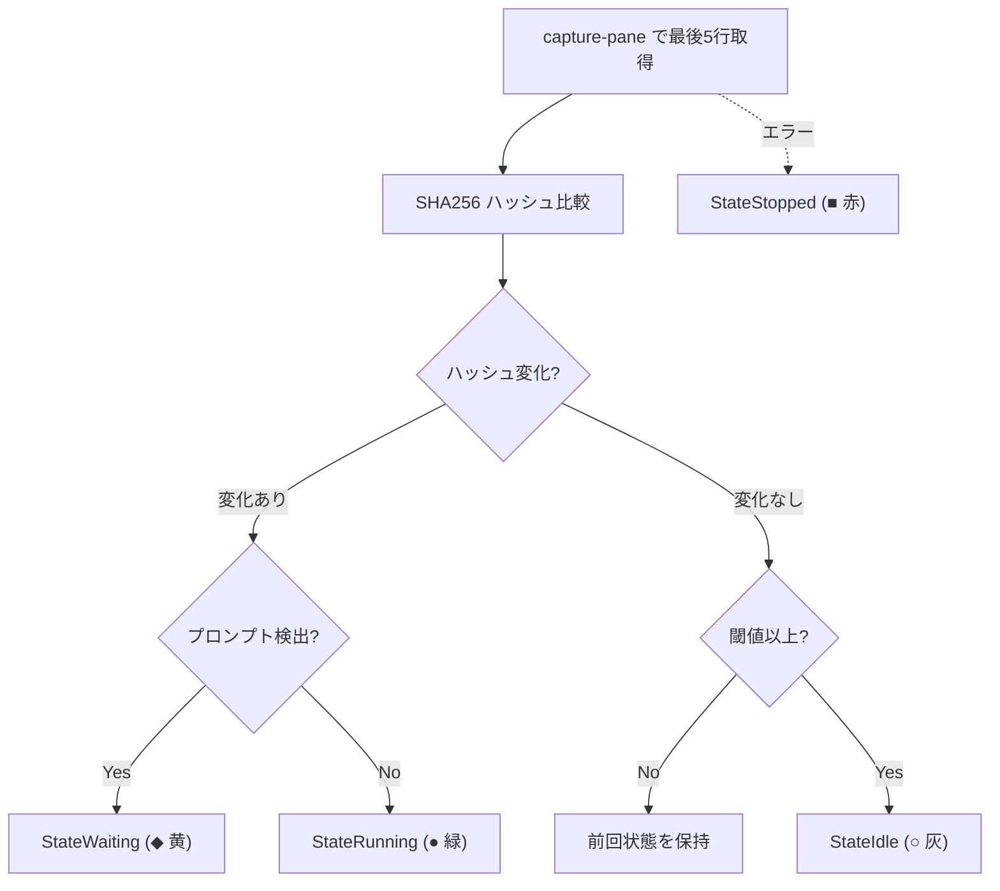

# Architecture

## ビジョン

- 複数の AI エージェントセッションを、プロジェクトを跨いで一元管理する操作パネル
- エージェント自体のオーケストレーションには踏み込まず、セッションのライフサイクル管理に徹する薄い TUI
- 最小操作でセッションの起動・切替ができる

## 設計原則

- **tmux ネイティブ**: tmux のセッション/window/pane をそのまま活用。エージェントの PTY を再実装しない
- **操作はすべてツール**: 全操作を Tool として抽象化。TUI・コマンドパレット・将来のエージェント SDK から同じ Tool を実行できる
- **TUI にビジネスロジックを置かない**: TUI は表示とキー入力のみ。ロジックは core.Service に集約
- **プロセスハンドラによるライフサイクル管理**: TUI サーバーの死活監視と自動復帰。終了判断はプロセスハンドラの責務
- **副作用の分離**: パス計算・状態遷移ロジック・データ構築は純粋関数。I/O (ファイル作成, tmux 操作) は呼び出し側が明示的に実行する。関数名で副作用の有無を区別する (`XxxPath` = 純粋, `EnsureXxx` = 副作用あり)
- **I/O 先行・状態変更後行**: 外部操作 (tmux, ファイル) を全て完了してから内部状態を変更する。I/O 失敗時はロールバックし、状態を汚染しない
- **テスト可能な設計**: tmux 操作はインターフェース経由。ファイルパスは注入可能。状態遷移ロジックは mock 不要で単体テスト可能

## レイヤー構成

```
tui/       表示層 — UI 状態管理、レンダリング、キー入力ディスパッチ
core/      サービス層 — セッション切替/プレビュー、popup 起動、状態ポーリング
session/   データ層 — セッション CRUD、JSON 永続化、状態定義
tmux/      インフラ層 — tmux コマンド実行、インターフェース定義
config/    設定 — TOML 読み込み、DataDir 注入
```

依存方向: `tui → core → session, tmux`

## プロセスモデル

3つの実行モードを1つのバイナリで提供。

```
roost                    → プロセスハンドラ
roost --tui sessions        → セッション一覧サーバー (Pane 2)
roost --tui palette [flags] → コマンドパレット (tmux popup)
roost --tui log            → ログ TUI (Pane 1, 将来)
```

### プロセスハンドラ

tmux セッションのライフサイクルを管理する親プロセス。

```
runProcessHandler()
├── tmux セッション作成 or 復元
├── Manager, Monitor, Service 初期化
├── Unix socket サーバー起動 (~/.config/roost/roost.sock)
├── Monitor ポーリングループ起動 (states-updated を broadcast)
├── ヘルスモニタ goroutine 起動 (2秒間隔で Pane 2 死活監視)
├── tmux attach (ブロック)
└── attach 終了時
    ├── shutdown コマンド受信済み → kill-session + sessions.json クリア
    └── 通常 detach → 終了（tmux 生存）
```

### セッション一覧サーバー

Pane 2 で動作する Bubbletea TUI。ソケット経由でプロセスハンドラに接続。終了不可（Ctrl+C 無効）。crash 時はヘルスモニタが自動 respawn。Manager/Monitor を持たず、全操作をソケット経由で委譲。

### コマンドパレット

`prefix p` または TUI の `n`/`N`/`p`/`d` で tmux popup として起動。ソケット経由でコマンド送信。ツール選択 → パラメータ入力 → 実行 → 終了。

## tmux レイアウト

```
┌─────────────────────┬────────────────┐
│  Pane 0.0           │  Pane 0.2      │
│  メイン (常時focus)  │  TUI サーバー   │
│                     │                │
├─────────────────────┤                │
│  Pane 0.1           │                │
│  ログ (tail -f)     │                │
└─────────────────────┴────────────────┘

Window 0: 制御画面（3ペイン固定）
Window 1+: セッション（バックグラウンド、swap-pane で Pane 0.0 に表示）
```

- `remain-on-exit on` でペイン終了時もレイアウト維持
- ターミナルサイズを `term.GetSize()` で取得し `new-session -x -y` に渡す
- prefix テーブルの全デフォルトキーを無効化し、Space/d/q/p のみ登録

## プロセス間通信 (IPC)

Unix domain socket (`~/.config/roost/roost.sock`) による JSON メッセージング。

```
PH (サーバー) ←sock→ TUI (クライアント, 長期接続, broadcast 購読)
PH (サーバー) ←sock→ Palette (クライアント, 短期接続)
```

### メッセージ種別

| 種別 | 方向 | 送信先 | 用途 |
|------|------|--------|------|
| **Response** | サーバー → クライアント | コマンド送信元のみ | コマンドの応答 |
| **Broadcast** | サーバー → クライアント | subscribe 済み全員 | sessions-changed, states-updated |

Response は `sendResponse` メソッドで統一送信。Broadcast は `subscribe` コマンドを送信したクライアントのみに配信。

### コマンド (クライアント → サーバー)

| コマンド | パラメータ | 機能 |
|---------|-----------|------|
| `subscribe` | - | ブロードキャストの受信を開始 |
| `create-session` | project, command | セッション作成 |
| `stop-session` | session_id | セッション停止 |
| `list-sessions` | - | セッション一覧取得 |
| `preview-session` | session_id, active_window_id | Pane 0 にプレビュー |
| `switch-session` | session_id, active_window_id | Pane 0 に切替 + フォーカス |
| `focus-pane` | pane | ペインフォーカス |
| `shutdown` | - | 全終了 |
| `detach` | - | デタッチ |

## ツールシステム

すべての操作は `Tool` として抽象化。TUI・パレット・将来の SDK から同じインターフェースで実行可能。ツールはパラメータ定義（`Param`）を持ち、パレットが不足パラメータを補完する。TUI/パレットはツール実行をソケット経由でサーバーに委譲。

## UX 処理パイプライン

ユーザー操作はすべて同一のパイプラインを通過する。

### インタラクティブパイプライン



**パレット経由の場合**: ②で tmux popup を起動。Palette が独立クライアントとしてパラメータ補完→③のコマンド送信を行い、結果は broadcast 経由で TUI に到達する。

### バックグラウンドパイプライン（状態監視）



**責務分離**: Monitor は capture + 純粋関数で状態計算のみ。Manager が状態を格納。Server が broadcast を配信。TUI は受信して再描画するだけ。

## TUI ↔ メインプロセス通信構造

### プロセス境界と責務


### 通信パターン

| パターン | 方向 | 特徴 | 例 |
|---------|------|------|-----|
| **Request-Response** | TUI → Server → TUI | 同期。Client が response ch でブロック待ち | `switch-session`, `preview-session` |
| **Event Broadcast** | Server → 全 TUI | 非同期。subscribe 済みクライアントに一斉配信 | `sessions-changed`, `states-updated` |
| **Tool Launch** | TUI → Server → tmux popup → Palette → Server | 間接通信。popup が独立クライアントとしてコマンド送信 | `new-session` |

### Client のメッセージ振り分け



## セッション切替

`core.Service` が `swap-pane -d` チェーンを `RunChain` でアトミック実行。

```
Preview(sess, active):
  1. swap-pane -d  メインペイン ↔ 旧セッション (旧を戻す)
  2. swap-pane -d  メインペイン ↔ 新セッション (新を表示)
  3. respawn-pane  ボトムペインにログ tail
  → フォーカスはサイドペインに残す

Switch(sess, active):
  Preview と同じ + SelectPane でメインペインにフォーカス
```

## 状態監視

`tmux/monitor.go` が `PaneCapturer` インターフェース経由で各セッション window を 1 秒間隔でポーリング。

状態遷移は純粋関数 `computeTransition` で計算し、`DetectState` は I/O (キャプチャ) と状態格納のみを担う。



## キー入力の処理分担

| レベル | 処理者 | 例 |
|--------|--------|-----|
| prefix キー | tmux bind-key (プロセスハンドラが設定) | Space, d, q, p |
| TUI キー | セッション一覧の Bubbletea | j/k, Enter, n, N, Tab |
| パレットキー | パレットの Bubbletea | Esc, Enter, 文字入力 |

prefix キーは tmux が横取り。bare key は各 pane のプロセスが直接受信。

## インターフェース

テスト可能性のために tmux 操作をインターフェース化。

```go
// tmux/interfaces.go
type PaneOperator interface {
    SwapPane(src, dst string) error
    SelectPane(target string) error
    RespawnPane(target, command string) error
    RunChain(commands ...[]string) error
}

type PaneCapturer interface {
    CapturePaneLines(target string, n int) (string, error)
}
```

- `core.Service` → `PaneOperator` に依存
- `tmux.Monitor` → `PaneCapturer` に依存
- `session.Manager` → `TmuxClient` インターフェースに依存
- ファイルパスは `Config.DataDir` で注入

## 副作用の命名規約

パス計算と副作用を関数名で区別する。

| パターン | 副作用 | 例 |
|---------|--------|-----|
| `XxxPath()` | なし (純粋) | `LogDirPath`, `ConfigDirPath`, `LogPath` |
| `EnsureXxx()` | ディレクトリ作成 | `EnsureLogDir`, `EnsureConfigDir` |
| `LoadFrom(path)` | ファイル読込のみ | `config.LoadFrom` |
| `Load()` | ディレクトリ作成 + ファイル読込 | `config.Load` (convenience wrapper) |

`Manager.Create` は I/O を全て先に実行し、失敗時にロールバック (tmux window kill, sessions slice 復元) する。

## データファイル

| パス | 形式 | 内容 |
|------|------|------|
| `~/.config/roost/config.toml` | TOML | ユーザー設定 |
| `~/.config/roost/sessions.json` | JSON | セッション一覧 |
| `~/.config/roost/logs/{id}.log` | テキスト | セッション別ログ |
| `~/.config/roost/roost.log` | slog | アプリケーションログ |
| `~/.config/roost/roost.sock` | Unix socket | プロセス間通信 |

`Config.DataDir` でベースパスを変更可能（テスト時に TempDir 指定）。

## ファイル構成

```
src/
├── main.go              プロセスハンドラ / モード分岐
├── core/
│   ├── server.go        Unix socket サーバー、コマンドハンドラ、broadcast
│   ├── client.go        ソケットクライアント（TUI・パレット用）
│   ├── protocol.go      メッセージ型定義 (Message, SessionInfo)
│   └── service.go       ビジネスロジック（切替、プレビュー、popup 起動）
├── config/
│   └── config.go        TOML 設定読み込み
├── session/
│   ├── manager.go       セッション CRUD + JSON 永続化
│   ├── state.go         状態 enum + Session struct
│   └── log.go           ログパス管理
├── tmux/
│   ├── interfaces.go    PaneOperator, PaneCapturer
│   ├── client.go        tmux コマンドラッパー（具象実装）
│   ├── pane.go          ペイン操作
│   └── monitor.go       状態監視
├── tui/
│   ├── model.go         Bubbletea Model（UI 状態のみ）
│   ├── view.go          レンダリング
│   ├── keys.go          キーバインド
│   ├── tool.go          ツール定義 + Registry
│   └── palette.go       コマンドパレット
└── logger/
    └── logger.go        slog 初期化
```

## 依存

| パッケージ | 用途 |
|-----------|------|
| `charm.land/bubbletea/v2` | TUI フレームワーク |
| `charm.land/lipgloss/v2` | スタイリング |
| `charm.land/bubbles/v2` | キーバインド |
| `github.com/BurntSushi/toml` | 設定ファイル |
| `golang.org/x/term` | ターミナルサイズ取得 |
| `log/slog` | 構造化ログ (標準ライブラリ) |
