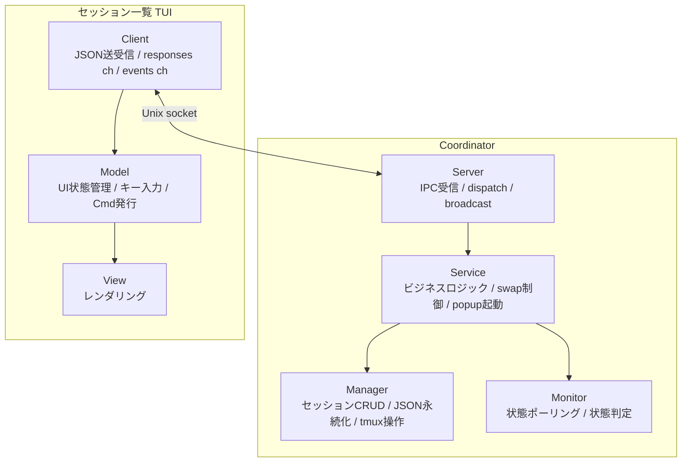
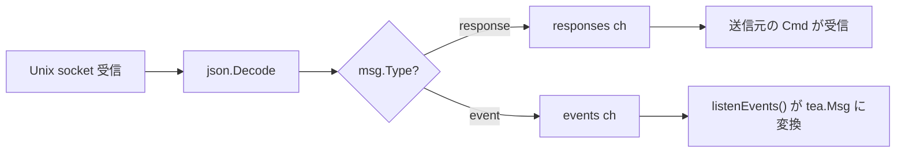
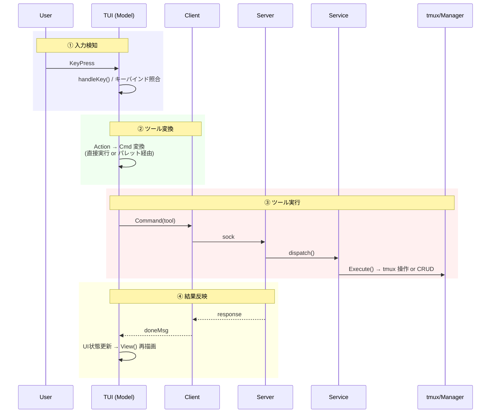
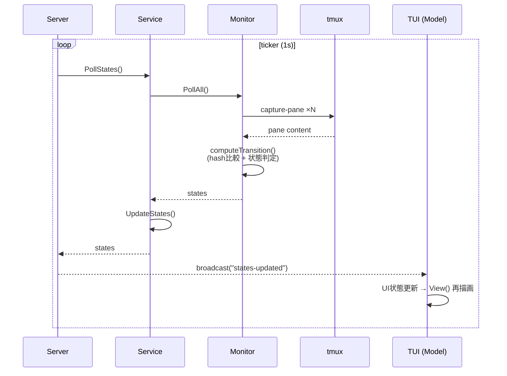
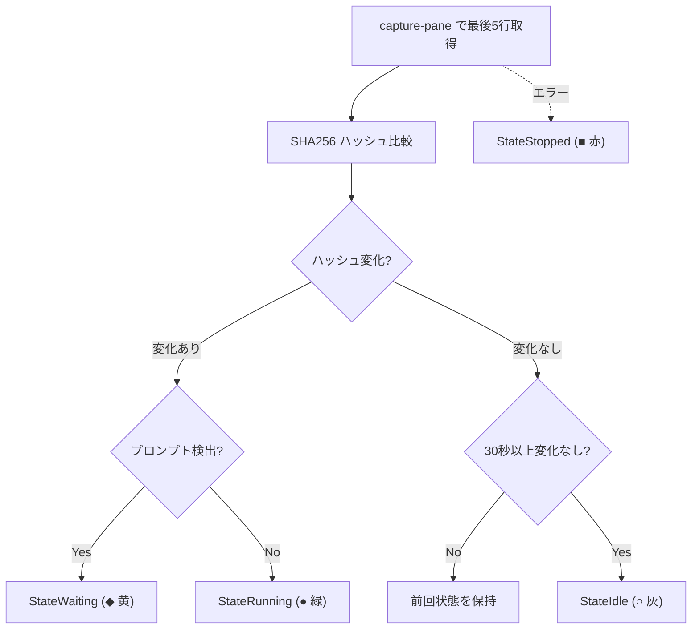

# Architecture

本ドキュメントは開発者向けに roost の内部アーキテクチャを説明する。

**roost** は tmux 上で複数の AI エージェントセッションを一元管理する TUI ツールである。

## 目次

- [ビジョン](#ビジョン) / [設計原則](#設計原則) / [用語](#用語)
- [レイヤー構成](#レイヤー構成) / [プロセスモデル](#プロセスモデル) / [tmux レイアウト](#tmux-レイアウト)
- [プロセス間通信](#プロセス間通信-ipc) / [ツールシステム](#ツールシステム) / [UX 処理パイプライン](#ux-処理パイプライン)
- [状態監視](#状態監視) / [インターフェース](#インターフェース) / [設計判断](#設計判断)
- [データファイル](#データファイル) / [ファイル構成](#ファイル構成) / [依存](#依存)

## ビジョン

AI エージェントを複数プロジェクトで並行稼働させると、tmux の素の操作ではセッションの把握・切替が煩雑になり、各エージェントが idle/running/waiting のどの状態かも見えない。これを解決する。

- 複数の AI エージェントセッションを、プロジェクトを跨いで一元管理する操作パネル
- エージェント自体のオーケストレーションには踏み込まず、セッションのライフサイクル管理に徹する薄い TUI
- 最小操作でセッションの起動・切替ができる

## 設計原則

- **tmux ネイティブ**: tmux のセッション/window/pane をそのまま活用。エージェントの PTY を再実装しない
- **高レベル操作はツール**: セッション作成・停止・終了など、副作用を伴う高レベル操作を Tool として抽象化。TUI・コマンドパレットから同じ Tool を実行できる
- **TUI にビジネスロジックを置かない**: TUI は表示とキー入力のみ。ロジックは core.Service に集約
- **Coordinator によるライフサイクル管理**: Coordinator（後述）が TUI プロセスの死活監視と自動復帰を担う。終了判断は Coordinator の責務
- **副作用の分離**: パス計算・状態遷移ロジック・データ構築は純粋関数。I/O (ファイル作成, tmux 操作) は呼び出し側が明示的に実行する。関数名で副作用の有無を区別する (`XxxPath` = 純粋, `EnsureXxx` = 副作用あり)
- **I/O 先行・状態変更後行**: 外部操作 (tmux, ファイル) を全て完了してから内部状態を変更する。I/O 失敗時は内部状態を変更せず汚染を防ぐ。ただし tmux の `RunChain` のようにアトミックにできない外部操作チェーンでは、途中失敗時の tmux 側ロールバックは行わない（設計判断参照）
- **テスト可能な設計**: tmux 操作はインターフェース経由。ファイルパスは注入可能。状態遷移ロジックは mock 不要で単体テスト可能

## 用語

| 用語 | 意味 | tmux 上の実体 |
|------|------|--------------|
| **セッション** | AI エージェントの作業単位。`Session` 構造体 | tmux **window**（Window 1+、単一ペイン構成） |
| **制御セッション** | roost 全体を収容する tmux セッション | tmux **session**（`roost`） |
| **ペイン** | Window 0 内の制御ペイン | tmux **pane**（`0.0`, `0.1`, `0.2`） |

以降「セッション」は roost セッションを指す。tmux セッションには「tmux セッション」と明記する。

## レイヤー構成

```
tui/       表示層 — UI 状態管理、レンダリング、キー入力ディスパッチ
core/      サービス層 — セッション切替/プレビュー、popup 起動、状態ポーリング、ツール定義
session/   データ層 — セッション CRUD、JSON 永続化、状態定義
tmux/      インフラ層 — tmux コマンド実行、インターフェース定義
config/    設定 — TOML 読み込み、DataDir 注入
logger/    ログ — slog 初期化、ログファイル管理
```

Coordinator プロセスとTUI プロセスは別プロセスで、Unix socket 経由の IPC で通信する。

コード依存方向:
- Coordinator (main) → `core.Service` → `session`, `tmux`
- TUI プロセス → `core.Client`（IPC 境界）
- 共通: `main` → `config`, `logger`

## プロセスモデル

3つの実行モードを1つのバイナリで提供。各ペイン ID (`0.0`, `0.1`, `0.2`) のレイアウトは [tmux レイアウト](#tmux-レイアウト) を参照。

```
roost                       → Coordinator（親プロセス。tmux セッションのライフサイクルを管理）
roost --tui main            → メイン TUI (Pane 0.0)
roost --tui sessions        → セッション一覧サーバー (Pane 0.2)
roost --tui palette [flags] → コマンドパレット (tmux popup)
roost --tui log             → ログ TUI (Pane 0.1)
```

### Coordinator

tmux セッション全体のライフサイクルを管理する親プロセス。起動時に tmux セッションを作成し、TUI プロセスを子ペインとして起動する。tmux attach 中はブロックし、detach またはシャットダウンで終了する。

```
runCoordinator()
├── tmux セッション作成 or 復元
├── sessions.json と tmux window の整合性チェック（orphan エントリ除去）
├── Manager, Monitor, Service 初期化
├── Unix socket サーバー起動 (~/.config/roost/roost.sock)
├── 状態ポーリング goroutine 起動 (Server が ticker で Monitor を駆動、states-updated を broadcast)
├── ヘルスモニタ goroutine 起動 (2秒間隔で Pane 0.1, 0.2 死活監視)
├── tmux attach (ブロック)
└── attach 終了時
    ├── shutdown 受信済み → flag 設定 → response 送信 → 50ms sleep → DetachClient()
    │   → attach 終了 → KillSession() → Manager.Clear()
    └── 通常 detach → 終了（tmux セッション生存）
```

### メイン TUI

Pane 0.0 で動作する常駐 Bubbletea TUI プロセス。キーバインドヘルプを常時表示し、セッション一覧でプロジェクトヘッダーが選択されたとき該当プロジェクトのセッション情報を表示する。Coordinator 未起動時はキーバインドヘルプのみの static モードで動作する。セッション切替時は `swap-pane` でバックグラウンド window に退避し、プロジェクトヘッダー選択時に復帰する。

```
runTUI("main")
├── ソケット接続を試行
│   ├── 成功 → subscribe + Client 付きで MainModel 起動
│   └── 失敗 → static モード（キーバインドヘルプのみ）
└── Bubbletea イベントループ（sessions-changed / states-updated / project-selected を受信 → 再描画）
```

### セッション一覧サーバー

Pane 0.2 で動作する常駐 Bubbletea TUI プロセス。ソケット経由で Coordinator に接続し、セッション一覧の表示・操作を提供する。終了不可（Ctrl+C 無効）。crash 時はヘルスモニタが自動 respawn。Manager/Monitor を持たず、全操作をソケット経由で Coordinator に委譲する。

```
runTUI("sessions")
├── Client 初期化 + ソケット接続
├── subscribe コマンド送信（broadcast 受信開始）
├── list-sessions で初期データ取得
└── Bubbletea イベントループ（キー入力 → IPC コマンド → broadcast 受信 → 再描画）
```

### ログ TUI

Pane 0.1 で動作する常駐 Bubbletea TUI プロセス。アプリケーションログとセッションログの 2 タブを提供する。200ms 間隔でログファイルをポーリングし、新規行を表示する。

```
runTUI("log")
├── ソケット接続を試行
│   ├── 成功 → subscribe + Client 付きで LogModel 起動（セッションログ切替を受信）
│   └── 失敗 → アプリログのみモードで LogModel 起動（Client なし）
└── Bubbletea イベントループ（タブ切替、スクロール、follow モード）
```

Coordinator との通信は任意。接続できない場合（Coordinator 未起動・起動順の競合）はアプリログのみで動作する。crash 時はヘルスモニタが Pane 0.1 の死活を検知し respawn する。

### コマンドパレット

`prefix p` または TUI の `n`/`N`/`d` で tmux popup として起動する独立プロセス。ソケット経由でコマンド送信。ツール選択 → パラメータ入力 → 実行 → 終了。TUI のサブコンポーネントではなく tmux popup にすることで、TUI のイベントループをブロックせず、パレットが crash しても TUI に影響しない。

```
runTUI("palette")
├── Client 初期化 + ソケット接続
├── フラグからツール名・初期引数を取得
├── 未確定パラメータがあればインクリメンタル選択 UI
├── 全パラメータ確定 → Tool.Run で IPC コマンド送信
└── 終了（popup 自動クローズ）
```

### 障害時の振る舞い

- **TUI のソケット切断**: TUI プロセスは終了する。ヘルスモニタが検知し respawn
- **セッション window の外部 kill**: 次回ポーリングで capture-pane がエラーを返し StateStopped に遷移。sessions.json からは除去しない（ユーザーが明示的に stop する）
- **ヘルスモニタの respawn 連続失敗**: respawn-pane は tmux がペインを再作成するため通常は失敗しない（ただしバイナリ削除・権限変更等の環境異常時は起動失敗する）。tmux セッション消失時は Coordinator の attach も終了するため、全体が終了する
- **起動時の整合性**: sessions.json の各エントリに対応する tmux window の存在を確認し、不在エントリを除去してから Manager を初期化する
- **IPC エラー**: TUI 側で IPC コマンドがエラーを返した場合、slog にログ出力し UI 状態は変更しない。タイムアウトは設定していない（Unix socket のローカル通信のため）。サーバーがデッドロックした場合、クライアントは無期限にブロックするリスクがある。復帰手段は外部からの `tmux kill-session -t roost` または Coordinator プロセスの kill

## tmux レイアウト

```
┌─────────────────────┬────────────────┐
│  Pane 0.0           │  Pane 0.2      │
│  メイン TUI (常時focus) │  TUI サーバー   │
│                     │                │
├─────────────────────┤                │
│  Pane 0.1           │                │
│  ログ TUI           │                │
└─────────────────────┴────────────────┘

Window 0: 制御画面（3ペイン固定）
Window 1+: セッション（バックグラウンド、swap-pane で Pane 0.0 に表示）
```

- `remain-on-exit on` でペイン終了時もレイアウト維持
- `mouse on` でマウスホイールスクロールとペイン境界認識を有効化。roost が明示的に設定し、ユーザーの tmux.conf に依存しない
- ターミナルサイズを `term.GetSize()` で取得し `new-session -x -y` に渡す
- prefix テーブルの全デフォルトキーを無効化し、Space/d/q/p のみ登録

### マウス操作

tmux `mouse on` により、マウス操作は tmux が仲介する。テキスト選択は tmux のコピーモードを経由する。

| 操作 | 動作 |
|------|------|
| ホイール | tmux がスクロール処理（alt screen ペインではプログラムにイベント転送） |
| ドラッグ | tmux コピーモードに入り、ペイン内でテキスト選択 |
| リリース | 選択テキストをコピーし、コピーモードを終了（ライブ表示に復帰） |
| Shift+ドラッグ | tmux を迂回し、ターミナルネイティブの選択（ペイン境界を跨ぐ） |

**制約**: コピーモード終了時にライブ表示（最下部）に復帰するのは tmux の仕様。スクロールバック位置を維持したままコピーモードを抜けることはできない。ペイン内選択とスクロール位置維持を両立するには Shift+ドラッグを使うか、コピーモード内で `q` を押すまで閲覧を続ける。

### セッション切替

`core.Service` が `swap-pane -d` チェーンを `RunChain` で単一 tmux 呼び出しとして実行（コマンドは `;` で連結。途中失敗時のロールバックはない）。

```
Preview(sess):
  1. swap-pane -d  メインペイン ↔ 旧セッション (旧を戻す、activeWindowID がある場合)
  2. swap-pane -d  メインペイン ↔ 新セッション (新を表示)
  → フォーカスは変更しない

Switch(sess):
  Preview と同じ + SelectPane でメインペインにフォーカス
```

### キー入力の処理分担

| レベル | 処理者 | 例 |
|--------|--------|-----|
| prefix キー | tmux bind-key (Coordinator が設定) | Space, d, q, p |
| TUI キー | セッション一覧の Bubbletea | j/k, Enter, n, N, Tab |
| パレットキー | パレットの Bubbletea | Esc, Enter, 文字入力 |

prefix キーは tmux が横取り。bare key は各 pane のプロセスが直接受信。

## プロセス間通信 (IPC)

Unix domain socket (`~/.config/roost/roost.sock`) による JSON メッセージング。

### トポロジ



### 通信パターン

| パターン | 方向 | 特徴 | 例 |
|---------|------|------|-----|
| **Request-Response** | TUI → Server → TUI | 同期。Client が response ch でブロック待ち | `switch-session`, `preview-session` |
| **Event Broadcast** | Server → 全クライアント | 非同期。subscribe 済みクライアントに一斉配信 | `sessions-changed`, `states-updated` |
| **Tool Launch** | TUI → Server → tmux popup → Palette → Server | 間接通信。popup が独立クライアントとしてコマンド送信 | `new-session` |

Response は `sendResponse` メソッドで統一送信。Broadcast は `subscribe` コマンドを送信したクライアントのみに配信。

### メッセージ形式

全メッセージは Go の `Message` 構造体で表現し、JSON にシリアライズして送受信する。`Type` フィールドで方向を判定する。フレーミングは改行区切り JSON (NDJSON)。`json.Encoder` / `json.Decoder` がストリーム上で 1 メッセージ = 1 行として読み書きする。`Message` は全フィールドをフラットに持つ単一構造体で、`omitempty` で不要フィールドを省略する。パース側で union type の分岐が不要になる。

| フィールド | Go 型 | JSON 型 | 用途 |
|-----------|-------|---------|------|
| `type` | string | string | `"command"`, `"response"`, `"event"` |
| `command` | string | string | コマンド名 (client → server) |
| `args` | map[string]string | object | コマンド引数 |
| `event` | string | string | イベント名 (server → client) |
| `sessions` | []SessionInfo | array | セッション一覧 |
| `states` | map[string]State | object | 状態マップ |
| `error` | string | string | エラーメッセージ |
| `active_window_id` | string | string | アクティブ window ID |
| `session_log_path` | string | string | セッションログパス |
| `selected_project` | string | string | 選択中プロジェクトパス |

生成ヘルパー: `NewCommand(cmd, args)` / `NewEvent(event)`。エラーは `Message.Error` に文字列を格納し、クライアント側で `error` に変換する。

### コマンド (クライアント → サーバー)

| コマンド | パラメータ | 機能 |
|---------|-----------|------|
| `subscribe` | - | ブロードキャストの受信を開始 |
| `create-session` | project, command | セッション作成 |
| `stop-session` | session_id | セッション停止 |
| `list-sessions` | - | セッション一覧取得 |
| `preview-session` | session_id | Pane 0.0 にプレビュー |
| `preview-project` | project | アクティブセッションを退避し `project-selected` イベントを broadcast |
| `switch-session` | session_id | Pane 0.0 に切替 + フォーカス |
| `focus-pane` | pane | ペインフォーカス |
| `launch-tool` | tool | パレット popup 起動 |
| `shutdown` | - | 全終了 |
| `detach` | - | デタッチ |

### Client のメッセージ振り分け



### 並行性モデル

- **Server**: `sync.Mutex` で clients と shutdownRequested を保護。各接続は独立 goroutine。dispatch は同一 goroutine 内で逐次実行
- **Client**: `sync.Mutex` で encoder を保護。`listen` goroutine が `responses` ch / `events` ch に振り分け
- **Manager**: `sync.RWMutex` で sessions スライスを保護
- **常駐 goroutine**: acceptLoop, StartMonitor (ticker), healthMonitor の 3 本

## ツールシステム

ユーザーが行う高レベル操作を `Tool` として抽象化。TUI・パレットから同じインターフェースで実行可能。

```go
// core/tool.go
type Tool struct {
    Name        string
    Description string
    Params      []Param
    Run         func(ctx *ToolContext, args map[string]string) error
}

type Param struct {
    Name    string
    Options func(ctx *ToolContext) []string  // 実行時に選択肢を生成
}
```

### Tool → IPC コマンドの対応

Tool の `Run` は `ToolContext.Client` 経由で IPC コマンドを送信する。1 Tool = 1 IPC コマンドの対応。

| Tool | IPC コマンド | パラメータ |
|------|-------------|-----------|
| `new-session` | `create-session` | project, command |
| `stop-session` | `stop-session` | session_id |
| `detach` | `detach` | - |
| `shutdown` | `shutdown` | - |

Tool は副作用を伴う高レベル操作（作成・停止・終了等）を対象とする。`switch-session`, `preview-session`, `focus-pane` 等の低レベルなナビゲーション操作は Tool を経由せず、TUI が直接 IPC コマンドを送信する。

### パレットによるパラメータ補完

パレットは tmux popup として起動する独立プロセス。TUI のイベントループをブロックせず、crash しても TUI に影響しない。

補完フロー: ツール選択 → 各 `Param` の `Options` コールバックで選択肢を動的生成 → ユーザー入力でインクリメンタルフィルタ → 全パラメータ確定後に `Tool.Run` 実行。結果は broadcast 経由で TUI に到達する。

## UX 処理パイプライン

ユーザー操作はすべて同一のパイプラインを通過する。

### インタラクティブパイプライン



**パレット経由の場合**: ②で tmux popup を起動。Palette が独立クライアントとしてパラメータ補完→③のコマンド送信を行い、結果は broadcast 経由で TUI に到達する。

**エラー時**: ③で IPC コマンドがエラーを返した場合、response の `error` フィールドに詳細が格納される。TUI 側は slog にログ出力し、UI 状態は変更しない（楽観的更新をしない）。tmux 操作の失敗（例: swap-pane 対象の window が消失）は Service 層でエラーとして返却され、同様に response 経由で TUI に伝搬する。

### バックグラウンドパイプライン（状態監視）



**責務分離**: Monitor は capture + 純粋関数で状態計算のみ（状態を返す）。Service が `UpdateStates()` で Monitor から受け取った状態を Manager に委譲して格納。Server が broadcast を配信。TUI は受信して再描画するだけ。

## 状態監視

バックグラウンドパイプライン（前節）で駆動される状態判定ロジックの詳細。`computeTransition` は純粋関数で、`DetectState` が I/O を担う。

プロンプト検出は正規表現 `` (?m)(^>|[>$❯]\s*$) `` による末尾行パターンマッチ。`>`, `$`, `❯` で終わる行をプロンプト待ちと判定する。



Idle 閾値は `config.toml` の `IdleThresholdSec` で変更可能（デフォルト 30 秒）。ポーリング間隔は `PollIntervalMs`（デフォルト 1000ms）。

## インターフェース

テスト可能性のために tmux 操作をインターフェース化。

```go
// tmux/interfaces.go
type PaneOperator interface {
    SwapPane(src, dst string) error
    SelectPane(target string) error
    RespawnPane(target, command string) error
    RunChain(commands ...[]string) error
}

type PaneCapturer interface {
    CapturePaneLines(target string, n int) (string, error)
}
```

```go
// session/manager.go
type TmuxClient interface {
    NewWindow(name, command, startDir string) (string, error)
    KillWindow(windowID string) error
    ListWindowIDs() ([]string, error)
    SetOption(target, key, value string) error
    PipePane(target, command string) error
}
```

- `core.Service` → `PaneOperator` に依存
- `tmux.Monitor` → `PaneCapturer` に依存
- `session.Manager` → `TmuxClient` に依存
- ファイルパスは `Config.DataDir` で注入

## 設計判断

| 判断 | 選択 | 理由 |
|------|------|------|
| パレットの実装方式 | tmux popup (独立プロセス) | crash 分離。Bubbletea サブモデルでは TUI 内で panic を共有する |
| Ctrl+C の無効化 | KeyPressMsg を consume | 常駐プロセスの誤終了防止。ヘルスモニタの respawn まで操作不能になる |
| 楽観的更新をしない | IPC エラー時に UI 状態を変更しない | 次回ポーリングで自動回復。状態不整合のリスクを回避 |
| shutdown 時に sessions.json クリア | Manager.Clear() | tmux session ごと kill するため orphan エントリを防止 |
| swap-pane チェーンのロールバック | しない | tmux の `;` 連結はアトミックではなく途中ロールバック不可。内部状態を変更しないことで整合性を維持 |
| IPC タイムアウト | 設定しない | Server のデッドロックは Coordinator 全体の障害を意味し、Client 側のタイムアウトでは回復できない。外部からの再起動が唯一の復帰手段であるため優先度は低い |

## 副作用の命名規約

パス計算と副作用を関数名で区別する。

| パターン | 副作用 | 例 |
|---------|--------|-----|
| `XxxPath()` | なし (純粋) | `LogDirPath`, `ConfigDirPath`, `LogPath` |
| `EnsureXxx()` | ディレクトリ作成 | `EnsureLogDir`, `EnsureConfigDir` |
| `LoadFrom(path)` | ファイル読込のみ | `config.LoadFrom` |
| `Load()` | ディレクトリ作成 + ファイル読込 | `config.Load` (convenience wrapper) |

## テスト方針

テストファイルは対象ファイルと同じディレクトリに `*_test.go` として配置。

- **純粋関数のテスト**: mock 不要。状態遷移ロジック（`computeTransition`）、プロトコルのシリアライズ、パス計算など
- **I/O を含むテスト**: インターフェースの mock を注入。`PaneOperator`/`PaneCapturer` の mock で tmux 依存を排除。`Config.DataDir` に `t.TempDir()` を注入してファイル I/O を分離
- **TUI テスト**: Bubbletea の `Model.Update` にメッセージを直接渡し、返り値の Model 状態を検証。実際のターミナルは不要

## データファイル

| パス | 形式 | 内容 | ライフサイクル |
|------|------|------|--------------|
| `~/.config/roost/config.toml` | TOML | ユーザー設定（下記参照） | ユーザーが作成。存在しなければデフォルト値で動作 |
| `~/.config/roost/sessions.json` | JSON | セッション一覧 | Coordinator 起動時に読込・整合性チェック。セッション作成/停止で更新。shutdown で全エントリ削除 |
| `~/.config/roost/logs/{id}.log` | テキスト | セッション出力 (pipe-pane でキャプチャ) | セッション作成時に開始。stop-session で pipe-pane 停止（ファイルは残る） |
| `~/.config/roost/roost.log` | slog | アプリケーションログ | Coordinator 起動時に作成/追記 |
| `~/.config/roost/roost.sock` | Unix socket | プロセス間通信 | Coordinator 起動時に作成。終了時に削除 |

`Config.DataDir` でベースパスを変更可能（テスト時に TempDir 指定）。

`config.toml` の全フィールド（括弧内はデフォルト値）:

- `tmux`: `session_name` (`"roost"`), `prefix` (`"C-b"`), `pane_ratio_horizontal` (`75`), `pane_ratio_vertical` (`70`)
- `monitor`: `poll_interval_ms` (`1000`), `idle_threshold_sec` (`30`)
- `session`: `auto_name` (`true`), `default_command` (`"claude"`), `commands` (`["claude","gemini","codex"]`)
- `projects`: `project_roots` (`["~/dev","~/work"]`)

## ファイル構成

```
src/
├── main.go              Coordinator / モード分岐
├── core/
│   ├── server.go        Unix socket サーバー、コマンドハンドラ、broadcast
│   ├── client.go        ソケットクライアント（TUI・パレット用）
│   ├── protocol.go      メッセージ型定義 (Message, SessionInfo)
│   ├── service.go       ビジネスロジック（切替、プレビュー、popup 起動）
│   └── tool.go          ツール定義 + Registry
├── config/
│   └── config.go        TOML 設定読み込み
├── session/
│   ├── manager.go       セッション CRUD + JSON 永続化
│   ├── state.go         状態 enum + Session struct
│   └── log.go           ログパス管理
├── tmux/
│   ├── interfaces.go    PaneOperator, PaneCapturer
│   ├── client.go        tmux コマンドラッパー（具象実装）
│   ├── pane.go          ペイン操作
│   └── monitor.go       状態監視
├── tui/
│   ├── model.go         セッション一覧 Model（UI 状態のみ）
│   ├── view.go          セッション一覧レンダリング
│   ├── main_model.go    メイン TUI Model
│   ├── main_view.go     メイン TUI レンダリング
│   ├── keys.go          キーバインド
│   ├── palette.go       コマンドパレット
│   └── log_model.go     ログ TUI
└── logger/
    └── logger.go        slog 初期化
```

## 依存

| パッケージ | バージョン | 用途 |
|-----------|-----------|------|
| `charm.land/bubbletea/v2` | v2.0.2 | TUI フレームワーク |
| `charm.land/lipgloss/v2` | v2.0.2 | スタイリング |
| `charm.land/bubbles/v2` | v2.1.0 | キーバインド |
| `github.com/BurntSushi/toml` | v1.6.0 | 設定ファイル |
| `golang.org/x/term` | v0.41.0 | ターミナルサイズ取得 |
| `log/slog` | 標準ライブラリ | 構造化ログ |
