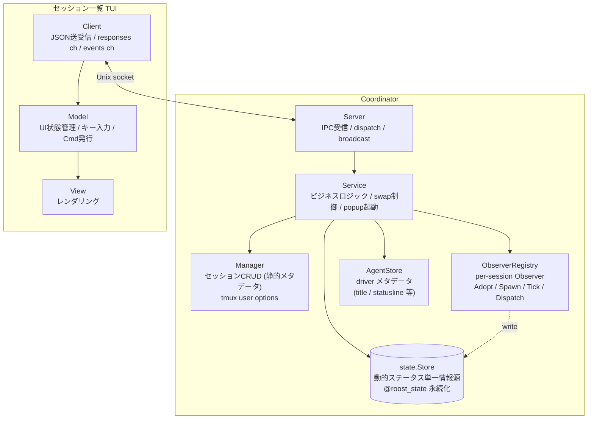
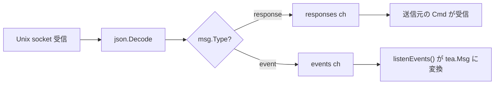
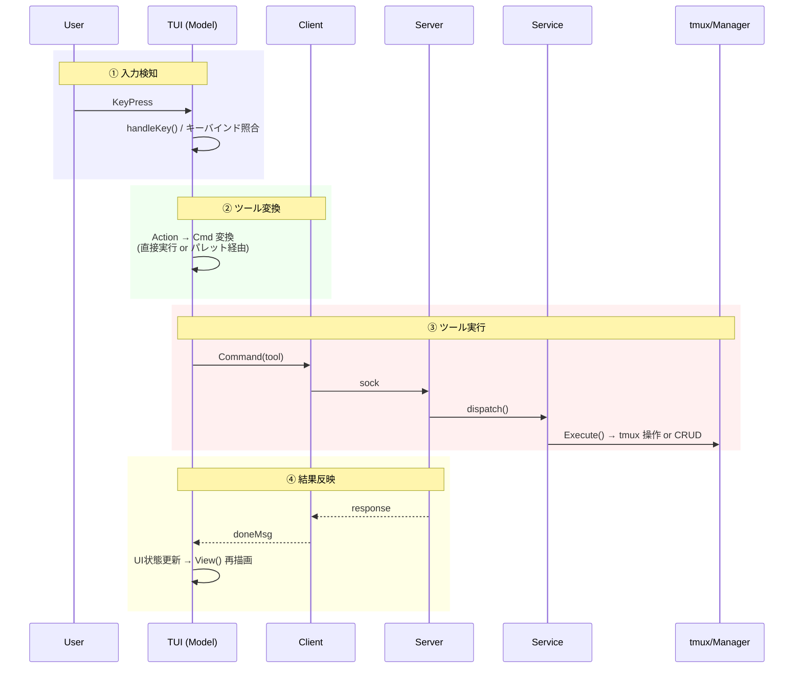
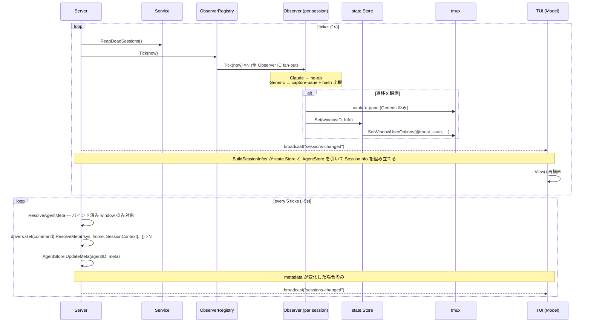
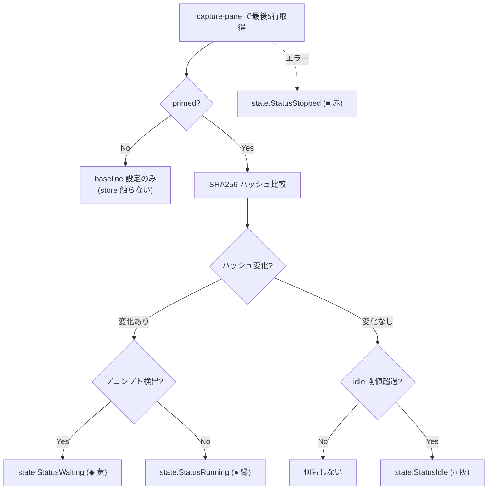

# Architecture

本ドキュメントは開発者向けに roost の内部アーキテクチャを説明する。

**roost** は tmux 上で複数の AI エージェントセッションを一元管理する TUI ツールである。

## 目次

- [ビジョン](#ビジョン) / [設計原則](#設計原則) / [用語](#用語)
- [レイヤー構成](#レイヤー構成) / [プロセスモデル](#プロセスモデル) / [tmux レイアウト](#tmux-レイアウト)
- [プロセス間通信](#プロセス間通信-ipc) / [ツールシステム](#ツールシステム) / [UX 処理パイプライン](#ux-処理パイプライン)
- [状態監視](#状態監視) / [インターフェース](#インターフェース) / [設計判断](#設計判断)
- [データファイル](#データファイル) / [ファイル構成](#ファイル構成) / [依存](#依存)

## ビジョン

AI エージェントを複数プロジェクトで並行稼働させると、tmux の素の操作ではセッションの把握・切替が煩雑になり、各エージェントが idle/running/waiting のどの状態かも見えない。これを解決する。

- 複数の AI エージェントセッションを、プロジェクトを跨いで一元管理する操作パネル
- エージェント自体のオーケストレーションには踏み込まず、セッションのライフサイクル管理に徹する薄い TUI
- 最小操作でセッションの起動・切替ができる

## 設計原則

- **tmux ネイティブ**: tmux のセッション/window/pane をそのまま活用。エージェントの PTY を再実装しない
- **高レベル操作はツール**: セッション作成・停止・終了など、副作用を伴う高レベル操作を Tool として抽象化。TUI・コマンドパレットから同じ Tool を実行できる
- **TUI にビジネスロジックを置かない**: TUI は表示とキー入力のみ。ロジックは core.Service に集約
- **Coordinator によるライフサイクル管理**: Coordinator（後述）が TUI プロセスの死活監視と自動復帰を担う。終了判断は Coordinator の責務
- **副作用の分離**: パス計算・状態遷移ロジック・データ構築は純粋関数。I/O (ファイル作成, tmux 操作) は呼び出し側が明示的に実行する。関数名で副作用の有無を区別する (`XxxPath` = 純粋, `EnsureXxx` = 副作用あり)
- **I/O 先行・状態変更後行**: 外部操作 (tmux, ファイル) を全て完了してから内部状態を変更する。I/O 失敗時は内部状態を変更せず汚染を防ぐ。ただし tmux の `RunChain` のようにアトミックにできない外部操作チェーンでは、途中失敗時の tmux 側ロールバックは行わない（設計判断参照）
- **動的状態の単一情報源**: セッションごとの動的ステータス (running / waiting / pending / idle / stopped) は `state.Store` 1 つだけが保持する。`Manager` は静的メタデータ、`AgentStore` は driver メタデータ (title / statusline 等) のみを持ち、ステータスは持たない。各層が独立に保つキャッシュをマージする合成ロジックは存在しない
- **Driver-owned state production**: ステータスを生む責務は driver が持つ。各 driver は自分の `Observer` インスタンスを生成し、Observer が hook 受信や capture-pane polling を内部に閉じ込めて `state.Store` に書き込む。core / Manager / AgentStore は Observer の中身を知らない
- **フォールバック禁止**: 「情報源 A が無ければ B」という合成は行わない。`Observer` が書かない限り `state.Store` は変わらない、それだけ。新規 / 復元セッションでは start 時に一度書き込まれた値が次の遷移まで持続する
- **テスト可能な設計**: tmux 操作はインターフェース経由。ファイルパスは注入可能。状態遷移ロジックは mock 不要で単体テスト可能

## 用語

| 用語 | 意味 | tmux 上の実体 |
|------|------|--------------|
| **セッション** | AI エージェントの作業単位。`Session` 構造体 | tmux **window**（Window 1+、単一ペイン構成） |
| **制御セッション** | roost 全体を収容する tmux セッション | tmux **session**（`roost`） |
| **ペイン** | Window 0 内の制御ペイン | tmux **pane**（`0.0`, `0.1`, `0.2`） |
| **Warm start (温起動)** | tmux session 生存状態での Coordinator 起動。tmux user options から状態を復元 | 既存の tmux session/window/pane を再利用 |
| **Cold start (冷起動)** | tmux session 消滅状態 (PC 再起動 / tmux server 死亡) での Coordinator 起動。`sessions.json` から tmux session/window を再作成 | tmux session/window を新規作成 |

以降「セッション」は roost セッションを指す。tmux セッションには「tmux セッション」と明記する。

Coordinator の起動は必ず Warm start か Cold start のどちらかで、初回起動という分岐は持たない (sessions.json が存在しなければ空のセッション一覧で Cold start するだけ)。

## レイヤー構成

```
tui/       表示層 — UI 状態管理、レンダリング、キー入力ディスパッチ
core/      サービス層 — セッション切替/プレビュー、popup 起動、Observer ループ駆動、ツール定義
session/   データ層 — セッション CRUD (静的メタデータのみ)、runtime は tmux user options が真実、Cold start 用の sessions.json スナップショットを並行管理
session/driver/  ドライバ層 — 各エージェントの Driver / Observer 実装。コマンド別プロンプト検出、AgentStore (driver メタデータのみ)、ObserverRegistry (per-session Observer のライフサイクル管理)
state/     ステータス層 — 動的セッションステータスの単一情報源 (state.Store)。in-memory cache + tmux user options 永続化 (`@roost_state` / `@roost_state_changed_at`)。leaf パッケージで session / tmux に依存しない
tmux/      インフラ層 — tmux コマンド実行、インターフェース定義
lib/       ユーティリティ — 外部ツール連携。サブパッケージで名前空間分離 (lib/git/, lib/claude/)
config/    設定 — TOML 読み込み、DataDir 注入
logger/    ログ — slog 初期化、ログファイル管理
```

Coordinator プロセスとTUI プロセスは別プロセスで、Unix socket 経由の IPC で通信する。

コード依存方向:
- Coordinator (main) → `core.Service` → `session`, `tmux`, `driver.AgentStore`, `driver.ObserverRegistry`, `state.Store`
- TUI プロセス → `core.Client`（IPC 境界）
- `tui` → `state`（`state.Status` enum を直接 import。`session.State` enum は廃止）
- `tui` → `driver.Registry`（コマンド表示名・ログタブ）
- `tui` → `lib/claude/transcript`（トランスクリプト整形・Parser）
- `session.Manager` → `session/driver`（`NewManager` で `driver.Registry` を受け取り、`refreshSessionBranchLocked` の cwd 取得と `Recreate` の spawn コマンド組立てに使う）
- `session/driver/` → `state`（Observer が `state.Store` への書き込みインターフェースを保持。`ObserverDeps` で注入される）
- 共通: `main` → `config`, `logger`
- `state/` は leaf パッケージで他の内部パッケージに依存しない。tmux への永続化は `state.OptionWriter` / `state.OptionReader` interface 経由で `tmux.Client` を注入する
- `session/driver/` は core / session / tmux など上位レイヤに依存しない。`state` パッケージと、副作用ゼロの leaf ユーティリティ (`lib/claude/cli`, `lib/claude/transcript`) は import してよい
- `lib/` のユーティリティ関数は他の内部パッケージに依存しない。サブコマンドハンドラ（`command.go`）は `core`, `config`, `session/driver` を使用可能 (driver subcommand が tool 固有の hook payload を `driver.AgentEvent` に詰め替える責務を持つため)
- `lib/subcommand.go` でサブコマンドレジストリを提供。各 lib パッケージが `init()` で登録し、`main` は `lib.Dispatch` でディスパッチ

## プロセスモデル

3つの実行モードを1つのバイナリで提供。各ペイン ID (`0.0`, `0.1`, `0.2`) のレイアウトは [tmux レイアウト](#tmux-レイアウト) を参照。

```
roost                       → Coordinator（親プロセス。tmux セッションのライフサイクルを管理）
roost --tui main            → メイン TUI (Pane 0.0)
roost --tui sessions        → セッション一覧サーバー (Pane 0.2)
roost --tui palette [flags] → コマンドパレット (tmux popup)
roost --tui log             → ログ TUI (Pane 0.1)
roost claude event          → Claude hook イベント受信（hook から呼ばれる短命プロセス）
roost claude setup          → Claude hook 登録（~/.claude/settings.json に書き込み）
```

### Coordinator

tmux セッション全体のライフサイクルを管理する親プロセス。起動時に tmux セッションを作成し、TUI プロセスを子ペインとして起動する。tmux attach 中はブロックし、detach またはシャットダウンで終了する。

```
runCoordinator()
├── Manager, state.Store, ObserverRegistry 初期化
│   (Store は tmux client を OptionWriter として保持。ObserverRegistry は driver.Registry と
│    ObserverDeps{Store, Capturer, IdleThreshold} を保持)
├── tmux セッション存在確認
│   ├── 存在 (Warm start: Coordinator のみ起動)
│   │   ├── restoreSession + Manager.Refresh（tmux window user options から静的メタデータを復元）
│   │   └── state.Store.LoadFromTmux（@roost_state / @roost_state_changed_at を in-memory cache へ seed）
│   └── 不在 (Cold start: PC 再起動 / tmux server 死亡)
│       └── setupNewSession + Manager.Recreate（sessions.json から window を再作成。state.Store は LoadFromTmux しない — 新 windowID 用に Spawn が後続で Idle を書く）
├── Manager.SyncBranches（git ブランチ情報を tmux user option に同期）
├── per-session Observer 構築ループ:
│   ├── Warm start → Observers.Adopt(windowID, command) — store を一切触らない
│   └── Cold start → Observers.Spawn(windowID, command) — MarkSpawned が Idle を書き込む
├── restoreActiveWindowID（tmux 環境変数 ROOST_ACTIVE_WINDOW から復元）
├── AgentStore.RestoreFromBindings（各セッションの DriverState から `Driver.IdentityKey()` で agent identity を取り出し、windowID ↔ identity を復元）
├── Service 初期化（Manager / AgentStore / driver.Registry / state.Store / ObserverRegistry を保持）
├── Service.SetSyncActive（active window ID を tmux 環境変数に同期するコールバック設定）
├── Unix socket サーバー起動 (~/.config/roost/roost.sock)
├── ポーリング goroutine 起動 (Server が ticker で Observers.Tick を呼ぶ。Observer 自身が Tick の中で polling / no-op を選ぶ)
├── ヘルスモニタ goroutine 起動 (2秒間隔で Pane 0.1, 0.2 死活監視)
├── tmux attach (ブロック)
└── attach 終了時
    ├── shutdown 受信済み → flag 設定 → response 送信 → 50ms sleep → DetachClient()
    │   → attach 終了 → KillSession()（sessions.json は次回起動時に Recreate するため残す）
    └── 通常 detach → 終了（tmux セッション生存）
```

**warm restart vs cold boot の差は Observer 構築フェーズに集約される**。Adopt は store を触らないため、`LoadFromTmux` で seed された前回ステータスがそのまま生き続け、新しい hook event / ポーリング遷移が観測されるまで上書きされない。Spawn は新プロセスを起動した直後だけ呼ばれるので、`MarkSpawned` で初期状態 Running を書き込むのはこのパスのみ。

### メイン TUI

Pane 0.0 で動作する常駐 Bubbletea TUI プロセス。キーバインドヘルプを常時表示し、セッション一覧でプロジェクトヘッダーが選択されたとき該当プロジェクトのセッション情報を表示する。Coordinator 未起動時はキーバインドヘルプのみの static モードで動作する。セッション切替時は `swap-pane` でバックグラウンド window に退避し、プロジェクトヘッダー選択時に復帰する。

```
runTUI("main")
├── ソケット接続を試行
│   ├── 成功 → subscribe + Client 付きで MainModel 起動
│   └── 失敗 → static モード（キーバインドヘルプのみ）
└── Bubbletea イベントループ（sessions-changed / project-selected を受信 → 再描画）
```

### セッション一覧サーバー

Pane 0.2 で動作する常駐 Bubbletea TUI プロセス。ソケット経由で Coordinator に接続し、セッション一覧の表示・操作を提供する。終了不可（Ctrl+C 無効）。crash 時はヘルスモニタが自動 respawn。Manager / state.Store / Observer を一切持たず、全操作をソケット経由で Coordinator に委譲する。

```
runTUI("sessions")
├── Client 初期化 + ソケット接続
├── subscribe コマンド送信（broadcast 受信開始）
├── list-sessions で初期データ取得
└── Bubbletea イベントループ（キー入力 → IPC コマンド → broadcast 受信 → 再描画）
```

### ログ TUI

Pane 0.1 で動作する常駐 Bubbletea TUI プロセス。APP タブ（アプリケーションログ）と、セッションごとに動的生成されるセッションタブを提供する。200ms 間隔でログファイルをポーリングし、新規行を表示する。

```
runTUI("log")
├── ソケット接続を試行
│   ├── 成功 → subscribe + Client 付きで LogModel 起動
│   │          sessions-changed でセッションタブを動的再構築
│   └── 失敗 → アプリログのみモードで LogModel 起動（Client なし）
└── Bubbletea イベントループ（タブ切替、スクロール、follow モード）
```

**タブ構成**: アクティブセッションがある場合 `TRANSCRIPT | EVENTS | INFO | LOG` (Claude セッション時)、または `INFO | LOG` (非 Claude)、それ以外は `LOG` のみ。`sessions-changed` イベントで動的に再構築。`INFO` は LOG の直前固定で、ファイルではなく `SessionInfo` のスナップショットを直接 viewport に描画する非ファイル系タブ。Switch 時は TRANSCRIPT がデフォルト、Preview (cursor hover) 時は `Message.IsPreview` フラグで判定して INFO がデフォルトになる。タブ切替時はファイル末尾から再読み込み（状態保持不要）。マウスクリックはタブラベルの累積幅でヒット判定する。

**経過時間表示**: セッション一覧とメイン TUI の両方で、`CreatedAt` からの経過時間を `formatElapsed` で表示する（分/時/日の 3 段階）。

Coordinator との通信は任意。接続できない場合（Coordinator 未起動・起動順の競合）はアプリログのみで動作する。crash 時はヘルスモニタが Pane 0.1 の死活を検知し respawn する。

### コマンドパレット

`prefix p` または TUI の `n`/`N`/`d` で tmux popup として起動する独立プロセス。ソケット経由でコマンド送信。ツール選択 → パラメータ入力 → 実行 → 終了。TUI のサブコンポーネントではなく tmux popup にすることで、TUI のイベントループをブロックせず、パレットが crash しても TUI に影響しない。

```
runTUI("palette")
├── Client 初期化 + ソケット接続
├── フラグからツール名・初期引数を取得
├── 未確定パラメータがあればインクリメンタル選択 UI
├── 全パラメータ確定 → Tool.Run で IPC コマンド送信
└── 終了（popup 自動クローズ）
```

### 障害時の振る舞い

- **TUI のソケット切断**: TUI プロセスは終了する。ヘルスモニタが検知し respawn
- **セッション window の外部 kill / agent プロセス終了**: session window は `remain-on-exit off` のため tmux が自動でペイン破棄、ペイン 1 個のみの window も自動消滅。`Server.StartMonitor` 各ティック先頭の `Service.ReapDeadSessions` が `Manager.ReconcileWindows` を呼び、消えた window を in-memory cache から外して snapshot を更新、`ClearActive` / `AgentStore.Unbind` / `Observers.Remove` (Observer 破棄 + `state.Store.Delete` を内包) を実行し `sessions-changed` を broadcast する
- **Active session の agent プロセス終了 (C-c など)**: active session の agent pane は swap-pane で `roost:0.0` に持ち込まれている。Window 0 は `remain-on-exit on` のため、agent が exit すると pane は `[exited]` のまま居座り、session window 側は swap で入れ替わった main TUI pane が生きているので通常の reconcile では掃除されない。`Service.ReapDeadSessions` は各 tick で `display-message -t roost:0.0 -p '#{pane_dead} #{pane_id}'` を実行し、dead な場合はその pane id (`%N`、swap-pane を跨いで不変) で `Manager.FindByAgentPaneID` を引いて死んだ pane の **本来の owner session** を特定する。`Service.activeWindowID` を信頼して reap 対象を決めると、並行 Preview などで activeWindowID が pane 0.0 の実 owner とずれた瞬間に無関係な window を kill してしまう (= 別 session のカードが消え、本物の死んだ session が `stopped` 表示で残る誤爆) ため、pane id だけが reap 対象の唯一の真実。owner が特定できたら `Service.swapPaneBackTo` で dead pane を owner window に戻し、`Manager.KillWindow` で window ごと破棄、続けて `Observers.Remove` で次の Tick が dead window を polling しないように Observer も即座に破棄する。その後の `ReconcileWindows` パスで in-memory cache が最終的に掃除される。owner が見つからない場合 (main TUI 自身が死んだ等) は何もしない (= ヘルスモニタの責務)。Pane id は `Manager.Create`/`Recreate` 時に `display-message -t <wid>:0.0 -p '#{pane_id}'` で取得し `@roost_agent_pane` user option に永続化する
- **ヘルスモニタの respawn 連続失敗**: respawn-pane は tmux がペインを再作成するため通常は失敗しない（ただしバイナリ削除・権限変更等の環境異常時は起動失敗する）。tmux セッション消失時は Coordinator の attach も終了するため、全体が終了する
- **起動時の整合性**: tmux window user options を単一の真実とするため、orphan チェックは不要。`@roost_id` を持つ tmux window がそのまま roost セッション一覧になる
- **IPC エラー**: TUI 側で IPC コマンドがエラーを返した場合、slog にログ出力し UI 状態は変更しない。タイムアウトは設定していない（Unix socket のローカル通信のため）。サーバーがデッドロックした場合、クライアントは無期限にブロックするリスクがある。復帰手段は外部からの `tmux kill-session -t roost` または Coordinator プロセスの kill

## tmux レイアウト

```
┌─────────────────────┬────────────────┐
│  Pane 0.0           │  Pane 0.2      │
│  メイン TUI (常時focus) │  TUI サーバー   │
│                     │                │
├─────────────────────┤                │
│  Pane 0.1           │                │
│  ログ TUI           │                │
└─────────────────────┴────────────────┘

Window 0: 制御画面（3ペイン固定）
Window 1+: セッション（バックグラウンド、swap-pane で Pane 0.0 に表示）
```

- Window 0 のみ `remain-on-exit on`: log / sessions ペインがクラッシュしてもレイアウトを維持し、ヘルスモニタが `respawn-pane` で復活させるため
- Session window (Window 1+) は `remain-on-exit off`: agent プロセス終了でペインごと自動消滅させ、`Service.ReapDeadSessions` が in-memory state を片付ける
- `mouse on` でマウスホイールスクロールとペイン境界認識を有効化。roost が明示的に設定し、ユーザーの tmux.conf に依存しない
- ターミナルサイズを `term.GetSize()` で取得し `new-session -x -y` に渡す
- prefix テーブルの全デフォルトキーを無効化し、Space/d/q/p のみ登録

### マウス操作

tmux `mouse on` により、マウス操作は tmux が仲介する。テキスト選択は tmux のコピーモードを経由する。

| 操作 | 動作 |
|------|------|
| ホイール | tmux がスクロール処理（alt screen ペインではプログラムにイベント転送） |
| ドラッグ | tmux コピーモードに入り、ペイン内でテキスト選択 |
| リリース | 選択テキストをコピーし、コピーモードを終了（ライブ表示に復帰） |
| Shift+ドラッグ | tmux を迂回し、ターミナルネイティブの選択（ペイン境界を跨ぐ） |

**制約**: コピーモード終了時にライブ表示（最下部）に復帰するのは tmux の仕様。スクロールバック位置を維持したままコピーモードを抜けることはできない。ペイン内選択とスクロール位置維持を両立するには Shift+ドラッグを使うか、コピーモード内で `q` を押すまで閲覧を続ける。

### セッション切替

`core.Service` が `swap-pane -d` チェーンを `RunChain` で単一 tmux 呼び出しとして実行（コマンドは `;` で連結。途中失敗時のロールバックはない）。

```
Preview(sess):
  1. swap-pane -d  メインペイン ↔ 旧セッション (旧を戻す、activeWindowID がある場合)
  2. swap-pane -d  メインペイン ↔ 新セッション (新を表示)
  → フォーカスは変更しない

Switch(sess):
  Preview と同じ + SelectPane でメインペインにフォーカス
```

### キー入力の処理分担

| レベル | 処理者 | 例 |
|--------|--------|-----|
| prefix キー | tmux bind-key (Coordinator が設定) | Space, d, q, p |
| TUI キー | セッション一覧の Bubbletea | j/k, Enter, n, N, Tab |
| パレットキー | パレットの Bubbletea | Esc, Enter, 文字入力 |

prefix キーは tmux が横取り。bare key は各 pane のプロセスが直接受信。

## プロセス間通信 (IPC)

Unix domain socket (`~/.config/roost/roost.sock`) による JSON メッセージング。

### トポロジ



**Service の追加コールバック / フィールド**:
- `SetSyncActive(fn)`: active window ID 変更時に tmux 環境変数に同期するコールバック
- `OnPreview(fn)`: プレビュー時にブランチ情報を更新するコールバック（Server が登録）
- `ClearActive(windowID)`: window 停止時に active 状態をクリア
- `ActiveSessionLogPath()`: アクティブセッションのログファイルパスを返す
- `CreateSession(project, command)` / `StopSession(id)`: Manager と Observers をペアで操作するライフサイクルラッパー。Server ハンドラは必ずこれらを使い、`Manager.Create` / `Manager.Stop` を直接呼んではいけない (Observer 漏れ防止)
- `Manager` / `States` / `Observers` / `AgentStore` フィールドは exported（Server が直接アクセス）

**Server の構成**: `Server` は `Service` と `*tmux.Client`（DetachClient 用）を保持する。`driver.Registry` は `Service` が保持し、メタデータ解決は `Service.ResolveAgentMeta` で行う。

### 通信パターン

| パターン | 方向 | 特徴 | 例 |
|---------|------|------|-----|
| **Request-Response** | TUI → Server → TUI | 同期。Client が response ch でブロック待ち | `switch-session`, `preview-session` |
| **Event Broadcast** | Server → 全クライアント | 非同期。subscribe 済みクライアントに一斉配信 | `sessions-changed`, `project-selected` |
| **Tool Launch** | TUI → Server → tmux popup → Palette → Server | 間接通信。popup が独立クライアントとしてコマンド送信 | `new-session` |

`SessionInfo` は静的メタデータと動的ステータスを 1 メッセージで運ぶ統合型: `BuildSessionInfos` が `Manager.All()` の各セッションについて `state.Store.Get(windowID)` と `AgentStore.GetByWindow(windowID)` を引いて 1 つの構造体に詰め込む。状態専用イベント (`states-updated`) は廃止された — Observer が store を更新するたびに次の `Server.StartMonitor` tick が `sessions-changed` を broadcast する。

Response は `sendResponse` メソッドで統一送信。Broadcast は `subscribe` コマンドを送信したクライアントのみに配信。

### メッセージ形式

全メッセージは Go の `Message` 構造体で表現し、JSON にシリアライズして送受信する。`Type` フィールドで方向を判定する。フレーミングは改行区切り JSON (NDJSON)。`json.Encoder` / `json.Decoder` がストリーム上で 1 メッセージ = 1 行として読み書きする。`Message` は全フィールドをフラットに持つ単一構造体で、`omitempty` で不要フィールドを省略する。パース側で union type の分岐が不要になる。

| フィールド | Go 型 | JSON 型 | 用途 |
|-----------|-------|---------|------|
| `type` | string | string | `"command"`, `"response"`, `"event"` |
| `command` | string | string | コマンド名 (client → server) |
| `args` | map[string]string | object | コマンド引数 |
| `event` | string | string | イベント名 (server → client) |
| `sessions` | []SessionInfo | array | セッション一覧（`SessionInfo.State` は `state.Status` 型） |
| `error` | string | string | エラーメッセージ |
| `active_window_id` | string | string | アクティブ window ID |
| `session_log_path` | string | string | セッションログパス |
| `selected_project` | string | string | 選択中プロジェクトパス |

生成ヘルパー: `NewCommand(cmd, args)` / `NewEvent(event)`。エラーは `Message.Error` に文字列を格納し、クライアント側で `error` に変換する。

### コマンド (クライアント → サーバー)

| コマンド | パラメータ | 機能 |
|---------|-----------|------|
| `subscribe` | - | ブロードキャストの受信を開始 |
| `create-session` | project, command | セッション作成 |
| `stop-session` | session_id | セッション停止 |
| `list-sessions` | - | セッション一覧取得 |
| `preview-session` | session_id | Pane 0.0 にプレビュー |
| `preview-project` | project | アクティブセッションを退避し `project-selected` イベントを broadcast |
| `switch-session` | session_id | Pane 0.0 に切替 + フォーカス |
| `focus-pane` | pane | ペインフォーカス |
| `launch-tool` | tool | パレット popup 起動 |
| `agent-event` | type, (type 別引数) | エージェントからのイベント通知。Service に委譲 |
| `shutdown` | - | 全終了 |
| `detach` | - | デタッチ |

### Client のメッセージ振り分け



### 並行性モデル

- **Server**: `sync.Mutex` で clients と shutdownRequested を保護。各接続は独立 goroutine。dispatch は同一 goroutine 内で逐次実行
- **Client**: `sync.Mutex` で encoder を保護。`listen` goroutine が `responses` ch / `events` ch に振り分け
- **Manager**: `sync.RWMutex` で sessions スライスを保護
- **常駐 goroutine**: acceptLoop, StartMonitor (ticker), healthMonitor の 3 本

## ツールシステム

ユーザーが行う高レベル操作を `Tool` として抽象化。TUI・パレットから同じインターフェースで実行可能。

```go
// core/tool.go
type Tool struct {
    Name        string
    Description string
    Params      []Param
    Run         func(ctx *ToolContext, args map[string]string) error
}

type Param struct {
    Name    string
    Options func(ctx *ToolContext) []string  // 実行時に選択肢を生成
}
```

### Tool → IPC コマンドの対応

Tool の `Run` は `ToolContext.Client` 経由で IPC コマンドを送信する。1 Tool = 1 IPC コマンドの対応。

| Tool | IPC コマンド | パラメータ |
|------|-------------|-----------|
| `new-session` | `create-session` | project, command |
| `stop-session` | `stop-session` | session_id |
| `detach` | `detach` | - |
| `shutdown` | `shutdown` | - |

Tool は副作用を伴う高レベル操作（作成・停止・終了等）を対象とする。`switch-session`, `preview-session`, `focus-pane` 等の低レベルなナビゲーション操作は Tool を経由せず、TUI が直接 IPC コマンドを送信する。

### パレットによるパラメータ補完

パレットは tmux popup として起動する独立プロセス。TUI のイベントループをブロックせず、crash しても TUI に影響しない。

補完フロー: ツール選択 → 各 `Param` の `Options` コールバックで選択肢を動的生成 → ユーザー入力でインクリメンタルフィルタ → 全パラメータ確定後に `Tool.Run` 実行。結果は broadcast 経由で TUI に到達する。

## UX 処理パイプライン

ユーザー操作はすべて同一のパイプラインを通過する。

### インタラクティブパイプライン



**パレット経由の場合**: ②で tmux popup を起動。Palette が独立クライアントとしてパラメータ補完→③のコマンド送信を行い、結果は broadcast 経由で TUI に到達する。

**エラー時**: ③で IPC コマンドがエラーを返した場合、response の `error` フィールドに詳細が格納される。TUI 側は slog にログ出力し、UI 状態は変更しない（楽観的更新をしない）。tmux 操作の失敗（例: swap-pane 対象の window が消失）は Service 層でエラーとして返却され、同様に response 経由で TUI に伝搬する。

### バックグラウンドパイプライン（ステータス更新）



**責務分離**:
- **`Server.StartMonitor`**: ticker を回して `ObserverRegistry.Tick(now)` を呼ぶだけ。状態判定ロジックは持たない
- **`ObserverRegistry`**: 全 Observer に Tick を fan-out する。lock は read lock のみで polling 中の I/O はブロックしない
- **`Observer` (per session)**: driver の中で完結する状態 producer。capture-pane や hash 比較は実装の内側に隠れ、外からは「ある時点で `state.Store.Set` を呼ぶか呼ばないか」だけが見える
- **`state.Store`**: 単一情報源。`Set` は in-memory + tmux 永続化を 1 操作で実行する
- **`Server.broadcastSessions`**: `BuildSessionInfos` が store と AgentStore を引いて SessionInfo を組み立てるだけ。状態合成 / フォールバックは存在しない

## 状態監視

ステータス更新を担うのは driver-owned な `Observer` インスタンス。`Driver.NewObserver(windowID, ObserverDeps)` が driver ごとに自分の Observer を返し、それが capture-pane でも hook event でも自分のメカニズムで `state.Store` を更新する。`core` / `Manager` / `AgentStore` は Observer の中身を知らない。

### Observer interface

```go
// session/driver/observer.go
type Observer interface {
    MarkSpawned()                       // 新プロセス起動直後だけ呼ぶ。Running を書き込む
    Tick(now time.Time)                 // 定期ポーリング tick。event 駆動 driver では no-op
    HandleEvent(ev AgentEvent) bool     // hook event を受け取る。consume したら true
    Close()                             // セッション破棄時のクリーンアップ
}

type ObserverDeps struct {
    Store         state.Store
    Capturer      PaneCapturer        // capture-pane ベース driver 用
    IdleThreshold time.Duration       // 同上
}
```

ライフサイクル:

| メソッド | 呼び出し元 | 用途 |
|---------|-----------|------|
| `NewObserver` | `ObserverRegistry.Adopt` / `Spawn` | Observer 構築。**store を一切触らない**ことが必須 (warm restart で persisted ステータスを温存するため) |
| `MarkSpawned` | `ObserverRegistry.Spawn` のみ | 新プロセス起動 (`Manager.Create` / `Manager.Recreate`) 直後に呼ばれる。`store.Set(Running, now)` を実行 |
| `Tick` | `ObserverRegistry.Tick` (Server から定期呼び出し) | event 駆動 driver は no-op、polling 駆動 driver は capture-pane で状態判定 |
| `HandleEvent` | `ObserverRegistry.Dispatch` (Server.handleAgentEvent から) | hook event を直接 store に反映 |

### Claude observer (event 駆動)

`claudeObserver` は polling を一切行わない。`Tick` は no-op で、`HandleEvent` が `state-change` event を受け取った瞬間だけ `state.Store.Set` を呼ぶ。新しい event が来なければ store は変わらない (= 復元された start 時のステータスがそのまま表示され続ける)。

hook event → state.Status マッピング:

| hook イベント | Status |
|--------------|--------|
| UserPromptSubmit, PreToolUse, PostToolUse, SubagentStart | Running |
| Stop, StopFailure, Notification(idle_prompt) | Waiting |
| Notification(permission_prompt) | Pending |
| SessionEnd | Stopped |

`roost claude event` サブコマンドが Claude hook payload を `driver.AgentEvent` に詰め替えて IPC で送り、`Server.handleAgentEvent` が `Observers.Dispatch(windowID, ev)` で対応する claudeObserver にルーティングする。Server / Service / Manager は Claude 固有の状態ロジックを一切持たない。

### Generic observer (polling 駆動)

`genericObserver` は capture-pane の hash 比較で状態判定する。Tick の挙動:



**第 1 回 Tick は store を触らない**。内部 hash baseline を設定するだけで、persisted ステータス (warm restart 時に LoadFromTmux で seed されたもの) は次の Tick まで保持される。第 2 回 Tick 以降のみ実際の遷移を観測したときに `store.Set` を呼ぶ。

`NewObserver` 時に `store.Get(windowID)` で前回の `ChangedAt` を読み取って `lastActivity` を seed し、idle countdown が再起動を跨いで継続する。

idle 閾値は `config.toml` の `IdleThresholdSec` で変更可能（デフォルト 30 秒）。ポーリング間隔は `PollIntervalMs`（デフォルト 1000ms）。プロンプト検出はコマンド別の正規表現で行う。汎用パターン `` (?m)(^>|[>$❯]\s*$) `` を基本とし、claude は `$` を除外した `` (?m)(^>|❯\s*$) `` を使用して bash シェルとの誤検知を防ぐ (claudeObserver は polling しないが、`Driver.PromptPattern()` は driver 固有の正規表現を返すために残されている)。

### 状態の永続化と復元

| シナリオ | 挙動 |
|---------|------|
| **新規セッション作成** | `Service.CreateSession` → `Manager.Create` + `Observers.Spawn`。Spawn が `MarkSpawned` を呼び `state.Store.Set(Running)` で初期ステータスを書く |
| **warm restart (Coordinator のみ再起動)** | `state.Store.LoadFromTmux` で `@roost_state` から in-memory cache を seed → `Observers.Adopt` で各セッションの Observer を構築 (store は触らない) → 新 hook event / ポーリング遷移を待つ |
| **cold boot (tmux server も死亡)** | `Manager.Recreate` で新 windowID で window を spawn → `Observers.Spawn` (windowID, command) → `MarkSpawned` で Running を書く。古い `@roost_state` は tmux server 消滅とともに失われているので復元不要 |
| **セッション停止** | `Service.StopSession` → `Manager.Stop` (window kill) + `Observers.Remove` (Observer.Close + `state.Store.Delete`) |
| **dead pane reap** | `Service.ReapDeadSessions` → `Manager.ReconcileWindows` で消えた window を検出 → 各 window について `Observers.Remove` + `AgentStore.Unbind` + `ClearActive` |

### コスト抽出

Claude セッションのモデル名・累計トークン量・派生 Insight (現在使用中のツール名・サブエージェント数・エラー数など) は transcript JSONL から `transcript.Tracker` (`lib/claude/transcript`) が抽出し、AgentSession.StatusLine と AgentSession の Insight 系フィールド (`CurrentTool`, `SubagentCounts`, `ErrorCount` 等) に保持する。`Tracker` は `core.SessionTracker` interface を通じて Service に注入され、core 層は driver 中立に保たれる。state-change イベントをトリガーに transcript の新規行を差分読みする。

## インターフェース

テスト可能性のために tmux 操作・状態ストア・driver Observer をすべてインターフェース化。

```go
// state/store.go — 動的ステータスの単一情報源
package state

type Status int
const (
    StatusRunning Status = iota
    StatusWaiting
    StatusIdle
    StatusStopped
    StatusPending
)

type Info struct {
    Status    Status
    ChangedAt time.Time
}

type Store interface {
    Get(windowID string) (Info, bool)
    Set(windowID string, info Info) error
    Delete(windowID string) error
    Snapshot() map[string]Info
    LoadFromTmux(reader OptionReader) error
}

// state パッケージは tmux に依存しない。tmux client は以下の interface
// 越しに注入され、core はそれらを実装した *tmux.Client を渡す。
type OptionWriter interface {
    SetWindowUserOptions(windowID string, kv map[string]string) error
    UnsetWindowUserOptions(windowID string, keys ...string) error
}
type OptionReader interface {
    ListWindowOptions() (map[string]map[string]string, error)
}
```

`state.Store.Set` は I/O 先行・状態変更後行 を厳格に守る: tmux への書き込みが成功した時のみ in-memory cache を更新し、失敗時は cache を変えずに error を返す。`Get` は in-memory cache 読み取りのみで tmux を呼ばない (`LoadFromTmux` は起動時に 1 回だけ呼ぶ)。

```go
// tmux/interfaces.go
type PaneOperator interface {
    SwapPane(src, dst string) error
    SelectPane(target string) error
    RespawnPane(target, command string) error
    RunChain(commands ...[]string) error
    WindowIDFromPane(paneID string) (string, error)
    DisplayMessage(target, format string) (string, error)
}

// PaneCapturer は driver パッケージで定義 (driver/observer.go)。
// 旧 tmux/monitor.go は廃止され、capture 駆動の状態判定は
// genericObserver の中に閉じ込められている。
```

```go
// session/driver/driver.go
type Driver interface {
    Name() string
    PromptPattern() string
    DisplayName() string

    // IdentityKey は AgentStore.Bind に使う agent identity を取り出す
    // DriverState のキー名を返す。固有 ID を持たない driver は "" を返す。
    IdentityKey() string
    // WorkingDir は git ブランチ検出に使う agent 実 cwd を返す。
    // 空文字なら呼び出し側は sc.Project にフォールバックする。
    WorkingDir(sc SessionContext) string
    SpawnCommand(baseCommand string, sc SessionContext) string
    TranscriptFilePath(home string, sc SessionContext) string
    ResolveMeta(fsys fs.FS, home string, sc SessionContext) SessionMeta

    // NewObserver はセッションごとの状態 producer を生成する。
    // 構築時に state.Store を触ってはならない (warm restart で persisted
    // ステータスを温存するため)。
    NewObserver(windowID string, deps ObserverDeps) Observer
}

// session/driver/observer.go
type Observer interface {
    MarkSpawned()                     // 新プロセス起動時のみ呼ぶ
    Tick(now time.Time)               // 定期 polling tick (event 駆動 driver は no-op)
    HandleEvent(ev AgentEvent) bool   // hook event 受信
    Close()
}

type PaneCapturer interface {
    CapturePaneLines(target string, n int) (string, error)
}

type ObserverDeps struct {
    Store         state.Store
    Capturer      PaneCapturer
    IdleThreshold time.Duration
}
```

```go
// session/driver/observer_registry.go
type ObserverRegistry struct {
    // per-windowID observer instances + drivers + shared deps
}

// Adopt: warm restart 時。store を触らない
func (r *ObserverRegistry) Adopt(windowID, command string)
// Spawn: 新規セッション or cold boot 時。MarkSpawned で Running を書く
func (r *ObserverRegistry) Spawn(windowID, command string)
// Remove: セッション破棄。Observer.Close + state.Store.Delete
func (r *ObserverRegistry) Remove(windowID string)
// Tick: 全 observer に fan-out。Server.StartMonitor が呼ぶ
func (r *ObserverRegistry) Tick(now time.Time)
// Dispatch: hook event を該当 observer にルーティング
func (r *ObserverRegistry) Dispatch(windowID string, ev AgentEvent) bool
```

// session/driver/context.go
type SessionContext struct {
    Command     string
    Project     string
    DriverState map[string]string  // driver が解釈する不透明な永続バッグ
}
```

session-aware なメソッドはすべて `SessionContext` 値型を受ける。これにより
**driver パッケージは `session` を import せず**、import cycle を避けつつ
driver は必要な情報 (Command / Project / DriverState) のみにアクセスする。
Session 全体を渡してしまうと driver が他フィールドへ副作用的に触れるため
あえて値型に絞っている。

`Driver.ResolveMeta` は agent が報告した transcript file の絶対パスを直接読み取る。本番では `os.DirFS("/")` を渡し、テストでは `fstest.MapFS` を使う。`Driver.TranscriptFilePath` は driver が `sc.DriverState` から transcript path / working dir / session ID を取り出して以下の優先順位で解決する: (1) agent が hook で報告したパス、(2) working dir + session ID から計算、(3) project + session ID から計算 (pre-hook 段階の補完)。Claude は `~/.claude/projects/{projectDir(cwd)}/{sessionID}.jsonl` を返し、Generic は `""` を返す。

### driver.AgentEvent — driver-neutral な hook event 抽象

```go
// session/driver/event.go
type AgentEvent struct {
    Type        AgentEventType    // session-start | state-change
    Pane        string            // TMUX_PANE
    State       string            // running / waiting / pending / stopped / idle
    Log         string            // event log 行
    DriverState map[string]string // driver が解釈する不透明な key/value バッグ
}
```

driver-specific な値 (Claude なら `session_id` / `cwd` / `transcript_path`) は
すべて `DriverState` に packed されて IPC を渡る。各 driver subcommand
(`roost claude event` 等) が自分の hook payload を `AgentEvent` に **詰め替えて**
送信し、`core.Server.handleAgentEvent` は `driver.AgentEventFromArgs(args)` で
struct を取り出した後は **DriverState を不透明 map として** `Service.ApplyAgentEvent`
へ渡すだけ。core は driver 固有のキー名 (`session_id` 等) を一切ハードコードしない。
ToArgs/FromArgs は wire format 上で `drv_<key>` プレフィックスを使い、generic
field と衝突しないようにしている。

`Service.ApplyAgentEvent` は (a) driver の `IdentityKey()` で agent identity を
取り出して `AgentStore.Bind` を呼び、(b) `Manager.MergeDriverState` で DriverState
バッグをセッションへ merge する。返り値の `AgentEventResult` には agent identity と
変更フラグが入っており、呼び出し側 (server.go) はそれを使ってログ出力や
broadcast を判断する。

`Driver.SpawnCommand` は Cold start 復元時に `Manager.Recreate` から呼ばれ、
ドライバごとに固有の resume 方法でコマンド文字列を組み立てる。Claude ドライバは
`sc.DriverState["session_id"]` を取り出し `lib/claude/cli.ResumeCommand` に
委譲して `claude --resume <id>` を返す。Generic ドライバは base コマンドを
そのまま返す。

```go
// session/driver/store.go — エージェントセッションのランタイムストア
type AgentStore struct {
    sessions map[string]*AgentSession // agentSessionID → AgentSession
    bindings map[string]string        // windowID → agentSessionID
}
```

`AgentStore` は純粋な in-memory ストアで tmux Session とは独立。`Bind` で windowID ↔ agentSessionID を紐付け、hook イベントは agentSessionID で直接ルックアップ。`WindowIDByAgent` で逆引きも可能。tmux の swap-pane に影響されない。I/O（イベントログ）は `Service` が担う。

`Session.DriverState` (`map[string]string`) は driver が解釈する不透明な永続バッグで、
`AgentEvent` 経由で driver から届いた key/value を `Manager.MergeDriverState`
が単一の tmux user option `@roost_driver_state` (JSON-encoded) と
`sessions.json` の `driver_state` フィールドへ書き出す。`MergeDriverState` は
書き込み成功後に `refreshSessionBranchLocked` を呼び、driver の `WorkingDir(sc)`
が新しい cwd を返した場合は branch tag を再計算する (`claude --worktree` で
起動した瞬間に worktree branch に切り替わる)。`Service.transcriptPathFor` は
`Driver.TranscriptFilePath(home, sc)` を直接呼び出し、agent-reported / computed
の優先順位は driver 内部に閉じている。

```go
// session/manager.go
type TmuxClient interface {
    NewWindow(name, command, startDir string) (string, error)
    KillWindow(windowID string) error
    SetOption(target, key, value string) error
    SetWindowUserOption(windowID, key, value string) error
    SetWindowUserOptions(windowID string, kv map[string]string) error
    ListRoostWindows() ([]RoostWindow, error)
}
```

`session.Manager` は `ListRoostWindows()` で tmux window の `@roost_*` ユーザー
オプションを読み込み、メモリキャッシュを再構築する。`Refresh()` は純粋な読み取り
で、ブランチ同期は別メソッド `SyncBranches()` に分離してある。Manager は
`NewManager(tmux, dataDir, drivers)` で `driver.Registry` を受け取り、
`refreshSessionBranchLocked` の cwd 取得と `Recreate` の spawn コマンド組立てに
使う。`AgentStore` のバインディングも各セッションの `DriverState` に
含まれるため、Coordinator 再起動時は `Driver.IdentityKey()` で identity を
取り出して自然復元される。

- `core.Service` → `PaneOperator`, `state.Store`, `driver.AgentStore`, `driver.ObserverRegistry`, `driver.Registry` に依存
- `state.Store` → `OptionWriter` (書き込み) と `OptionReader` (LoadFromTmux 時の seed) に依存。実装は `tmux.Client` を注入する
- `driver.Observer` → `state.Store` (書き込みのみ。読み取りは `genericObserver` の `NewObserver` 時に 1 回 ChangedAt seed のために行う) と driver 固有の依存 (`PaneCapturer` 等) に依存
- `session.Manager` → `TmuxClient`, `driver.Registry` に依存。**動的ステータスは持たない**
- `session.Manager` → `git.DetectBranch`（`detectBranch` フィールドで DI。テスト時に差し替え可能）
- ファイルパスは `Config.DataDir` で注入
- `Session` は tmux 固有データに加え、`DriverState map[string]string`（driver が
  解釈する不透明な永続バッグ）を保持。**動的ステータス (Status / ChangedAt) は `state.Store` が管理**。
  エージェント固有の表示データ（Title, LastPrompt, Subjects, StatusLine, Insight）は `AgentStore` が管理。
  `SessionInfo.Indicators` は driver の `AgentSession.Indicators()` が組み立てた
  driver-neutral な status chip 文字列リスト

## 設計判断

| 判断 | 選択 | 理由 |
|------|------|------|
| パレットの実装方式 | tmux popup (独立プロセス) | crash 分離。Bubbletea サブモデルでは TUI 内で panic を共有する |
| Ctrl+C の無効化 | KeyPressMsg を consume | 常駐プロセスの誤終了防止。ヘルスモニタの respawn まで操作不能になる |
| 楽観的更新をしない | IPC エラー時に UI 状態を変更しない | 次回ポーリングで自動回復。状態不整合のリスクを回避 |
| セッションメタデータの永続化 | tmux window user options (`@roost_*`) を runtime 真実、`sessions.json` を Cold start スナップショット | runtime 中は tmux が単一の真実 (二重管理を避ける)。tmux server が落ちる PC 再起動時のみスナップショットから `Recreate` で復元。snapshot は読み取り専用バックアップとして役割が明確 |
| shutdown (`C-b q`) の挙動 | `KillSession()` のみで sessions.json は残す | 次回起動時に `Manager.Recreate()` でセッションを復元できるようにするため。`Manager.Clear()` は呼ばない |
| Cold start 復元時の Claude 起動コマンド | `claude --resume <id>` を `Driver.SpawnCommand` で組立て | 過去の会話 transcript を新しい Claude プロセスにそのまま引き継ぐ。Claude 固有の `--resume` フラグ知識は `lib/claude/cli` に閉じ、`session/driver/claude.go` から委譲する |
| swap-pane チェーンのロールバック | しない | tmux の `;` 連結はアトミックではなく途中ロールバック不可。内部状態を変更しないことで整合性を維持 |
| IPC タイムアウト | 設定しない | Server のデッドロックは Coordinator 全体の障害を意味し、Client 側のタイムアウトでは回復できない。外部からの再起動が唯一の復帰手段であるため優先度は低い |
| SessionMeta の定義場所 | `driver.SessionMeta` のみ（`session.SessionMeta` は廃止） | driver パッケージの独立性を保つ。Server が `driver.SessionMeta` → `AgentStore.UpdateMeta` で格納 |
| tmux / エージェント / 動的ステータスの分離 | 3 つの独立した store: `Session` (tmux 静的メタデータ) / `AgentSession` (driver メタデータ) / `state.Store` (動的ステータス) | 1 つの session に対して 1 つの真実、合成不要。`AgentStore` が windowID ↔ agentSessionID の紐付けを管理。状態を 3 層が別々にキャッシュする以前の構造は再起動直後の上書きバグの温床だった (合成ロジックが原料の欠落を Idle にフォールバックしていた) |
| エージェント状態検出 | Driver-owned Observer | `Driver.NewObserver` が driver ごとに `Observer` を返し、Observer が hook 受信 (Claude) または capture-pane polling (Generic) で `state.Store.Set` を呼ぶ。core 側に状態合成ロジックは存在しない (`ResolveAgentState` は廃止)。フォールバック禁止: Observer が書かない限り store は変わらない |
| エージェントイベント連携 | `roost claude event` + `agent-event` IPC | SessionStart で `Service.ApplyAgentEvent` が `pane → WindowID` を解決し、`Driver.IdentityKey()` で agent identity を取り出して `AgentStore.Bind` + `Manager.MergeDriverState` を一括実行する。state-change は `Observers.Dispatch` 経由で claudeObserver にルーティングされ、`state.Store.Set` を呼ぶ。Coordinator 再起動後は各セッションの DriverState から identity を取り出して `RestoreFromBindings` |
| driver hook payload の抽象化 | `AgentEvent.DriverState` を不透明 `map[string]string` バッグとして運ぶ | 各 driver subcommand が tool 固有の hook field (Claude の `cwd` / `transcript_path` 等) を **driver が定義した key** (例: `working_dir` / `transcript_path`) で DriverState に packing する。core/server.go は `AgentEventFromArgs` で構造体を取り出した後、DriverState を中身を見ずに `Manager.MergeDriverState` へ転送するだけ。固有 field を増やしても core / manager / tmux / json には一切手が入らない |
| Session ランタイム情報の保持 | `Session.DriverState map[string]string` を tmux user option `@roost_driver_state` (1 列 packed JSON) と sessions.json の `driver_state` フィールドで永続化 | driver 固有のキーを増やしても tmux 層は触らない (per-key option を増やすと tmux/client の format string と parser が schema を持ってしまう)。git branch 検出は `Driver.WorkingDir(sc)` 経由で取得 (なければ `Project` フォールバック)。transcript path 解決は `Driver.TranscriptFilePath` 内部で完結し、driver が agent-reported / computed の優先順位を決める |
| 動的ステータスの永続化 | `state.Store` が `@roost_state` / `@roost_state_changed_at` ペアを `SetWindowUserOptions` でアトミック書き込み。Coordinator 起動時 (Warm start) に `LoadFromTmux` で in-memory cache に seed | 書き込み元は driver Observer のみ。Manager / AgentStore / core は store を読みはするが書かない。Warm start 直後は seed された persisted ステータスがそのまま表示され、新しい hook event / 遷移観測まで上書きされない (再起動上書きバグの構造的解決)。書き込み失敗時は in-memory cache を更新せず error を伝播 |
| polling と event 駆動の統一インターフェース | `Observer` に `Tick` (polling) と `HandleEvent` (event) を両方用意。driver ごとに片方だけ実装 | Claude (`claudeObserver`) は `Tick` を no-op にする = 新 event が来るまで store は不変。Generic (`genericObserver`) は `HandleEvent` を `return false` にする。Coordinator は両者を区別せず `Observers.Tick` / `Observers.Dispatch` を呼ぶだけ。新 driver 追加時は `NewObserver` を 1 つ実装すればよい |
| 初回 Tick で store を触らない | `genericObserver.Tick` は `primed=false` のとき hash baseline を設定するだけで `Set` を呼ばない | Warm start 直後の最初のポーリングで persisted ステータスを上書きしないため。次の Tick で実際に hash 変化を観測したときだけ書き込む |
| Session ライフサイクルラッパー | `Service.CreateSession` / `Service.StopSession` が `Manager.Create`/`Stop` と `Observers.Spawn`/`Remove` をペアで呼ぶ | Server ハンドラが Manager を直接呼ぶと Observer が漏れて store と Manager が乖離する。Service がペアの操作を保証することで「セッションが存在する = Observer も存在する」不変条件を守る。`ReapDeadSessions` も同様に `Observers.Remove` を呼ぶ |
| StatusLine の表示 | transcript JSONL → `transcript.Tracker` (lib/claude/transcript) → `tmux set-option status-left` | statusLine hook 不要。state-change イベントをトリガーに差分読み。Insight (current tool / subagent count / error count) も同経路で抽出。`core.SessionTracker` interface 経由で Service に注入し core 中立を維持。`status-format[0]` でウィンドウリストを排除 |

## 副作用の命名規約

パス計算と副作用を関数名で区別する。

| パターン | 副作用 | 例 |
|---------|--------|-----|
| `XxxPath()` | なし (純粋) | `LogDirPath`, `ConfigDirPath`, `LogPath` |
| `EnsureXxx()` | ディレクトリ作成 | `EnsureLogDir`, `EnsureConfigDir` |
| `LoadFrom(path)` | ファイル読込のみ | `config.LoadFrom` |
| `Load()` | ディレクトリ作成 + ファイル読込 | `config.Load` (convenience wrapper) |

## テスト方針

テストファイルは対象ファイルと同じディレクトリに `*_test.go` として配置。

- **純粋関数のテスト**: mock 不要。状態遷移ロジック（`computeTransition`）、プロトコルのシリアライズ、パス計算など
- **I/O を含むテスト**: インターフェースの mock を注入。`PaneOperator`/`PaneCapturer` の mock で tmux 依存を排除。`Config.DataDir` に `t.TempDir()` を注入してファイル I/O を分離
- **TUI テスト**: Bubbletea の `Model.Update` にメッセージを直接渡し、返り値の Model 状態を検証。実際のターミナルは不要

## データファイル

| パス | 形式 | 内容 | ライフサイクル |
|------|------|------|--------------|
| `~/.config/roost/config.toml` | TOML | ユーザー設定（下記参照） | ユーザーが作成。存在しなければデフォルト値で動作 |
| `~/.config/roost/sessions.json` | JSON | セッション静的メタデータの Cold start スナップショット (動的ステータスは含まない) | Manager の各ミューテーション (Create/Stop/MergeDriverState/RefreshBranch/Refresh) で書き出し。読まれるのは PC 再起動 (`!client.SessionExists()`) 時の `Manager.Recreate` のみ。runtime の真実は tmux user options。動的ステータスは Cold start で復元する意味がない (新プロセスは Idle から始まる) ため `state.Store` の値はここに含まれない |
| `~/.config/roost/events/{agentSessionID}.log` | テキスト | エージェント hook イベントログ | hook イベント受信時に追記。Service.AppendEventLog で書き込み |
| `~/.config/roost/roost.log` | slog | アプリケーションログ | Coordinator 起動時に作成/追記 |
| `~/.config/roost/roost.sock` | Unix socket | プロセス間通信 | Coordinator 起動時に作成。終了時に削除 |

`Config.DataDir` でベースパスを変更可能（テスト時に TempDir 指定）。

`config.toml` の全フィールド（括弧内はデフォルト値）:

- `tmux`: `session_name` (`"roost"`), `prefix` (`"C-b"`), `pane_ratio_horizontal` (`75`), `pane_ratio_vertical` (`70`)
- `monitor`: `poll_interval_ms` (`1000`), `idle_threshold_sec` (`30`)
- `session`: `auto_name` (`true`), `default_command` (`"claude"`), `commands` (`["claude","gemini","codex"]`)
- `projects`: `project_roots` (`["~/dev","~/work"]`)

## ファイル構成

```
src/
├── main.go              Coordinator / モード分岐（lib.Dispatch でサブコマンド委譲）
├── lib/
│   ├── subcommand.go    サブコマンドレジストリ (Register, Dispatch)
│   ├── git/
│   │   └── git.go       git ブランチ検出 (DetectBranch)
│   └── claude/
│       ├── command.go   Claude サブコマンドハンドラ (init で "claude" 登録)
│       ├── hook.go      Claude hook イベントのパース + DeriveState
│       ├── transcript_usage.go  transcript JSONL から model/usage をパース + FormatUsageStatusLine
│       ├── setup.go     Claude settings.json への hook 登録/解除
│       ├── transcript/  Claude JSONL トランスクリプトのパース + 差分追跡 (driver から import される leaf サブパッケージ)
│       └── cli/         Claude CLI 起動コマンド組立て (ResumeCommand など。core 依存ゼロの leaf サブパッケージ)
├── core/
│   ├── server.go        Unix socket サーバー、コマンドハンドラ、broadcast、メタデータ定期解決、エージェントイベント受信、StartMonitor (Observers.Tick)
│   ├── client.go        ソケットクライアント（TUI・パレット用）
│   ├── protocol.go      メッセージ型定義 (Message, SessionInfo, BuildSessionInfos — state.Store と AgentStore から組み立て)
│   ├── service.go       ビジネスロジック（CreateSession/StopSession ライフサイクルラッパー、切替、プレビュー、popup 起動、イベントログ I/O）
│   ├── service_agent.go エージェントイベント適用（ApplyAgentEvent）、transcript 解決、ResolveAgentMeta
│   ├── service_reap.go  ReapDeadSessions / dead pane reaper (Observers.Remove と AgentStore.Unbind を一括実行)
│   ├── usage_tracker.go セッションごとの transcript 差分読み + usage 累計管理
│   └── tool.go          ツール定義 + Registry
├── state/
│   ├── status.go        Status 列挙型 (Running/Waiting/Idle/Stopped/Pending) + Info 構造体 + ParseStatus
│   └── store.go         Store interface, in-memory + tmux user options 永続化実装, OptionWriter/OptionReader interface
├── config/
│   └── config.go        TOML 設定読み込み
├── session/
│   ├── manager.go       セッション CRUD (静的メタデータのみ)。runtime は tmux user options 経由 (Refresh / SyncBranches)、Cold start は sessions.json から Recreate。driver.Registry を保持
│   ├── manager_runtime.go  driver state mutator (MergeDriverState, RefreshBranch, refreshSessionBranchLocked)
│   ├── state.go         Session struct (tmux 固有データ + DriverState map[string]string) + RoostWindow 型。動的ステータスは保持しない
│   ├── log.go           ログパスヘルパー
│   └── driver/
│       ├── driver.go    Driver インターフェース (Name, PromptPattern, DisplayName, IdentityKey, WorkingDir, SpawnCommand, TranscriptFilePath, ResolveMeta, NewObserver)
│       ├── context.go   SessionContext 値型 (Command/Project/DriverState を driver に渡す projection)
│       ├── event.go     AgentEvent (driver-neutral hook payload。driver 固有値は DriverState map に packed)
│       ├── agent_session.go  AgentSession 構造体 (driver メタデータのみ。動的ステータスは持たない)
│       ├── store.go     AgentStore（windowID ↔ agentSessionID 紐付け、driver メタデータキャッシュ）
│       ├── observer.go  Observer interface, ObserverDeps, PaneCapturer
│       ├── observer_registry.go  ObserverRegistry (Adopt / Spawn / Remove / Tick / Dispatch)
│       ├── observer_poll.go  capture-pane 駆動 Observer 用の共通ヘルパー (hashContent, hasPromptIndicator)
│       ├── claude_observer.go    claudeObserver (event 駆動。Tick は no-op、HandleEvent で state.Store.Set)
│       ├── generic_observer.go   genericObserver (polling 駆動。capture-pane + hash 比較 + idle 閾値)
│       ├── registry.go  Registry (コマンド名 → Driver, パターン事前コンパイル)
│       ├── claude.go    Claude driver (❯/> のみ、$ 除外。session_id/working_dir/transcript_path キーを内部で定義)
│       └── generic.go   Generic driver (bash/codex/gemini/デフォルト)
├── tmux/
│   ├── interfaces.go    PaneOperator
│   ├── client.go        tmux コマンドラッパー（具象実装）。ListWindowOptions / UnsetWindowUserOptions / CapturePaneLines を含む (旧 monitor.go の capture-pane 呼び出しが driver Observer に移動したため)
│   └── pane.go          ペイン操作
├── tui/
│   ├── model.go         セッション一覧 Model（UI 状態のみ）
│   ├── view.go          セッション一覧レンダリング（driver.Registry で表示名取得、経過時間表示）
│   ├── mouse.go         マウス入力ハンドラ（ホバー、クリック、離脱検知）
│   ├── keys.go          キーバインド定義 + キーボード入力ハンドラ
│   ├── main_model.go    メイン TUI Model
│   ├── main_view.go     メイン TUI レンダリング
│   ├── palette.go       コマンドパレット
│   └── log_model.go     ログ TUI（動的セッションタブ）
└── logger/
    └── logger.go        slog 初期化
```

## 依存

| パッケージ | バージョン | 用途 |
|-----------|-----------|------|
| `charm.land/bubbletea/v2` | v2.0.2 | TUI フレームワーク |
| `charm.land/lipgloss/v2` | v2.0.2 | スタイリング |
| `charm.land/bubbles/v2` | v2.1.0 | キーバインド |
| `github.com/BurntSushi/toml` | v1.6.0 | 設定ファイル |
| `golang.org/x/term` | v0.41.0 | ターミナルサイズ取得 |
| `log/slog` | 標準ライブラリ | 構造化ログ |
