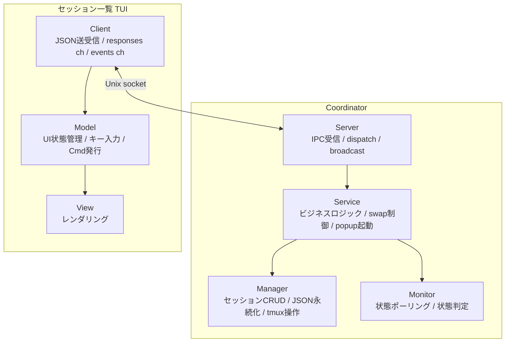
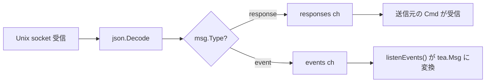
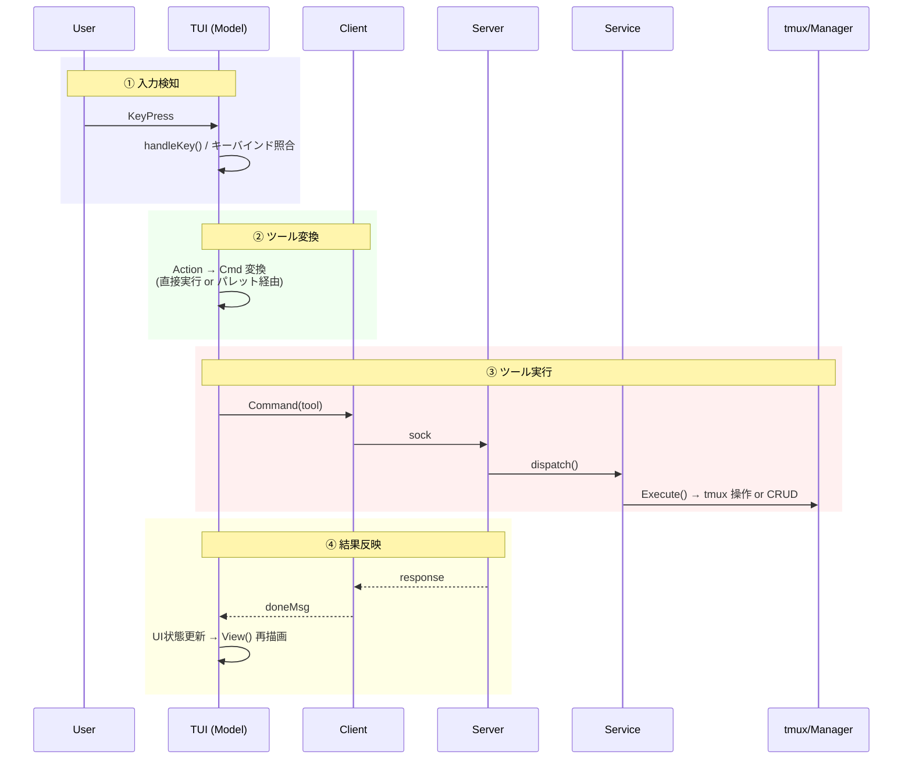
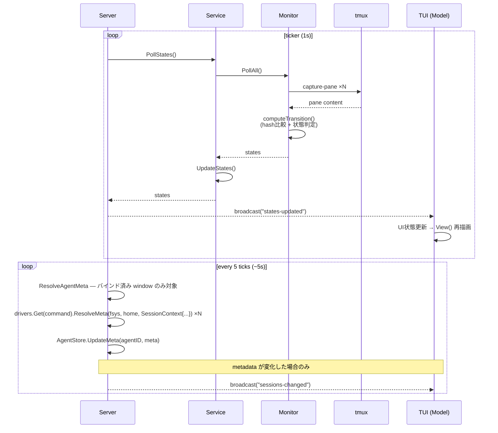
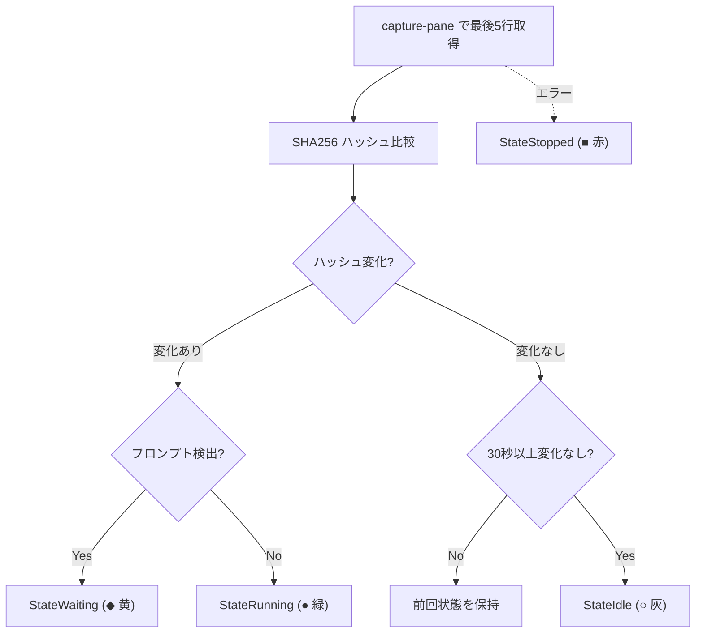

# Architecture

本ドキュメントは開発者向けに roost の内部アーキテクチャを説明する。

**roost** は tmux 上で複数の AI エージェントセッションを一元管理する TUI ツールである。

## 目次

- [ビジョン](#ビジョン) / [設計原則](#設計原則) / [用語](#用語)
- [レイヤー構成](#レイヤー構成) / [プロセスモデル](#プロセスモデル) / [tmux レイアウト](#tmux-レイアウト)
- [プロセス間通信](#プロセス間通信-ipc) / [ツールシステム](#ツールシステム) / [UX 処理パイプライン](#ux-処理パイプライン)
- [状態監視](#状態監視) / [インターフェース](#インターフェース) / [設計判断](#設計判断)
- [データファイル](#データファイル) / [ファイル構成](#ファイル構成) / [依存](#依存)

## ビジョン

AI エージェントを複数プロジェクトで並行稼働させると、tmux の素の操作ではセッションの把握・切替が煩雑になり、各エージェントが idle/running/waiting のどの状態かも見えない。これを解決する。

- 複数の AI エージェントセッションを、プロジェクトを跨いで一元管理する操作パネル
- エージェント自体のオーケストレーションには踏み込まず、セッションのライフサイクル管理に徹する薄い TUI
- 最小操作でセッションの起動・切替ができる

## 設計原則

- **tmux ネイティブ**: tmux のセッション/window/pane をそのまま活用。エージェントの PTY を再実装しない
- **高レベル操作はツール**: セッション作成・停止・終了など、副作用を伴う高レベル操作を Tool として抽象化。TUI・コマンドパレットから同じ Tool を実行できる
- **TUI にビジネスロジックを置かない**: TUI は表示とキー入力のみ。ロジックは core.Service に集約
- **Coordinator によるライフサイクル管理**: Coordinator（後述）が TUI プロセスの死活監視と自動復帰を担う。終了判断は Coordinator の責務
- **副作用の分離**: パス計算・状態遷移ロジック・データ構築は純粋関数。I/O (ファイル作成, tmux 操作) は呼び出し側が明示的に実行する。関数名で副作用の有無を区別する (`XxxPath` = 純粋, `EnsureXxx` = 副作用あり)
- **I/O 先行・状態変更後行**: 外部操作 (tmux, ファイル) を全て完了してから内部状態を変更する。I/O 失敗時は内部状態を変更せず汚染を防ぐ。ただし tmux の `RunChain` のようにアトミックにできない外部操作チェーンでは、途中失敗時の tmux 側ロールバックは行わない（設計判断参照）
- **テスト可能な設計**: tmux 操作はインターフェース経由。ファイルパスは注入可能。状態遷移ロジックは mock 不要で単体テスト可能

## 用語

| 用語 | 意味 | tmux 上の実体 |
|------|------|--------------|
| **セッション** | AI エージェントの作業単位。`Session` 構造体 | tmux **window**（Window 1+、単一ペイン構成） |
| **制御セッション** | roost 全体を収容する tmux セッション | tmux **session**（`roost`） |
| **ペイン** | Window 0 内の制御ペイン | tmux **pane**（`0.0`, `0.1`, `0.2`） |

以降「セッション」は roost セッションを指す。tmux セッションには「tmux セッション」と明記する。

## レイヤー構成

```
tui/       表示層 — UI 状態管理、レンダリング、キー入力ディスパッチ
core/      サービス層 — セッション切替/プレビュー、popup 起動、状態ポーリング、ツール定義
session/   データ層 — セッション CRUD、runtime は tmux user options が真実、cold-boot 用の sessions.json スナップショットを並行管理
tmux/      インフラ層 — tmux コマンド実行、インターフェース定義
session/driver/  コマンド抽象化 — エージェントドライバ定義、コマンド別プロンプト検出・表示名、エージェントセッション管理 (AgentStore)
lib/       ユーティリティ — 外部ツール連携。サブパッケージで名前空間分離 (lib/git/, lib/claude/)
config/    設定 — TOML 読み込み、DataDir 注入
logger/    ログ — slog 初期化、ログファイル管理
```

Coordinator プロセスとTUI プロセスは別プロセスで、Unix socket 経由の IPC で通信する。

コード依存方向:
- Coordinator (main) → `core.Service` → `session`, `tmux`, `driver.AgentStore`
- `tmux.Monitor` → `driver.Registry`（コマンド別プロンプト検出）
- TUI プロセス → `core.Client`（IPC 境界）
- `tui` → `driver.Registry`（コマンド表示名・ログタブ）
- `tui` → `lib/claude/transcript`（トランスクリプト整形・Parser）
- `session.Manager` → `session/driver`（`NewManager` で `driver.Registry` を受け取り、`refreshSessionBranchLocked` の cwd 取得と `Recreate` の spawn コマンド組立てに使う）
- 共通: `main` → `config`, `logger`
- `session/driver/` は core / session / tmux など上位レイヤに依存しない。副作用ゼロの leaf ユーティリティ (`lib/claude/cli`, `lib/claude/transcript`) は import してよい
- `lib/` のユーティリティ関数は他の内部パッケージに依存しない。サブコマンドハンドラ（`command.go`）は `core`, `config`, `session/driver` を使用可能 (driver subcommand が tool 固有の hook payload を `driver.AgentEvent` に詰め替える責務を持つため)
- `lib/subcommand.go` でサブコマンドレジストリを提供。各 lib パッケージが `init()` で登録し、`main` は `lib.Dispatch` でディスパッチ

## プロセスモデル

3つの実行モードを1つのバイナリで提供。各ペイン ID (`0.0`, `0.1`, `0.2`) のレイアウトは [tmux レイアウト](#tmux-レイアウト) を参照。

```
roost                       → Coordinator（親プロセス。tmux セッションのライフサイクルを管理）
roost --tui main            → メイン TUI (Pane 0.0)
roost --tui sessions        → セッション一覧サーバー (Pane 0.2)
roost --tui palette [flags] → コマンドパレット (tmux popup)
roost --tui log             → ログ TUI (Pane 0.1)
roost claude event          → Claude hook イベント受信（hook から呼ばれる短命プロセス）
roost claude setup          → Claude hook 登録（~/.claude/settings.json に書き込み）
```

### Coordinator

tmux セッション全体のライフサイクルを管理する親プロセス。起動時に tmux セッションを作成し、TUI プロセスを子ペインとして起動する。tmux attach 中はブロックし、detach またはシャットダウンで終了する。

```
runCoordinator()
├── tmux セッション存在確認
│   ├── 存在 (warm: Coordinator のみ再起動)
│   │   └── restoreSession + Manager.Refresh（tmux window user options から復元）
│   └── 不在 (cold: PC 再起動 / tmux server 死亡)
│       └── setupNewSession + Manager.Recreate（sessions.json から window を再作成）
├── Manager.SyncBranches（git ブランチ情報を tmux user option に同期）
├── restoreActiveWindowID（tmux 環境変数 ROOST_ACTIVE_WINDOW から復元）
├── AgentStore.RestoreFromBindings（各セッションの DriverState から `Driver.IdentityKey()` で agent identity を取り出し、windowID ↔ identity を復元）
├── Manager, Monitor, Service 初期化
├── Service.SetSyncActive（active window ID を tmux 環境変数に同期するコールバック設定）
├── Service.OnPreview（プレビュー時にブランチ情報を更新するコールバック設定）
├── Unix socket サーバー起動 (~/.config/roost/roost.sock)
├── 状態ポーリング goroutine 起動 (Server が ticker で Monitor を駆動、states-updated を broadcast)
├── ヘルスモニタ goroutine 起動 (2秒間隔で Pane 0.1, 0.2 死活監視)
├── tmux attach (ブロック)
└── attach 終了時
    ├── shutdown 受信済み → flag 設定 → response 送信 → 50ms sleep → DetachClient()
    │   → attach 終了 → KillSession()（sessions.json は次回起動時に Recreate するため残す）
    └── 通常 detach → 終了（tmux セッション生存）
```

### メイン TUI

Pane 0.0 で動作する常駐 Bubbletea TUI プロセス。キーバインドヘルプを常時表示し、セッション一覧でプロジェクトヘッダーが選択されたとき該当プロジェクトのセッション情報を表示する。Coordinator 未起動時はキーバインドヘルプのみの static モードで動作する。セッション切替時は `swap-pane` でバックグラウンド window に退避し、プロジェクトヘッダー選択時に復帰する。

```
runTUI("main")
├── ソケット接続を試行
│   ├── 成功 → subscribe + Client 付きで MainModel 起動
│   └── 失敗 → static モード（キーバインドヘルプのみ）
└── Bubbletea イベントループ（sessions-changed / states-updated / project-selected を受信 → 再描画）
```

### セッション一覧サーバー

Pane 0.2 で動作する常駐 Bubbletea TUI プロセス。ソケット経由で Coordinator に接続し、セッション一覧の表示・操作を提供する。終了不可（Ctrl+C 無効）。crash 時はヘルスモニタが自動 respawn。Manager/Monitor を持たず、全操作をソケット経由で Coordinator に委譲する。

```
runTUI("sessions")
├── Client 初期化 + ソケット接続
├── subscribe コマンド送信（broadcast 受信開始）
├── list-sessions で初期データ取得
└── Bubbletea イベントループ（キー入力 → IPC コマンド → broadcast 受信 → 再描画）
```

### ログ TUI

Pane 0.1 で動作する常駐 Bubbletea TUI プロセス。APP タブ（アプリケーションログ）と、セッションごとに動的生成されるセッションタブを提供する。200ms 間隔でログファイルをポーリングし、新規行を表示する。

```
runTUI("log")
├── ソケット接続を試行
│   ├── 成功 → subscribe + Client 付きで LogModel 起動
│   │          sessions-changed でセッションタブを動的再構築
│   └── 失敗 → アプリログのみモードで LogModel 起動（Client なし）
└── Bubbletea イベントループ（タブ切替、スクロール、follow モード）
```

**タブ構成**: Claude セッションがアクティブな場合 `TRANSCRIPT | EVENTS | LOG` の3タブ、それ以外は `LOG` のみ。`sessions-changed` イベントで動的に再構築。セッション切替時は TRANSCRIPT がデフォルト。タブ切替時はファイル末尾から再読み込み（状態保持不要）。マウスクリックはタブラベルの累積幅でヒット判定する。

**経過時間表示**: セッション一覧とメイン TUI の両方で、`CreatedAt` からの経過時間を `formatElapsed` で表示する（分/時/日の 3 段階）。

Coordinator との通信は任意。接続できない場合（Coordinator 未起動・起動順の競合）はアプリログのみで動作する。crash 時はヘルスモニタが Pane 0.1 の死活を検知し respawn する。

### コマンドパレット

`prefix p` または TUI の `n`/`N`/`d` で tmux popup として起動する独立プロセス。ソケット経由でコマンド送信。ツール選択 → パラメータ入力 → 実行 → 終了。TUI のサブコンポーネントではなく tmux popup にすることで、TUI のイベントループをブロックせず、パレットが crash しても TUI に影響しない。

```
runTUI("palette")
├── Client 初期化 + ソケット接続
├── フラグからツール名・初期引数を取得
├── 未確定パラメータがあればインクリメンタル選択 UI
├── 全パラメータ確定 → Tool.Run で IPC コマンド送信
└── 終了（popup 自動クローズ）
```

### 障害時の振る舞い

- **TUI のソケット切断**: TUI プロセスは終了する。ヘルスモニタが検知し respawn
- **セッション window の外部 kill / agent プロセス終了**: session window は `remain-on-exit off` のため tmux が自動でペイン破棄、ペイン 1 個のみの window も自動消滅。`Server.StartMonitor` 各ティック先頭の `Service.ReapDeadSessions` が `Manager.ReconcileWindows` を呼び、消えた window を in-memory cache から外し snapshot を更新、`ClearActive` と `AgentStore.Unbind` を実行し `sessions-changed` を broadcast する
- **Active session の agent プロセス終了 (C-c など)**: active session の agent pane は swap-pane で `roost:0.0` に持ち込まれている。Window 0 は `remain-on-exit on` のため、agent が exit すると pane は `[exited]` のまま居座り、session window 側は swap で入れ替わった main TUI pane が生きているので通常の reconcile では掃除されない。`Service.ReapDeadSessions` は各 tick で `display-message -t roost:0.0 -p '#{pane_dead} #{pane_id}'` を実行し、dead な場合はその pane id (`%N`、swap-pane を跨いで不変) で `Manager.FindByAgentPaneID` を引いて死んだ pane の **本来の owner session** を特定する。`Service.activeWindowID` を信頼して reap 対象を決めると、並行 Preview などで activeWindowID が pane 0.0 の実 owner とずれた瞬間に無関係な window を kill してしまう (= 別 session のカードが消え、本物の死んだ session が `stopped` 表示で残る誤爆) ため、pane id だけが reap 対象の唯一の真実。owner が特定できたら `Service.swapPaneBackTo` で dead pane を owner window に戻し、`Manager.KillWindow` で window ごと破棄、その後の `ReconcileWindows` パスで in-memory cache が掃除される。owner が見つからない場合 (main TUI 自身が死んだ等) は何もしない (= ヘルスモニタの責務)。Pane id は `Manager.Create`/`Recreate` 時に `display-message -t <wid>:0.0 -p '#{pane_id}'` で取得し `@roost_agent_pane` user option に永続化する
- **ヘルスモニタの respawn 連続失敗**: respawn-pane は tmux がペインを再作成するため通常は失敗しない（ただしバイナリ削除・権限変更等の環境異常時は起動失敗する）。tmux セッション消失時は Coordinator の attach も終了するため、全体が終了する
- **起動時の整合性**: tmux window user options を単一の真実とするため、orphan チェックは不要。`@roost_id` を持つ tmux window がそのまま roost セッション一覧になる
- **IPC エラー**: TUI 側で IPC コマンドがエラーを返した場合、slog にログ出力し UI 状態は変更しない。タイムアウトは設定していない（Unix socket のローカル通信のため）。サーバーがデッドロックした場合、クライアントは無期限にブロックするリスクがある。復帰手段は外部からの `tmux kill-session -t roost` または Coordinator プロセスの kill

## tmux レイアウト

```
┌─────────────────────┬────────────────┐
│  Pane 0.0           │  Pane 0.2      │
│  メイン TUI (常時focus) │  TUI サーバー   │
│                     │                │
├─────────────────────┤                │
│  Pane 0.1           │                │
│  ログ TUI           │                │
└─────────────────────┴────────────────┘

Window 0: 制御画面（3ペイン固定）
Window 1+: セッション（バックグラウンド、swap-pane で Pane 0.0 に表示）
```

- Window 0 のみ `remain-on-exit on`: log / sessions ペインがクラッシュしてもレイアウトを維持し、ヘルスモニタが `respawn-pane` で復活させるため
- Session window (Window 1+) は `remain-on-exit off`: agent プロセス終了でペインごと自動消滅させ、`Service.ReapDeadSessions` が in-memory state を片付ける
- `mouse on` でマウスホイールスクロールとペイン境界認識を有効化。roost が明示的に設定し、ユーザーの tmux.conf に依存しない
- ターミナルサイズを `term.GetSize()` で取得し `new-session -x -y` に渡す
- prefix テーブルの全デフォルトキーを無効化し、Space/d/q/p のみ登録

### マウス操作

tmux `mouse on` により、マウス操作は tmux が仲介する。テキスト選択は tmux のコピーモードを経由する。

| 操作 | 動作 |
|------|------|
| ホイール | tmux がスクロール処理（alt screen ペインではプログラムにイベント転送） |
| ドラッグ | tmux コピーモードに入り、ペイン内でテキスト選択 |
| リリース | 選択テキストをコピーし、コピーモードを終了（ライブ表示に復帰） |
| Shift+ドラッグ | tmux を迂回し、ターミナルネイティブの選択（ペイン境界を跨ぐ） |

**制約**: コピーモード終了時にライブ表示（最下部）に復帰するのは tmux の仕様。スクロールバック位置を維持したままコピーモードを抜けることはできない。ペイン内選択とスクロール位置維持を両立するには Shift+ドラッグを使うか、コピーモード内で `q` を押すまで閲覧を続ける。

### セッション切替

`core.Service` が `swap-pane -d` チェーンを `RunChain` で単一 tmux 呼び出しとして実行（コマンドは `;` で連結。途中失敗時のロールバックはない）。

```
Preview(sess):
  1. swap-pane -d  メインペイン ↔ 旧セッション (旧を戻す、activeWindowID がある場合)
  2. swap-pane -d  メインペイン ↔ 新セッション (新を表示)
  → フォーカスは変更しない

Switch(sess):
  Preview と同じ + SelectPane でメインペインにフォーカス
```

### キー入力の処理分担

| レベル | 処理者 | 例 |
|--------|--------|-----|
| prefix キー | tmux bind-key (Coordinator が設定) | Space, d, q, p |
| TUI キー | セッション一覧の Bubbletea | j/k, Enter, n, N, Tab |
| パレットキー | パレットの Bubbletea | Esc, Enter, 文字入力 |

prefix キーは tmux が横取り。bare key は各 pane のプロセスが直接受信。

## プロセス間通信 (IPC)

Unix domain socket (`~/.config/roost/roost.sock`) による JSON メッセージング。

### トポロジ



**Service の追加コールバック**:
- `SetSyncActive(fn)`: active window ID 変更時に tmux 環境変数に同期するコールバック
- `OnPreview(fn)`: プレビュー時にブランチ情報を更新するコールバック（Server が登録）
- `ClearActive(windowID)`: window 停止時に active 状態をクリア
- `ActiveSessionLogPath()`: アクティブセッションのログファイルパスを返す
- `Manager` フィールドは exported（Server が直接アクセス）

**Server の構成**: `Server` は `Service` と `*tmux.Client`（DetachClient 用）を保持する。`driver.Registry` は `Service` が保持し、メタデータ解決は `Service.ResolveAgentMeta` で行う。

### 通信パターン

| パターン | 方向 | 特徴 | 例 |
|---------|------|------|-----|
| **Request-Response** | TUI → Server → TUI | 同期。Client が response ch でブロック待ち | `switch-session`, `preview-session` |
| **Event Broadcast** | Server → 全クライアント | 非同期。subscribe 済みクライアントに一斉配信 | `sessions-changed`, `states-updated` |
| **Tool Launch** | TUI → Server → tmux popup → Palette → Server | 間接通信。popup が独立クライアントとしてコマンド送信 | `new-session` |

Response は `sendResponse` メソッドで統一送信。Broadcast は `subscribe` コマンドを送信したクライアントのみに配信。

### メッセージ形式

全メッセージは Go の `Message` 構造体で表現し、JSON にシリアライズして送受信する。`Type` フィールドで方向を判定する。フレーミングは改行区切り JSON (NDJSON)。`json.Encoder` / `json.Decoder` がストリーム上で 1 メッセージ = 1 行として読み書きする。`Message` は全フィールドをフラットに持つ単一構造体で、`omitempty` で不要フィールドを省略する。パース側で union type の分岐が不要になる。

| フィールド | Go 型 | JSON 型 | 用途 |
|-----------|-------|---------|------|
| `type` | string | string | `"command"`, `"response"`, `"event"` |
| `command` | string | string | コマンド名 (client → server) |
| `args` | map[string]string | object | コマンド引数 |
| `event` | string | string | イベント名 (server → client) |
| `sessions` | []SessionInfo | array | セッション一覧 |
| `states` | map[string]State | object | 状態マップ |
| `error` | string | string | エラーメッセージ |
| `active_window_id` | string | string | アクティブ window ID |
| `session_log_path` | string | string | セッションログパス |
| `selected_project` | string | string | 選択中プロジェクトパス |

生成ヘルパー: `NewCommand(cmd, args)` / `NewEvent(event)`。エラーは `Message.Error` に文字列を格納し、クライアント側で `error` に変換する。

### コマンド (クライアント → サーバー)

| コマンド | パラメータ | 機能 |
|---------|-----------|------|
| `subscribe` | - | ブロードキャストの受信を開始 |
| `create-session` | project, command | セッション作成 |
| `stop-session` | session_id | セッション停止 |
| `list-sessions` | - | セッション一覧取得 |
| `preview-session` | session_id | Pane 0.0 にプレビュー |
| `preview-project` | project | アクティブセッションを退避し `project-selected` イベントを broadcast |
| `switch-session` | session_id | Pane 0.0 に切替 + フォーカス |
| `focus-pane` | pane | ペインフォーカス |
| `launch-tool` | tool | パレット popup 起動 |
| `agent-event` | type, (type 別引数) | エージェントからのイベント通知。Service に委譲 |
| `shutdown` | - | 全終了 |
| `detach` | - | デタッチ |

### Client のメッセージ振り分け



### 並行性モデル

- **Server**: `sync.Mutex` で clients と shutdownRequested を保護。各接続は独立 goroutine。dispatch は同一 goroutine 内で逐次実行
- **Client**: `sync.Mutex` で encoder を保護。`listen` goroutine が `responses` ch / `events` ch に振り分け
- **Manager**: `sync.RWMutex` で sessions スライスを保護
- **常駐 goroutine**: acceptLoop, StartMonitor (ticker), healthMonitor の 3 本

## ツールシステム

ユーザーが行う高レベル操作を `Tool` として抽象化。TUI・パレットから同じインターフェースで実行可能。

```go
// core/tool.go
type Tool struct {
    Name        string
    Description string
    Params      []Param
    Run         func(ctx *ToolContext, args map[string]string) error
}

type Param struct {
    Name    string
    Options func(ctx *ToolContext) []string  // 実行時に選択肢を生成
}
```

### Tool → IPC コマンドの対応

Tool の `Run` は `ToolContext.Client` 経由で IPC コマンドを送信する。1 Tool = 1 IPC コマンドの対応。

| Tool | IPC コマンド | パラメータ |
|------|-------------|-----------|
| `new-session` | `create-session` | project, command |
| `stop-session` | `stop-session` | session_id |
| `detach` | `detach` | - |
| `shutdown` | `shutdown` | - |

Tool は副作用を伴う高レベル操作（作成・停止・終了等）を対象とする。`switch-session`, `preview-session`, `focus-pane` 等の低レベルなナビゲーション操作は Tool を経由せず、TUI が直接 IPC コマンドを送信する。

### パレットによるパラメータ補完

パレットは tmux popup として起動する独立プロセス。TUI のイベントループをブロックせず、crash しても TUI に影響しない。

補完フロー: ツール選択 → 各 `Param` の `Options` コールバックで選択肢を動的生成 → ユーザー入力でインクリメンタルフィルタ → 全パラメータ確定後に `Tool.Run` 実行。結果は broadcast 経由で TUI に到達する。

## UX 処理パイプライン

ユーザー操作はすべて同一のパイプラインを通過する。

### インタラクティブパイプライン



**パレット経由の場合**: ②で tmux popup を起動。Palette が独立クライアントとしてパラメータ補完→③のコマンド送信を行い、結果は broadcast 経由で TUI に到達する。

**エラー時**: ③で IPC コマンドがエラーを返した場合、response の `error` フィールドに詳細が格納される。TUI 側は slog にログ出力し、UI 状態は変更しない（楽観的更新をしない）。tmux 操作の失敗（例: swap-pane 対象の window が消失）は Service 層でエラーとして返却され、同様に response 経由で TUI に伝搬する。

### バックグラウンドパイプライン（状態監視）



**責務分離**: Monitor は capture + 純粋関数で状態計算のみ（状態を返す）。`resolveAgentStates` が AgentStore の hook 状態で capture-pane 結果を上書き（Claude セッション）。Service が `UpdateStates()` でマージ済み状態を Manager に格納。Server が broadcast を配信。TUI は受信して再描画するだけ。

## 状態監視

バックグラウンドパイプライン（前節）で駆動される状態判定ロジックの詳細。`computeTransition` は純粋関数で、`DetectState` が I/O を担う。

プロンプト検出はコマンド別の正規表現で行う（`driver.Registry` 経由）。汎用パターン `` (?m)(^>|[>$❯]\s*$) `` を基本とし、claude は `$` を除外した `` (?m)(^>|❯\s*$) `` を使用して bash シェルとの誤検知を防ぐ。`Monitor.PollAll` はウィンドウ ID とコマンド名のマップを受け取り、各セッションのドライバパターンで判定する。



Idle 閾値は `config.toml` の `IdleThresholdSec` で変更可能（デフォルト 30 秒）。ポーリング間隔は `PollIntervalMs`（デフォルト 1000ms）。初回キャプチャ（snapshot 未取得）ではプロンプトがあれば Waiting、なければ Idle を返す（Running にはしない）。

### エージェント状態検出（Claude セッション）

Claude セッションは capture-pane ではなく hook イベントで状態を検出する。`core.ResolveAgentState` が capture-pane 結果と AgentSession の hook 状態をマージする。

| 条件 | 結果 |
|------|------|
| 非 Claude セッション | capture-pane の状態をそのまま使用 |
| Claude + AgentSession なし or 未受信 | StateIdle |
| Claude + hook 状態あり | hook 状態を採用 |

hook イベント → AgentState マッピング:

| hook イベント | AgentState |
|--------------|------------|
| UserPromptSubmit, PreToolUse, PostToolUse, SubagentStart | Running |
| Stop, StopFailure, Notification(idle_prompt) | Waiting |
| Notification(permission_prompt) | Pending |
| SessionEnd | Stopped |

### コスト抽出

`Monitor.ExtractCost(windowID)` は pane の最後 2 行から `$[\d.]+` パターンでコスト文字列を抽出する。Claude セッションのモデル名・累計トークン量・派生 Insight (現在使用中のツール名・サブエージェント数・エラー数など) は transcript JSONL から `transcript.Tracker` (`lib/claude/transcript`) が抽出し、AgentSession.StatusLine と AgentSession の Insight 系フィールド (`CurrentTool`, `SubagentCounts`, `ErrorCount` 等) に保持する。`Tracker` は `core.SessionTracker` interface を通じて Service に注入され、core 層は driver 中立に保たれる。state-change イベントをトリガーに transcript の新規行を差分読みする。

## インターフェース

テスト可能性のために tmux 操作をインターフェース化。

```go
// tmux/interfaces.go
type PaneOperator interface {
    SwapPane(src, dst string) error
    SelectPane(target string) error
    RespawnPane(target, command string) error
    RunChain(commands ...[]string) error
    WindowIDFromPane(paneID string) (string, error)
    DisplayMessage(target, format string) (string, error)
}

type PaneCapturer interface {
    CapturePaneLines(target string, n int) (string, error)
}
```

```go
// session/driver/driver.go
type Driver interface {
    Name() string
    PromptPattern() string
    DisplayName() string

    // IdentityKey は AgentStore.Bind に使う agent identity を取り出す
    // DriverState のキー名を返す。固有 ID を持たない driver は "" を返す。
    IdentityKey() string
    // WorkingDir は git ブランチ検出に使う agent 実 cwd を返す。
    // 空文字なら呼び出し側は sc.Project にフォールバックする。
    WorkingDir(sc SessionContext) string
    SpawnCommand(baseCommand string, sc SessionContext) string
    TranscriptFilePath(home string, sc SessionContext) string
    ResolveMeta(fsys fs.FS, home string, sc SessionContext) SessionMeta
}

// session/driver/context.go
type SessionContext struct {
    Command     string
    Project     string
    DriverState map[string]string  // driver が解釈する不透明な永続バッグ
}
```

session-aware なメソッドはすべて `SessionContext` 値型を受ける。これにより
**driver パッケージは `session` を import せず**、import cycle を避けつつ
driver は必要な情報 (Command / Project / DriverState) のみにアクセスする。
Session 全体を渡してしまうと driver が他フィールドへ副作用的に触れるため
あえて値型に絞っている。

`Driver.ResolveMeta` は agent が報告した transcript file の絶対パスを直接読み取る。本番では `os.DirFS("/")` を渡し、テストでは `fstest.MapFS` を使う。`Driver.TranscriptFilePath` は driver が `sc.DriverState` から transcript path / working dir / session ID を取り出して以下の優先順位で解決する: (1) agent が hook で報告したパス、(2) working dir + session ID から計算、(3) project + session ID から計算 (pre-hook 段階の補完)。Claude は `~/.claude/projects/{projectDir(cwd)}/{sessionID}.jsonl` を返し、Generic は `""` を返す。

### driver.AgentEvent — driver-neutral な hook event 抽象

```go
// session/driver/event.go
type AgentEvent struct {
    Type        AgentEventType    // session-start | state-change
    Pane        string            // TMUX_PANE
    State       string            // running / waiting / pending / stopped / idle
    Log         string            // event log 行
    DriverState map[string]string // driver が解釈する不透明な key/value バッグ
}
```

driver-specific な値 (Claude なら `session_id` / `cwd` / `transcript_path`) は
すべて `DriverState` に packed されて IPC を渡る。各 driver subcommand
(`roost claude event` 等) が自分の hook payload を `AgentEvent` に **詰め替えて**
送信し、`core.Server.handleAgentEvent` は `driver.AgentEventFromArgs(args)` で
struct を取り出した後は **DriverState を不透明 map として** `Service.ApplyAgentEvent`
へ渡すだけ。core は driver 固有のキー名 (`session_id` 等) を一切ハードコードしない。
ToArgs/FromArgs は wire format 上で `drv_<key>` プレフィックスを使い、generic
field と衝突しないようにしている。

`Service.ApplyAgentEvent` は (a) driver の `IdentityKey()` で agent identity を
取り出して `AgentStore.Bind` を呼び、(b) `Manager.MergeDriverState` で DriverState
バッグをセッションへ merge する。返り値の `AgentEventResult` には agent identity と
変更フラグが入っており、呼び出し側 (server.go) はそれを使ってログ出力や
broadcast を判断する。

`Driver.SpawnCommand` は cold-boot 復元時に `Manager.Recreate` から呼ばれ、
ドライバごとに固有の resume 方法でコマンド文字列を組み立てる。Claude ドライバは
`sc.DriverState["session_id"]` を取り出し `lib/claude/cli.ResumeCommand` に
委譲して `claude --resume <id>` を返す。Generic ドライバは base コマンドを
そのまま返す。

```go
// session/driver/store.go — エージェントセッションのランタイムストア
type AgentStore struct {
    sessions map[string]*AgentSession // agentSessionID → AgentSession
    bindings map[string]string        // windowID → agentSessionID
}
```

`AgentStore` は純粋な in-memory ストアで tmux Session とは独立。`Bind` で windowID ↔ agentSessionID を紐付け、hook イベントは agentSessionID で直接ルックアップ。`WindowIDByAgent` で逆引きも可能。tmux の swap-pane に影響されない。I/O（イベントログ）は `Service` が担う。

`Session.DriverState` (`map[string]string`) は driver が解釈する不透明な永続バッグで、
`AgentEvent` 経由で driver から届いた key/value を `Manager.MergeDriverState`
が単一の tmux user option `@roost_driver_state` (JSON-encoded) と
`sessions.json` の `driver_state` フィールドへ書き出す。`MergeDriverState` は
書き込み成功後に `refreshSessionBranchLocked` を呼び、driver の `WorkingDir(sc)`
が新しい cwd を返した場合は branch tag を再計算する (`claude --worktree` で
起動した瞬間に worktree branch に切り替わる)。`Service.transcriptPathFor` は
`Driver.TranscriptFilePath(home, sc)` を直接呼び出し、agent-reported / computed
の優先順位は driver 内部に閉じている。

```go
// session/manager.go
type TmuxClient interface {
    NewWindow(name, command, startDir string) (string, error)
    KillWindow(windowID string) error
    SetOption(target, key, value string) error
    SetWindowUserOption(windowID, key, value string) error
    SetWindowUserOptions(windowID string, kv map[string]string) error
    ListRoostWindows() ([]RoostWindow, error)
}
```

`session.Manager` は `ListRoostWindows()` で tmux window の `@roost_*` ユーザー
オプションを読み込み、メモリキャッシュを再構築する。`Refresh()` は純粋な読み取り
で、ブランチ同期は別メソッド `SyncBranches()` に分離してある。Manager は
`NewManager(tmux, dataDir, drivers)` で `driver.Registry` を受け取り、
`refreshSessionBranchLocked` の cwd 取得と `Recreate` の spawn コマンド組立てに
使う。`AgentStore` のバインディングも各セッションの `DriverState` に
含まれるため、Coordinator 再起動時は `Driver.IdentityKey()` で identity を
取り出して自然復元される。

- `core.Service` → `PaneOperator`, `driver.AgentStore`, `driver.Registry` に依存
- `tmux.Monitor` → `PaneCapturer`, `driver.Registry` に依存
- `session.Manager` → `TmuxClient`, `driver.Registry` に依存
- `session.Manager` → `git.DetectBranch`（`detectBranch` フィールドで DI。テスト時に差し替え可能）
- ファイルパスは `Config.DataDir` で注入
- `Session` は tmux 固有データに加え、`DriverState map[string]string`（driver が
  解釈する不透明な永続バッグ）を保持。エージェント固有の表示データ（Title,
  LastPrompt, Subjects, StatusLine, State, Insight）は `AgentStore` が管理。
  `SessionInfo.Indicators` は driver の `AgentSession.Indicators()` が組み立てた
  driver-neutral な status chip 文字列リスト

## 設計判断

| 判断 | 選択 | 理由 |
|------|------|------|
| パレットの実装方式 | tmux popup (独立プロセス) | crash 分離。Bubbletea サブモデルでは TUI 内で panic を共有する |
| Ctrl+C の無効化 | KeyPressMsg を consume | 常駐プロセスの誤終了防止。ヘルスモニタの respawn まで操作不能になる |
| 楽観的更新をしない | IPC エラー時に UI 状態を変更しない | 次回ポーリングで自動回復。状態不整合のリスクを回避 |
| セッションメタデータの永続化 | tmux window user options (`@roost_*`) を runtime 真実、`sessions.json` を cold-boot スナップショット | runtime 中は tmux が単一の真実 (二重管理を避ける)。tmux server が落ちる PC 再起動時のみスナップショットから `Recreate` で復元。snapshot は読み取り専用バックアップとして役割が明確 |
| shutdown (`C-b q`) の挙動 | `KillSession()` のみで sessions.json は残す | 次回起動時に `Manager.Recreate()` でセッションを復元できるようにするため。`Manager.Clear()` は呼ばない |
| cold-boot 復元時の Claude 起動コマンド | `claude --resume <id>` を `Driver.SpawnCommand` で組立て | 過去の会話 transcript を新しい Claude プロセスにそのまま引き継ぐ。Claude 固有の `--resume` フラグ知識は `lib/claude/cli` に閉じ、`session/driver/claude.go` から委譲する |
| swap-pane チェーンのロールバック | しない | tmux の `;` 連結はアトミックではなく途中ロールバック不可。内部状態を変更しないことで整合性を維持 |
| IPC タイムアウト | 設定しない | Server のデッドロックは Coordinator 全体の障害を意味し、Client 側のタイムアウトでは回復できない。外部からの再起動が唯一の復帰手段であるため優先度は低い |
| SessionMeta の定義場所 | `driver.SessionMeta` のみ（`session.SessionMeta` は廃止） | driver パッケージの独立性を保つ。Server が `driver.SessionMeta` → `AgentStore.UpdateMeta` で格納 |
| tmux/エージェントセッション分離 | `Session`（tmux）と `AgentSession`（driver）を別構造体 | tmux の swap-pane に影響されないセッション特定。AgentStore が windowID ↔ agentSessionID の紐付けを管理 |
| エージェント状態検出 | Claude: hook イベント、非 Claude: capture-pane | Claude は hook で正確な状態を取得。`ResolveAgentState` でマージ。hook 未受信時は Idle |
| エージェントイベント連携 | `roost claude event` + `agent-event` IPC | SessionStart で `Service.ApplyAgentEvent` が `pane → WindowID` を解決し、`Driver.IdentityKey()` で agent identity を取り出して `AgentStore.Bind` + `Manager.MergeDriverState` を一括実行する。以降は agentSessionID で直接ルックアップ。Coordinator 再起動後は各セッションの DriverState から identity を取り出して `RestoreFromBindings` |
| driver hook payload の抽象化 | `AgentEvent.DriverState` を不透明 `map[string]string` バッグとして運ぶ | 各 driver subcommand が tool 固有の hook field (Claude の `cwd` / `transcript_path` 等) を **driver が定義した key** (例: `working_dir` / `transcript_path`) で DriverState に packing する。core/server.go は `AgentEventFromArgs` で構造体を取り出した後、DriverState を中身を見ずに `Manager.MergeDriverState` へ転送するだけ。固有 field を増やしても core / manager / tmux / json には一切手が入らない |
| Session ランタイム情報の保持 | `Session.DriverState map[string]string` を tmux user option `@roost_driver_state` (1 列 packed JSON) と sessions.json の `driver_state` フィールドで永続化 | driver 固有のキーを増やしても tmux 層は触らない (per-key option を増やすと tmux/client の format string と parser が schema を持ってしまう)。git branch 検出は `Driver.WorkingDir(sc)` 経由で取得 (なければ `Project` フォールバック)。transcript path 解決は `Driver.TranscriptFilePath` 内部で完結し、driver が agent-reported / computed の優先順位を決める |
| Session 表示状態の永続化 | `@roost_state` / `@roost_state_changed_at` ペアを `Manager.UpdateStates` から `SetWindowUserOptions` でアトミック書き込み + sessions.json への記録 | warm restart 直後の最初の描画で正しい状態が出るため UI のチラつきが消える。cold boot 時は新プロセスを spawn するので `Recreate` が `{StateRunning, time.Now()}` にリセットしてから tmux options を書く。書き込み失敗時は in-memory cache を更新せず、次回ポーリングで再試行 |
| StatusLine の表示 | transcript JSONL → `transcript.Tracker` (lib/claude/transcript) → `tmux set-option status-left` | statusLine hook 不要。state-change イベントをトリガーに差分読み。Insight (current tool / subagent count / error count) も同経路で抽出。`core.SessionTracker` interface 経由で Service に注入し core 中立を維持。`status-format[0]` でウィンドウリストを排除 |

## 副作用の命名規約

パス計算と副作用を関数名で区別する。

| パターン | 副作用 | 例 |
|---------|--------|-----|
| `XxxPath()` | なし (純粋) | `LogDirPath`, `ConfigDirPath`, `LogPath` |
| `EnsureXxx()` | ディレクトリ作成 | `EnsureLogDir`, `EnsureConfigDir` |
| `LoadFrom(path)` | ファイル読込のみ | `config.LoadFrom` |
| `Load()` | ディレクトリ作成 + ファイル読込 | `config.Load` (convenience wrapper) |

## テスト方針

テストファイルは対象ファイルと同じディレクトリに `*_test.go` として配置。

- **純粋関数のテスト**: mock 不要。状態遷移ロジック（`computeTransition`）、プロトコルのシリアライズ、パス計算など
- **I/O を含むテスト**: インターフェースの mock を注入。`PaneOperator`/`PaneCapturer` の mock で tmux 依存を排除。`Config.DataDir` に `t.TempDir()` を注入してファイル I/O を分離
- **TUI テスト**: Bubbletea の `Model.Update` にメッセージを直接渡し、返り値の Model 状態を検証。実際のターミナルは不要

## データファイル

| パス | 形式 | 内容 | ライフサイクル |
|------|------|------|--------------|
| `~/.config/roost/config.toml` | TOML | ユーザー設定（下記参照） | ユーザーが作成。存在しなければデフォルト値で動作 |
| `~/.config/roost/sessions.json` | JSON | セッション一覧の cold-boot スナップショット | Manager の各ミューテーション (Create/Stop/MergeDriverState/UpdateStates/RefreshBranch/Refresh) で書き出し。読まれるのは PC 再起動 (`!client.SessionExists()`) 時の `Manager.Recreate` のみ。runtime の真実は tmux user options |
| `~/.config/roost/events/{agentSessionID}.log` | テキスト | エージェント hook イベントログ | hook イベント受信時に追記。Service.AppendEventLog で書き込み |
| `~/.config/roost/roost.log` | slog | アプリケーションログ | Coordinator 起動時に作成/追記 |
| `~/.config/roost/roost.sock` | Unix socket | プロセス間通信 | Coordinator 起動時に作成。終了時に削除 |

`Config.DataDir` でベースパスを変更可能（テスト時に TempDir 指定）。

`config.toml` の全フィールド（括弧内はデフォルト値）:

- `tmux`: `session_name` (`"roost"`), `prefix` (`"C-b"`), `pane_ratio_horizontal` (`75`), `pane_ratio_vertical` (`70`)
- `monitor`: `poll_interval_ms` (`1000`), `idle_threshold_sec` (`30`)
- `session`: `auto_name` (`true`), `default_command` (`"claude"`), `commands` (`["claude","gemini","codex"]`)
- `projects`: `project_roots` (`["~/dev","~/work"]`)

## ファイル構成

```
src/
├── main.go              Coordinator / モード分岐（lib.Dispatch でサブコマンド委譲）
├── lib/
│   ├── subcommand.go    サブコマンドレジストリ (Register, Dispatch)
│   ├── git/
│   │   └── git.go       git ブランチ検出 (DetectBranch)
│   └── claude/
│       ├── command.go   Claude サブコマンドハンドラ (init で "claude" 登録)
│       ├── hook.go      Claude hook イベントのパース + DeriveState
│       ├── transcript_usage.go  transcript JSONL から model/usage をパース + FormatUsageStatusLine
│       ├── setup.go     Claude settings.json への hook 登録/解除
│       ├── transcript/  Claude JSONL トランスクリプトのパース + 差分追跡 (driver から import される leaf サブパッケージ)
│       └── cli/         Claude CLI 起動コマンド組立て (ResumeCommand など。core 依存ゼロの leaf サブパッケージ)
├── core/
│   ├── server.go        Unix socket サーバー、コマンドハンドラ、broadcast、メタデータ定期解決、エージェントイベント受信
│   ├── client.go        ソケットクライアント（TUI・パレット用）
│   ├── protocol.go      メッセージ型定義 (Message, SessionInfo, BuildSessionInfos)
│   ├── service.go       ビジネスロジック（切替、プレビュー、popup 起動、ResolveAgentState、イベントログ I/O）
│   ├── service_agent.go エージェントイベント適用（ApplyAgentEvent）、状態更新、transcript 解決、ResolveAgentMeta
│   ├── usage_tracker.go セッションごとの transcript 差分読み + usage 累計管理
│   └── tool.go          ツール定義 + Registry
├── config/
│   └── config.go        TOML 設定読み込み
├── session/
│   ├── manager.go       セッション CRUD。runtime は tmux user options 経由 (Refresh / SyncBranches)、cold-boot は sessions.json から Recreate。driver.Registry を保持
│   ├── manager_runtime.go  agent runtime 系の mutator (MergeDriverState, RefreshBranch, refreshSessionBranchLocked)
│   ├── state.go         状態 enum + Session struct (tmux 固有データ + DriverState map[string]string) + RoostWindow 型
│   ├── log.go           ログパスヘルパー
│   └── driver/
│       ├── driver.go    Driver インターフェース (Name, PromptPattern, DisplayName, IdentityKey, WorkingDir, SpawnCommand, TranscriptFilePath, ResolveMeta)
│       ├── context.go   SessionContext 値型 (Command/Project/DriverState を driver に渡す projection)
│       ├── event.go     AgentEvent (driver-neutral hook payload。driver 固有値は DriverState map に packed)
│       ├── agent_session.go  AgentSession 構造体 + AgentState 列挙型
│       ├── store.go     AgentStore（エージェントセッション管理、windowID ↔ agentSessionID 紐付け）
│       ├── registry.go  Registry (コマンド名 → Driver, パターン事前コンパイル)
│       ├── claude.go    Claude driver (❯/> のみ、$ 除外。session_id/working_dir/transcript_path キーを内部で定義。JSONL からタイトル・プロンプト・TaskCreate subject 解析)
│       └── generic.go   Generic driver (bash/codex/gemini/デフォルト)
├── tmux/
│   ├── interfaces.go    PaneOperator, PaneCapturer
│   ├── client.go        tmux コマンドラッパー（具象実装）
│   ├── pane.go          ペイン操作
│   └── monitor.go       状態監視（driver.Registry でコマンド別パターン検出）+ コスト抽出
├── tui/
│   ├── model.go         セッション一覧 Model（UI 状態のみ）
│   ├── view.go          セッション一覧レンダリング（driver.Registry で表示名取得、経過時間表示）
│   ├── mouse.go         マウス入力ハンドラ（ホバー、クリック、離脱検知）
│   ├── keys.go          キーバインド定義 + キーボード入力ハンドラ
│   ├── main_model.go    メイン TUI Model
│   ├── main_view.go     メイン TUI レンダリング
│   ├── palette.go       コマンドパレット
│   └── log_model.go     ログ TUI（動的セッションタブ）
└── logger/
    └── logger.go        slog 初期化
```

## 依存

| パッケージ | バージョン | 用途 |
|-----------|-----------|------|
| `charm.land/bubbletea/v2` | v2.0.2 | TUI フレームワーク |
| `charm.land/lipgloss/v2` | v2.0.2 | スタイリング |
| `charm.land/bubbles/v2` | v2.1.0 | キーバインド |
| `github.com/BurntSushi/toml` | v1.6.0 | 設定ファイル |
| `golang.org/x/term` | v0.41.0 | ターミナルサイズ取得 |
| `log/slog` | 標準ライブラリ | 構造化ログ |
