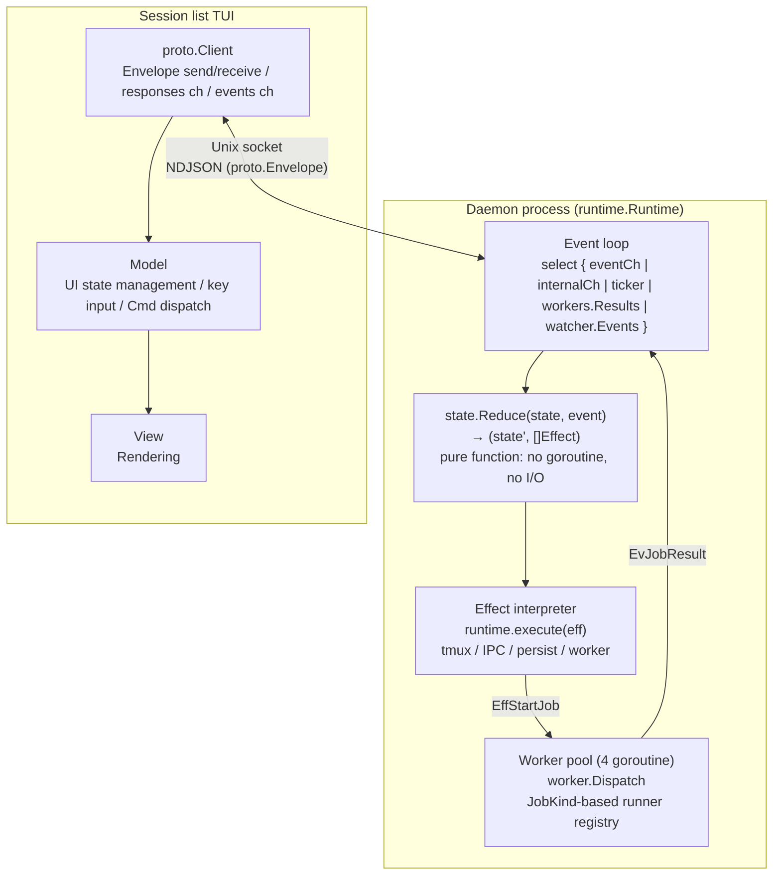
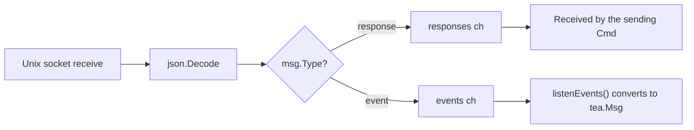
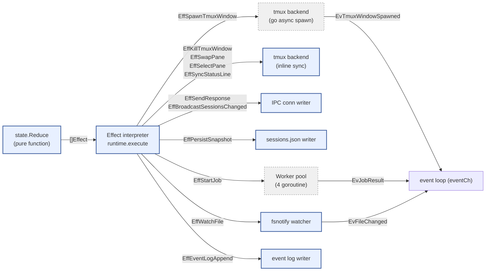
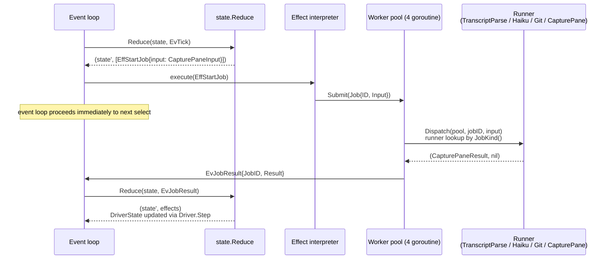
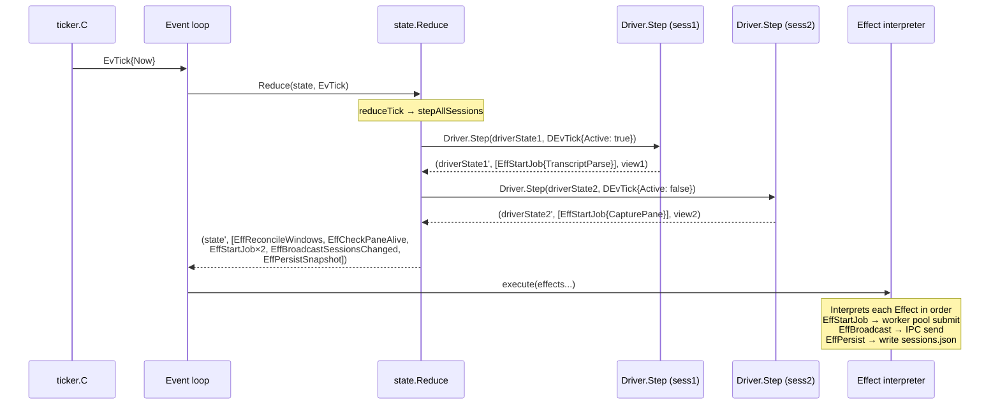

# Inter-Process Communication (IPC) and Tool System

## Inter-Process Communication (IPC)

JSON messaging over a Unix domain socket (`~/.roost/roost.sock`).

### Topology



`runtime.Runtime` is the sole state owner. `state.State` is a pure value type that only round-trips as an argument and return value of `Reduce`. The effect interpreter performs tmux operations, IPC sends, persistence, and worker pool submits, feeding results back to the event loop as `Event`s.

**Runtime composition**:
- `state`: `state.State` — all domain state (Sessions map, Active, Subscribers, Jobs). Solely owned by the event loop goroutine
- `eventCh`: channel where external goroutines (IPC reader, worker pool, fsnotify watcher) submit Events
- `workers`: `worker.Pool` — fixed-size (4) goroutine pool. `worker.Dispatch` dispatches via registered runner lookup using `JobInput.JobKind()`
- `conns`: `map[ConnID]*ipcConn` — connection management. Solely owned by the event loop goroutine
- `cfg.Tmux` / `cfg.Persist` / `cfg.EventLog` / `cfg.Watcher`: backend interfaces (replaceable with fakes during testing)

### Communication Patterns

| Pattern | Direction | Characteristics | Example |
|---------|-----------|-----------------|---------|
| **Request-Response** | TUI → Server → TUI | Synchronous. Client blocks waiting on response ch | `switch-session`, `preview-session` |
| **Event Broadcast** | Server → all clients | Asynchronous. Delivered to all subscribed clients | `sessions-changed`, `project-selected`, `pane-focused` |
| **Tool Launch** | TUI → Server → tmux popup → Palette → Server | Indirect communication. Popup sends commands as an independent client | `new-session` |

`SessionInfo` is a unified type that carries static metadata and dynamic state in a single message: the runtime's `broadcastSessionsChanged` retrieves status / title etc. from each Session's `Driver.View(sess.Driver)` and packs them into `proto.SessionInfo`. `reduceTick` emits `EffBroadcastSessionsChanged` on every tick, delivering to all subscribers.

Responses are sent uniformly via the `sendResponse` method. Broadcasts are delivered only to clients that have sent the `subscribe` command.

### Message Format

All messages are represented as `proto.Envelope` structs, serialized as newline-delimited JSON (NDJSON). The `Type` field discriminates the message type.

| Field | Purpose |
|-------|---------|
| `type` | `"cmd"` / `"resp"` / `"evt"` |
| `req_id` | Correlates request-response pairs |
| `cmd` | Command name (when type=cmd) |
| `name` | Event name (when type=evt) |
| `status` | `"ok"` / `"error"` (when type=resp) |
| `data` | Typed payload (`json.RawMessage`) |
| `error` | Error details (when status=error) |

Command / Response / ServerEvent are closed sum types. See [interfaces.md](interfaces.md#interfaces) for detailed Go type definitions.

### Commands (Client → Server)

| Command | Parameters | Function |
|---------|------------|----------|
| `subscribe` | - | Start receiving broadcasts |
| `create-session` | project, command | Create a session |
| `stop-session` | session_id | Stop a session |
| `list-sessions` | - | Retrieve session list |
| `preview-session` | session_id | Preview in Pane 0.0 |
| `preview-project` | project | Stash the active session and broadcast `project-selected` event |
| `switch-session` | session_id | Switch to Pane 0.0 + focus |
| `focus-pane` | pane | Focus pane. Broadcasts `pane-focused` event |
| `launch-tool` | tool | Launch palette popup |
| `agent-event` | type, (type-specific args) | Event notification from agent. Delegated to Service |
| `shutdown` | - | Shutdown all |
| `detach` | - | Detach |

### Client Message Routing



### Concurrency Model — Single Event Loop + Worker Pool

The server side of agent-roost is composed of a **single event loop + fixed-size worker pool**. All domain state (`state.State`) is solely owned by the event loop goroutine, and state transitions are expressed as the pure function `state.Reduce(state, event) → (state', []Effect)`. No `sync.Mutex` exists in the domain layer (except inside the worker pool).

#### Event Loop and State Ownership

```
runtime.Runtime.Run() — single goroutine
├── select {
│   ├── eventCh     — Events from IPC reader / hook bridge
│   ├── internalCh  — conn open/close (runtime internal events)
│   ├── ticker.C    — EvTick at 1-second intervals
│   ├── workers.Results() — EvJobResult from worker pool
│   └── watcher.Events()  — EvFileChanged from fsnotify
│   }
├── dispatch(ev):
│   ├── state.Reduce(r.state, ev) → (next, effects)
│   ├── r.state = next
│   └── for _, eff := range effects { r.execute(eff) }
└── state: state.State (Sessions, Active, Subscribers, Jobs, ...)
    → solely owned by event loop goroutine. No mutex needed
```

#### Effect Interpreter Dispatch

`runtime.execute(eff)` maps each Effect type to backend I/O. Since Effect is a closed sum type, all side effects can be enumerated via `grep`:



Legend:
- **Solid border** = executed synchronously on the event loop goroutine
- **Dashed border** = executed asynchronously in a separate goroutine. Results are fed back to the event loop as Events

#### Worker Pool (Off-Loop Execution of Slow I/O)

Heavy I/O (transcript parse, haiku summary, git branch detect, capture-pane) is executed outside the event loop in a fixed-size worker pool (`worker.Pool`, 4 goroutines). Runners are registered via `RegisterRunner[In,Out]` by the driver at init time, and `Dispatch` looks them up by `JobInput.JobKind()`:



Key points:
- **The event loop never blocks**: EffStartJob only submits to the worker pool. Results return asynchronously as EvJobResult
- **Fixed goroutine count**: event loop (1) + IPC accept (1) + worker pool (4) + IPC reader/writer (per client). Independent of session count
- **Type-based runner registration**: `worker.RegisterRunner("capture_pane", runner)` — adding a new job type requires only one RegisterRunner call + a runner function + a JobKind() method

#### Tick Processing Sequence

On each tick, `state.Reduce` calls Driver.Step for all sessions and returns the necessary Effects (capture-pane job, transcript parse job, broadcast, persist):



#### Hook Event Routing

Hook events are processed in a straight line: IPC reader → event loop → Reduce → Driver.Step. See [state-monitoring.md](state-monitoring.md#hook-event-routing-and-race-free-identification) for details.

#### Resident Goroutines

| Goroutine | Count | Role |
|-----------|-------|------|
| `Runtime.Run` (event loop) | 1 | State ownership + Reduce + Effect interpretation |
| `acceptLoop` | 1 | Accepts new connections from the unix socket |
| `ipcConn.readLoop` | M (1 / client) | IPC reader. Converts Commands to Events and submits to eventCh |
| `ipcConn.writeLoop` | M (1 / client) | IPC writer. Drains outbox and writes to socket |
| `worker.Pool.run` | 4 (fixed) | Worker pool goroutines |

Only IPC reader/writer scales with client count (one per TUI client). No per-session goroutines exist.

## Tool System

High-level user operations are abstracted as `Tool`s. Executable from the same interface via both TUI and palette.

```go
// tools/tools.go
type Tool struct {
    Name        string
    Description string
    Params      []Param
    Run         func(ctx *ToolContext, args map[string]string) (*ToolInvocation, error)
}

type Param struct {
    Name    string
    Options func(ctx *ToolContext) []string  // generates choices at runtime
}

type ToolContext struct {
    Client *proto.Client   // typed IPC connection to daemon
    Config ToolConfig      // palette config (commands, projects)
    Args   map[string]string
}
```

### Tool to IPC Command Mapping

A Tool's `Run` sends typed IPC commands via `ToolContext.Client` (`proto.Client`). Each Tool corresponds to one IPC command. By returning a `ToolInvocation`, tool chaining within the same popup (e.g., create-project → new-session) is achieved.

| Tool | IPC Command | Parameters |
|------|-------------|------------|
| `new-session` | `create-session` | project, command |
| `stop-session` | `stop-session` | session_id |
| `detach` | `detach` | - |
| `shutdown` | `shutdown` | - |

Tools target high-level operations with side effects (create, stop, shutdown, etc.). Low-level navigation operations such as `switch-session`, `preview-session`, and `focus-pane` bypass Tools and are sent directly as IPC commands by the TUI.

### Parameter Completion via Palette

The palette is an independent process launched as a tmux popup. It does not block the TUI's event loop, and a crash does not affect the TUI.

Completion flow: tool selection → dynamically generate choices via each `Param`'s `Options` callback → incremental filtering by user input → execute `Tool.Run` after all parameters are resolved. Results reach the TUI via broadcast.
