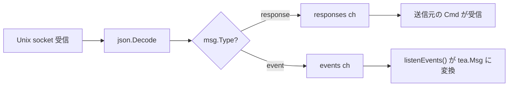
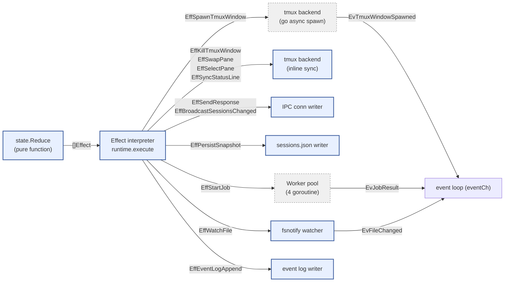
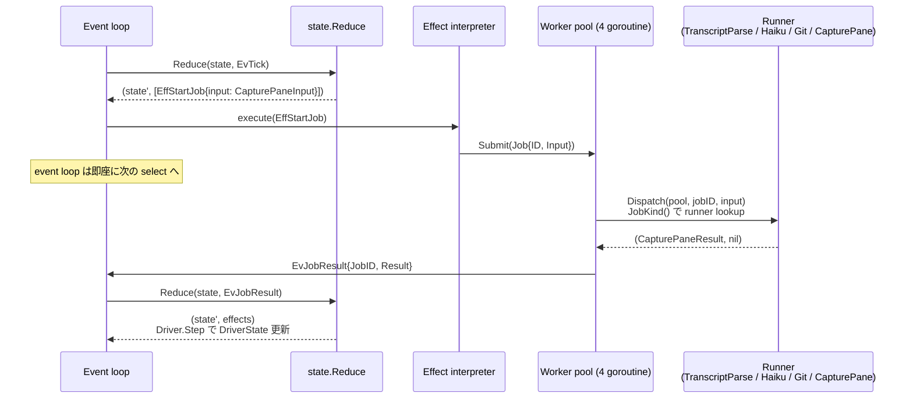
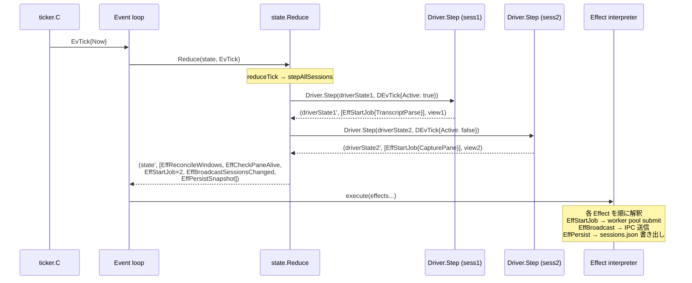
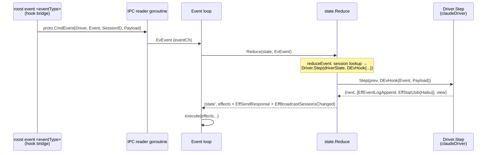

# プロセス間通信 (IPC) ・ツールシステム

## プロセス間通信 (IPC)

Unix domain socket (`~/.roost/roost.sock`) による JSON メッセージング。

### トポロジ


`runtime.Runtime` が唯一の状態所有者。`state.State` は純粋な値型で、`Reduce` の引数と戻り値としてのみ round-trip する。Effect interpreter が tmux 操作・IPC 送信・永続化・worker pool submit を実行し、結果を `Event` として event loop に feed back する。

**Runtime の構成**:
- `state`: `state.State` — 全ドメイン状態 (Sessions map, Active, Subscribers, Jobs)。event loop goroutine が単独所有
- `eventCh`: 外部 goroutine (IPC reader, worker pool, fsnotify watcher) が Event を投入するチャネル
- `workers`: `worker.Pool` — fixed-size (4) goroutine pool。`worker.Dispatch` が `JobInput.JobKind()` で登録済み runner を dispatch
- `conns`: `map[ConnID]*ipcConn` — 接続管理。event loop goroutine が単独所有
- `cfg.Tmux` / `cfg.Persist` / `cfg.EventLog` / `cfg.Watcher`: backend interface (テスト時に fake 差し替え可能)

### 通信パターン

| パターン | 方向 | 特徴 | 例 |
|---------|------|------|-----|
| **Request-Response** | TUI → Server → TUI | 同期。Client が response ch でブロック待ち | `switch-session`, `preview-session` |
| **Event Broadcast** | Server → 全クライアント | 非同期。subscribe 済みクライアントに一斉配信 | `sessions-changed`, `project-selected`, `pane-focused` |
| **Tool Launch** | TUI → Server → tmux popup → Palette → Server | 間接通信。popup が独立クライアントとしてコマンド送信 | `new-session` |

`SessionInfo` は静的メタデータと動的状態を 1 メッセージで運ぶ統合型: runtime の `broadcastSessionsChanged` が `state.Sessions` の各 Session について `Driver.View(sess.Driver)` から status / title / insight 等を取得して `proto.SessionInfo` に詰め込む。状態専用イベント (`states-updated`) は廃止された — `reduceTick` が毎 tick `EffBroadcastSessionsChanged` を emit する。

Response は `sendResponse` メソッドで統一送信。Broadcast は `subscribe` コマンドを送信したクライアントのみに配信。

### メッセージ形式

全メッセージは Go の `Message` 構造体で表現し、JSON にシリアライズして送受信する。`Type` フィールドで方向を判定する。フレーミングは改行区切り JSON (NDJSON)。`json.Encoder` / `json.Decoder` がストリーム上で 1 メッセージ = 1 行として読み書きする。`Message` は全フィールドをフラットに持つ単一構造体で、`omitempty` で不要フィールドを省略する。パース側で union type の分岐が不要になる。

| フィールド | Go 型 | JSON 型 | 用途 |
|-----------|-------|---------|------|
| `type` | string | string | `"command"`, `"response"`, `"event"` |
| `command` | string | string | コマンド名 (client → server) |
| `args` | map[string]string | object | コマンド引数 |
| `event` | string | string | イベント名 (server → client) |
| `sessions` | []SessionInfo | array | セッション一覧（`SessionInfo.State` は `driver.Status` 型） |
| `error` | string | string | エラーメッセージ |
| `active_window_id` | string | string | アクティブ window ID |
| `session_log_path` | string | string | セッションログパス |
| `selected_project` | string | string | 選択中プロジェクトパス |

生成ヘルパー: `NewCommand(cmd, args)` / `NewEvent(event)`。エラーは `Message.Error` に文字列を格納し、クライアント側で `error` に変換する。

### コマンド (クライアント → サーバー)

| コマンド | パラメータ | 機能 |
|---------|-----------|------|
| `subscribe` | - | ブロードキャストの受信を開始 |
| `create-session` | project, command | セッション作成 |
| `stop-session` | session_id | セッション停止 |
| `list-sessions` | - | セッション一覧取得 |
| `preview-session` | session_id | Pane 0.0 にプレビュー |
| `preview-project` | project | アクティブセッションを退避し `project-selected` イベントを broadcast |
| `switch-session` | session_id | Pane 0.0 に切替 + フォーカス |
| `focus-pane` | pane | ペインフォーカス。`pane-focused` イベントを broadcast |
| `launch-tool` | tool | パレット popup 起動 |
| `agent-event` | type, (type 別引数) | エージェントからのイベント通知。Service に委譲 |
| `shutdown` | - | 全終了 |
| `detach` | - | デタッチ |

### Client のメッセージ振り分け



### 並行性モデル — Single event loop + Worker pool

agent-roost のサーバ側は **単一の event loop + 固定サイズ worker pool** で構成される。全ドメイン状態 (`state.State`) は event loop goroutine が単独所有し、状態遷移は純関数 `state.Reduce(state, event) → (state', []Effect)` で表現される。`sync.Mutex` はドメイン層に存在しない (worker pool 内部を除く)。

#### Event loop と状態所有

```
runtime.Runtime.Run() — 単一 goroutine
├── select {
│   ├── eventCh     — IPC reader / hook bridge からの Event
│   ├── internalCh  — conn open/close (runtime 内部イベント)
│   ├── ticker.C    — 1 秒周期の EvTick
│   ├── workers.Results() — worker pool からの EvJobResult
│   └── watcher.Events()  — fsnotify からの EvFileChanged
│   }
├── dispatch(ev):
│   ├── state.Reduce(r.state, ev) → (next, effects)
│   ├── r.state = next
│   └── for _, eff := range effects { r.execute(eff) }
└── 状態: state.State (Sessions, Active, Subscribers, Jobs, ...)
    → event loop goroutine が単独所有。mutex 不要
```

#### Effect interpreter のディスパッチ

`runtime.execute(eff)` が各 Effect 型を backend I/O にマッピングする。Effect は closed sum type なので `grep` で全副作用を列挙可能:



凡例:
- **実線枠** = event loop goroutine 上で同期実行
- **破線枠** = 別 goroutine で非同期実行。結果は Event として event loop に feed back

#### Worker pool (slow I/O の off-loop 実行)

重い I/O (transcript parse、haiku summary、git branch detect、capture-pane) は fixed-size worker pool (`worker.Pool`, 4 goroutine) で event loop 外で実行する。runner は `RegisterRunner[In,Out]` で driver が init 時に登録し、`Dispatch` が `JobInput.JobKind()` で lookup する:



ポイント:
- **event loop は一切ブロックしない**: EffStartJob は worker pool に submit するだけ。結果は EvJobResult として非同期に戻る
- **goroutine 数は固定 (~16)**: event loop (1) + IPC accept (1) + worker pool (4) + IPC reader (M, per client) + health monitor (1)。session 数に依存しない
- **Runner 登録は型ベース**: `worker.RegisterRunner("capture_pane", runner)` — 新 job 型の追加は RegisterRunner 1 行 + runner 関数 + JobKind() メソッドだけ

#### Tick 処理のシーケンス

各 tick で `state.Reduce` が全セッションの Driver.Step を呼び、必要な Effect (capture-pane job, transcript parse job, broadcast, persist) を返す:



ポイント:
- **Driver.Step は純関数**: goroutine なし、I/O なし。capture-pane や transcript parse が必要な場合は EffStartJob を返すだけ
- **全セッションの Step を同期的に回す**: Driver.Step は純関数なので ~µs で完了する。重い I/O は EffStartJob で worker pool に委譲済み
- **reconcile + health check も同じ tick**: EvTick の reducer が EffReconcileWindows と EffCheckPaneAlive を emit し、effect interpreter が tmux に問い合わせる

#### Hook event ルーティング

hook event は IPC reader → event loop → Reduce → Driver.Step の一直線:



全処理が event loop goroutine 上で同期実行される。Driver.Step は純関数なので重い処理は EffStartJob で worker pool に委譲する (haiku summary など)。

#### 残存する同期プリミティブ

state 層には sync primitive が一切存在しない。runtime 層に残るのは **worker pool 内部のみ**:

| 場所 | プリミティブ | 用途 |
|------|------------|------|
| `worker.Pool` | `sync.Mutex` | `closed` フラグの保護 (Submit/Stop の競合防止) |
| `worker.Pool` | `sync.WaitGroup` | worker goroutine の join (Stop 時に全 worker の完了を待つ) |
| runner 内の shared Tracker | `sync.Mutex` | TranscriptParse と HaikuSummary runner 間の Tracker 共有 |
| `proto.Client` | `sync.Mutex` | TUI プロセス側の encoder 排他 (サーバ側ではない) |

ドメイン状態 (`state.State`) は event loop goroutine 単独所有で、`sync.Mutex` / `sync.RWMutex` は不要。

#### 常駐 goroutine

| goroutine | 数 | 役割 |
|-----------|----|------|
| `Runtime.Run` (event loop) | 1 | 状態所有 + Reduce + Effect 解釈 |
| `acceptLoop` | 1 | unix socket からの新規接続を受け付ける |
| `ipcConn.readLoop` | M (1 / client) | IPC reader。Command を Event に変換して eventCh に投入 |
| `ipcConn.writeLoop` | M (1 / client) | IPC writer。outbox を drain して socket 書き出し |
| `worker.Pool.run` | 4 (固定) | worker pool goroutine |
| `healthMonitor` | 1 | tmux pane 0.1/0.2 の死活監視 (eventCh 経由で event loop に通知) |

session 数に依存するのは IPC reader/writer (TUI client 数分) だけ。10 セッション運用時でも常駐 goroutine 数は ~16 で、Go ランタイム上の負荷は無視できる。

#### 設計上の利点

- **データ競合不在**: race detector で `go test -race ./...` がすべてパスする。ドメイン状態は event loop goroutine が単独所有
- **デッドロック不在**: actor 間通信が存在しない。全状態遷移は単一の goroutine 上で Reduce → execute の直列実行
- **テスト容易性**: `state.Reduce` は pure function test で検証。goroutine / channel / timing 依存なし
- **slow I/O の隔離**: transcript parse / haiku summary / git / capture-pane は worker pool で event loop 外実行。event loop は EffStartJob で submit → EvJobResult で結果受信するだけ
- **goroutine 数が固定**: session 追加で goroutine が増えない (~16)。per-session goroutine は存在しない
- **全副作用が grep 可能**: `grep 'type Eff' src/state/effect.go` で全副作用を列挙できる。Driver が直接 I/O を呼ぶことはない

## ツールシステム

ユーザーが行う高レベル操作を `Tool` として抽象化。TUI・パレットから同じインターフェースで実行可能。

```go
// tools/tools.go
type Tool struct {
    Name        string
    Description string
    Params      []Param
    Run         func(ctx *ToolContext, args map[string]string) (*ToolInvocation, error)
}

type Param struct {
    Name    string
    Options func(ctx *ToolContext) []string  // 実行時に選択肢を生成
}

type ToolContext struct {
    Client *proto.Client   // daemon との typed IPC 接続
    Config ToolConfig      // palette config (commands, projects)
    Args   map[string]string
}
```

### Tool → IPC コマンドの対応

Tool の `Run` は `ToolContext.Client` (`proto.Client`) 経由で typed IPC コマンドを送信する。1 Tool = 1 IPC コマンドの対応。`ToolInvocation` を返すことで同一 popup 内での tool chain (例: create-project → new-session) を実現する。

| Tool | IPC コマンド | パラメータ |
|------|-------------|-----------|
| `new-session` | `create-session` | project, command |
| `stop-session` | `stop-session` | session_id |
| `detach` | `detach` | - |
| `shutdown` | `shutdown` | - |

Tool は副作用を伴う高レベル操作（作成・停止・終了等）を対象とする。`switch-session`, `preview-session`, `focus-pane` 等の低レベルなナビゲーション操作は Tool を経由せず、TUI が直接 IPC コマンドを送信する。

### パレットによるパラメータ補完

パレットは tmux popup として起動する独立プロセス。TUI のイベントループをブロックせず、crash しても TUI に影響しない。

補完フロー: ツール選択 → 各 `Param` の `Options` コールバックで選択肢を動的生成 → ユーザー入力でインクリメンタルフィルタ → 全パラメータ確定後に `Tool.Run` 実行。結果は broadcast 経由で TUI に到達する。
