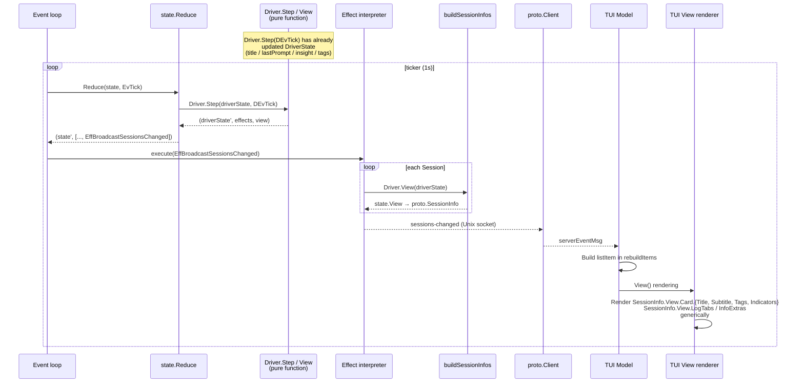

# Process Model, tmux Layout, and Rendering Responsibilities

## Rendering Responsibilities

The agent-roost TUI rendering divides responsibilities between the driver and TUI at the following boundaries. **When adding a new driver, you do not need to touch the runtime or TUI code**. A driver only needs to implement `View(DriverState) state.View`.

### Driver-Owned (`SessionView`)

The driver returns `View(DriverState) state.View`. It is a pure function that performs no I/O or detection (heavy processing is already reflected in DriverState via `Step(DEvTick)`).

- `Card.Title`: First line (e.g., conversation title)
- `Card.Subtitle`: Second line (e.g., most recent prompt)
- `Card.Tags`: Identity chips. **The driver directly determines colors** (Tags carry `Foreground` / `Background`)
  - The command name is displayed via `View.DisplayName` and `Card.BorderTitle`. Tags contain only branch names, etc.
- `Card.Indicators`: State chips (e.g., `▸ Edit`, `2 subs`, `3 err`)
- `LogTabs`: Additional log tabs (label + absolute path + kind). kind is a TabKind constant defined by the driver (the generic `TabKindText` is provided by state; driver-specific kinds are defined in each driver package)
- `InfoExtras`: Driver-specific lines in the INFO tab
- `SuppressInfo`: Opt-out of the INFO tab (explicitly set by driver)
- `StatusLine`: Pre-rendered string sent to tmux status-left

### TUI-Owned

The TUI acts as a driver-agnostic generic renderer.

- Rendering of `SessionInfo` generic fields (ID / Project / Command / WindowID / CreatedAt / State / StateChangedAt)
- Color selection from `State` enum values (`tui/theme.go`) — universal state colors are consistent across all drivers
- Elapsed time formatting (relative notation like `5m ago`)
- Card layout (ordering of each slot / margins / wrap / truncate)
- INFO tab generic header (auto-generated from SessionInfo generic fields in `renderInfoContent` → driver's `InfoExtras` appended at the end)
- LOG tab (always tails `~/.roost/roost.log`)
- Filter / fold / cursor restoration

### Prohibitions

- **Do not branch on driver name in the TUI** (code like `if cmd == "claude" {...}` is prohibited). Verifiable by grep:
  ```sh
  grep -rn '"claude"\|"bash"\|"codex"\|"gemini"' src/tui/  # → should return 0 results
  ```
- **Drivers must not import the TUI** (no dependency on the `tui` package / lipgloss / bubbletea)
- **Drivers must not perform I/O** (delegate to runtime via Effects like EffEventLogAppend, EffStartJob, etc.)
- **Runtime must not call driver-specific I/O directly** (runtime only interprets Effects; driver-specific I/O is executed by worker pool runners)

### Tag Colors Are Driver-Owned, State Colors Are TUI-Owned — Why the Different Ownership?

- **State** concepts (idle / running / waiting / error) and their colors **should be consistent across all drivers**. Users would be confused if the same state appeared in different colors → centralized in TUI theme
- **Tags** are driver-specific (branch tag, command tag, ...). What to display and what color are up to the driver → driver-owned
- If tag caching/persistence is needed, the driver holds it in the `PersistedState` bag (e.g., claudeDriver's `branch_tag` / `branch_target` / `branch_at`)

### Rendering Flow (driver → runtime → IPC → TUI)

The driver's `View(driverState)` produces the UI payload, runtime's `buildSessionInfos` packs it into `proto.SessionInfo`, broadcasts it via IPC through `EffBroadcastSessionsChanged`, and the TUI renders it generically **without branching on driver name**. The diagram below shows the flow that occurs on each tick:



Key points:
- Runtime's `buildSessionInfos` packs `state.View` directly into `proto.SessionInfo.View` and transports it. The TUI renders `SessionInfo.View.*` fields generically
- StatusLine uses a separate path: `EffSyncStatusLine` causes runtime to reflect the active session's `Driver.View().StatusLine` into tmux `status-left`

## Process Model

Three execution modes are provided in a single binary. The pane IDs (`0.0`, `0.1`, `0.2`) layout is described in [tmux Layout](#tmux-layout).

```
roost                       → Daemon (parent process: Runtime event loop + IPC server)
roost --tui main            → Main TUI (Pane 0.0)
roost --tui sessions        → Session list server (Pane 0.2)
roost --tui palette [flags] → Command palette (tmux popup)
roost --tui log             → Log TUI (Pane 0.1)
roost event <eventType>     → Hook event receiver (short-lived process invoked by hook)
roost claude setup          → Claude hook registration (writes to ~/.claude/settings.json)
```

### Daemon (Runtime)

The parent process that manages the lifecycle of the entire tmux session. On startup, it creates a tmux session and launches TUI processes as child panes. It blocks while tmux is attached, and exits on detach or shutdown.

```
runDaemon()
├── Register drivers (driver.RegisterDefaults)
├── Build worker pool (worker.NewPool + RegisterDefaults)
├── Build Runtime (runtime.New)
├── Check tmux session existence
│   ├── Exists (Warm start)
│   │   ├── restoreSession (rebuild tmux pane layout)
│   │   ├── rt.LoadSnapshot() — restore State.Sessions from sessions.json
│   │   ├── rt.ReconcileWarm() — match by tmux @roost_id, evict sessions for disappeared windows
│   │   └── rt.RestoreActiveWindow() — restore State.Active from ROOST_ACTIVE_WINDOW env
│   └── Does not exist (Cold start)
│       ├── setupNewSession (create new tmux session)
│       ├── rt.LoadSnapshot() — restore State.Sessions from sessions.json
│       ├── rt.ClearStaleWindowIDs() — clear old WindowIDs
│       └── rt.RecreateAll() — for each session:
│           ├── Driver.SpawnCommand(driverState, command) to build resume command
│           └── tmux new-window to spawn → obtain WindowID/PaneID
├── rt.Run(ctx) — start event loop goroutine (select: eventCh / ticker / workers / fsnotify)
├── rt.StartIPC() — start Unix socket server
├── FileRelay startup — push monitoring for log/transcript files
├── tmux attach (blocking)
└── On attach exit
    ├── Shutdown received → KillSession()
    └── Normal detach → exit (tmux session survives)
```

**The difference between warm start and cold start is only the bootstrap path**. Both use sessions.json as the source of truth. The driver's PersistedState (status / title / summary / branch, etc.) is included in sessions.json, so previous values are restored in both paths.

### Main TUI

A resident Bubbletea TUI process running in Pane 0.0. It always displays keybinding help, and shows session information for the corresponding project when a project header is selected in the session list. When the daemon is not running, it operates in static mode showing only keybinding help. On session switch, it retreats to a background window via `swap-pane`, and returns when a project header is selected.

```
runTUI("main")
├── Attempt socket connection
│   ├── Success → subscribe + launch MainModel with Client
│   └── Failure → static mode (keybinding help only)
└── Bubbletea event loop (receives sessions-changed / project-selected → re-render)
```

### Session List Server

A resident Bubbletea TUI process running in Pane 0.2. It connects to the daemon via socket and provides session list display and operations. Cannot be terminated (Ctrl+C disabled). On crash, the daemon automatically recovers it via `respawn-pane`. It holds no state.State or Driver; all operations are delegated to the daemon via socket.

```
runTUI("sessions")
├── Initialize Client + socket connection
├── Send subscribe command (start receiving broadcasts)
├── Fetch initial data via list-sessions
└── Bubbletea event loop (key input → IPC command → receive broadcast → re-render)
```

### Log TUI

A resident Bubbletea TUI process running in Pane 0.1. It provides an APP tab (application log) and dynamically generated per-session tabs. It polls log files at 200ms intervals and displays new lines.

```
runTUI("log")
├── Attempt socket connection
│   ├── Success → subscribe + launch LogModel with Client
│   │              Dynamically rebuild session tabs on sessions-changed
│   └── Failure → launch LogModel in app-log-only mode (no Client)
└── Bubbletea event loop (tab switching, scrolling, follow mode)
```

**Tab structure**: When there is an active session: `TRANSCRIPT | EVENTS | INFO | LOG` (for Claude sessions), or `INFO | LOG` (for non-Claude); otherwise `LOG` only. Dynamically rebuilt on `sessions-changed` events. `INFO` is always positioned immediately before LOG; it is a non-file tab that renders a `SessionInfo` snapshot directly into the viewport rather than reading from a file. During Preview (hovering over a cursor in the sidebar, just swapping the window into the main pane), the `Message.IsPreview` flag determines behavior and activates INFO. When the main pane is actually focused (detected via `pane-focused` event with `Pane == "0.0"`), it switches to TRANSCRIPT. Tick broadcasts from `sessions-changed` do not change the active tab (preserving the user's tab selection). On tab switch, the file is re-read from the end (no state persistence needed). Mouse clicks use cumulative tab label widths for hit detection.

**Elapsed time display**: Both the session list and main TUI display elapsed time from `CreatedAt` using `formatElapsed` (3 levels: minutes/hours/days).

Communication with the daemon is optional. If the connection fails (daemon not running / startup race), it operates with app logs only. On crash, the daemon detects the failure and recovers via `respawn-pane`.

### Command Palette

An independent process launched as a tmux popup via `prefix p` or TUI's `n`/`N`/`d`. Sends commands via socket. Tool selection → parameter input → execution → exit. By using a tmux popup rather than a TUI subcomponent, the TUI event loop is not blocked, and palette crashes do not affect the TUI.

```
runTUI("palette")
├── Initialize Client + socket connection
├── Get tool name and initial arguments from flags
├── If undetermined parameters exist, show incremental selection UI
├── All parameters determined → send IPC command via Tool.Run
└── Exit (popup auto-closes)
```

### Failure Behavior

- **TUI socket disconnection**: The TUI process exits. The daemon detects this and recovers via `respawn-pane`
- **External kill of session window / agent process exit**: Session windows have `remain-on-exit off`, so tmux automatically destroys the pane; windows with only 1 pane also auto-disappear. `reduceTick` emits `EffReconcileWindows`, and runtime reconciles the tmux window list with `state.State`, removes disappeared windows from State, updates the snapshot, and broadcasts `sessions-changed`
- **Active session agent process exit (e.g., C-c)**: The active session's agent pane is brought into `roost:0.0` via swap-pane. Window 0 has `remain-on-exit on`, so when the agent exits, the pane remains as `[exited]`; the session window side has the main TUI pane swapped in and alive, so normal reconcile does not clean it up. `reduceTick` emits `EffCheckPaneAlive{0.0}` every tick, and runtime executes `display-message -t roost:0.0 -p '#{pane_dead} #{pane_id}'`. If dead, it looks up the pane id (`%N`, invariant across swap-pane) via `runtime.findPaneOwner` to identify the **original owner session** of the dead pane. Relying on State's activeWindowID to determine the reap target would cause an unrelated window to be killed when activeWindowID diverges from the actual owner of pane 0.0 during concurrent Preview operations (= cards for other sessions disappear while the actually dead session remains displayed as `stopped` — a false positive). Therefore, the pane id is the sole source of truth for the reap target. Once the owner is identified, the dead pane is swapped back to the owner window via swap-pane, and the window is destroyed. The subsequent `runtime.reconcileWindows` pass finally cleans up State. If the owner cannot be found (e.g., main TUI itself died), nothing is done (that is `respawn-pane`'s responsibility). PaneID is obtained at spawn time via `display-message -t <wid>:0.0 -p '#{pane_id}'` and persisted in `sessions.json`
- **Consecutive `respawn-pane` failures**: respawn-pane normally does not fail since tmux recreates the pane (however, startup may fail in cases of environmental anomalies such as binary deletion or permission changes). When the tmux session is destroyed, the daemon's attach also exits, so everything shuts down
- **Startup consistency**: Since tmux window user options are the single source of truth, orphan checking is unnecessary. tmux windows with `@roost_id` directly constitute the roost session list
- **IPC errors**: When an IPC command returns an error on the TUI side, it logs to slog and does not change UI state. No timeout is configured (local communication over Unix socket). If the server deadlocks, the client risks blocking indefinitely. Recovery means externally running `tmux kill-session -t roost` or killing the daemon process

## tmux Layout

```
┌─────────────────────┬────────────────┐
│  Pane 0.0           │  Pane 0.2      │
│  Main TUI (always   │  TUI server    │
│  focused)           │                │
├─────────────────────┤                │
│  Pane 0.1           │                │
│  Log TUI            │                │
└─────────────────────┴────────────────┘

Window 0: Control screen (3 fixed panes)
Window 1+: Sessions (background, displayed in Pane 0.0 via swap-pane)
```

- Window 0 only has `remain-on-exit on`: to maintain layout even when log / sessions panes crash, allowing daemon to revive them via `respawn-pane`
- Session windows (Window 1+) have `remain-on-exit off`: agent process exit causes automatic pane destruction, and `reduceTick` → `EffReconcileWindows` cleans up State
- `mouse on` enables mouse wheel scrolling and pane border detection. Explicitly set by roost, not dependent on the user's tmux.conf
- Terminal size is obtained via `term.GetSize()` and passed to `new-session -x -y`
- All default keys in the prefix table are disabled; only Space/d/q/p are registered

### Mouse Operations

With tmux `mouse on`, mouse operations are mediated by tmux. Text selection goes through tmux copy mode.

| Operation | Behavior |
|-----------|----------|
| Wheel | tmux handles scrolling (forwards events to the program for alt screen panes) |
| Drag | Enters tmux copy mode, selects text within the pane |
| Release | Copies selected text and exits copy mode (returns to live display) |
| Shift+Drag | Bypasses tmux, uses terminal-native selection (can cross pane boundaries) |

**Limitation**: Returning to live display (bottom) when exiting copy mode is tmux's default behavior. It is not possible to exit copy mode while maintaining the scrollback position. To have both in-pane selection and scrollback position retention, use Shift+Drag or continue browsing within copy mode until pressing `q`.

### Session Switching

Runtime executes individual `swap-pane -d` operations sequentially (no rollback on mid-sequence failure).

```
Preview(sess):
  1. swap-pane -d  main pane ↔ old session (return old, if activeWindowID exists)
  2. swap-pane -d  main pane ↔ new session (display new)
  → Focus is not changed

Switch(sess):
  Preview + SelectPane to focus the main pane
```

### Key Input Processing Responsibilities

| Level | Handler | Examples |
|-------|---------|----------|
| Prefix keys | tmux bind-key (configured by daemon) | Space, d, q, p |
| TUI keys | Session list Bubbletea | j/k, Enter, n, N, Tab |
| Palette keys | Palette Bubbletea | Esc, Enter, text input |

Prefix keys are intercepted by tmux. Bare keys are received directly by each pane's process.
