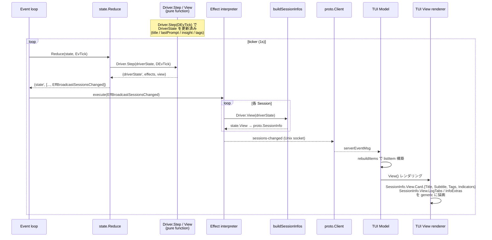

# プロセスモデル・tmux レイアウト・描画責務

## 描画責務の所在

agent-roost の TUI 描画は driver と TUI の間で以下の境界で責務を分ける。**新しい driver を追加するとき、runtime や TUI のコードを触る必要はない**。Driver は `View(DriverState) state.View` を実装するだけで完結する。

### Driver 所有 (`SessionView`)

Driver は `View(DriverState) state.View` を返す。純関数であり、I/O や検出を行わない (重い処理は `Step(DEvTick)` で DriverState に反映済み)。

- `Card.Title`: 1 行目 (例: 会話タイトル)
- `Card.Subtitle`: 2 行目 (例: 直近プロンプト)
- `Card.Tags`: identity 系のチップ。**色も driver が直接決める** (`Foreground` / `Background` を Tag に持たせる)
  - 全 driver は通常 `CommandTag(d.Name())` を先頭に置く規約 (driver 共有ヘルパ `driver/tags.go` 経由)
- `Card.Indicators`: state 系のチップ (例: `▸ Edit`, `2 subs`, `3 err`)
- `Card.Subjects`: ぶら下がり箇条書き
- `LogTabs`: 追加ログタブ (label + 絶対パス + kind)。kind は driver が定義する TabKind 定数（汎用の `TabKindText` は state 提供、driver 固有の kind は各 driver パッケージで定義）
- `InfoExtras`: INFO タブの driver-specific 行
- `SuppressInfo`: INFO タブの opt-out (driver 明示)
- `StatusLine`: tmux status-left に流す pre-rendered 文字列

### TUI 所有

TUI は driver-agnostic な汎用 renderer に徹する。

- `SessionInfo` の generic フィールド (ID / Project / Command / WindowID / CreatedAt / State / StateChangedAt) の描画
- `State` enum 値からの色選択 (`tui/theme.go`) — universal な状態色は driver 横断で統一
- 経過時間フォーマット (`5m ago` などの相対表記)
- カードレイアウト (各スロットの並び順 / 余白 / wrap / truncate)
- INFO タブの generic header (`renderInfoContent` で SessionInfo の generic フィールドから自動生成 → driver の `InfoExtras` を後ろに append)
- LOG タブ (常時最後尾、`~/.roost/roost.log` を tail)
- フィルタ / フォールド / カーソル復元

### 禁止事項

- **TUI から driver 名で分岐しない** (`if cmd == "claude" {...}` のようなコード禁止)。grep で検証可能:
  ```sh
  grep -rn '"claude"\|"bash"\|"codex"\|"gemini"' src/tui/  # → 0 件であること
  ```
- **driver から TUI を import しない** (`tui` パッケージ / lipgloss / bubbletea に依存しない)
- **driver は I/O を持たない** (EffEventLogAppend, EffStartJob 等の Effect で runtime に委譲する)
- **runtime から driver-specific I/O を直接呼ばない** (runtime は Effect を interpret するだけ。driver-specific な I/O は worker pool の runner が実行する)

### Tag の色は driver、State の色は TUI — なぜ別所有なのか

- **State** の概念 (idle / running / waiting / error) と色は **全 driver で共通すべき**。同じ状態は同じ色で見えないと混乱する → TUI theme に集約
- **Tag** は driver 固有 (branch tag, command tag, ...)。何を出すかも色も driver の自由 → driver 所有
- 結果として `@roost_tags` user option は撤廃。tag のキャッシュ/永続化が必要なら driver が `PersistedState` bag 内に持つ (例: claudeDriver の `branch_tag` / `branch_target` / `branch_at`)

### 描画フロー (driver → runtime → IPC → TUI)

Driver の `View(driverState)` が UI ペイロードを produce し、runtime の `buildSessionInfos` がそれを `proto.SessionInfo` に詰め、`EffBroadcastSessionsChanged` で IPC 経由でブロードキャストし、TUI は **driver 名で分岐せず** generic に描画する。下図は各 tick で起きる流れ:



ポイント:
- **Driver.Step / View は純関数**: I/O なし、goroutine なし。重い処理 (transcript parse, git branch) は EffStartJob で worker pool に委譲済み。View は DriverState から組み立てるだけ
- **runtime は中身を見ない**: `buildSessionInfos` は `state.View` をそのまま `proto.SessionInfo.View` に詰めて運ぶ
- **TUI は generic renderer**: `SessionInfo.View.*` のフィールドを順に描画するだけ。`if cmd == "claude"` のような分岐は禁止 (`grep '"claude"\|"bash"\|"codex"' src/tui/` で検証可能)
- **StatusLine だけは別経路**: tmux `status-left` への流し込みは `EffSyncStatusLine` で runtime が active session の `Driver.View().StatusLine` を pull して tmux に反映する (broadcast 経路には乗らない)

## プロセスモデル

3つの実行モードを1つのバイナリで提供。各ペイン ID (`0.0`, `0.1`, `0.2`) のレイアウトは [tmux レイアウト](#tmux-レイアウト) を参照。

```
roost                       → Daemon（親プロセス。Runtime event loop + IPC server）
roost --tui main            → メイン TUI (Pane 0.0)
roost --tui sessions        → セッション一覧サーバー (Pane 0.2)
roost --tui palette [flags] → コマンドパレット (tmux popup)
roost --tui log             → ログ TUI (Pane 0.1)
roost claude event          → Claude hook イベント受信（hook から呼ばれる短命プロセス）
roost claude setup          → Claude hook 登録（~/.claude/settings.json に書き込み）
```

### Daemon (Runtime)

tmux セッション全体のライフサイクルを管理する親プロセス。起動時に tmux セッションを作成し、TUI プロセスを子ペインとして起動する。tmux attach 中はブロックし、detach またはシャットダウンで終了する。

```
runDaemon()
├── Driver 登録 (driver.RegisterDefaults)
├── Worker pool 構築 (worker.NewPool + RegisterDefaults)
├── Runtime 構築 (runtime.New)
├── tmux セッション存在確認
│   ├── 存在 (Warm start)
│   │   ├── restoreSession (tmux pane layout 再構築)
│   │   ├── rt.LoadSnapshot() — sessions.json から State.Sessions を復元
│   │   ├── rt.ReconcileWarm() — tmux @roost_id で照合、消えた window の session を evict
│   │   └── rt.RestoreActiveWindow() — ROOST_ACTIVE_WINDOW env から State.Active 復元
│   └── 不在 (Cold start)
│       ├── setupNewSession (新 tmux session 作成)
│       ├── rt.LoadSnapshot() — sessions.json から State.Sessions を復元
│       ├── rt.ClearStaleWindowIDs() — 旧 WindowID をクリア
│       └── rt.RecreateAll() — 各 session について:
│           ├── Driver.SpawnCommand(driverState, command) で resume コマンド組み立て
│           └── tmux new-window で spawn → WindowID/PaneID を取得
├── rt.Run(ctx) — event loop goroutine 起動 (select: eventCh / ticker / workers / fsnotify)
├── rt.StartIPC() — Unix socket サーバー起動
├── FileRelay 起動 — ログ/transcript ファイルの push 監視
├── tmux attach (ブロック)
└── attach 終了時
    ├── shutdown 受信済み → KillSession()
    └── 通常 detach → 終了（tmux セッション生存）
```

**Warm start と Cold start の差は bootstrap 経路だけ**。どちらも sessions.json が SoT。Driver の PersistedState (status / title / summary / branch 等) は sessions.json に含まれるため、どちらのパスでも前回値が復元される。

### メイン TUI

Pane 0.0 で動作する常駐 Bubbletea TUI プロセス。キーバインドヘルプを常時表示し、セッション一覧でプロジェクトヘッダーが選択されたとき該当プロジェクトのセッション情報を表示する。daemon 未起動時はキーバインドヘルプのみの static モードで動作する。セッション切替時は `swap-pane` でバックグラウンド window に退避し、プロジェクトヘッダー選択時に復帰する。

```
runTUI("main")
├── ソケット接続を試行
│   ├── 成功 → subscribe + Client 付きで MainModel 起動
│   └── 失敗 → static モード（キーバインドヘルプのみ）
└── Bubbletea イベントループ（sessions-changed / project-selected を受信 → 再描画）
```

### セッション一覧サーバー

Pane 0.2 で動作する常駐 Bubbletea TUI プロセス。ソケット経由で daemon に接続し、セッション一覧の表示・操作を提供する。終了不可（Ctrl+C 無効）。crash 時はヘルスモニタが自動 respawn。state.State や Driver を一切持たず、全操作をソケット経由で daemon に委譲する。

```
runTUI("sessions")
├── Client 初期化 + ソケット接続
├── subscribe コマンド送信（broadcast 受信開始）
├── list-sessions で初期データ取得
└── Bubbletea イベントループ（キー入力 → IPC コマンド → broadcast 受信 → 再描画）
```

### ログ TUI

Pane 0.1 で動作する常駐 Bubbletea TUI プロセス。APP タブ（アプリケーションログ）と、セッションごとに動的生成されるセッションタブを提供する。200ms 間隔でログファイルをポーリングし、新規行を表示する。

```
runTUI("log")
├── ソケット接続を試行
│   ├── 成功 → subscribe + Client 付きで LogModel 起動
│   │          sessions-changed でセッションタブを動的再構築
│   └── 失敗 → アプリログのみモードで LogModel 起動（Client なし）
└── Bubbletea イベントループ（タブ切替、スクロール、follow モード）
```

**タブ構成**: アクティブセッションがある場合 `TRANSCRIPT | EVENTS | INFO | LOG` (Claude セッション時)、または `INFO | LOG` (非 Claude)、それ以外は `LOG` のみ。`sessions-changed` イベントで動的に再構築。`INFO` は LOG の直前固定で、ファイルではなく `SessionInfo` のスナップショットを直接 viewport に描画する非ファイル系タブ。Preview (サイドバーで cursor hover、メインペインに window を swap するだけ) 時は `Message.IsPreview` フラグで判定して INFO をアクティブにする。メインペインが実際に focus された (`pane-focused` イベントで `Pane == "0.0"`) ときに TRANSCRIPT へ切り替える。`sessions-changed` の Tick broadcast はアクティブタブを変更しない（ユーザーが選んだタブを保持）。タブ切替時はファイル末尾から再読み込み（状態保持不要）。マウスクリックはタブラベルの累積幅でヒット判定する。

**経過時間表示**: セッション一覧とメイン TUI の両方で、`CreatedAt` からの経過時間を `formatElapsed` で表示する（分/時/日の 3 段階）。

daemon との通信は任意。接続できない場合（daemon 未起動・起動順の競合）はアプリログのみで動作する。crash 時はヘルスモニタが Pane 0.1 の死活を検知し respawn する。

### コマンドパレット

`prefix p` または TUI の `n`/`N`/`d` で tmux popup として起動する独立プロセス。ソケット経由でコマンド送信。ツール選択 → パラメータ入力 → 実行 → 終了。TUI のサブコンポーネントではなく tmux popup にすることで、TUI のイベントループをブロックせず、パレットが crash しても TUI に影響しない。

```
runTUI("palette")
├── Client 初期化 + ソケット接続
├── フラグからツール名・初期引数を取得
├── 未確定パラメータがあればインクリメンタル選択 UI
├── 全パラメータ確定 → Tool.Run で IPC コマンド送信
└── 終了（popup 自動クローズ）
```

### 障害時の振る舞い

- **TUI のソケット切断**: TUI プロセスは終了する。ヘルスモニタが検知し respawn
- **セッション window の外部 kill / agent プロセス終了**: session window は `remain-on-exit off` のため tmux が自動でペイン破棄、ペイン 1 個のみの window も自動消滅。`reduceTick` が `EffReconcileWindows` を emit し、runtime が tmux window 一覧と `state.State` を照合、消えた window を State から削除して snapshot を更新し `sessions-changed` を broadcast する
- **Active session の agent プロセス終了 (C-c など)**: active session の agent pane は swap-pane で `roost:0.0` に持ち込まれている。Window 0 は `remain-on-exit on` のため、agent が exit すると pane は `[exited]` のまま居座り、session window 側は swap で入れ替わった main TUI pane が生きているので通常の reconcile では掃除されない。`reduceTick` は毎 tick `EffCheckPaneAlive{0.0}` を emit し、runtime が `display-message -t roost:0.0 -p '#{pane_dead} #{pane_id}'` を実行する。dead な場合はその pane id (`%N`、swap-pane を跨いで不変) で `runtime.findPaneOwner` を引いて死んだ pane の **本来の owner session** を特定する。State の activeWindowID を信頼して reap 対象を決めると、並行 Preview などで activeWindowID が pane 0.0 の実 owner とずれた瞬間に無関係な window を kill してしまう (= 別 session のカードが消え、本物の死んだ session が `stopped` 表示で残る誤爆) ため、pane id だけが reap 対象の唯一の真実。owner が特定できたら dead pane を owner window に swap-pane で戻し、window ごと破棄する。その後の `runtime.reconcileWindows` パスで State が最終的に掃除される。owner が見つからない場合 (main TUI 自身が死んだ等) は何もしない (= ヘルスモニタの責務)。PaneID は spawn 時に `display-message -t <wid>:0.0 -p '#{pane_id}'` で取得し `sessions.json` に永続化する
- **ヘルスモニタの respawn 連続失敗**: respawn-pane は tmux がペインを再作成するため通常は失敗しない（ただしバイナリ削除・権限変更等の環境異常時は起動失敗する）。tmux セッション消失時は daemon の attach も終了するため、全体が終了する
- **起動時の整合性**: tmux window user options を単一の真実とするため、orphan チェックは不要。`@roost_id` を持つ tmux window がそのまま roost セッション一覧になる
- **IPC エラー**: TUI 側で IPC コマンドがエラーを返した場合、slog にログ出力し UI 状態は変更しない。タイムアウトは設定していない（Unix socket のローカル通信のため）。サーバーがデッドロックした場合、クライアントは無期限にブロックするリスクがある。復帰手段は外部からの `tmux kill-session -t roost` または daemon プロセスの kill

## tmux レイアウト

```
┌─────────────────────┬────────────────┐
│  Pane 0.0           │  Pane 0.2      │
│  メイン TUI (常時focus) │  TUI サーバー   │
│                     │                │
├─────────────────────┤                │
│  Pane 0.1           │                │
│  ログ TUI           │                │
└─────────────────────┴────────────────┘

Window 0: 制御画面（3ペイン固定）
Window 1+: セッション（バックグラウンド、swap-pane で Pane 0.0 に表示）
```

- Window 0 のみ `remain-on-exit on`: log / sessions ペインがクラッシュしてもレイアウトを維持し、ヘルスモニタが `respawn-pane` で復活させるため
- Session window (Window 1+) は `remain-on-exit off`: agent プロセス終了でペインごと自動消滅させ、`reduceTick` → `EffReconcileWindows` で State を片付ける
- `mouse on` でマウスホイールスクロールとペイン境界認識を有効化。roost が明示的に設定し、ユーザーの tmux.conf に依存しない
- ターミナルサイズを `term.GetSize()` で取得し `new-session -x -y` に渡す
- prefix テーブルの全デフォルトキーを無効化し、Space/d/q/p のみ登録

### マウス操作

tmux `mouse on` により、マウス操作は tmux が仲介する。テキスト選択は tmux のコピーモードを経由する。

| 操作 | 動作 |
|------|------|
| ホイール | tmux がスクロール処理（alt screen ペインではプログラムにイベント転送） |
| ドラッグ | tmux コピーモードに入り、ペイン内でテキスト選択 |
| リリース | 選択テキストをコピーし、コピーモードを終了（ライブ表示に復帰） |
| Shift+ドラッグ | tmux を迂回し、ターミナルネイティブの選択（ペイン境界を跨ぐ） |

**制約**: コピーモード終了時にライブ表示（最下部）に復帰するのは tmux の仕様。スクロールバック位置を維持したままコピーモードを抜けることはできない。ペイン内選択とスクロール位置維持を両立するには Shift+ドラッグを使うか、コピーモード内で `q` を押すまで閲覧を続ける。

### セッション切替

runtime が個別の `swap-pane -d` 操作を順に実行する（途中失敗時のロールバックはない）。

```
Preview(sess):
  1. swap-pane -d  メインペイン ↔ 旧セッション (旧を戻す、activeWindowID がある場合)
  2. swap-pane -d  メインペイン ↔ 新セッション (新を表示)
  → フォーカスは変更しない

Switch(sess):
  Preview と同じ + SelectPane でメインペインにフォーカス
```

### キー入力の処理分担

| レベル | 処理者 | 例 |
|--------|--------|-----|
| prefix キー | tmux bind-key (daemon が設定) | Space, d, q, p |
| TUI キー | セッション一覧の Bubbletea | j/k, Enter, n, N, Tab |
| パレットキー | パレットの Bubbletea | Esc, Enter, 文字入力 |

prefix キーは tmux が横取り。bare key は各 pane のプロセスが直接受信。
