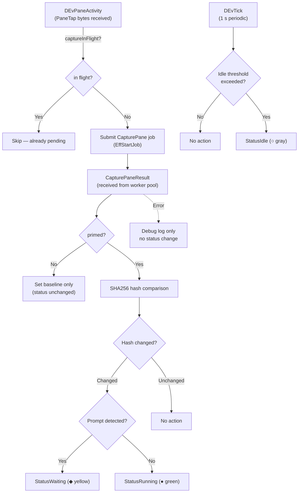
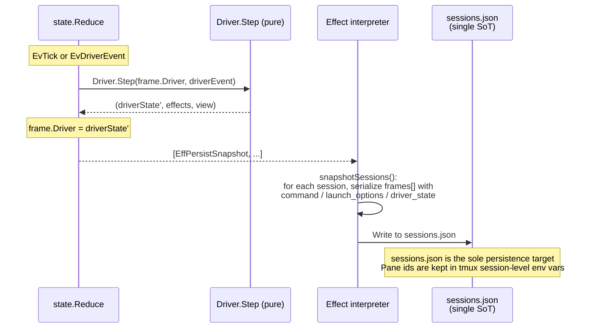
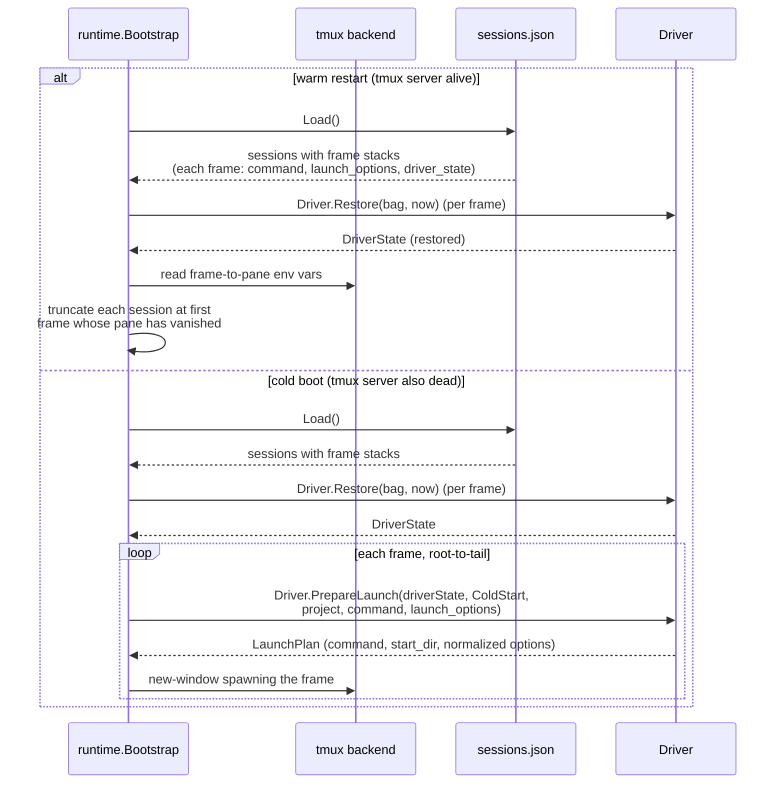

# State monitoring

For the interactive operation processing flow (TUI → IPC → Reduce → Effect), see [ipc.md](ipc.md). The following describes the background status update pipeline and state monitoring by Drivers.

## Background pipeline

Two parallel event sources feed Driver.Step:

- **Periodic tick (1s)**: `reduceTick` steps the active frame of each running session via `Driver.Step(frame.Driver, DEvTick{...})`. Pane reconciliation and the pane 0.0 health check are performed on the same tick. For the detailed sequence, see [ipc.md](ipc.md#tick-processing-sequence).
- **PaneTap activity (`EvPaneActivity`)**: When the `tapManager` reader goroutine receives bytes from `tmux pipe-pane`, it emits `EvPaneActivity` (debounced to 100 ms). `reduceActivity` calls `Driver.Step(frame.Driver, DEvPaneActivity{...})`, which triggers an immediate capture-pane job for the owning frame rather than waiting for the next tick.

Driver.Step returns `EffStartJob`, which is submitted to the worker pool. The result is fed back via `EvJobResult` → `Driver.Step(DEvJobResult)` and reflected in DriverState.

## State monitoring

The Driver plugin's `Step` method is responsible for status updates. For the Driver interface definition, see [interfaces.md](interfaces.md#interfaces).

### Lifecycle:

| Method | Caller | Purpose |
|---------|-----------|------|
| `NewState(now)` | `reduceCreateSession`, `reducePushDriver` | Generates a fresh DriverState value for a new frame. Initial values are Idle / now |
| `Restore(bag, now)` | `runtime.Bootstrap` | Reconstructs each frame's DriverState from the previously saved opaque map on warm/cold restart |
| `PrepareLaunch(s, mode, project, cmd, options)` | `reduceCreateSession`, `reducePushDriver`, cold-start bootstrap | Pure function that resolves the frame's launch plan (command / start_dir / normalized `LaunchOptions`). Called synchronously inside `state.Reduce` and on cold-start restoration; the resolved plan is baked into `EffSpawnTmuxWindow` so the runtime never calls drivers |
| `PrepareCreate(s, sessID, project, cmd, options)` | `reduceCreateSession` (planner-gated drivers only) | Optional extension returning a `CreatePlan` with a `SetupJob` for async pre-launch work (e.g., creating a managed worktree) |
| `CompleteCreate(s, cmd, options, result, err)` | `handlePendingCreate` (planner-gated drivers only) | Runs after the SetupJob completes; returns the final `CreateLaunch` and the normalized `LaunchOptions` to persist on the frame |
| `Step(prev, DEvTick)` | `reduceTick` | Periodic tick on the active frame of each running session. Claude gates on `DEvTick.Active`, emitting transcript parse jobs only when active. Generic uses tick only for idle-threshold detection when no capture-pane is already in flight |
| `Step(prev, DEvPaneActivity)` | `reduceActivity` | Fired by the PaneTap reader goroutine when bytes arrive from the pane (debounced 100 ms). Generic and Shell drivers emit an immediate capture-pane job, bypassing the tick interval |
| `Step(prev, DEvHook)` | `reduceDriverHook` | Receives hook events targeted at a specific frame and updates that frame's DriverState. Claude performs status transitions + event log append effects |
| `Step(prev, DEvJobResult)` | `reduceJobResult` | Reflects results from the worker pool into the owning frame's DriverState. Transcript parse results such as title / lastPrompt |
| `Step(prev, DEvFileChanged)` | `reduceFileChanged` | File change notification from fsnotify. Emits transcript parse job |
| `View(driverState)` | runtime's `broadcastSessionsChanged` / `activeStatusLine` | Pure getter that returns display payloads for the TUI (Card / LogTabs / InfoExtras / StatusLine) |
| `Persist(driverState)` | runtime's `snapshotSessions` | Serializes DriverState to an opaque map. Written to sessions.json alongside the frame's command and normalized `LaunchOptions` |

### Active/Inactive and DEvTick.Active (push model)

"Session is active" means the session's active frame pane is swapped into pane 0.0 (main). The single source of truth is `state.State.ActiveSession` (SessionID), and `reduceTick` evaluates `sessID == state.ActiveSession` when constructing `DEvTick` to set the `DEvTick.Active` flag. Step is called on the active frame of every running session on every tick, passing `DEvTick{Active: false}` to inactive sessions. Activation is detected on the next tick (within 1 second).

### Claude driver (event-driven + active-gated transcript sync)

`claudeDriver`'s status is **fully event-driven**: the status in DriverState is updated only at the moment `Step(prev, DEvHook{Event: "state-change"})` receives a state-change event. If no new event arrives, the status does not change (= the previously restored status continues to be displayed).

Transcript metadata (title / lastPrompt, etc.) is incrementally parsed by `transcript.Tracker` inside the worker pool's `TranscriptParse` runner:

- `Step(prev, DEvTick{Active: true})`: Emits transcript parse job only when active. Returns immediately when inactive
- `Step(prev, DEvHook)`: Always updates DriverState regardless of active/inactive. Also emits transcript parse job
- `Step(prev, DEvJobResult{TranscriptParseResult})`: Reflects parse results (title / lastPrompt / statusLine) into DriverState
- `Step(prev, DEvFileChanged)`: File change notification from fsnotify. Emits transcript parse job

`lastPrompt` is obtained by `transcript.Tracker` walking the parentUuid chain backwards from the tail and returning the text of the first non-synthetic `KindUser` entry.

Hook event → driver.Status mapping:

| Hook event | Status |
|--------------|--------|
| UserPromptSubmit, PreToolUse, PostToolUse, SubagentStart | Running |
| Stop, Notification(idle_prompt) | Waiting |
| StopFailure, SessionEnd | Stopped |
| Notification(permission_prompt) | Pending |
| SessionStart | Idle |
| SessionEnd | Stopped |

The `roost event <eventType>` subcommand repackages the Claude hook payload into `proto.CmdEvent` and sends it via IPC. The runtime's IPC reader converts it into an `EvDriverEvent` and feeds it into the event loop. `reduceDriverHook` locates the owning frame across all sessions using the frame id it received as `SenderID`, and calls `Driver.Step(frame.Driver, DEvHook{...})`. Neither the state layer nor the runtime layer holds any Claude-specific state logic.

### Hook event routing and race-free identification

A mechanism for the hook subprocess to identify its owning roost frame in a race-free manner.

**Problem**: There is a window after `tmux new-window` where any pane-scoped tmux option written by the daemon is not yet visible to processes inside the pane. If a hook fires during this window, the option-based owner marker is unset and the event is discarded.

**Solution**: Inject a frame-scoped env var into the pane environment at `tmux new-window -e` time. The env var is set at the kernel exec level simultaneously with the window creation, so no race occurs. The hook bridge reads the frame id directly from its own process environment, requiring no round-trip to tmux. The reducer then scans the frame stacks to locate the owning frame and routes the hook to that frame's driver. Hooks whose target frame has already been truncated off the stack are silently dropped — this is the intended behavior when a frame's pane has just died and the reducer is still processing the eviction.

### Generic driver (activity-driven + tick idle detection)

`genericDriver` determines state by comparing capture-pane hashes. Capture-pane jobs are now triggered primarily by `DEvPaneActivity` (bytes arriving via PaneTap), with `DEvTick` used only for idle-threshold detection. Results arrive from the worker pool via `DEvJobResult{CapturePaneResult}`:



**The first capture-pane result does not change status** — it only sets the internal hash baseline. Status changes begin from the second result onward.

When `Driver.Restore` is called, `lastActivity` is also seeded from `status_changed_at`, allowing the idle countdown to continue across restarts.

The idle threshold can be changed via `IdleThresholdSec` in `settings.toml` (default 30 seconds). The polling interval is `PollIntervalMs` (default 1000ms). Prompt detection uses per-driver regular expressions. The generic pattern `` (?m)(^>|[>$❯]\s*$) `` serves as the base, while claude uses `` (?m)(^>|❯\s*$) `` excluding `$` to prevent false positives with bash shells.

### State persistence and restoration

`Driver.Persist(driverState)` returns an opaque `map[string]string` interpreted by the driver, and `EffPersistSnapshot` writes it to `sessions.json`. Frame-to-pane mapping is stored in tmux session-level env vars (not in sessions.json), so pane ids do not leak into the snapshot file.

`sessions.json` is organized as a list of sessions, where each session contains a **frame stack** `frames[]`. Each frame in the stack carries its own `command`, normalized `launch_options`, and the driver-interpreted `driver_state` bag. The active frame is not persisted — it is always the tail of the stack at load time. `LaunchOptions` is stored in its canonical (normalized) form that drivers returned from `PrepareLaunch`; on cold start the bootstrap re-feeds those persisted options back into `PrepareLaunch` so each frame respawns with the same launch flavor (worktree vs in-place, etc.).

#### Writing (runtime)

When a driver's Step updates its frame's DriverState on each tick / hook event, the reducer emits `EffPersistSnapshot`, and the runtime's Effect interpreter writes it to `sessions.json`:



#### Restoration (warm restart / cold boot)

There are two restoration paths. **Warm restart** (tmux server alive) rebuilds the frame-to-pane map from tmux session-level env vars, restores each frame's DriverState via `Driver.Restore`, and truncates any session at the first frame whose pane has gone missing (dropping the whole session if its root frame is missing). Active session is not restored; startup always returns pane `0.0` to the main TUI. **Cold boot** (tmux server also dead) walks each restored session's frame stack in root-to-tail order and respawns a window per frame via `Driver.PrepareLaunch(LaunchModeColdStart, …)`, re-feeding the persisted `LaunchOptions` so the launch flavor is preserved across restarts:



#### PersistedState schema per Driver

`claudeDriver.PersistedState()`:
```
{
  "roost_session_id":     "abc-123",
  "claude_session_id":    "def-456",
  "working_dir":          "/path/to/workdir",
  "transcript_path":      "/path/to/transcript.jsonl",
  "status":               "running",
  "status_changed_at":    "2026-04-09T12:34:56Z",
  "branch_tag":           "feature/foo",
  "branch_bg":            "#334455",
  "branch_fg":            "#ffffff",
  "branch_target":        "/path/to/repo",
  "branch_at":            "2026-04-09T12:00:00Z",
  "branch_is_worktree":   "1",
  "branch_parent_branch": "main",
  "summary":              "haiku summary text",
  "title":                "conversation title",
  "last_prompt":          "most recent user prompt"
}
```

`genericDriver.PersistedState()`:
```
{
  "status":             "running",
  "status_changed_at":  "2026-04-09T12:34:56Z"
}
```

| Scenario | Behavior |
|---------|------|
| **New session creation** | `reduceCreateSession` generates the initial DriverState via `Driver.NewState`, calls `Driver.PrepareLaunch` synchronously to resolve the frame's command / start_dir / normalized `LaunchOptions`, stores a root frame carrying the normalized options on the session, and emits `EffSpawnTmuxWindow` pre-baked with the resolved plan. The runtime spawns the tmux pane and reports back via `EvTmuxPaneSpawned` |
| **Push driver on top of a session** | `reducePushDriver` appends a new frame on top of the active frame, running the same `PrepareLaunch` / spawn pipeline as new session creation. The appended frame becomes the new active frame |
| **Warm restart (daemon only restarts)** | `runtime.Bootstrap` loads the frame stacks from sessions.json, restores each frame's DriverState via `Driver.Restore`, rebinds frames to their live tmux panes via frame-scoped env vars, and truncates any session at the first frame whose pane is missing (root-frame truncation drops the whole session). Pane `0.0` is always main TUI at startup |
| **Cold boot (tmux server also dead)** | `runtime.Bootstrap` loads the frame stacks, restores each frame's DriverState, then walks each session's frames in root-to-tail order and calls `Driver.PrepareLaunch(LaunchModeColdStart, …)` with the persisted `LaunchOptions` to reconstruct the launch plan. A tmux window is spawned per frame directly from the resolved plan |
| **Session stop** | `reduceStopSession` emits terminate / unwatch / unregister effects for every frame in the session. The session is removed from State only once the pane/window actually exits and a `EvTmuxWindowVanished` arrives |
| **Dead pane reap** | Pane reconciliation and `EvPaneDied` / `EvTmuxWindowVanished` locate the owning frame and truncate the session from that frame onward. If the root frame is the one that died, the entire session is deleted; otherwise the remaining lower frames stay and the new tail becomes the active frame |

### Cost extraction

Tool names, subagent counts, error counts, and other metrics from Claude sessions are extracted from the transcript JSONL by `transcript.Tracker` (`lib/claude/transcript`). `Tracker` is held within the worker pool's `TranscriptParse` runner, and results are returned to Driver.Step as `TranscriptParseResult`.
