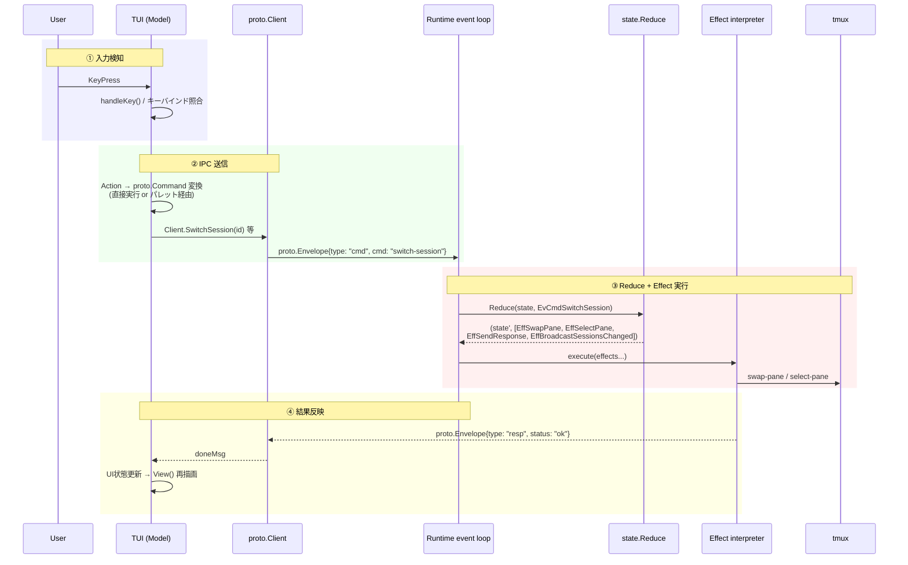
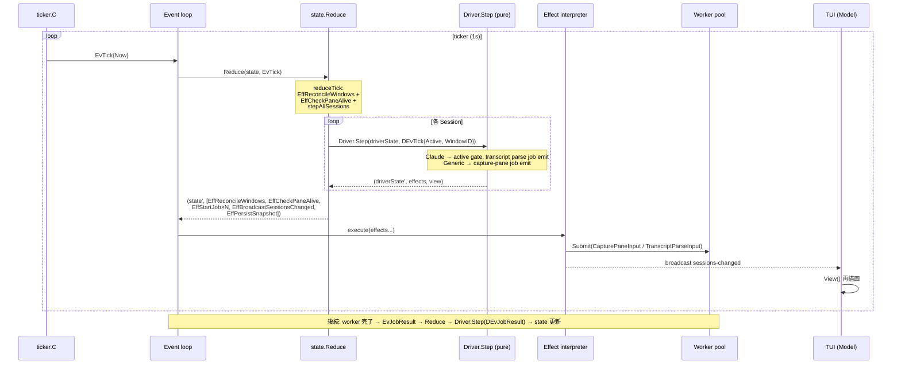
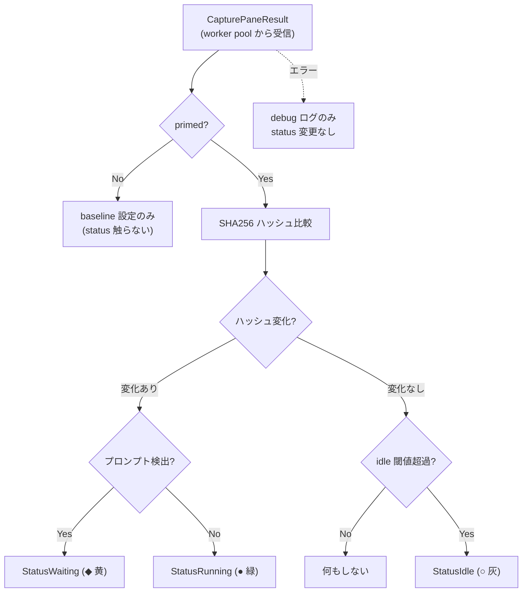
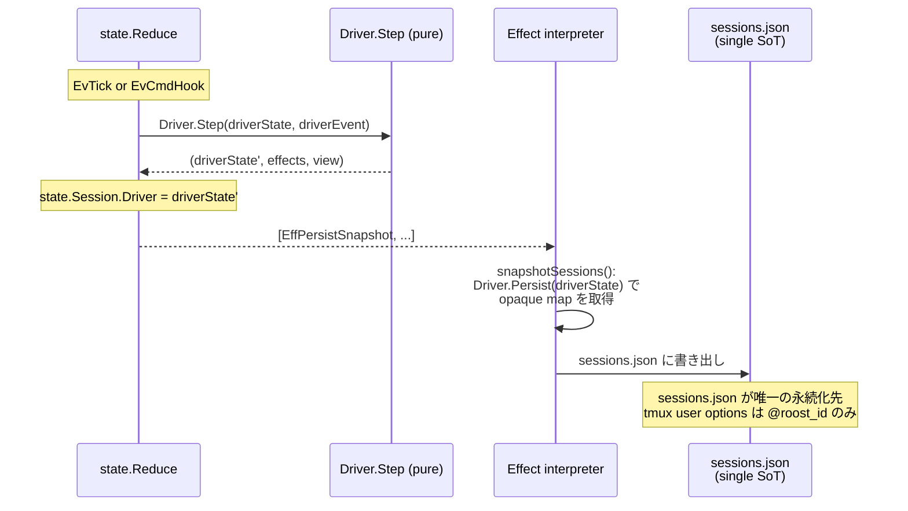
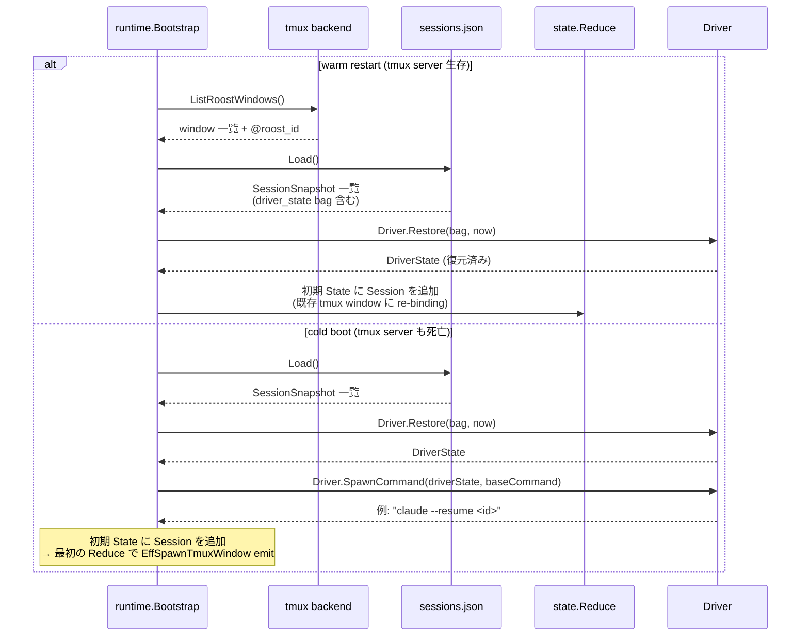

# 状態監視・UX 処理パイプライン

## UX 処理パイプライン

ユーザー操作はすべて同一のパイプラインを通過する。

### インタラクティブパイプライン



**パレット経由の場合**: ②で tmux popup を起動。Palette が独立 `proto.Client` としてパラメータ補完→③のコマンド送信を行い、結果は broadcast 経由で TUI に到達する。

**エラー時**: ③で Reduce がエラー Effect (`EffSendError`) を返した場合、response の `error` フィールドに詳細が格納される。TUI 側は slog にログ出力し、UI 状態は変更しない（楽観的更新をしない）。tmux 操作の失敗（例: swap-pane 対象の window が消失）は Effect interpreter がエラーログを出力する。

### バックグラウンドパイプライン（ステータス更新）



**責務分離**:
- **`reduceTick`**: 全セッションを回して `Driver.Step(driverState, DEvTick{...})` を呼ぶ。返された effects (EffStartJob 等) を集約して返す。reconcile と health check も同じ tick で emit
- **`Driver.Step` (pure)**: goroutine なし、I/O なし。capture-pane や transcript parse が必要な場合は `EffStartJob` を返すだけ。active/inactive は `DEvTick.Active` フラグで判定
- **Worker pool**: EffStartJob の input 型 (`CapturePaneInput`, `TranscriptParseInput` 等) を `Dispatch` が `JobInput.JobKind()` で登録済み runner に dispatch。結果は `EvJobResult` で event loop に feed back
- **EffBroadcastSessionsChanged**: runtime が `state.Sessions` から `proto.SessionInfo` を組み立てて全 subscriber に配信。状態合成 / フォールバックは存在しない

## 状態監視

ステータス更新を担うのは **値型の Driver plugin** の `Step` メソッド。`state.State.Sessions` が sessionID ごとに `DriverState` を保持し、`Reduce` が `Driver.Step(driverState, driverEvent)` を呼んで新しい `DriverState` を得る。Driver.Step は capture-pane でも hook event でも副作用を Effect として返すだけの純関数。runtime / state 層は Driver の中身を知らず、Driver interface 経由でしかアクセスしない。

### Driver interface (動的状態関連)

```go
// state/driver_iface.go
type Driver interface {
    Name() string
    DisplayName() string

    NewState(now time.Time) DriverState
    Step(prev DriverState, ev DriverEvent) (DriverState, []Effect, View)
    View(s DriverState) View

    SpawnCommand(s DriverState, baseCommand string) string
    Persist(s DriverState) map[string]string
    Restore(bag map[string]string, now time.Time) DriverState
}

// DriverState — per-session state value (closed sum type marker)
type DriverState interface { driverStateMarker() }

// DriverEvent — Driver.Step への入力 (closed sum type)
type DEvTick struct { Now time.Time; Active bool; Project string; WindowID WindowID }
type DEvHook struct { Event string; Payload map[string]any }
type DEvJobResult struct { Result any; Err error; Now time.Time }
type DEvFileChanged struct { Path string }
```

ライフサイクル:

| メソッド | 呼び出し元 | 用途 |
|---------|-----------|------|
| `NewState(now)` | `reduceCreateSession` | 新しい DriverState 値を生成。初期値は Idle / now |
| `Restore(bag, now)` | `runtime.Bootstrap` | warm/cold restart で前回保存した opaque map から DriverState を再構築 |
| `Step(prev, DEvTick)` | `reduceTick` → `stepAllSessions` | 定期 polling。Claude は `DEvTick.Active` で gate し、active 時のみ transcript parse job を emit。Generic は capture-pane job を emit |
| `Step(prev, DEvHook)` | `reduceHook` | hook event を受けて DriverState を更新。Claude は status 遷移 + event log append effect |
| `Step(prev, DEvJobResult)` | `reduceJobResult` | worker pool からの結果を DriverState に反映。transcript parse result の title / lastPrompt 等 |
| `Step(prev, DEvFileChanged)` | `reduceFileChanged` | fsnotify からのファイル変更通知。transcript parse job を emit |
| `View(driverState)` | runtime の `broadcastSessionsChanged` / `activeStatusLine` | TUI 向け表示ペイロード (Card / LogTabs / InfoExtras / StatusLine) を返す pure getter |
| `Persist(driverState)` | runtime の `snapshotSessions` | DriverState を opaque map に serialize。sessions.json に書き出す |
| `SpawnCommand(driverState, base)` | `runtime.Bootstrap` (cold boot のみ) | resume コマンドを組み立て (例: `claude --resume <id>`) |

### Active/Inactive と DEvTick.Active (push 型)

「session が active」とは tmux window が pane 0.0 (メイン) に swap-pane されている状態を指す。**唯一の真実は `state.State.Active`** (WindowID) で、`reduceTick` が `DEvTick` を構築する際に `sess.WindowID == state.Active` を評価して `DEvTick.Active` フラグに設定する。

設計上のポイント:

- **状態の単一化**: `active` 状態は `state.State.Active` だけが持つ。Driver 側に capture せず、毎 tick Reduce が評価して push する → 通知漏れ / 順序問題が原理的に発生しない
- **Driver は state パッケージ以外を import しない**: `DEvTick.Active` は plain bool。SessionContext のような interface 注入は不要
- **全 session に毎 tick Step を呼ぶ**: inactive Driver にも `DEvTick{Active: false}` を渡す。Driver 側で `Active` フラグを見て早期 return する。これにより active 化は次の Tick (≤ 1 秒以内) で自然に検出される

### Claude driver (event 駆動 + active gate 付き transcript 同期)

`claudeDriver` の status は **完全に event 駆動** で、`Step(prev, DEvHook{Event: "state-change"})` が state-change event を受け取った瞬間だけ DriverState の status を更新する。新しい event が来なければ status は変わらない (= 復元された前回 status がそのまま表示され続ける)。

一方 transcript メタ (title / lastPrompt / subjects / insight) は worker pool の `TranscriptParse` runner 内の `transcript.Tracker` が増分パースする。Driver.Step は `EffStartJob{TranscriptParseInput}` を emit するだけで、I/O は一切行わない:

- `Step(prev, DEvTick{Active: true})`: active 時のみ transcript parse job を emit。inactive (この session の tmux window が pane 0.0 に swap されていない) 状態では `DEvTick.Active == false` で即 return — reducer は全 session に毎 tick Step を呼び続ける (chicken-and-egg を避けるため)
- `Step(prev, DEvHook)`: active/inactive を問わず常に DriverState を更新。Hook event は鮮度の高い情報源なので、background session でも status はその都度更新される。transcript parse job も emit する
- `Step(prev, DEvJobResult{TranscriptParseResult})`: worker pool から戻った transcript parse 結果 (title / lastPrompt / statusLine / insight) を DriverState に反映
- `Step(prev, DEvFileChanged)`: fsnotify からのファイル変更通知。transcript parse job を emit
- ファイル truncation 検出: `claude --resume` で transcript が巻き戻されたとき、worker pool の Tracker が `Stat().Size() < offset` を検出して state を全リセットして再パースする

#### lastPrompt の決定

`lastPrompt` は `transcript.Tracker` が保持する **parentUuid チェーン**を `tailUUID` から逆向きに辿り、最初に出会う非 synthetic な `KindUser` エントリの text を返すことで決定する。

- **rewind+resubmit の自然な扱い**: ユーザが Esc-Esc で巻き戻して別文言を再送信すると、Claude は同じ親 uuid を持つ user 子を 2 つ書く (実 transcript で観測済み)。新 branch のエントリだけが新 tail から到達可能なので、walk すれば自然に古い branch を無視する
- **synthetic block-text の除外**: skill bootstrap (`Base directory for this skill: ...`)、interrupt marker (`[Request interrupted by user]`)、bang command の `<bash-input>` / `<bash-stdout>` 系の合成 user content は CLI からのユーザ入力ではないので、parser が `Synthetic` フラグを立てた KindUser として emit し、Tracker はこれらを userPrompts map に登録しない (チェーンは延ばす)
- **チェーンスタブ**: 表示可能 entry を 0 個しか生成しない `assistant` 行 (例: `thinking` ブロックのみで `ShowThinking` が `RendererCfg` で false) でも parser は `KindUnknown` のチェーンスタブを emit する。これがなければ後続の tail から walk しても uuid が parentOf に登録されておらず、chain が切れて lastPrompt が空になる
- **`{"type":"last-prompt"}` イベントは使わない**: Claude Code がこのイベントを書くのは session resume の meta block (`last-prompt → custom-title → agent-name → permission-mode` 順) の中だけで、per-turn には emit されない。`parseLastPromptEntry` と `KindLastPrompt` 定数は dead code として残してあるが (将来の互換性 + 過去 transcript)、`applyEntryToMeta` / `applyMetaEntry` からは参照されない

hook event → driver.Status マッピング:

| hook イベント | Status |
|--------------|--------|
| UserPromptSubmit, PreToolUse, PostToolUse, SubagentStart | Running |
| Stop, StopFailure, Notification(idle_prompt) | Waiting |
| Notification(permission_prompt) | Pending |
| SessionStart | Idle |
| SessionEnd | Stopped |

`roost claude event` サブコマンドが Claude hook payload を `proto.CmdHook` に詰め替えて IPC で送り、runtime の IPC reader が `EvCmdHook` に変換して event loop に投入する。`reduceHook` が `Sessions[ev.SessionID]` で 1 段ルックアップして `Driver.Step(driverState, DEvHook{...})` を呼ぶ。state 層も runtime 層も Claude 固有の状態ロジックを一切持たない。

ルーティングは sessionID で 1 段ルックアップ。詳細は [hook event ルーティングと race-free identification](#hook-event-ルーティングと-race-free-identification) を参照。

### hook event ルーティングと race-free identification

agent (Claude 等) の hook subprocess が `roost <agent> event` として起動されたとき、自分がどの roost セッションに属するかを **race-free に** 識別する仕組み。

#### 問題

runtime の spawn 処理は `tmux new-window` で agent プロセスを起動した **後** に `SetWindowUserOptions` で `@roost_id` などの user option を設定する。各 tmux 呼び出しは独立した `exec.Command` で 5-20ms かかるため、`new-window` から `SetWindowUserOptions` 完了まで 20-50ms の窓が開く。この間に agent が SessionStart hook を発火すると、hook subprocess が pane 経由で `@roost_id` を問い合わせても **未設定** の値しか返らず、event が破棄される (origin: commit `7e541ad` の "外部 claude を排除する" ガード)。

#### 解決: env var による atomic injection

`tmux new-window -e ROOST_SESSION_ID=<sess.ID>` で **新ウィンドウのプロセス環境変数として sessionID を注入する**。env var は `new-window` と同時に kernel exec レベルで設定されるので、後続の `set-option` 呼び出しを待たない:

```
T+0ms   roost: tmux new-window -e ROOST_SESSION_ID=abc123 'exec claude'
        → claude プロセス起動 (env に ROOST_SESSION_ID=abc123 が既に入っている)
T+5ms   claude が SessionStart hook を発火
T+5ms   roost claude event 起動 (環境変数を継承)
T+5ms   currentRoostSessionID() → os.Getenv("ROOST_SESSION_ID") == "abc123" → 即 OK
T+5ms   → SendAgentEvent({SessionID: "abc123", ...}) ✓
T+5ms   server: HandleHookEvent → Sessions.FindByID("abc123") → 該当 → drv.HandleEvent
```

`lib/claude/command.go` の `currentRoostSessionID()` は env var を読むだけのトリビアル関数で、tmux への往復を一切しない。

#### 副次効果

- **間接参照の削除**: 旧設計は AgentEvent に `Pane` (tmux pane id) を載せ、runtime が `findSessionByPane` で pane → window → session の 3 段 fallback を辿っていた。新設計では AgentEvent.SessionID を `state.Sessions.FindByID` する 1 段ルックアップ。
- **roost cross-talk の防止**: 同じ tmux サーバー内で複数 roost インスタンスが動いていても、各 roost は自分の知っている sessionID しか受理しないので hook event の cross-talk が起きない。
- **セキュリティ**: 攻撃者が env var を spoof しても、`Sessions.FindByID` は実在しない ID には nil を返すので event は破棄される。socket access も user-private で従来通りのガードが効く。

#### 補足: 残存する微小な race

`tmux new-window` が返ってから `EvTmuxWindowSpawned` が State に Session を追加するまでに <1ms の窓が残る (この間に hook が届くと `FindByID` が空振り)。ただし agent の bootstrap latency (~100ms+) >> このギャップなので実用上踏むことはほぼ無い。完全に解消するには session を spawn の前に reservation で登録する restructure が必要だが、本設計では deferred している。

### Generic driver (polling 駆動)

`genericDriver` は capture-pane の hash 比較で状態判定する。`Step(prev, DEvTick)` の挙動 (capture-pane 結果は worker pool からの `DEvJobResult{CapturePaneResult}` で受信):



**第 1 回 Tick は status を触らない**。内部 hash baseline を設定するだけで、`Driver.Restore` で復元された前回 status は次の Tick まで保持される。第 2 回 Tick 以降のみ実際の遷移を観測したときに status を更新する。

`Driver.Restore` が呼ばれた時点で `lastActivity` も `status_changed_at` から seed し、idle countdown が再起動を跨いで継続する。

idle 閾値は `settings.toml` の `IdleThresholdSec` で変更可能 (デフォルト 30 秒)。ポーリング間隔は `PollIntervalMs` (デフォルト 1000ms)。プロンプト検出は driver ごとに自前の正規表現を持つ。汎用パターン `` (?m)(^>|[>$❯]\s*$) `` を基本とし、claude は `$` を除外した `` (?m)(^>|❯\s*$) `` を使用して bash シェルとの誤検知を防ぐ。

### 状態の永続化と復元

`Driver.Persist(driverState)` は driver が解釈する opaque な `map[string]string` を返し、`EffPersistSnapshot` が `sessions.json` に書き出す。`sessions.json` が唯一の永続化先 (Single persistence store)。tmux user options は `@roost_id` (window-to-session marker) のみ。

#### 書き込み (runtime)

各 Tick / Hook event で Driver.Step が DriverState を更新すると、reducer が `EffPersistSnapshot` を emit し、runtime の Effect interpreter が `sessions.json` に書き出す:



#### 復元 (warm restart / cold boot)

復元経路は 2 つ。**warm restart** (tmux server 生存) は tmux の `@roost_id` user option で window-to-session を対応付け、`sessions.json` の `driver_state` bag から `Driver.Restore` で DriverState を復元する。**cold boot** (tmux server も死亡) は sessions.json から session + tmux window を再作成する:



ポイント:
- **Driver.Restore は純関数**: persisted bag から DriverState 値を再構築する。goroutine も I/O もない
- **sessions.json が唯一の永続化先**: tmux user options に `@roost_persisted_state` を書き込まない。`@roost_id` だけが window-to-session の marker
- **SpawnCommand は cold boot だけ**: warm restart は既存 agent process が生きているので新 spawn しない

#### Driver ごとの PersistedState スキーマ

`claudeDriver.PersistedState()`:
```
{
  "session_id":         "abc-123",
  "working_dir":        "/path/to/workdir",
  "transcript_path":    "/path/to/transcript.jsonl",
  "status":             "running",
  "status_changed_at":  "2026-04-09T12:34:56Z"
}
```

`genericDriver.PersistedState()`:
```
{
  "status":             "running",
  "status_changed_at":  "2026-04-09T12:34:56Z"
}
```

Title / LastPrompt / Subjects / Insight は **永続化対象ではない** (transcript から再構築可能、または Tick / HandleEvent で再取得)。

| シナリオ | 挙動 |
|---------|------|
| **新規セッション作成** | `EvCmdCreateSession` → `reduceCreateSession` が State に Session を追加 (Driver.NewState で初期 DriverState 生成) + `EffSpawnTmuxWindow` emit → runtime が tmux window を spawn → `EvTmuxWindowSpawned` で WindowID/PaneID を反映 |
| **warm restart (daemon のみ再起動)** | `runtime.Bootstrap` が tmux `@roost_id` + sessions.json から Session を再構築。`Driver.Restore(bag, now)` で DriverState を復元 → 初期 State に設定 |
| **cold boot (tmux server も死亡)** | `runtime.Bootstrap` が sessions.json から SessionSnapshot を読む → `Driver.Restore(bag, now)` + `Driver.SpawnCommand(driverState, baseCommand)` で resume コマンド組み立て → 初期 State に Session 追加 → 最初の Reduce で EffSpawnTmuxWindow emit |
| **セッション停止** | `EvCmdStopSession` → `reduceStopSession` が State から Session 削除 + `EffKillTmuxWindow` + `EffPersistSnapshot` emit |
| **dead pane reap** | `EvTick` → `reduceTick` が `EffReconcileWindows` + `EffCheckPaneAlive` emit → runtime が tmux に問い合わせ → `EvTmuxWindowVanished` / `EvPaneDied` で State から Session 削除 |

永続化は `EffPersistSnapshot` が `sessions.json` に書き出すだけ。tmux user options への `@roost_persisted_state` 書き込みは廃止され、`@roost_id` のみ。

### コスト抽出

Claude セッションのモデル名・累計トークン量・派生 Insight (現在使用中のツール名・サブエージェント数・エラー数など) は transcript JSONL から `transcript.Tracker` (`lib/claude/transcript`) が抽出する。`Tracker` は worker pool の `TranscriptParse` runner 内で保持され、`Driver.Step` は `EffStartJob{TranscriptParseInput}` を emit するだけ。結果は `EvJobResult{TranscriptParseResult}` として event loop に戻り、`Driver.Step(DEvJobResult)` で DriverState に反映される。state 層も runtime 層も Claude 固有の transcript 形式を直接知らない。
