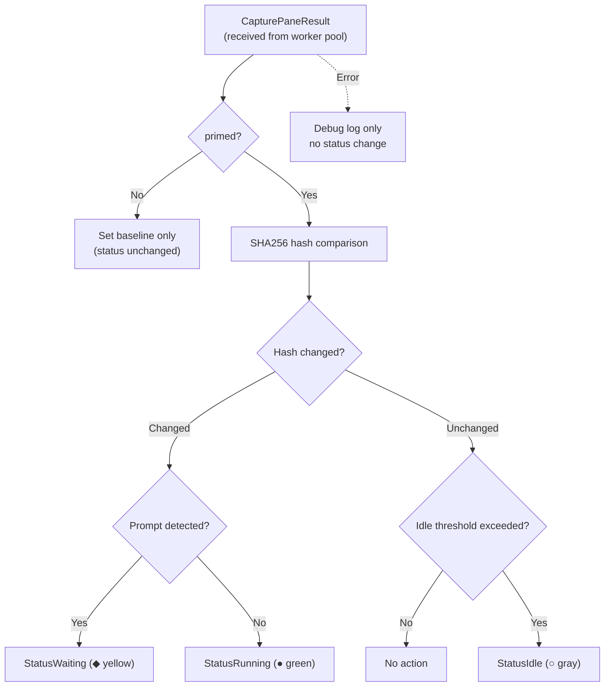
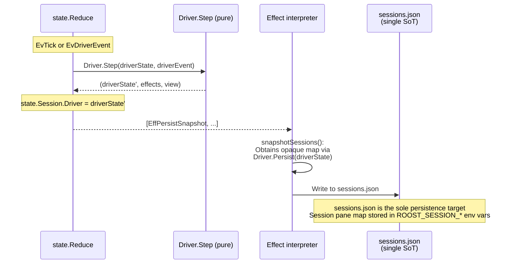
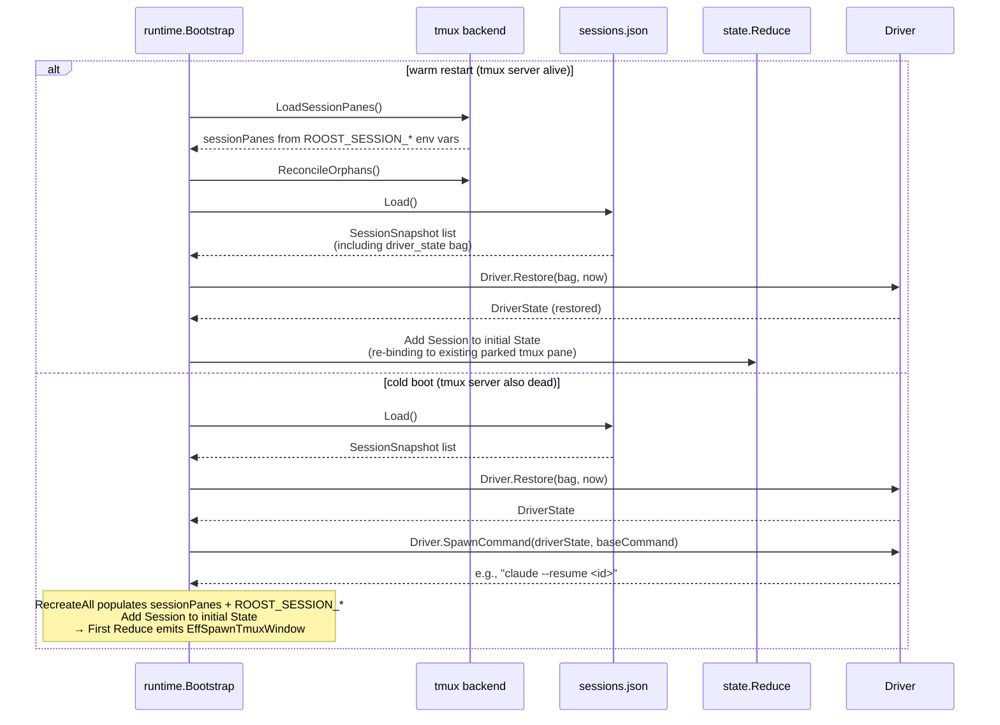

# State monitoring

For the interactive operation processing flow (TUI → IPC → Reduce → Effect), see [ipc.md](ipc.md). The following describes the background status update pipeline and state monitoring by Drivers.

## Background pipeline

Every tick (1s), `reduceTick` calls `Driver.Step(driverState, DEvTick{...})` for all sessions and aggregates the returned Effects (EffStartJob, etc.). Pane reconciliation (`runtime.reconcileWindows()` using `sessionPanes` + `PaneAlive`) and pane health check (runtime checks pane 0.0 alive; owner is `runtime.activeSession`) are also performed on the same tick. For the detailed tick processing sequence, see [ipc.md](ipc.md#tick-processing-sequence).

Driver.Step returns `EffStartJob`, which is submitted to the worker pool. The result is fed back to the event loop via `EvJobResult` → `Driver.Step(DEvJobResult)` reflects it in DriverState.

## State monitoring

The Driver plugin's `Step` method is responsible for status updates. For the Driver interface definition, see [interfaces.md](interfaces.md#interfaces).

### Lifecycle:

| Method | Caller | Purpose |
|---------|-----------|------|
| `NewState(now)` | `reduceCreateSession` | Generates a new DriverState value. Initial values are Idle / now |
| `Restore(bag, now)` | `runtime.Bootstrap` | Reconstructs DriverState from the previously saved opaque map on warm/cold restart |
| `Step(prev, DEvTick)` | `reduceTick` → `stepAllSessions` | Periodic polling. Claude gates on `DEvTick.Active`, emitting transcript parse jobs only when active. Generic emits capture-pane jobs |
| `Step(prev, DEvHook)` | `reduceDriverHook` | Receives hook events and updates DriverState. Claude performs status transitions + event log append effects |
| `Step(prev, DEvJobResult)` | `reduceJobResult` | Reflects results from the worker pool into DriverState. Transcript parse results such as title / lastPrompt |
| `Step(prev, DEvFileChanged)` | `reduceFileChanged` | File change notification from fsnotify. Emits transcript parse job |
| `View(driverState)` | runtime's `broadcastSessionsChanged` / `activeStatusLine` | Pure getter that returns display payloads for the TUI (Card / LogTabs / InfoExtras / StatusLine) |
| `Persist(driverState)` | runtime's `snapshotSessions` | Serializes DriverState to an opaque map. Written to sessions.json |
| `SpawnCommand(driverState, base)` | `runtime.Bootstrap` (cold boot only) | Assembles a resume command (e.g., `claude --resume <id>`) |

### Active/Inactive and DEvTick.Active (push model)

"Session is active" means the session pane is joined into pane 0.0 (main). The single source of truth is `state.State.ActiveSession` (SessionID), and `reduceTick` evaluates `sessID == state.ActiveSession` when constructing `DEvTick` to set the `DEvTick.Active` flag. Step is called for all sessions on every tick, passing `DEvTick{Active: false}` to inactive Drivers. Activation is detected on the next tick (within 1 second).

### Claude driver (event-driven + active-gated transcript sync)

`claudeDriver`'s status is **fully event-driven**: the status in DriverState is updated only at the moment `Step(prev, DEvHook{Event: "state-change"})` receives a state-change event. If no new event arrives, the status does not change (= the previously restored status continues to be displayed).

Transcript metadata (title / lastPrompt, etc.) is incrementally parsed by `transcript.Tracker` inside the worker pool's `TranscriptParse` runner:

- `Step(prev, DEvTick{Active: true})`: Emits transcript parse job only when active. Returns immediately when inactive
- `Step(prev, DEvHook)`: Always updates DriverState regardless of active/inactive. Also emits transcript parse job
- `Step(prev, DEvJobResult{TranscriptParseResult})`: Reflects parse results (title / lastPrompt / statusLine) into DriverState
- `Step(prev, DEvFileChanged)`: File change notification from fsnotify. Emits transcript parse job

`lastPrompt` is obtained by `transcript.Tracker` walking the parentUuid chain backwards from the tail and returning the text of the first non-synthetic `KindUser` entry.

Hook event → driver.Status mapping:

| Hook event | Status |
|--------------|--------|
| UserPromptSubmit, PreToolUse, PostToolUse, SubagentStart | Running |
| Stop, StopFailure, Notification(idle_prompt) | Waiting |
| Notification(permission_prompt) | Pending |
| SessionStart | Idle |
| SessionEnd | Stopped |

The `roost event <eventType>` subcommand repackages the Claude hook payload into `proto.CmdEvent` and sends it via IPC. The runtime's IPC reader converts it into an `EvDriverEvent` and feeds it into the event loop. `reduceDriverHook` performs a single-level lookup with `Sessions[ev.SenderID]` and calls `Driver.Step(driverState, DEvHook{...})`. Neither the state layer nor the runtime layer holds any Claude-specific state logic.

### Hook event routing and race-free identification

A mechanism for the hook subprocess to identify its owning roost session in a race-free manner.

**Problem**: There is a 20-50ms window after `tmux new-window` before `SetWindowUserOptions` sets `@roost_id`. If a hook fires during this window, `@roost_id` is unset and the event is discarded.

**Solution**: Inject the env var via `tmux new-window -e ROOST_SESSION_ID=<sess.ID>`. The env var is set at the kernel exec level simultaneously with `new-window`, so no race occurs. The hook bridge (`lib/claude/command.go`) simply reads `os.Getenv("ROOST_SESSION_ID")`, requiring no round-trip to tmux. The reducer identifies the session with a single-level lookup via `Sessions[ev.SessionID]`.

### Generic driver (polling-driven)

`genericDriver` determines state by comparing capture-pane hashes. Behavior of `Step(prev, DEvTick)` (capture-pane results are received from the worker pool via `DEvJobResult{CapturePaneResult}`):



**The first tick does not change status**. It only sets the internal hash baseline, and the previous status restored by `Driver.Restore` is preserved until the next tick. Only from the second tick onward is the status updated when an actual transition is observed.

When `Driver.Restore` is called, `lastActivity` is also seeded from `status_changed_at`, allowing the idle countdown to continue across restarts.

The idle threshold can be changed via `IdleThresholdSec` in `settings.toml` (default 30 seconds). The polling interval is `PollIntervalMs` (default 1000ms). Prompt detection uses per-driver regular expressions. The generic pattern `` (?m)(^>|[>$❯]\s*$) `` serves as the base, while claude uses `` (?m)(^>|❯\s*$) `` excluding `$` to prevent false positives with bash shells.

### State persistence and restoration

`Driver.Persist(driverState)` returns an opaque `map[string]string` interpreted by the driver, and `EffPersistSnapshot` writes it to `sessions.json`. Session-to-pane mapping is stored in `ROOST_SESSION_*` session-level env vars (not in sessions.json).

#### Writing (runtime)

When Driver.Step updates DriverState on each tick / hook event, the reducer emits `EffPersistSnapshot`, and the runtime's Effect interpreter writes it to `sessions.json`:



#### Restoration (warm restart / cold boot)

There are two restoration paths. **Warm restart** (tmux server alive) rebuilds the parked session pane map from `ROOST_SESSION_*` session-level env vars via `LoadSessionPanes`, then reconciles orphans with `ReconcileOrphans`, and restores DriverState from the `driver_state` bag in `sessions.json` using `Driver.Restore`. Active session is not restored; startup always returns pane `0.0` to the main TUI. **Cold boot** (tmux server also dead) recreates sessions from sessions.json via `RecreateAll`, which populates `sessionPanes` + `ROOST_SESSION_*` env vars:



SpawnCommand is called only on cold boot (on warm restart, the existing agent process is still alive).

#### PersistedState schema per Driver

`claudeDriver.PersistedState()`:
```
{
  "roost_session_id":     "abc-123",
  "claude_session_id":    "def-456",
  "working_dir":          "/path/to/workdir",
  "transcript_path":      "/path/to/transcript.jsonl",
  "status":               "running",
  "status_changed_at":    "2026-04-09T12:34:56Z",
  "branch_tag":           "feature/foo",
  "branch_bg":            "#334455",
  "branch_fg":            "#ffffff",
  "branch_target":        "/path/to/repo",
  "branch_at":            "2026-04-09T12:00:00Z",
  "branch_is_worktree":   "1",
  "branch_parent_branch": "main",
  "summary":              "haiku summary text",
  "title":                "conversation title",
  "last_prompt":          "most recent user prompt"
}
```

`genericDriver.PersistedState()`:
```
{
  "status":             "running",
  "status_changed_at":  "2026-04-09T12:34:56Z"
}
```

| Scenario | Behavior |
|---------|------|
| **New session creation** | `EvCmdCreateSession` → `reduceCreateSession` adds Session to State (generates initial DriverState via Driver.NewState) + emits `EffSpawnTmuxWindow` → runtime spawns tmux pane → `EvTmuxPaneSpawned` reflects `PaneTarget` |
| **Warm restart (daemon only restarts)** | `runtime.Bootstrap` reconstructs parked Sessions from `LoadSessionPanes` (`ROOST_SESSION_*`) + sessions.json. Restores DriverState via `Driver.Restore(bag, now)` → sets in initial State. `0.0` is always main TUI |
| **Cold boot (tmux server also dead)** | `runtime.Bootstrap` reads SessionSnapshots from sessions.json → `Driver.Restore(bag, now)` + `Driver.SpawnCommand(driverState, baseCommand)` assembles resume command → `RecreateAll` populates `sessionPanes` + `ROOST_SESSION_*` → adds Session to initial State → first Reduce emits `EffSpawnTmuxWindow` |
| **Session stop** | `EvCmdStopSession` → `reduceStopSession` removes Session from State + emits `EffKillSessionWindow` (SessionID-based) + `EffPersistSnapshot` |
| **Dead pane reap** | `EvTick` → `reduceTick` → runtime's `reconcileWindows()` (`PaneAlive` + `sessionPanes`) + pane 0.0 health check → `EvTmuxWindowVanished` / `EvPaneDied` removes Session from State |

### Cost extraction

Tool names, subagent counts, error counts, and other metrics from Claude sessions are extracted from the transcript JSONL by `transcript.Tracker` (`lib/claude/transcript`). `Tracker` is held within the worker pool's `TranscriptParse` runner, and results are returned to Driver.Step as `TranscriptParseResult`.
